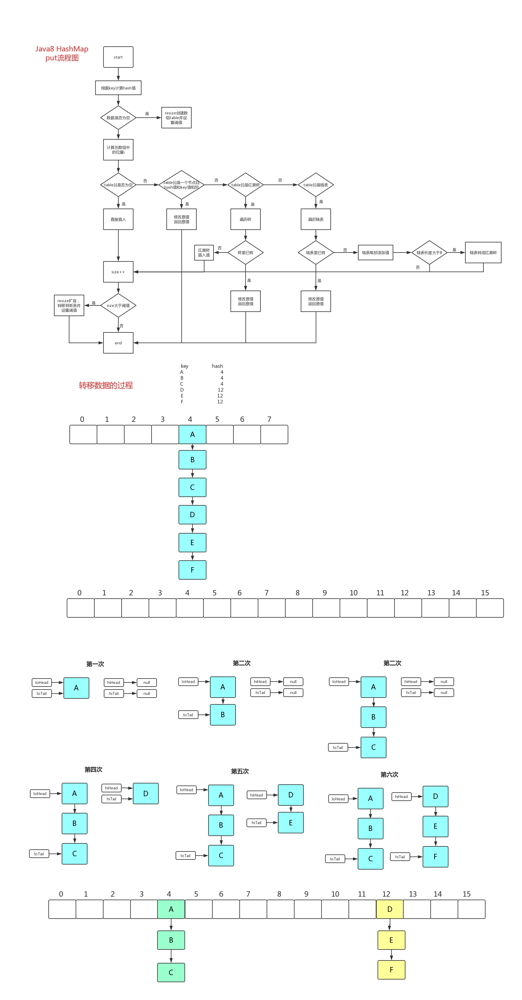
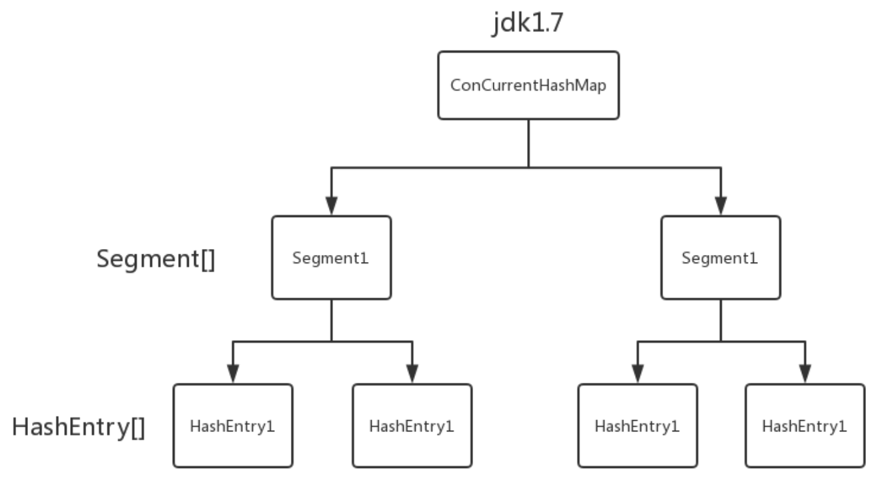

# 容器

连老师在公开课里面讲过相关的源码

### Collection

- List

  - **CoptOnWriteList**：读时不加锁，写时复制，适用于读线程多，写线程少的情况
  - Vector, Stack
  - ArrayList：会有并发问题
  - LinkedList

- Set

  - HashSet, LinkedHashSet
  - SortedSet, TreeSet
  - EnumSet
  - CopyOnWriteArraySet
  - ConcurrentSkipListSet

- Queue

  Queue和List的区别？Queue提供了很多在多线程访问下比较友好的API：

  `add`, `offer`, `peek`, `poll`, `remove`

  - Deque
    - ArrayDeque
    - BlockingDeque, LinkedBlockingDequeue
  - **BlockingQueue**：增加了更多API，比如put，take，可以阻塞/指定时间等待，是MQ的基础，MQ的本质，就是一个大型的生产者、消费者模型
    - ArrayBlockingQueue
    - PriorityBlockingQueue：阻塞的 PriorityQueue
    - **LinkedBlockingQueue**：用链表实现的BlockingQueue。阻塞用`await()`实现，底层是park
    - **TransferQueue, LinkedTransferQueue**：装完之后阻塞等待，直到有线程把它取走，再离开。场景：确认收钱完成之后，才能把商品取走。经典的**交替打印**面试题可以用 TransferQueue 实现
    - **SynchronousQueue**：容量为0，不能往里装东西，只有有一个线程等着的时候，才能把东西递到这个线程手里，是用来一个线程给另外一个线程传数据的。和Exchanger比较相似，也是需要两个线程同步对接，否则都会阻塞。在线程池里面，线程之间进行任务调度的时候，经常会用到。
  - **PriorityQueue**：内部进行了排序，底层是一个二叉树（小顶堆）的结构
  - **ConcurrentLinkedQueue**：里面很多方法是CAS实现的
  - **DelayQueue**：是一种阻塞的队列，需要实现compareTo方法，需要指定等待时间，用来按时间进行任务调度

- Map

  早期的 Vector 和 **Hashtable** 都自带锁，设计上有不完善的地方，基本上不用

  - **HashMap**, LinkedHashMap：多线程用 HashMap 要加锁
  - **Hashtable**：自带 synchronized，线程安全，但在线程竞争激烈的情况下效率非常低下
  - **ConcurrentHashMap**：CAS操作，多线程读取的效率非常高
  - TreeMap：不存在ConcurrentTreeMap，但为了排序，用跳表**ConcurrentSkipListMap**代替树结构
  - WeakHashMap
  - IdentityHashMap


# HashMap

### HashMap数据结构

1.8 数组+链表+红黑树


#### JDK1.8 HashMap为什么在链表长度为8的时候转红黑树，为啥不能是9是10？

是不是随便什么情况下只要满足了链表长度为8就转红黑树呢？答案自然不是，为什么不是，看代码：

```java
    /**
     * Replaces all linked nodes in bin at index for given hash unless
     * table is too small, in which case resizes instead.
     */
    final void treeifyBin(Node<K,V>[] tab, int hash) {
        int n, index; Node<K,V> e;
        if (tab == null || (n = tab.length) < MIN_TREEIFY_CAPACITY)
            resize();
        ......
    }
```

这是HashMap转红黑树的方法代码，可以看到，如果此时的HashMap的长度是小于MIN_TREEIFY_CAPACITY的或者为空，则进行扩容操作，而不是转红黑树，这其实也是容易忽略的点。

#### 为什么要转红黑树？

回答自然很简单，因为链表是取一个数需要遍历链表，复杂度为O(N)，而红黑树为O(logN)呗，那么问题来了

为什么不直接使用红黑树，而是要先使用链表实在不行再转红黑树呢？

答案自然要在源码和注释里找：在HashMap类中第174行左右有描述：

```
     Because TreeNodes are about twice the size of regular nodes, we
     use them only when bins contain enough nodes to warrant use
     (see TREEIFY_THRESHOLD)
```

“因为树节点的大小是链表节点大小的两倍，所以只有在容器中包含足够的节点保证使用才用它”，显然尽管转为树使得查找的速度更快，但是在节点数比较小的时候，此时对于红黑树来说内存上的劣势会

超过查找等操作的优势，自然使用链表更加好，但是在节点数比较多的时候，综合考虑，红黑树比链表要好。

为什么是8，而不是9不是10？

其实当时想回答面试官这是基于统计的结果，但是心里很虚还是没有说，再回头看看源码的描述：

```java
Ideally, under random hashCodes, the frequency of nodes in bins follows a Poisson distribution with a parameter of about 0.5 on average for the default resizing threshold of 0.75, although with a large variance because of resizing granularity. Ignoring variance, the expected occurrences of list size k are (exp(-0.5) * pow(0.5, k) / factorial(k)). The first values are:
理想情况下，在随机哈希码下，bin中节点的频率遵循泊松分布，参数平均约为0.5，默认大小调整阈值为0.75，尽管由于粒度调整的原因方差很大。忽略方差，列表大小k的期望出现次数为(exp(-0.5) * pow(0.5, k) / factorial(k))。第一个值是:
      0:    0.60653066
      1:    0.30326533
      2:    0.07581633
      3:    0.01263606
      4:    0.00157952
      5:    0.00015795
      6:    0.00001316
      7:    0.00000094
      8:    0.00000006
      more: less than 1 in ten million
```

理想情况下，在随机哈希码下，哈希表中节点的频率遵循泊松分布，而根据统计，忽略方差，列表长度为K的期望出现的次数是以上的结果，可以看到其实在为8的时候概率就已经很小了，再往后调整意义并不大。

### 扩容原理

负载因子：0.75，达到这个容量，则进行 2 倍扩容，复制过去

初始容量：16

初始容量为 2 的 n 次幂：为了方便哈希时进行按位与的取模运算，计算下标位置





## ConcurrentHashMap

几个参数：

- 默认大小：16
- 负载因子：0.75
- 默认并发级别：16
- put 方法调用的是 Unsafe 类的 CAS 操作

#### 结构变化：




ConcurrentHashMap 使用 **锁分段技术**，将数据分成一段一段的存储，给每一段数据配一把锁。一个线程访问其中一个段数据时，其他段数据能被其他线程访问。

有些方法需要跨段，比如size()和containsValue()，它们可能需要锁定整个表而而不仅仅是某个段，这需要**按顺序**锁定所有段，操作完毕后，又**按顺序**释放所有段的锁。这里“按顺序”是很重要的，否则极有可能出现死锁。


**Hashtable** 的任何操作都会把整个表锁住，是阻塞的。

好处：能获取最实时的更新，比如说线程A调用putAll写入大量数据，期间线程B调用get，线程B就会被阻塞，直到线程A完成putAll，因此线程B肯定能获取到线程A写入的完整数据。

坏处：是所有调用都要排队，效率较低。

**ConcurrentHashMap** 是设计为非阻塞的。在更新时会局部锁住某部分数据，但不会把整个表都锁住。同步读取操作则是完全非阻塞的。

好：处是在保证合理的同步前提下，效率很高。

坏处：是严格来说读取操作不能保证反映最近的更新。

例如线程A调用putAll写入大量数据，期间线程B调用get，则只能get到目前为止已经顺利插入的部分数据。


