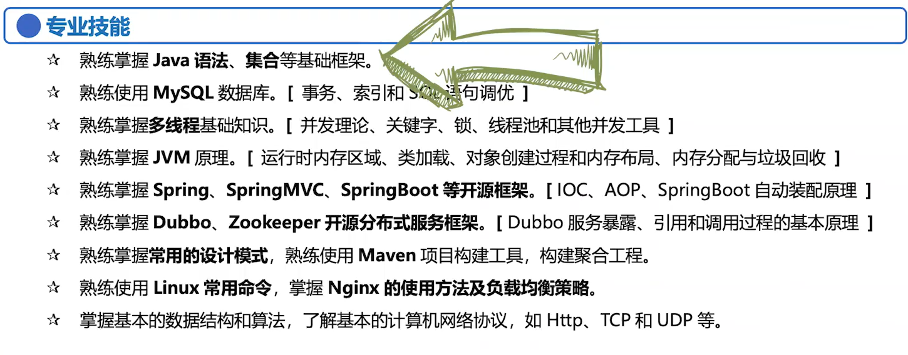

# 其他

我是xxx，就读于北京工业大学，明年毕业，到目前为止，在一家公司有半年多的 java 后端开发实习经验，在公司主要参与过两个项目，并且在此期间，熟练的掌握了 Java基础、像多线程、锁机制、JVM、MySQL索引、事务，Redis，以及BIO，NIO等网络IO相关的一些内容，以及Spring全家桶的一些基础知识，和一些主流的框架，平时自己也研究过分布式集群下的一些解决方案，LVS负载均衡，Zookeeper，k8s之类的，有一些了解。因为项目规模不是很大，所以也机会接触到线上的 Linux 服务器，管理过一段时间，在这个期间还是得到了很多的锻炼，有很多的心得体会。 但是毕竟不是一家互联网公司，很多平台都是公司内部使用，我希望可以在互联网背景的公司或大一些的公司，开阔视野，提升自己的能力。面试官，我的自我介绍就是这些，你看有什么问我的。

##### 为什么选择使用某种技术？

- 性能上，有没有做过对比？
- 通俗的角度，它更常用一些...

##### 你不会的问题怎么回答？

- 这个我就没有再深入的去了解了，只知道它可以做到这个程度
- 我了解的不是很深，说一下我知道的吧
- 我没有用过xxx，但是我知道xxx（另一个）

##### 让你聊一下某个技术？

关于 xxx，它经常会使用在 xxx（使用场景），然后聊一下它的底层原理

### 并发和并行的区别？

并发指任务提交，并行指任务执行；

并行是多个CPU同时处理，并发是多个任务同时过来；

并行是并发的子集。

### CAP 原理

### Paxos 协议

### 大厂校招时间

- 精通Java核心，熟悉JDK中各种集合，队列，锁机制，多线程，高并发相关底层结构及原理
- 熟悉各种GC，各种垃圾回收算法，有JVM调优经验
- 精通NIO相关的常见IO模型以及优化策略
- 熟悉常用的数据结构与算法，熟悉常用的设计模式
- 熟悉LVS、Nginx负载均衡策略及原理
- 熟悉Redis内存模型，Redis缓存常见问题 
- 熟悉MySQL的存储引擎，索引、事务原理
- 熟悉SpringBoot框架
- 熟悉分布式系统设计方案和原理，熟悉Zookeeper分布式协调框架
- 熟悉Linux常用命令，了解Linux内核设计原理
- 有GitLab + Jenkins项目自动构建、自动部署经验；对docker，kubernetes有一定的了解
- 了解分布式系统AKF拆分原则，CAP定理，Paxos协议
- 了解集群下的并发解决方案，采用Nginx，LVS，KeepAlive，支持HA高可用

# 本周

- 快速过一遍计组
- 复习一遍面试题，下周一开始海投秋招
- 整体上复习完高数部分，开始二轮现代，也不要放下高数，做一下真题
- 开始英语、政治，找视频、买书
- 想好项目怎么说
- 写好简历，至少找一家普通公司练手。你不开始，就永远不开始
- 找找工大专业课的真题
- 一定要看一下spring的源码，以及跟一下spring项目

#### 周一

- 高数（√）
- 写简历（√）
- 准备好面试（√）
- 看一下spring源码

#### 周二

- 数学
- 试一下英语的难度
- 找政治的书、视频
- 准备面试，开始跟项目

#### 周三

- 

#### 周四

- 数据结构 3 结束
- 复习 JVM 面试题
- 数学

#### 周五

- 复习高并发、Collection面试题
- 数学

#### 周六

#### 周日

## 整体

#### 暑假

- 复习完二轮数学
- 早就应该开始练真题
- 复习完一轮数据结构、操作系统
- 复习完一轮政治，知道自己的政治水平
- 复习完一轮英语，知道自己的英语水平

#### 150天（721）

#### 140天

#### 130天

#### 120天

#### 110天

#### 100天

#### 90天

#### 80天

#### 70天

#### 60天

#### 50天

#### 40天

#### 30天

#### 20天

#### 10天

