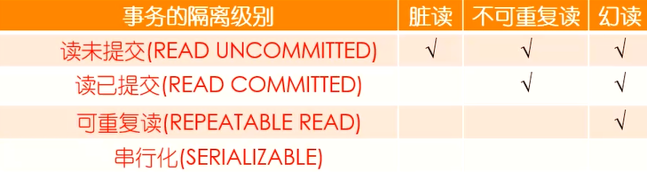
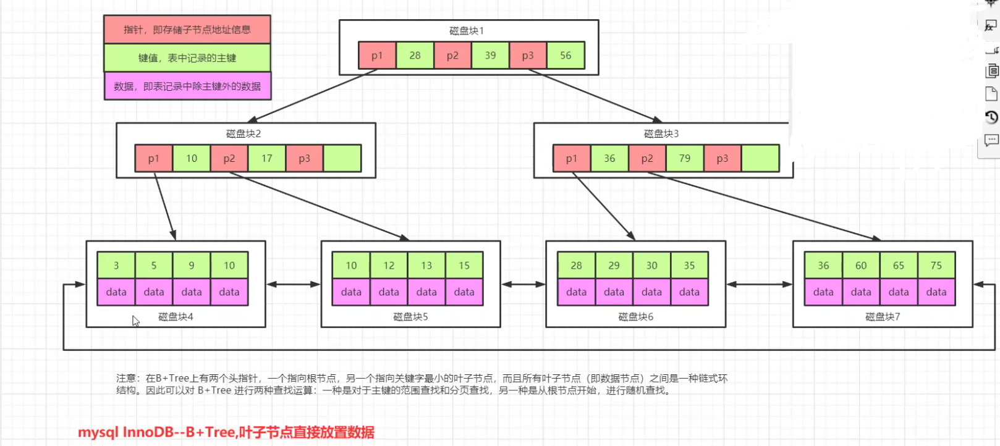
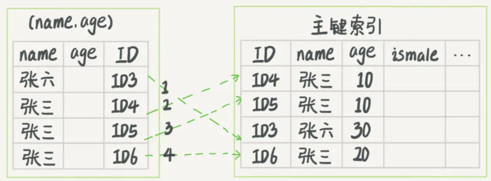

# MySQL

### 零碎知识点

#### 局部性原理

##### 时间、空间局部性

数据有可能是聚集存放的，数据被访问过之后，在很短的时间之内，可以再次被访问

##### 磁盘预读

当内存和磁盘发生交互的时候，是以一个逻辑单元 **“页”** 为单位进行交互的，一般是 4k 或 8k

SSD 4K 对齐，能够加快查询效率


#### log 有多少种？

binlog, undolog, redolog, relaylog, errorlog, slowlog 等

所有存储引擎都有 binlog，errorlog，relaylog，slowlog


#### undolog 的原理？是否需要落盘？

innodb通过force log at commit机制实现事务的持久性，即在事务提交的时候，必须先将该事务的所有事务日志写入到磁盘上的 redo log file 和 undo log file 中，进行持久化。

undo日志会记录事务执行过程中，每次修改的数据的原始值。

```sql
x = 5, y = 8
t1 begin:
	// undo日志记录x=5
	x = x - 1;
	// undo日志记录y=8
	y = y - 2;
	// 事务执行临近结束，将 undolog 写入到磁盘
	// 将数据写入到磁盘
commit
```

每次进行事务修改之前，把未修改之前的值存储到 undo 日志中，提交的时候，先将 undo 写到磁盘，再把修改后的数据写到磁盘。

若undo写入磁盘之前发生了异常，根本就不需要做任何操作，这时候事务是被认为执行失败的，也不需要回滚，因为undo日志没有写入磁盘，数据库被认为处于没有执行事务的状态。


#### MySQL有多少种锁？

共享锁，排它锁，独占锁，间隙锁，临键锁，自增锁，意向锁

MVCC：multi version concurrency control 多版本并发控制，通过保存数据在某个时间点的快照来实现的。在同一个事务里能够看到数据一致的视图。

排它锁怎么加？query for update

共享锁怎么加？lock in share mode

WAL：Write Ahead Log 溢写日志


#### 使用自定义变量

在给一个变量赋值的同时，使用这个变量

```mysql
select actor_id, @rounum:=@rownum+1 as rownum from actor limit 10;
```


#### 分区表

创建表时使用partition by子句定义每个分区存放的数据，在执行查询的时候，优化器会根据分区定义过滤那些没有我们需要数据的分区，这样查询就无须扫描所有分区。


### 存储引擎

- innodb
  - 有redolog, undolog
  - 簇族索引
- myisam
  - 非簇族索引
  - 不支持事务
- memory
  - 数据在内存中，有持久化文件
  - 默认使用哈希索引


### 事务

#### Spring事务和数据库事务有什么区别？

Spring提供了一个类，由这个类以AOP的方式管理，只需要`@Transactional`即可


### 事务的 ACID

#### Atomicity 原子性

- 事务中的所有操作作为一个整体，像原子一样不可分割（原子性）
- 使用 undolog 逻辑日志实现回滚

#### Consistency 一致性

- **事务的执行**不能破坏**数据库数据**的完整性和一致性
- 事务执行的结果必须使数据库从**一个一致性状态**转变到**另一个一致性状态**
- 如果事务被迫中断，不应该有一部分被写入物理数据库

#### Isolation 隔离性

- 使用锁机制
- 并发环境中，并发的事务是相互隔离的，并发执行的事务之间不能相互干扰
- 隔离级别：假设 A，B 都开启了事务
  - 读未提交（未授权读取）：即使A事务未提交，B事务也能看到A的修改
  - 读已提交（授权读取）：A事务提交后，B事务中才能看到A的修改
  - 可重复读：无论A怎么修改，事务B在事务期间都不会看到A的修改
  - 串行化：所有事物只能一个接一个处理，不能并发执行
  
  （要能够模拟脏读、幻读、不可重复读的情况）
  
  

#### Durability 持久性

持久性通过 redolog 和 binlog 共同保证。

- 事务一旦提交，数据必须永久保存
- 即使宕机，重启后也能恢复到事务成功结束时的状态
- 使用 redolog 两阶段提交实现。事务提交前，需要将 redolog 持久化。系统崩溃时，虽然数据没有持久化，但是可以根据 redolog 的内容，将数据恢复到最新的状态。
- redolog 大小是固定的，相当于一个增量存储，redolog 满了之后，会进行持久化的同步归档。然后将redolog清空。


### 锁

#### MyIsam

只能锁表

- 共享读锁
- 独占写锁

#### Innodb

支持表锁，行锁。实质上锁的是索引，如果没有索引的话，退化成为表锁。

- 共享锁（s），又称读锁
- 排它锁（x），又称写锁


### 索引

OLTP：联机事务处理，我们常用的关系型数据库

OLAP：联机分析处理，Hive，主要是对历史数据的分析，用于做出决策；不支持范围查询，插入新数据要重排？

区别在于时效性，在很短的时间内返回结果。


### 索引实现原理

索引是和存储引擎相关联的。所谓存储引擎，指的是数据在磁盘上的不同组织形式。

Memory 存储引擎使用 Hash 索引。

##### 不同存储引擎的数据文件

innodb：包括 frm（表结构），ibd（索引+数据放在一起，聚簇索引） 文件

MyISAM：包括 frm，myd，myi 文件，非聚簇索引

##### 聚簇索引就是主键索引吗？

不一定是。

- 如果你建表时不指定主键，innodb会选择 **唯一键** 创建索引。
- 如果没有唯一键的话，会生成一个 6 字节的 row_id 作为主键。

##### innodb 采用自适应哈希：

当给 colA 建 立B+tree 索引的时候，这棵 B+ tree 会有个三四层，通过 colA = 'xxx' 会在树里查询 3、4 次才能查到，所以这里如果开启了自适应索引，就利用 buffer pool 来给 colA 建立一个哈希索引，这样就只用在哈希索引里查 1 次，不用在 B+ tree 里查询 3、4 次，加快了速度。

##### 扰动函数（java HashMap相关的，自己看一下吧）

```java
static final int hash(Object key) {
    int h;
    return (key == null) ? 0 : (h = key.hashCode()) ^ (h >>> 16);
}
```

目的是为了减少hash冲突。

##### 普通二叉树

查询效率过太低，需要遍历整个数

##### BST Tree

递增插入会退化成链表，树不够平衡

##### AVL树

最短子树和最长子树高度之差不能超过1，是严格意义上的平衡树

损失插入性能，来满足查询性能

##### 红黑树

最长路径不超过最短路径的两倍

##### 为什么使用 B / B+ 树？

以上的树会越来越高，每一个节点中只能存一个元素，查找的时候，需要进行多次 IO 交互。应该尽量在 4k 中存储尽可能多的数据节点。

B / B+ 树的每一个节点中可以有多个元素

##### 为什么推荐使用自增的 int 类型作为主键？

int 类型 相比 varchar，占用的索引比较小

自增可以直接追加在最后面，减少树的页分裂、合并带来的维护成本

##### 不同存储引擎的数据结构

Innodb 默认使用 B-tree，根据官网文档，Memory tables 也支持哈希索引。

Hash劣势：rehash，哈希冲突问题。不好的hash算法导致散列不均匀，浪费磁盘空间。

jdk 1.8 的哈希函数算法使用了扰动函数，也是为了让散列更均匀

| **索引**      | MyISAM引擎 | InnoDB引擎 | Memory引擎 |
| ------------- | ---------- | ---------- | ---------- |
| B-Tree索引    | 支持       | 支持       | 支持       |
| HASH索引      | 不支持     | 不支持     | 支持       |
| R-Tree索引    | 支持       | 不支持     | 不支持     |
| Full-text索引 | 支持       | 不支持     | 不支持     |


#### B 树


#### B+ 树

每个节点可以包含多个元素，有 n 棵子树的节点中含有 n 个关键字。每个关键字不保存数据，只用来索引。

非叶子结点只存储 key，不存储数据。所有 **数据都放在叶子结点** 中存储。

是为文件系统而生的。




### 索引分类

#### 1、按照索引的存储来划分：簇族索引、非簇族索引

##### 聚簇索引

innodb，数据和索引放在一起。如果不设置主键，innodb会选择一个唯一键，如果没有唯一键，innodb会生成一个6字节的rowid存储，对用户是不可见的。

##### 非聚簇索引

数据和索引不放在一起，myisam


#### 2、按照使用来分：

**主键索引**：主键所关联的数据

**唯一索引**：mysql 默认会给唯一键添加索引

**普通索引**：用来加速数据访问速度而建立的索引。多建立在经常出现在查询条件的字段和经常用于排序的字段。


### 回表 & 覆盖索引


回表：通过普通索引去树中查找，会 **返回主键值**，再 **根据主键 **去索引树查找数据。

```sql
select id, age from test where name = '张三';
```


覆盖索引：执行计划能看到 using index。通过检索索引就可以读取想要的数据，那就不需要再到数据表中读取行了。也就是不需要回表。

```sql
select id, name from test where name = '张三';
```


### 索引下推

假设有这么个需求，查询表中“名字第一个字是张，性别男，年龄为10岁的所有记录”。那么，查询语句是这么写的：

```sql
mysq> select * from tuser where name like '张%' and age=10 and ismale=1;
```

根据前面说的“最左前缀原则”，该语句在搜索索引树的时候，只能匹配到名字第一个字是‘张’的记录（即记录ID3），接下来是怎么处理的呢？当然就是从ID3开始，逐个回表，到主键索引上找出相应的记录，再比对age和ismale这两个字段的值是否符合。

但是！MySQL 5.6引入了索引下推优化，可以在索引遍历过程中，**对索引中包含的字段先做判断，过滤掉不符合条件的记录，减少回表字数**。

#### 没有索引下推的情况



图 1 中，在 (name,age) 索引里面，我特意去掉了 age 的值，因为 **这个过程 InnoDB 并不会去看 age 的值**，只是按顺序把“name 第一个字是’张’”的记录一条条取出来回表。因此，需要回表 4 次。

#### 有索引下推的情况


图 2 跟图 1 的区别是，InnoDB **在 (name,age) 索引内部就判断了 age 是否等于 10**，对于不等于 10 的记录，直接判断并跳过。在我们的这个例子中，只需要对 ID4、ID5 这两条记录回表取数据判断，就只需要回表 2 次。

#### 总结

如果没有索引下推优化（或称ICP优化），当进行索引查询时，**首先根据索引来查找记录，然后再根据where条件来过滤记录**；在支持ICP优化后，MySQL会在取出索引的同时，**判断是否可以进行where条件过滤再进行索引查询**，也就是说提前执行where的部分过滤操作，在某些场景下，可以大大减少回表次数，从而提升整体性能。

