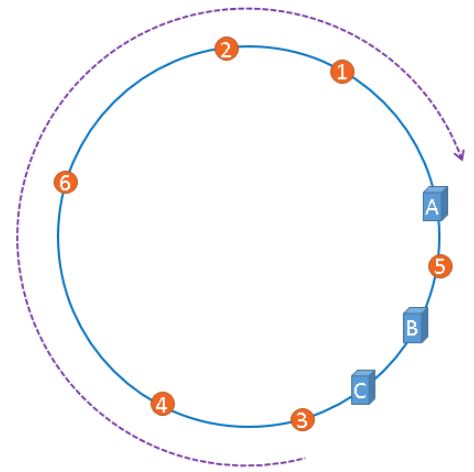

# Redis

### Redis 五种基本数据结构

string(字符串)、list(列表)、hash(字典)、set(集合) 和 zset(有序集合)

#### 1、字符串 string

Redis 中的字符串是一种 **动态字符串**，这意味着使用者可以修改，它的底层实现有点类似于 Java 中的 **ArrayList**，有一个字符数组，从源码的 **sds.h/sdshdr 文件** 中可以看到 Redis 底层对于字符串的定义 **SDS**，即 *Simple Dynamic String* 结构。

我们通常使用 `SET` 和 `GET` 来设置和获取字符串值。

**Redis 规定了字符串的长度不得超过 512 MB。**

#### 2、列表 list

相当于 Java 语言中的 **LinkedList**，注意它是链表而不是数组。这意味着 list 的插入和删除操作非常快，时间复杂度为 O(1)，但是索引定位很慢，时间复杂度为 O(n)。

基本操作

- LPUSH 和 RPUSH 分别可以向 list 的左边（头部）和右边（尾部）添加一个新元素；
- LRANGE 命令可以从 list 中取出一定范围的元素；
- LINDEX 命令可以从 list 中取出指定下表的元素，相当于 Java 链表操作中的 get(int index) 操作；

#### 3、字典 hash

Redis 中的字典相当于 Java 中的 **HashMap**，内部实现也差不多类似，都是通过 **"数组 + 链表"** 的链地址法来解决部分 **哈希冲突**，同时这样的结构也吸收了两种不同数据结构的优点。

#### 4、集合 set

Redis 的集合相当于 Java 语言中的 **HashSet**，它内部的键值对是无序、唯一的。它的内部实现相当于一个特殊的字典，字典中所有的 value 都是一个值 NULL。

#### 5、有序集合 zset

这可能使 Redis 最具特色的一个数据结构了，它类似于 Java 中 **SortedSet** 和 **HashMap** 的结合体，一方面它是一个 set，保证了内部 value 的唯一性，另一方面它可以为每个 value 赋予一个 score 值，用来代表排序的权重。

它的内部实现用的是一种叫做 **「跳跃表」** 的数据结构，由于比较复杂，所以在这里简单提一下原理就好了：


想象你是一家创业公司的老板，刚开始只有几个人，大家都平起平坐。后来随着公司的发展，人数越来越多，团队沟通成本逐渐增加，渐渐地引入了组长制，对团队进行划分，于是有一些人**又是员工又有组长的身份**。

再后来，公司规模进一步扩大，公司需要再进入一个层级：部门。于是每个部门又会从组长中推举一位选出部长。

跳跃表就类似于这样的机制，最下面一层所有的元素都会串起来，都是员工，然后每隔几个元素就会挑选出一个代表，再把这几个代表使用另外一级指针串起来。然后再在这些代表里面挑出二级代表，再串起来。**最终形成了一个金字塔的结构。**

想一下你目前所在的地理位置：亚洲 > 中国 > 某省 > 某市 > ....，**就是这样一个结构！**


### 内存模型

- epoll
  - Nginx也用了epoll
  - fd
  - 红黑树


- 零拷贝

  - sendfile

  - mmap

    - epoll源码没有用到mmap，是redis用到了mmap

    - 理解为：我们使用 epoll 的时候要注意用 mmap 辅助，来避免 read/write 多一次拷贝，而非系统内核帮你维护了 mmap

    - 编译器将 epoll_create 编译为了 int 80 中断等一系列汇编指令，交给CPU就行了。C代码中虽然是显式调用 epoll_create ，但C翻译成汇编的时候就翻译成了相应的0x80中断以及相关指令的

      

### 数据类型

- string
  - bitmap：可以做布隆过滤器
- list
- hashmap
- set
- sorted_set（zsest）
  - 排序的实现：跳跃表


### 使用

- 管道

  ```shell
  (printf "PING\r\nPING\r\nPING\r\n"; sleep 1) | nc localhost 6379
  ```

  - 只用了一个命令的开销时间
  - 服务器将被迫回复一个队列答复

- 发布/订阅 pubsub

  - 发送者 `publish test1 hello`
  - 订阅者 `subscribe test1`
  - 场景：聊天室，启动多个 redis 去接收订阅消息
    - redis1：将消息实时推送给用户
    - redis2：存入 zset，用来取某个时间窗口的历史消息
    - redis3：启一个 service ，将最新消息推给 kafka，然后异步存入db

- 事务

  - 无论谁先开启事务，`exec`命令先到达的client，事务先被执行
  - watch 某个 key，如果发生更改，事务不执行

- 布隆过滤器

  - RedisBloom模块
  - 用**小空间**解决**大量数据匹配**，避免缓存穿透
  - 有一定的误判率

  布隆过滤器升级版

  - Counting Bloom Filter
  - 布谷鸟过滤器


### 持久化

#### RDB

```
save 900 1
save 300 10
save 60 10000

dbfilename dump.rdb
dir /var/lib/redis/6379
```

- 时点性
- save，阻塞的，比如关机维护
- bgsave，后台的，fork子进程

#### AOF

```
appendonly yes
appendfilename "appendonly.aof"

auto-aof-rewrite-percentage 100
auto-aof-rewrite-min-size 64mb

appendfsync always
appendfsync everysec
appendfsync no
```

- 将写操作记录到文件中
- 丢失数据少
- 可以和 RDB 同时开启
  - 4.0 以前，重写 AOF 时，删除抵消的命令，合并重复的命令
  - 4.0 以后，重写 AOF 时，将老的数据 RDB 到 AOF 文件中，再将增量数据以指令的方式 append 到 AOF 文件中


### 缓存常见问题

#### 缓存击穿

作为缓存，受到内存大小限制，可能：

- key 超过了过期时间
- key 被 LRU LFU 清掉了

因为**某些 key 不在 redis 里面了，大量并发来找这个 key** 的时候，这时候客户端去直接请求数据库，这就是**击穿**。

这个问题怎么解决？
只要发现某个key不存在，就让所有对这个key的请求去抢一把锁。也就是说，
让第一个找key的请求，执行一个setnx，类似于放一把锁。只有获得锁的人才能去数据库查，其他的请求让它们失败，sleep等待几秒钟之后，重新去 redis 取数据。

这会存在一个问题：
1、如果第一个拿到锁的人挂了，别人也拿不到锁，这样就死锁了。可以设置锁的过期时间来避免这个问题。
2、由于我设置了过期时间，可能会发生这样的情况：拿到锁的人没挂，但是可能由于网络拥塞或者数据库拥塞，锁超时了，又有一个人拿到这个锁，又去数据库取，更加拥塞了。
针对这个问题，可以开启多个线程，一个线程去库里取数据，另一个线程去给锁的超时时间延长。这样会让代码逻辑变得复杂。
3、像上面这样，你自己去实现分布式协调很麻烦。因此我们引入Zokeeper，这个以后再讲~


#### 缓存穿透

从业务接收查询的，是你**系统里面根本不存在的数据**。这就是缓存穿透。

怎么解决？使用布隆过滤器

- 你可以在客户端中包含布隆过滤器的算法
- 你可以在客户端只包含算法，在redis中存放bitmap
- 你可以直接在redis中集成布隆模块：RedisBloom模块

**布隆过滤器的缺点**

只能增加，不能删除，如果你的业务删除了数据库中的某条数据，无法在布隆过滤器中删除这个key

**解决方式**

你可以使用布谷鸟过滤器等其他支持删除操作的过滤器，或者设置一个空 key


#### 缓存雪崩

和击穿有些类似，都是后面有数据的情况。

- 大量 key 同时失效，间接造成大量的访问到达 DB

怎么解决？要考虑两种情况：

1、每天都要更新数据的情况，例如每天零点要刷新缓存。这时候可以依赖击穿的解决方案。或者在业务层加一个小延时：判断如果是零点就延时，随机sleep几秒，这样不会把流量一大波流量同时放过来。
对于能够提前预知的时点数据，比如京东双11的页面样式、图片等，可以提前推到客户端本地，到双11零点的时候直接切换即可。

2、与时点性无关（并不需要在某个时间刷新缓存）的话，可以设置随机过期时间。


#### 缓存一致性（双写问题）


### Redis 集群

单机、单节点、单实例存在的问题

- 单点故障
- 容量有限
- 单机压力过大

单机单点问题的解决方式：AKF

#### AKF拆分原则


- X轴：可以是Redis实例的副本，数据库的副本等
  - 读写分离，增加备用性，**解决单点故障** 问题
  - 全量镜像，**不能解决容量有限 **的问题
- Y轴：按业务拆分，数据分开存储，客户端按照业务指定查询哪个库
  - **解决容量有限** 的问题
- Z轴：在按照不同业务拆分的前提下，将同一个业务将数据再拆分，存到不同的库中
  - 数据量足够小，更易发挥单机性能

#### AKF存在的问题：CAP定理

- 一致性（Consistency）：分布式系统中的所有数据备份，在同一时刻是否同样的值
- 可用性（Availability）：集群中一部分节点故障后，集群整体是否还能响应客户端的读写请求
- 分区容忍性（Partition tolerance）：是否能够容忍发生网络分区，对外表现出数据的不一致
  - 例如，向注册中心集群注册50台tomcat，有的仅成功注册了40台，不影响使用，可容忍

#### 集群一般使用奇数台

当存活节点过半的时候，就可以解决容错问题，正常提供服务

为什么是奇数台？你看，3个节点4个节点都最多允许1个节点挂掉，但是：

- 4台服务器成本高于3台服务器成本
- 不管你是4节点还是3个节点，都只允许挂1个，风险是一样的

#### Sentinel 哨兵

- 监控
- 提醒
- 自动故障迁移
  - 流言协议：主服务器是否下线
  - 投票协议：重新选主，故障迁移


### 一致性哈希

http://www.zsythink.net/archives/1182

#### 普通的哈希算法存在的问题：

当缓存服务器数量发生变化时，会引起缓存的雪崩，大量缓存同一时间失效。

当缓存服务器数量发生变化时，几乎所有缓存的位置都会发生改变。怎样才能尽量减少受影响的缓存呢？

```
hash（服务器A的IP地址） %  2^32
hash（服务器B的IP地址） %  2^32
hash（服务器C的IP地址） %  2^32
```


#### 一致性哈希算法的优点

假设服务器B出现了故障，我们现在需要将服务器B移除，那么，我们将上图中的服务器B从hash环上移除即可。图片4仍然会被缓存到服务器C中，图片1与图片2仍然会被缓存到服务器A中，这与服务器B移除之前并没有任何区别。


#### hash环的偏斜

如果服务器被映射成下图中的模样，那么被缓存的对象很有可能大部分集中缓存在某一台服务器上。



我们应该怎样防止hash环的偏斜呢？一致性hash算法中使用"虚拟节点"解决了这个问题

#### 虚拟节点

"虚拟节点"是"实际节点"（实际的物理服务器）在hash环上的复制品,一个实际节点可以对应多个虚拟节点。

从上图可以看出，A、B、C三台服务器分别虚拟出了一个虚拟节点，当然，如果你需要，也可以虚拟出更多的虚拟节点。引入虚拟节点的概念后，缓存的分布就均衡多了。如果你还不放心，可以虚拟出更多的虚拟节点，以便减小hash环偏斜所带来的影响，虚拟节点越多，hash环上的节点就越多，缓存被均匀分布的概率就越大。

