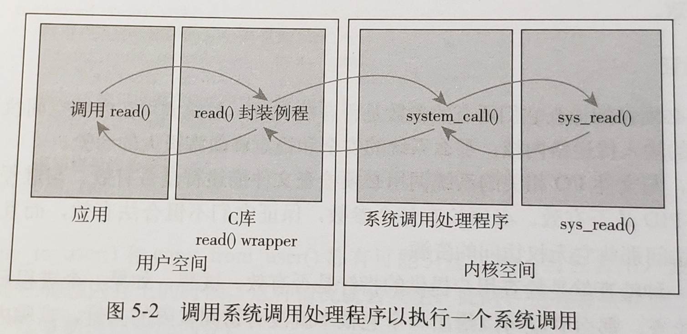

# 计组、操作系统

汇编和操作系统代码，又是不同层面的东西

汇编是针对CPU编程。系统内核方法，是针对操作系统编程。

### 总线的分类

数据总线、地址总线、控制总线


### 进程、线程

#### 进程

- 进程 是处于执行期的程序以及相关资源的总称
- 所有的进程都是 PID 为 1 的 init 进程的后代
- 内核把进程的列表放在任务队列  task list 中，链表中的每一项都是 **进程描述符**
  - 进程描述符包含：它打开的文件、进程的地址空间、挂起的信号、进程的状态等
- 进程状态
  - 运行：进程是可执行的
  - 可中断：正在睡眠，等待某些条件的达成，可以因为收到信号而提前被唤醒
  - 不可中断：即使收到信号，也不会被唤醒
  - 被其他进程跟踪：例如通过 ptrace 对调试程序进行跟踪
  - 停止：进程没有投入运行，也不能投入运行
- **进程的创建**
  - Linux 中，父进程通过 `fork()` 创建子进程，Linux 的 `fork()` 使用 **写时拷贝** 页实现
- **进程的调度**
  - Linux 使用 CFS（完全公平调度）
    - 确保给每个进程公平的 **处理器使用比**
    - 用 **红黑树** 维护 **可运行进程队列**，每次运行红黑树中 **最左边叶子结点** 代表的进程

#### 线程

- 线程是在进程中活动的对象
- 内核调度的对象是 **线程**，而不是 进程
- Linux 把所有的线程都当做进程来实现，线程仅仅被视为一个与其他进程共享某些资源的进程。

##### 思考：java线程是用户级线程还是内核级线程？

1. java 线程不是纯用户级线程：java中有个 fork join 框架，利用多处理技术进行 maprudce 的工作，证明了内核是可以感知到用户线程的存在，因此才会将多个线程调度到多个处理器中。

   java应用程序中的某个线程阻塞，是不会引起整个进程的阻塞。

2. java 线程不是纯内核级线程：如果使用纯粹的内核级线程，那么有关线程的所有管理工作都是内核完成的，用户程序中没有管理线程的代码。显然，java线程库提供了大量的线程管理机制，因此java线程绝不是纯粹的内核级线程。
3.  综上，java线程是混合型的线程模型，一般而言，是通过lwp将用户级线程映射到内核线程中。


### 原语

- 是一种特殊的程序，运行在 **内核态**
- 处于操作系统最底层，是最接近硬件的部分
- 这种程序的运行具有原子性，只能一气呵成，**不可被中断**
- 运行时间较短、调用频繁
- 原语采用“关中断指令”和“开中断指令”实现


### 系统调用



**系统调用** 是用户空间访问内核的唯一手段，除 **异常** 和 **陷入** 外，它是内核的唯一合法入口。

系统调用表及源码链接 https://filippo.io/linux-syscall-table/

- Linux 的系统调用，作为 C 库的一部分提供
- **用户空间进程** 用 **系统调用号** 来指明执行哪个系统调用。
- 进行系统调用的步骤：
  1. 用户空间应用程序把 **系统调用号** 放入 eax 寄存器中，**外部参数** 放在另外的 5 或 6 个寄存器中
  2. 应用程序通过 `int $0x80` 触发 **软中断**（异常），系统切换到内核态，执行 **128 号异常处理程序**，即 `system_call()` **系统调用处理程序**
  3. `system_call()` 运行，从 eax 寄存器中得到 **系统调用号**，检查其有效性，然后 **执行相应的系统调用**
  4. 内核在执行系统调用的时候，处于 **进程上下文**。在进程上下文中，内核 **可以休眠**，并且 **可以被抢占**
  5. **系统调用返回** 的时候，`system_call()` 负责 **切换回用户空间**，并让用户进程继续执行 `int $0x80` 的下一条指令

```asm
# Simple program that exits and returns a status code back to the Linux kernel
./section .data # 以.为开头的名称不会被翻译为机器指令，而是作为一种汇编提示告知汇编器 ，这个形式直接被称为 “汇编指令” 或 ”伪操作“
./section .text # .text 段位保存代码， 是只读和可执行的。后面的指令都是属于 .text 段。 
.globl _start # 告诉编译器，_start 这个符号就像c程序中的main函数一样，是整个程序的入口
_start : # 是一个符号，符号在汇编中表示一个地址，可以再指令中 ，汇编程序经过汇编器的处理后， 所有的符号都被替换成为它所代表的地址值。（通俗说，c语言中的函数变量名都属于符号）
# movl 是一条数据传送指令，要求CPU内部产生一个long数字1并保存到eax寄存器中。
# 1表示在CPU内部产生 ，称为立即数，立即数在前面要加个$ ,寄存器就加个%
movl $1 ,%eax # eax 寄存器用来指定系统调用号
movl $4 ,%ebx # _ebx 的值是传给 _exit 的参数，表示退出状态。_exit 的系统调用号为1。
int $0x80 # int 指令中的立即数 0x80 是一个参数，可以用于执行系统调用
```


### 用户态、内核态

Intel CPU 的四个运行级别：ring 0 ~ ring 3

Linux内核是运行在 ring 0 级别的，能访问所有指令

用户空间的应用程序运行在 ring 3 级别，某些指令是不能被访问的，因此需要转换为内核态


### mmap

mmap将 **用户的线性地址空间** 直接映射到了 **内核的 pagecache 地址**，如果是脏的需要写的话，依然受pagecache 的影响，才能最终刷写到磁盘中去。


### VFS 虚拟文件系统

Virtual Filesystem Switch，虚拟文件系统，是一个目录树。树上不同的节点可映射到物理的文件地址，可挂载。

相当于一个解耦层，在具体的文件系统之上抽象的一层，为能够给各种文件系统提供一个通用的接口，使上层的应用程序能够使用通用的接口访问不同文件系统、不同的驱动。

#### 硬链接、软链接

- 硬链接
  - 两个变量名指向了同一个物理位置
  - 如果删掉了其中一个文件，另外一方还能找到这个文件。相当于只是删除了一个引用。
- 软链接
  - 软链接是两个独立的文件，相当于创建了一个“快捷方式”
  - 文件的共享用户只有该文件的 **路径名**，只有文件拥有者才拥有 **指向其索引节点的指针**
  - 如果删除原有的`msb.txt`，则`xxoo.txt`找不到链接了，会标红报错。
- 共性
  - 无论是硬链接还是软连接，如果修改任意一方，另外一个文件也会看到这个变化。

#### 文件描述符 fd

任何程序都有：0 标准输入，1 标准输出， 2 报错输出

- `lsof` 列出系统中打开的文件

  `lsof -op $$`看见当前进程的文件描述符的细节，包括偏移量、指针等等

- `/proc/$$/fd`是当前程序的所有的文件描述符


### PageCache  页缓存

PageCache  通常 4K，本来是用来优化IO的性能（优先走内存），但它的缺点是刷写硬盘不及时，在突然关机或异常断电时，有丢失数据的可能

##### 为什么 Java 程序员不要使用直接 IO，而要使用 Buffered 形式的IO？

一次写一个缓冲区大小，减少调用 write 的次数，只不过是每一次写入的数据量比较大。减少了用户态到内核态的来回切换带来的性能损耗。

- ByteBuffer
  - `allocate`将字节数组分配到了堆上，是 **JVM 堆内** 的线性地址空间
  - `allocateDirect`将字节数组分配到 **JVM 的堆外** 内存中，是 C 语言可以直接访问的。


> 操作系统没有绝对的数据可靠性。为什么要设计 pagecache，是为了减少硬件的IO的调用，想要优先使用内存，这样能够提速。如果追求性能，就要在一致性、可靠性之间做出权衡。
>
> 从大方面来看，在现在的分布式系统当中，如果你追求数据存储的可靠性（保持缓存和磁盘的强一致，对于每一次对数据的微小改变，都要去刷写磁盘），仍然避免不了单点故障的问题。单点故障会让你为了保持强一致而耗费的能损耗一毛钱收益都没有。
>
> 这就是为什么我们使用主从复制、主备HA
> 这就是为什么 Kafka，ES 都有副本的概念，而副本是从 socket 得到的。副本又分为同步的异步的区别，这些都是后话了，我们以后再讲…

