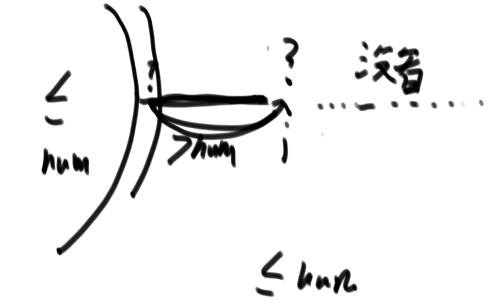
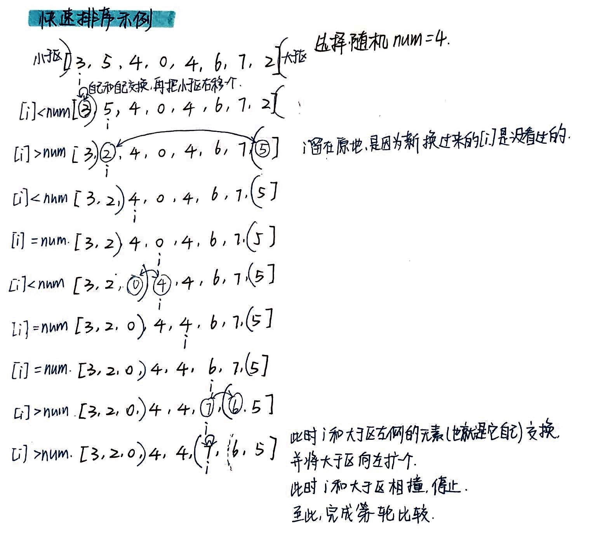

# 数据结构与算法

### 数据结构算法常见面试考题

部分摘自 https://blog.csdn.net/u012414189/article/details/83832161 

使用对数器：一个显而易见但是好实现的方法总是可以得到的。

#### 为什么要学算法？

我们发展出 service mesh, service less 等等这么多技术，是为了最大程度上对资源和单击性能的压榨。算法考核的是你一个程序员的基本素养，也是为了能够压榨单机性能的必要条件。

一台服务器，通过内核参数的调整、JVM、线程池参数的调整，单击并发量差距会在500并发/5000并发的差别。这也是你能写出好的 crud 的基本素养；你知道的越多，你不知道的越多


#### 为什么有完全二叉树的存在？

因为可以用数组存


#### Java 按位异或小技巧

```java
System.out.println(1 ^ 2 ^ 3 ^ 4 ^ 2 ^ 3 ^ 1);//使用按位异或，找到数组中唯一不重复的项
```

#### 求 mid 防止溢出小技巧

```java
int mid = l + ((r - l) >> 1);
```


#### Top K 问题（可以采取的方法有哪些，各自优点？）

1.将输入内容（假设用数组存放）进行完全排序，从中选出排在前K的元素即为所求。有了这个思路，我们可以选择相应的排序算法进行处理，目前来看快速排序，堆排序和归并排序都能达到O(nlogn)的时间复杂度。

2.对输入内容进行部分排序，即只对前K大的元素进行排序（这K个元素即为所求）。此时我们可以选择冒泡排序或选择排序进行处理，即每次冒泡（选择）都能找到所求的一个元素。这类策略的时间复杂度是O(Kn)。

3.对输入内容不进行排序，显而易见，这种策略将会有更好的性能开销。我们此时可以选择两种策略进行处理：

用一个桶来装前k个数，桶里面可以按照最小堆来维护
a)利用最小堆维护一个大小为K的数组，目前该小根堆中的元素是排名前K的数，其中根是最小的数。此后，每次从原数组中取一个元素与根进行比较，如大于根的元素，则将根元素替换并进行堆调整（下沉），即保证小根堆中的元素仍然是排名前K的数，且根元素仍然最小；否则不予处理，取下一个数组元素继续该过程。该算法的时间复杂度是O(nlogK)，一般来说企业中都采用该策略处理top-K问题，因为该算法不需要一次将原数组中的内容全部加载到内存中，而这正是海量数据处理必然会面临的一个关卡。

b)利用快速排序的分划函数找到分划位置K，则其前面的内容即为所求。该算法是一种非常有效的处理方式，时间复杂度是O(n)（证明可以参考算法导论书籍）。对于能一次加载到内存中的数组，该策略非常优秀。


## 树

### 二叉树

#### 满二叉树

一棵二叉树的结点要么是叶子结点，要么它有两个子结点（如果一个二叉树的层数为K，且结点总数是(2^k) -1，则它就是满二叉树。）


#### 完全二叉树

若设二叉树的深度为k，除第 k 层外，其它各层 (1～k-1) 的结点数都达到最大个数，第k 层所有的结点都**连续集中在最左边**，这就是完全二叉树。


#### 平衡二叉树

它或者是一颗空树，或它的左子树和右子树的深度之差(平衡因子)的绝对值不超过1，且它的左子树和右子树都是一颗平衡二叉树。


#### 堆

堆，是具有以下性质的 **完全二叉树**

- 每个结点的值都大于或等于其左右孩子结点的值，称为 **大顶堆**
- 每个结点的值都小于或等于其左右孩子结点的值，称为 **小顶堆**


#### 二叉查找树（BST）

二叉查找树的特点：

- 若任意节点的左子树不空，则左子树上所有结点的 值均小于它的根结点的值
- 若任意节点的右子树不空，则右子树上所有结点的值均大于它的根结点的值
- 任意节点的左、右子树也分别为二叉查找树
- 没有键值相等的节点（no duplicate nodes）


#### 平衡二叉树（Self-balancing binary search tree）

平衡二叉树（平衡二叉树的常用实现方法有红黑树、AVL、替罪羊树、Treap、伸展树等）


#### 红黑树

红黑树特点:

- 每个节点非红即黑；
- 根节点总是黑色的；
  每个叶子节点都是黑色的空节点（NIL节点）；
- 如果节点是红色的，则它的子节点必须是黑色的（反之不一定）；
- 从根节点到叶节点或空子节点的每条路径，必须包含相同数目的黑色节点（即相同的黑色高度）。

##### 红黑树的应用：

TreeMap、TreeSet以及JDK1.8的HashMap底层都用到了红黑树。

##### 为什么要用红黑树？

简单来说红黑树就是为了解决二叉查找树的缺陷，因为二叉查找树在某些情况下会退化成一个线性结构。详细了解可以查看 漫画：什么是红黑树？（也介绍到了二叉查找树，非常推荐）

##### 推荐文章：

- [漫画：什么是红黑树？](https://juejin.im/post/5a27c6946fb9a04509096248#comment)（也介绍到了二叉查找树，非常推荐）
- [寻找红黑树的操作手册](http://dandanlove.com/2018/03/18/red-black-tree/)（文章排版以及思路真的不错）
- [红黑树深入剖析及Java实现](https://zhuanlan.zhihu.com/p/24367771)（美团点评技术团队）


#### B，B+，B* 树

二叉树学习笔记之B树、B+树、B*树

B树是一种平衡的多路查找（又称排序）树，在文件系统中有所应用。主要用作文件的索引。其中的B就表示平衡(Balance)

B+ 树的叶子节点链表结构相比于 B- 树便于扫库，和范围检索。

B+树支持range-query（区间查询）非常方便，而B树不支持。这是数据库选用B+树的最主要原因。

`B*`树 是B+树的变体，B*树分配新结点的概率比B+树要低，空间使用率更高；


#### LSM 树

[HBase] LSM 树 VS B+树

B+树最大的性能问题是会产生大量的随机IO

为了克服B+树的弱点，HBase引入了LSM树的概念，即Log-Structured Merge-Trees。

LSM树由来、设计思想以及应用到HBase的索引


## 排序算法

### 归并排序的精髓

##### 例1：求小和

在一个数组中，一个数左边比它小的数的总和，叫数的小和，所有数的小和累加起来，叫数组小和。求数组小和。

例子： [1,3,4,2,5] 

1左边比1小的数：没有

3左边比3小的数：1

4左边比4小的数：1、3

2左边比2小的数：1

5左边比5小的数：1、3、4、 2

所以数组的小和为1+1+3+1+1+3+4+2=16

**MergeSort的实质，就是把比较行为省下来，变成有序的部分**

在本题的归并过程中，小和的产生，都是在左组与新的右组pk的时候，才产生这个数的小和，也就是在右组中寻找有多少个数比它大。组内不会重复算小和。每一个数都是如此。我总是面临一个新的右组，和右面我没有遇到过的范围，继续pk


##### 例2：求所有的降序对

 找一个数右边有多少个数比它大。


### 快速排序

##### Partition 过程

给定一个数组arr，和一个整数num。请把小于等于num的数放在数组的左边，大于num的数放在数组的右边。

要求额外空间复杂度O(1)，时间复杂度O(N) 

##### 思路

维护一个 **小于区**，i 从第一个数开始：

- 只要 i 小于 num，就把 i 与 **小于区右侧的第一个数* *交换，并将小于区向右扩大一个数
- 如果 i 大于等于 num，将 i++

##### 原理

在 i 的左侧，都是看过的数，并且每一次比较，都把比 num 小的数发送到小于区。而 i 右侧是没看过的数，随着 i++，将来一定会被看。




##### Partition 过程升级版：荷兰旗问题

将数组划分为三个区域，即：小于区，等于区，大于区

1. 首先，随机选择一个基准数字 num

2. 下标 i 从第一个数字开始，与基准数字 num 比较，分为三种情况：

   - 如果 [i] == num，则 i++

   - 如果 [i] < num，则让 [i] 与小于区右侧的第一个元素交换，小于区右移一个元素，i++

   - 如果 [i] > num，则让 [i] 与大于区左侧的第一个元素交换，大于区左移一个元素，i 留在原地

3. 直到 i 与大于区相撞，即可停止，此时已经完成第一轮比较

4. 此时可以认为，等于区已经在它们正确的位置上。用同样的方法，递归对小于区、大于区分别进行再一次划分




##### 快速排序3.0(随机快排+荷兰国旗技巧优化)

在arr[L..R]范围上，进行快速排序的过程：

1）在这个范围上，随机选一个数记为num，

1）用num对该范围做partition，< num的数在左部分，== num的数中间，>num的数在右部分。假设== num的数所在范围是[a,b]

2）对arr[L..a-1]进行快速排序(递归)

3）对arr[b+1..R]进行快速排序(递归)

因为每一次partition都会搞定一批数的位置且不会再变动，所以排序能完成

##### 随机快排的时间复杂度分析

 在arr[L..R]范围上，进行快速排序的过程：

1）在这个范围上，随机选一个数记为num，

1）用num对该范围做partition，< num的数在左部分，== num的数中间，>num的数在右部分。假设== num的数所在范围是[a,b]

2）对arr[L..a-1]进行快速排序(递归)

3）对arr[b+1..R]进行快速排序(递归)

因为每一次partition都会搞定一批数的位置且不会再变动，所以排序能完成

##### 代码

```java
public static void quickSort(int[] arr) {
    if (arr == null || arr.length < 2) {
        return;
    }
    process(arr, 0, arr.length - 1);
}

public static void process(int[] arr, int L, int R) {
    if (L >= R) return;
    swap(arr, L + (int) (Math.random() * (R - L + 1)), R); // 随机选一个数作为基准，放在最右侧
    int[] equalArea = netherlandsFlag(arr, L, R);
    process(arr, L, equalArea[0] - 1); // 小于区递归
    process(arr, equalArea[1] + 1, R); // 大于区递归
}

// arr[L...R] 玩荷兰国旗问题的划分，以arr[R]做划分值，分为：小于区，等于区，大于区
public static int[] netherlandsFlag(int[] arr, int L, int R) {
    if (L > R) {
        return new int[] { -1, -1 };
    }
    if (L == R) {
        return new int[] { L, R };
    }
    int less = L - 1; // 小于区的右边界，L-1保持基准始终在最右侧，或者你可以用独立的变量记录它
    int more = R;     // 大于区的左边界
    int index = L;
    while (index < more) {
        if (arr[index] == arr[R]) {
            index++;
        } else if (arr[index] < arr[R]) {
            swap(arr, index++, ++less);
        } else {
            swap(arr, index, --more);
        }
    }
    swap(arr, more, R);
    return new int[] { less + 1, more };
}

public static void swap(int[] arr, int i, int j) {
    int tmp = arr[i];
    arr[i] = arr[j];
    arr[j] = tmp;
}
```


## 堆

#### 什么是堆？

**堆** 是一棵 **完全二叉树**：即使它不是满二叉树，也是正在从左往右变满的过程中。

1）堆结构就是用数组实现的完全二叉树结构

2）完全二叉树中，如果每棵子树的 **最大值都在顶部**，是 **大根堆**

3）完全二叉树中，如果每棵子树的 **最小值都在顶部**，是 **小根堆**

4）堆结构的 heapInsert 与 heapify 操作

5）堆结构的增大和减少

6）优先级队列结构，就是堆结构

7）特点：由 N 个数 组成的堆，高度是 log(n)


#### 如何用数组存放堆？

##### 如果从 0 位置开始：


i 层，则

- 左孩子：2 * i + 1
- 右孩子：2 * i + 2
- 父节点：(i - 1) / 2

##### 如果从 1 位置开始：


正是由于可以使用 **位运算** 来代替 **算数运算**，效率更高，所以有时候让下标从 1 开始。

- 左孩子：2 * i  （i << 1）
- 右孩子：2 * i + 1  （i << 1 | 1）
- 父节点：i / 2  （i >> 1）

#### 如何将数组转化成大根堆？—— heapInsert 操作

每在 i 位置加入一个新的节点，都与它的 (i - 1) / 2 位置的父节点比较，如果比父节点大，则交换（并while比较父节点与父父节点）

```java
private void heapInsert(int[] arr, int index) {
    while (arr[index] > arr[(index - 1) / 2]) {
        swap(arr, index, (index - 1) / 2);
        index = (index - 1) / 2;
    }
}
private void swap(int[] arr, int i, int j) {
    int tmp = arr[i];
    arr[i] = arr[j];
    arr[j] = tmp;
}
```

#### 如何返回并删除大根堆的最大值，剩余数字依然保持大根堆？—— heapify 操作

1. 将顶部元素取出
2. 将大根堆的最后位置上的元素覆盖到顶部
3. while 循环
   1. 如果左右孩子中较大的数比当前节点更大，则交换当前节点和较大的孩子节点
   2. 如果左孩子下标越界，或左右孩子都不比当前节点大，就停止

```java
// 返回最大值，并在大根堆中把最大值删掉，剩下的数依然保持大根堆形态
public int pop() {
    int ans = heap[0];
    swap(heap, 0, --heapSize);
    heapify(heap, 0, heapSize);
    return ans;
}
// 从index位置开始，不断的下沉，直到我的孩子都不再比我大，或者我已经没孩子了，就停止
private void heapify(int[] arr, int index, int heapSize) {
    int left = index * 2 + 1;
    while (left < heapSize) {
        // largest存储左右孩子 较大者 的下标
        int largest = left + 1 < heapSize && arr[left + 1] > arr[left] ? left + 1 : left;
        // largest存储两个孩子与父节点 较大者 的下标
        largest = arr[largest] > arr[index] ? largest : index;
        if (largest == index) { // 不需要交换的情况
            break;
        }
        swap(arr, largest, index);
        index = largest;
        left = index * 2 + 1;
    }
}
```

#### 堆排序

1. 先让整个数组都变成大根堆结构，建立堆的过程: 
   1. 从上到下的方法，时间复杂度为O(N*logN) 
   2. 从下到上的方法，时间复杂度为O(N) 
2. 把堆的最大值和堆末尾的值交换，然后减少堆的大小之后，再去调整堆，一直周而复始，时间复杂度为O(N*logN) 
3. 堆的大小减小成0之后，排序完成！

```java
public static void heapSort(int[] arr) {
    if (arr == null || arr.length < 2) {
        return;
    }
    // 方法1：对数组进行堆排序 O(N*logN)
    for (int i = 0; i < arr.length; i++) { // O(N)
        heapInsert(arr, i); // O(logN)
    }
    // 方法2：仅将数组转化成大顶堆 O(n) 
    for (int i = arr.length - 1; i >= 0; i--) {
        heapify(arr, i, arr.length);
    }
}
```

#### 语言提供的堆结构 vs 手写的堆结构，怎么选择？

取决于你有没有 **动态改信息** 的需求！

- 语言提供的堆结构，如果你动态改数据，不保证依然有序

- 手写堆结构，因为增加了对象的位置表，所以能够满足动态改信息的 resign 需求（以后我们的 Dijskra 会用到），而系统自带的堆结构即使是实现了对数据的修改，时间复杂度也不会好，因为它没有 hashmap，只能从顶部开始，遍历每个元素进行 heapify

  ```java
  public static class MyHeap<T> {
      private ArrayList<T> heap;			  	  // 用动态数组存堆
      private HashMap<T, Integer> indexMap; 	  // 对象的位置表
      private int heapSize;	              	  // 堆大小
      private Comparator<? super T> comparator; // 自定义比较器
      
      /*...省略push,pop,heapInsert,heapify等...*/
      public void resign(T value) { // resign操作不需要全量遍历整个堆
         int valueIndex = indexMap.get(value);
         heapInsert(valueIndex); // 这个heapInsert和下面的heapify，只会命中一个，另一个直接返回
         heapify(valueIndex, heapSize);
      }
  }
  public static void main(String[] args) {
      myHeap = new MyHeap<>(new StudentComparator());
  	/*...省略s1, s2等new对象过程...*/
      myHeap.push(s1);
      myHeap.push(s2);
      myHeap.push(s3);
      myHeap.push(s4);
      myHeap.push(s5);
  
      s2.age = 6;
      myHeap.resign(s2);
  }
  ```

PriorityQueue 底层就是用堆实现的，默认是小根堆

```java
public static void main(String[] args) {
    // 小根堆
    PriorityQueue<Integer> heap = new PriorityQueue<>();
    heap.add(5);
    heap.add(7);
    heap.add(3);
    heap.add(0);
    heap.add(2);
    heap.add(5);
    while (!heap.isEmpty()) { // 排序输出
        System.out.println(heap.poll());
    }
}
```


##### 与堆有关的题目

已知一个几乎有序的数组。

几乎有序是指，如果把数组排好顺序的话，每个元素移动的距离一定不超过k（假设k=5），并且k相对于数组长度来说是比较小的。

请选择一个合适的排序策略，对这个数组进行排序。 

思路：维护一个大小为 k 的小根堆，每加入一个新数字，先将小根堆的最小值弹出，再把新值放入小根堆中去。

```java
public static void sortedArrDistanceLessK(int[] arr, int k) {
    if (k == 0) {
        return;
    }
    // 默认小根堆，复杂度：log(k)
    PriorityQueue<Integer> heap = new PriorityQueue<>();
    int index = 0;
    for (; index <= Math.min(arr.length - 1, k - 1); index++) {
        heap.add(arr[index]);
    }
    int i = 0;
    for (; index < arr.length; i++, index++) {
        heap.add(arr[index]);
        arr[i] = heap.poll();
    }
    while (!heap.isEmpty()) {
        arr[i++] = heap.poll();
    }
}
```

##### 比较器 Comparator

1)比较器的实质就是重载比较运算符

2)比较器可以很好的应用在特殊标准的排序上 

3)比较器可以很好的应用在根据特殊标准排序的结构上

4)写代码变得异常容易，还用于范型编程

```java
public static class IdAscendingComparator implements Comparator<Student> {
    // 返回负数，第一个参数排在前面
    // 返回正数，第二个参数排在前面
    // 返回0的时候，谁在前面无所谓
    @Override
    public int compare(Student o1, Student o2) {
        return o1.id - o2.id;
    }
}
public static void main(String[] args) {
    Student student1 = new Student("A", 2, 20);
    Student student2 = new Student("B", 3, 21);
    Student student3 = new Student("C", 1, 22);
    Student[] students = new Student[]{student1, student2, student3};
    Arrays.sort(students, new IdAscendingComparator());
}
```

用 Comparator 排序：

```java
public static class HeapComp implements Comparator<Integer> {
    @Override
    public int compare(Integer o1, Integer o2) {
        return o2 - o1;
    }
}
public static void main(String[] args) {
    Integer[] arr = {5, 4, 3, 2, 7, 9, 1, 0};
    Arrays.sort(arr, new HeapComp());
}
```


# 附录