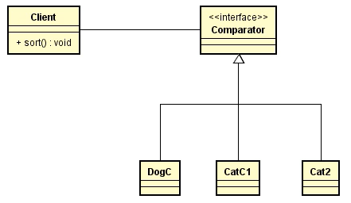

# 设计模式

### 1、单例模式 Singleton

只需要一个实例，并且防止别人 new 好多个对象出来

通常由 Spring 的 Bean 工厂来帮你保证单例，自己写单例的情况越来越少了

##### 各种 Manager（例如配置管理器PropertyManager），各种 Factory

饿汉式

```java
public class Mgr01 {
    private static final Mgr01 INSTANCE = new Mgr01();

    private Mgr01() {}

    public static Mgr01 getInstance() {
        return INSTANCE;
    }

    public void m() {
        System.out.println("m");
    }

    public static void main(String[] args) {
        Mgr01 m1 = Mgr01.getInstance();
        Mgr01 m2 = Mgr01.getInstance();
        System.out.println(m1 == m2);
    }
}
```


### 2、策略模式 Strategy

开闭原则：对修改关闭，对扩展开放



应用：`Tank.fire()` 不同形式的子弹（单方向，双方向，四方向...）通过配置文件读取策略类名，在代码中只需要扩展地添加一个策略的实现类（继承定义好的策略接口），之后通过反射拿到这个策略类就可以了，不需要改变原有的代码。

```java
// Main.java
import java.util.Arrays;

public class Main {
    public static void main(String[] args) {
        Cat[] cats = {new Cat(3, 3), new Cat(5, 5), new Cat(1, 1)};
        //Dog[] a = {new Dog(3), new Dog(5), new Dog(1)};
        Sorter<Cat> sorter = new Sorter<>(); // 自定义 Sorter，调用comparator.compare方法排序
        sorter.sort(cats, new CatWeightComparator());
        System.out.println(Arrays.toString(cats));
    }
}
```


```java
// CatWeightComparator.java
public class CatWeightComparator implements Comparator<Cat> {
    @Override
    public int compare(Cat o1, Cat o2) {
        if (o1.weight < o2.weight) return -1;
        else if (o1.weight > o2.weight) return 1;
        else return 0;
    }
}
```


```java
// Comparator.java 函数式接口：@FunctionalInterface，只有一个方法的接口
@FunctionalInterface
public interface Comparator<T> {
    int compare(T o1, T o2);

    default void m() {
        System.out.println("m");
    }
}
```


### 3、工厂方法模式 FactoryMethod - 抽象工厂 AbstractFactory


### 4、门面模式 Facade - Mediator 调停者


### 5、装饰器模式 Decorator


### 6、责任链模式 ChainOfResponsibility


### 7、观察者模式 Observer


### 8、组合模式 Composite


### 9、享元模式 Flyweight


### 10、静态代理与动态代理 Proxy


### 11、迭代器模式 Iterator


### 12、访问者模式 Visitor


### 13、构建器模式 Builder


### 14、适配器模式 Adapter


### 15、桥接模式 Bridge


### 16、命令模式 Command


### 17、原型模式 Prototype


### 18、备忘录模式 Memento


### 19、模板方法模式 TemplateMethod


### 20、状态模式 State


### 21、Intepreter解释器模式


### 总结：6大设计原则