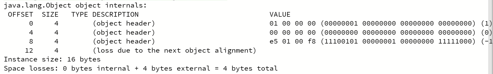

# JVM

### Java 程序是怎样运行的？

- **首先通过 Javac 编译器将 .java 转为 JVM 可加载的 .class 字节码文件。**

  Javac 是由 Java 编写的程序，编译过程可以分为：

   ① 词法解析，通过空格分割出单词、操作符、控制符等信息，形成 token 信息流，传递给语法解析器。

  ② 语法解析，把 token 信息流按照 Java 语法规则组装成语法树。

  ③ 语义分析，检查关键字使用是否合理、类型是否匹配、作用域是否正确等。

  ④ 字节码生成，将前面各个步骤的信息转换为字节码。

  字节码必须通过类加载过程加载到 JVM 后才可以执行，执行有三种模式，解释执行、JIT 编译执行、JIT 编译与解释器混合执行（主流 JVM 默认执行的方式）。混合模式的优势在于解释器在启动时先解释执行，省去编译时间。

- **之后通过即时编译器 JIT 把字节码文件编译成本地机器码。**

  Java 程序最初都是通过解释器进行解释执行的，当虚拟机发现某个方法或代码块的运行特别频繁，就会认定其为"热点代码"，热点代码的检测主要有基于采样和基于计数器两种方式，为了提高热点代码的执行效率，虚拟机会把它们编译成本地机器码，尽可能对代码优化，在运行时完成这个任务的后端编译器被称为即时编译器。

- **还可以通过静态的提前编译器 AOT 直接把程序编译成与目标机器指令集相关的二进制代码。**


### 对象

#### 对象在内存中占用多少字节？

查看一个对象的内存布局，工具：JOL = Java Object Layout

```xml
<dependencies>
    <!-- https://mvnrepository.com/artifact/org.openjdk.jol/jol-core -->
    <dependency>
        <groupId>org.openjdk.jol</groupId>
        <artifactId>jol-core</artifactId>
        <version>0.9</version>
    </dependency>
</dependencies>
```

```java
System.out.println(ClassLayout.parseInstance(o).toPrintable());
```

经过试验，一个`Object o = new Object();`  是16字节，（下图是小端）



添加 `syncronized(o){ sout ... }` 之后：下面 00 表示轻量级锁，因为偏向锁未启动，直接升级为了轻量级锁


- **8 字节（对象头 MarkWord，它的大小是固定的）**
- **4 字节（开启压缩时的对象指针 ClassPointer）**
- **4 字节 padding（对齐，要被 8 整除）**


#### 对象头 MarkWord 包括什么？

MarkWord 里面包括：锁信息、HashCode、GC信息。

jdk8u: markOop.hpp 中，详细的说明了 markword 的布局。理解即可，无需背过。

```
// Bit-format of an object header (most significant first, big endian layout below):
//
//  32 bits:
//  --------
//             hash:25 ------------>| age:4    biased_lock:1 lock:2 (normal object)
//             JavaThread*:23 epoch:2 age:4    biased_lock:1 lock:2 (biased object)
//             size:32 ------------------------------------------>| (CMS free block)
//             PromotedObject*:29 ---------->| promo_bits:3 ----->| (CMS promoted object)
//
//  64 bits:
//  --------
//  unused:25 hash:31 -->| unused:1   age:4    biased_lock:1 lock:2 (normal object)
//  JavaThread*:54 epoch:2 unused:1   age:4    biased_lock:1 lock:2 (biased object)
//  PromotedObject*:61 --------------------->| promo_bits:3 ----->| (CMS promoted object)
//  size:64 ----------------------------------------------------->| (CMS free block)
//
//  unused:25 hash:31 -->| cms_free:1 age:4    biased_lock:1 lock:2 (COOPs && normal object)
//  JavaThread*:54 epoch:2 cms_free:1 age:4    biased_lock:1 lock:2 (COOPs && biased object)
//  narrowOop:32 unused:24 cms_free:1 unused:4 promo_bits:3 ----->| (COOPs && CMS promoted object)
//  unused:21 size:35 -->| cms_free:1 unused:7 ------------------>| (COOPs && CMS free block)
```

总结 JDK8 中对象的 MarkWord 布局如下（64 位，也就是 8 字节）：

要看加的是什么锁的话，先看 markword 的最低两位，是 01 / 00 / 10 / 11


为什么 GC 年龄默认为 15？因为分代年龄只有 4 bit，可以表示最大的数就是 15


#### 对象怎么定位？

怎么通过 `t` 找到 `new T()`？

- 通过句柄池（间接法）
- 通过直接指针（HotSpot用的是这种方式）


### JVM内存模型

#### class 的生命周期

- .class 文件
- 经过 load，link，initialize，进入 JVM
- 经过 JVM 的 run engine，进入 JVM 的运行时数据区
- 最终被 GC

#### Run-time data areas 运行时数据区的组成


每个线程有自己独立的 PC，VMS，NMS

线程之间共享 Heap 以及 MethodArea

- PC：程序计数器
- MethodArea：方法区
  - jdk1.8 之前：Perm Space 永久代
    - 字符串常量位于 Perm Space
    - FGC 不会清理
  - jdk1.8 及之后：Meta Space 元数据区
    - 字符串常量位于 Heap
    - FGC 会清理
- Stacks：栈空间
  - 栈中存放**栈帧**
    - 局部变量表
    - 操作数栈
    - 动态链接
    - 返回值地址
- Heap：堆空间
  - 类实例
  - 为数组分配的空间
- DirectMemory：直接内存，JVM可以直接访问OS管理的内存，提高效率
  - 零拷贝（不需要拷贝），NIO用到
- Run-Time Constant Pool 运行时常量池
