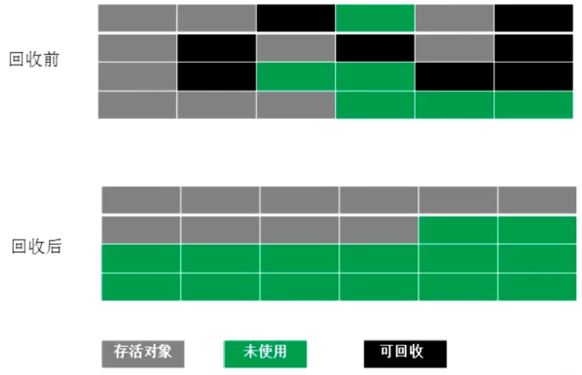

typora-copy-images-to: /images/


# Java

### 容器

连老师在公开课里面讲过相关的源码

- Collection

  - List

    - **CoptOnWriteList**：读时不加锁，写时复制，适用于读线程多，写线程少的情况
    - Vector, Stack
    - ArrayList：会有并发问题
    - LinkedList

  - Set

    - HashSet, LinkedHashSet
    - SortedSet, TreeSet
    - EnumSet
    - CopyOnWriteArraySet
    - ConcurrentSkipListSet

  - Queue

    Queue和List的区别？Queue提供了很多在多线程访问下比较友好的API：

    `add`, `offer`, `peek`, `poll`, `remove`

    - Deque
      - ArrayDeque
      - BlockingDeque, LinkedBlockingDequeue
    - **BlockingQueue**：增加了更多API，比如put，take，可以阻塞/指定时间等待，是MQ的基础，MQ的本质，就是一个大型的生产者、消费者模型
      - ArrayBlockingQueue
      - PriorityBlockingQueue：阻塞的 PriorityQueue
      - **LinkedBlockingQueue**：用链表实现的BlockingQueue。阻塞用`await()`实现，底层是park
      - **TransferQueue, LinkedTransferQueue**：装完之后阻塞等待，直到有线程把它取走，再离开。场景：确认收钱完成之后，才能把商品取走。经典的**交替打印**面试题可以用 TransferQueue 实现
      - **SynchronousQueue**：容量为0，不能往里装东西，只有有一个线程等着的时候，才能把东西递到这个线程手里，是用来一个线程给另外一个线程传数据的。和Exchanger比较相似，也是需要两个线程同步对接，否则都会阻塞。在线程池里面，线程之间进行任务调度的时候，经常会用到。
    - **PriorityQueue**：内部进行了排序，底层是一个二叉树（小顶堆）的结构
    - **ConcurrentLinkedQueue**：里面很多方法是CAS实现的
    - **DelayQueue**：是一种阻塞的队列，需要实现compareTo方法，需要指定等待时间，用来按时间进行任务调度

- Map

  早期的 Vector 和 Hashtable 都自带锁，设计上有不完善的地方，基本上不用

  - HashMap, LinkedHashMap：多线程用 HashMap 要加锁
  - **ConcurrentHashMap**：CAS操作，多线程读取的效率非常高
  - TreeMap：不存在ConcurrentTreeMap，但为了排序，用跳表**ConcurrentSkipListMap**代替树结构
  - WeakHashMap
  - IdentityHashMap

### 多线程

##### 启动线程的三种方式

- 继承Thread，重写run方法
- 实现Runnable接口，重写run方法（或Lambda表达式）
- 通过线程池来启动（实际上是以上两种之一）

##### sleep yield join 的含义

- `sleep`：当前线程暂停一段时间，让别的线程去执行。不释放锁。睡眠时间到，自动复活
- `yield`：当前线程执行时，停下来进入等待队列。系统调度算法决定哪个线程继续运行（有可能还是自己）
- `join`：在当前线程加入调用的join线程，等调用的线程运行完了，自己再继续执行

##### wait notify notifyAll 的含义

Object 对象中有三个方法wait()、notify()、notifyAll()，它们的用途都是用来控制线程的状态。

- wait：必须在同步方法/同步代码块中被调用；释放锁，调用该线程的方法进入**等待队列**，直到被唤醒
- notify：随机唤醒等待队列中等待的一个线程，使得该线程由**等待状态**进入**可运行状态**
- notifyAll：唤醒在此对象监视器上等待的所有线程，被唤醒的线程将以常规方式与在该对象上主动同步的其他所有线程进行竞争

##### 如何关闭线程？interrupt 的含义？

Java没有提供任何机制来安全地终止线程。它提供了 interrupt，这仅仅是会通知到被终止的线程“你该停止运行了”，由编写者决定如何处理 InterruptedException

```java
@Override
public void run() {
    while (true && !Thread.currentThread().isInterrupted()) { // 判断是否处于中断状态
        System.out.println("go");
        try {
            throwInMethod();
        } catch (InterruptedException e) {
            // 恢复设置中断状态，便于在下一个循环的时候检测到中断状态，正常退出
            Thread.currentThread().interrupt();
            e.printStackTrace();// 可以记录一下日志
        }
    }
}
```

不要使用 stop() 关闭线程。

sleep阻塞时候会自动检测中断：`java.lang.InterruptedException: sleep interrupted`


##### ThreadLocal

ThreadLocal 是线程引用对象，线程之间不共享。

- 为什么要有ThreadLocal？

  - Spring的声明式事务会用到。（Spring的声明式事务在一个线程里）
  - connection在连接池里，不同的connection之间怎么形成完整的事务？把connection放在当前线程的ThreadLocal里面，以后拿的时候从ThreadLocal直接拿，不去线池里面拿。

- ThreadLocal是怎么做到线程独有的？

  

  - `ThreadLocalMap`是当前Thread的一个成员变量
  - 使用虚引用，让`Key`指向`ThreadLocal`

##### 强软弱虚四种引用

- 强引用 StrongReference

  - `Object o = new Object()`
  - 只要有引用指向它，就算是OOM了，也不会被回收

- 软引用 SoftReference

  ```java
  SoftReference<byte[]> m = new SoftReference<>(new byte[1024 * 1024 * 10]);
  System.out.println(m.get());
  ```

  - 内存空间不够时，弱引用会被回收
  - 用来做缓存

- 弱引用 WeakReference

  ```java
  WeakReference<M> m = new WeakReference<>(new M());
  System.out.println(m.get());
  ```

  - 只要发生GC，弱引用就会被回收
  - ThreadLocal 中会使用弱引用

- 虚引用 PhantomReference

  ```java
  private static final ReferenceQueue<M> QUEUE = new ReferenceQueue<>();
  public static void main(String[] args) {
      PhantomReference<M> phantomReference = new PhantomReference<>(new M(), QUEUE);
  ```

  - 必须和引用队列`ReferenceQueue`联合使用
  - 虚引用对象被回收前，会被加入到队列中，需要另一线程不断检测队列并处理
  - 用来管理**堆外内存**，堆外内存包括：
    - 方法区
    - NIO 的`DirectByteBuffer`


### 线程池

#### 线程池前值知识

##### Executor 接口关系


##### Callable

​		类似于Runnable，但是可以有返回值

##### Future

​		存储将来执行的结果。Callable被执行完之后的结果，被封装到Future里面。

##### FutureTask

​		更加灵活，是Runnable和Future的结合，既是一个Runnable，又可以存结果。

##### CompletableFuture

​		可以用来管理多个Future的结果，对各种各样的结果进行组合处理。提供了非常好用的接口，十分友好。

> 场景：假设你需要提供一个服务，这个服务查询 京东、淘宝、天猫 对于同一类产品的价格并汇总展示，你用CompletableFuture开启三个线程，来完成这个任务，三个任务全部完成之后，才能继续向下运行。

#### 线程池

**ThreadPoolExecutor**：我们通常所说的线程池。多个线程共享同一个任务队列。

- SingleThreadPool

  为什么会有单线程的线程池？单线程的线程池是有任务队列的；线程池能帮你提供线程生命周期的管理。

  - 线程池里面只有一个线程
  - 保证我们扔进去的任务是被顺序执行的

- CachedThreadPool

  当任务到来时，如果有线程空闲，我就用现有的线程；如果所有线程忙，就启动一个新线程。

  - 核心线程数为0
  - 最大线程数是Integer.MAX_VALUE
  - 保证任务不会堆积
  - SynchronousQueue 是容量为0的阻塞队列，每个插入操作必须等待另一个线程执行相应的删除操作

- FixedThreadPool

  - 固定线程数的线程池
  - 适合做一些**并行**的计算，比如你要找1-200000之内所有的质数，你将这个大任务拆成4个小线程，共同去运行，肯定比串行计算要更快。

- ScheduledPool

  - 专门用来执行定时任务的一个线程池

**ForkJoinPoll**：先将任务分解，最后再汇总，可以有返回值或无返回值。每个线程有自己的任务队列。

- WorkStealingPool
  - 普通的线程池是有一个线程的集合，所有线程去同一个任务队列里面取任务，取出任务之后执行，而 WorkStealingPool 是每一个线程都有自己独立的任务队列，如果某一个线程执行完自己的任务之后，要去别的线程那里偷任务，分担别的线程的任务。
  - WorkStealingPool 本质上还是一个 ForkJoinPool


#### 自定义一个线程池

```java
public class TestThreadPool {
    static class Task implements Runnable {
        @Override
        public void run() {
            System.out.println(Thread.currentThread().getName() + " is running task");
        }
    }
    public static void main(String[] args) {
        // ThreadPoolExecutor 7个参数
        ThreadPoolExecutor tpe = new ThreadPoolExecutor(2, 4,
                60, TimeUnit.SECONDS,
                new ArrayBlockingQueue<Runnable>(4),
                Executors.defaultThreadFactory(),
                new ThreadPoolExecutor.CallerRunsPolicy()); // 调用者处理服务，这里是main调用
        for (int i = 0; i < 8; i++) { // 开启8个任务，放进线程池执行
            tpe.execute(new Task());
        }
        tpe.shutdown();
    }
}
```

##### new ThreadPoolExecutor() 7个参数

- corePoolSize：核心线程数

- maximumPoolSize：最大线程数

- keepAliveTime：空闲线程生存时间

- TimeUnit：生存时间的单位

- BlockingQueue<Runnable>：各种各样的任务队列

- ThreadFactory：线程工厂

  可以使用`Executors.defaultThreadFactory()`，也可以自定义工厂，指定线程名称

- RejectedExecutionHandler：线程池忙且任务队列满时的 **拒绝策略**

  - CallerRunsPolicy，让调用者线程去处理任务
  - AbortPolicy，抛异常
  - DiscardPolicy，扔掉，不抛异常
  - DiscardOldestPolicy，扔掉排队时间最久的


### 锁机制

#### syncronized

​		给一个变量/一段代码加锁，线程拿到锁之后，才能修改一个变量/执行一段代码

- `wait()`
- `notify()`

##### syncronized 实现原理？

- 字节码层面
  - ACC_SYNCHRONIZED
  - `monitorenter`, `monitorexit`
- JVM 层面
  -  C, C++ 调用了操作系统提供的同步机制，在 win 和 linux 上不同
- OS 和硬件层面
  - X86 : `lock cmpxchg` / xxx
  - lock是处理多处理器之间的总线锁问题

#### ReentrantLock 可重入锁

```java
import java.util.concurrent.ExecutorService;
import java.util.concurrent.Executors;
import java.util.concurrent.TimeUnit;
import java.util.concurrent.locks.ReentrantLock;

public class TestLock {
    public static void main(String[] args) throws InterruptedException {
        ExecutorService executorService = Executors.newCachedThreadPool();
        ReentrantLock reentrantLock = new ReentrantLock();
        int count[] = {0};
        for (int i = 0; i < 10000; i++) {
            executorService.submit(() -> {
                try {
                    reentrantLock.lock();  // 获取锁
                    count[0]++;
                } catch (Exception e) {
                    e.printStackTrace();
                } finally {
                    reentrantLock.unlock();  // 释放锁
                }
            });
        }
        executorService.shutdown();
        executorService.awaitTermination(1, TimeUnit.HOURS);
        System.out.println(count[0]);  // 10000
    }
}
```

`private Lock lock = new ReentrantLock();`

- `lock.lock()` 获取锁
- `lock.unlock()` 释放锁

#### volatile

​		保证线程的可见性，同时禁止指令的重排序。

​		一个线程中的改变，在另一个线程中可以立刻看到。

##### DCL单例要不要加volitile？

​		需要。为了防止指令重排序导致拿到半初始化的变量。

##### 硬件和JVM如何保证特定情况下不乱序？

- **硬件层面（针对x86 CPU）**

  - `sfence`（store fence）: 在**sfence指令前的写操作**，必须在**sfence指令后的写操作前**完成。
  - `lfence`（load fence）：在**lfence指令前的读操作**，必须在**lfence指令后的读操作前**完成。

  原子指令，如x86上的`lock …` 指令是一个 Full Barrier，执行时会**锁住内存子系统**来确保执行顺序，甚至**跨多个CPU**。

  Software Locks 通常使用了**内存屏障**或**原子指令**来实现**变量可见性**和**保持程序顺序**.

- **JVM层面（JSR133）**

  - LoadLoad屏障
    - `Load语句1; LoadLoad屏障; Load语句2`
    - 在Load2及后续读取操作要读取的数据被访问前，保证Load1要读取的数据被读取完毕。
  - StoreStore屏障
    - `Store语句1; StoreStore屏障; Store语句2`
    - 在Store2及后续写入操作执行前，保证Store1的写入操作对其它处理器可见。
  - LoadStore屏障
    - `Load语句1; LoadStore屏障; Store语句2`
    - 在Store2及后续写入操作被刷出前，保证Load1要读取的数据被读取完毕。
  - StoreLoad屏障
    - `Store语句1; StoreLoad屏障; Load语句2`
    - 在Load2及后续所有读取操作执行前，保证Store1的写入对所有处理器可见。

##### volitile的实现原理？

- 字节码层面
  - ACC_VOLATILE
- JVM层面
  -  对于volatile内存区的读写，都加屏障
     - **StoreStoreBarrier**
       volatile 写操作
       **StoreLoadBarrier**
     - **LoadLoadBarrier**
       volatile 读操作
       **LoadStoreBarrier**
- OS和硬件层面
  - windows lock 指令实现 | MESI实现

##### happens-before 原则

​		JVM规定重排序必须遵守的规则，由具体的JVM实现

##### as-if-serial

​		不管如何重排序，单线程执行结果不会改变，看起来像是串行的一样


#### JUC包下新的同步机制

- CAS
- AtomicInteger
- AtomicLong
- ReentrantLock
  - 可重入锁
  - 必须要finally中手动释放锁
  - 可以指定为公平锁
- CountDownLatch
  - 门栓
  - 和Join的对比：CountDownLatch可以更灵活，因为在一个线程中，CountDownLatch可以根据你的需要countDown很多次。而join是等待所有join进来的线程结束之后，才继续执行被join的线程。
- CyclicBarrier
  - 循环栅栏
  - 这里有一个栅栏，什么时候人满了，就把栅栏推倒，哗啦哗啦的都放出去，出去之后，栅栏又重新起来，再来人，满了推倒，以此类推。
- Phaser
  - 按照不同的阶段来对线程进行执行
  - 场景：n个人全到场才能吃饭，全吃完才能离开，全离开才能打扫
- ReadWriteLock
  - **读写锁**，其实就是 **shared共享锁** 和 **exclusive排他锁**
  - 读写有很多种情况，比如，你数据库里的某条数据，你放在内存里读的时候特别多，你改的次数并不多。这时候将读写的锁分开，会大大提高效率，因为读操作本质上是可以允许多个线程同时进行的。
- Semaphore
  - 信号量，类似于令牌桶
  - 可以用于限流：最多允许多少个 线程同时在运行
- Exchanger
  - 可以想象 exchanger 是一个容器，用来在两个线程之间交换变量
- LockSupport
  - 在线程中调用`LockSupport.park()`，阻塞当前线程
  - `LockSupport.unpark(t)` 唤醒 `t` 线程
  - unpark 方法可以先于 park 方法执行，unpark 依然有效
  - 这两个方法的实现是由 Unsafe 类提供的，原理是操作线程的一个变量在0,1之间切换，控制阻塞和唤醒
  - AQS 就是调用这两个方法进行线程的阻塞和唤醒的。

##### AQS（AbstractQueuedSyncronizer）

- AQS的底层是 CAS + volitile
- 用CAS替代了锁整个链表的操作
- VarHandle 类
  - 普通属性也可以进行原子操作
  - 比反射快，直接操作二进制码


#### 锁升级过程

偏向锁、自旋锁都是用户空间完成；重量级锁需要向内核申请

- **偏向锁**
  - syncronized
  - **没有必要**设计**锁竞争机制**时，只是把第一个访问的`线程的id`写到`markword`中，而不去真正的加锁


- **CAS（也叫 自旋锁，无锁，轻量级锁）**
  - 偏向锁时，有人来竞争锁了，现在操作系统把偏向锁撤销，进行**自旋锁（轻量级锁）竞争**。
  - 一种乐观锁：`cas(v, a, b)` 变量v，期待a，修改值b
    - Java 中调用了 native 的 `conpareAndSwapXXX()` 方法
    - 每个人在自己的线程内部生成一个自己LR（Lock Record锁记录），两个线程通过自己的方式尝试将 LR 写门上，竞争成功的开始运行，竞争失败的一直自旋等待。
    - 实际上是汇编指令 `lock cmpxchg`，硬件层面实现：在操作过程中不允许被其他CPU打断，避免CAS在写数据的时候被其他线程打断，相比操作系统级别的锁，效率要高很多。
     - 如何解决ABA问题？
       - 基础数据类型即使出现了ABA，一般问题不大。
       - 解决方式：加版本号，后面检查的时候连版本号一起检查。
       - Atomic里面有个带版本号的类 `AtomicStampedReference`，目前还没有人在面试的时候遇到过。

- **重量级锁**
  - 当必须加锁时，markword中记录的是objectmonitor（JVM用C++写的一个Object）


## JVM

### 对象

##### 对象的创建过程？

1. class loading：把一个 class 文件 load 到内存中
2. class linking
   1. verification：校验装进来的 class 文件是否符合标准，比如 `CA FE BA BE`
   2. preparation：将 class 文件的静态变量赋默认值（不是初始值）
   3. resolution：把 class 文件常量池中用到的符号引用，转换为直接内存地址可以直接访问到的内容
3. class initializing：静态变量这时候才会赋初始值
4. 申请对象内存
5. 成员变量赋默认值
6. 调用构造方法
   - 成员变量按照顺序赋初始值
   - 执行构造方法语句

##### 对象在内存中占用多少字节？

经过试验，一个`Object o = new Object()` 是16字节

- 8字节（对象头）
- 4字节（开启压缩时的对象指针）
- 4字节 padding（对齐）

##### 对象头 MarkWord 包括什么？

jdk8 对象的 MarkWord 布局：


为什么GC年龄默认为15？因为分代年龄只有4bit，可以表示最大的数就是15

##### 对象怎么定位？

- 句柄池
- 直接指针（HotSpot用这种方式）


### 类加载器

#### 双亲委派机制

不同的类加载器加载不同的 class。双亲委派机制是一个递归：

1. 子类先委托父类加载
2. 父类加载器有自己的**加载范围**，范围内没有找到，则不加载，并返回给子类
3. 子类在收到父类无法加载的时候，才会自己去加载

##### 为什么要搞双亲委派？

主要为了安全。如果任何一个 class 都可以把它 load 到内存的话，那我就可以自定义一个 java.lang.string 类，交给自定义的 ClassLoader，把这个我自己的 string 类打包给客户，它被 load 进内存，然后客户把密码存储成 String 类型对象，我偷摸把密码发给自己，这样就不安全了。

##### Bootstrap ClassLoader

- C++实现
- 加载 <JAVA_HOME>/lib下的类，是 jdk 最核心的内容，例如 rt.jar, charset.jar

- 加载路径：sun.boot.class.path

##### Extension ClassLoader

- Java 实现

- 加载扩展包中的类，在 jdk 安装目录 jre/lib/ext 下的 jar

- 加载路径：java.ext.dirs

##### Application ClassLoader

- 我们写的代码默认就是由它来加载

- 加载 classpath 指定的内容

- 加载路径：java.class.path

##### 自定义ClassLoader

- 加载自己定义的加载器


### JVM内存模型

##### class 的生命周期

- .class 文件
- 经过 load，link，initialize，进入 JVM
- 经过 JVM 的 run engine，进入 JVM 的运行时数据区
- 最终被 GC

##### Run-time data areas 的组成

每个线程有自己独立的 PC，VMS，NMS

线程之间共享 Heap 以及 MethodArea

- PC：程序计数器
- MethodArea：方法区
  - jdk1.8 之前：Perm Space 永久代
    - 字符串常量位于 Perm Space
    - FGC 不会清理
  - jdk1.8 及之后：Meta Space 元数据区
    - 字符串常量位于 Heap
    - FGC 会清理
- Stacks：栈空间
  - 栈中存放**栈帧**
    - 局部变量表
    - 操作数栈
    - 动态链接
    - 返回值地址
- Heap：堆空间
  - 类实例
  - 为数组分配的空间
- DirectMemory：直接内存，JVM可以直接访问OS管理的内存，提高效率
  - 零拷贝（不需要拷贝），NIO用到
- Run-Time Constant Pool 运行时常量池


### 垃圾回收机制

垃圾：没有引用指向的对象

#### 针对分代模型

##### 新生代（堆空间）

- 分为 1 个 **伊甸区**，2 个 **survivor 区**
- 存活对象少，使用 **拷贝算法**

##### 老年代（堆空间）

- 存活对象多，使用 **标记压缩算法 / 标记清除算法**

##### 永久代（方法区 MethodArea）（堆之外空间）

存的是class的元信息，代码的编译信息等待等等

- 1.8 之前：Perm Generation，固定设置大小
- 1.8 之后：MetaSpace，默认受限于物理内存，可以设置
- 字符串常量1.7在Perm Generation，1.8在堆内存


除了 Epsilon，ZGC，Shenandoah 之外的垃圾回收器，都是 **逻辑分代** 模型

G1是 **逻辑分代，物理不分代**（物理分代就是内存里确实有这样一块空间）

除此之外，其余的不仅逻辑分代，而且物理分代。


#### 对象何时进入老年代？

对象头 MarkWord 中分代年龄只有 4bit，所以最大是15次

PS 默认是15，CMS 默认是 6


#### 对象分配过程？

1. start 会 new 一个对象，首先在栈上分配，如果能分配到栈上，则分配到栈上
2. 如果栈上分配不下，判断是否大对象
   - 如果是大对象，直接进入 old 区
   - 如果不是大对象，进入 TLAB 线程本地，到 eden 区
3. 进行 GC 清除
   - 如果是垃圾，则对象被清除
   - 如果不是垃圾，进入 survivor 区
   - 如果 survivor 区年龄到达，进入 old 区

**动态年龄，分配担保**：了解即可


#### GC的分类

MinorGC / YGC：年轻代空间耗尽时触发

MajorGC / FullGC：老年代无法分配空间时触发，新生代、老年代同时进行回收


#### “找到”垃圾的算法？

- 引用计数算法（ReferenceCount）

- 根可达算法（RootSearching）

  通过一系列**GC Roots 对象**作为起始点，开始向下搜索，若一个对象没有任何引用链相连，则不可达。

  **GC Roots 对象**包括：

  - JVM stack
  - native method stack
  - run-time constant pool
  - static references in method area
  - Clazz


#### “清除”垃圾的算法？

##### Mark-Sweep 标记清除算法


- 需要两遍扫描：第一遍标记，第二遍清除
- 产生碎片
- 适合 **存活对象较多** 的情况，不适合Eden区

##### Copying 拷贝算法


- 只扫描一次，效率高
- 不产生碎片
- 空间折半浪费
- 移动、复制对象时，需要调整对象引用
- 适合 **存活对象比较少** 的情况

##### Mark-Compact 标记压缩算法



- 需要扫描两次，需要移动对象，效率偏低
- 不产生碎片
- 不会产生内存减半
  

#### 常见的垃圾回收器


常见组合：

- Serial + Serial Old
- ParNew + CMS
- Parallel Scavenge + Parallel Old（PS + PO），1.8 默认

##### 1、Serial + Serial Old

- STW
- 单线程
- Serial 工作在年轻代，Serial Old 工作在老年代

##### 2、PS + PO（默认）

10G内存的话，回收一次要十几秒

- STW
- 多个GC线程并行回收
- 线程数不可能被无限增多，CPU会将资源耗费在线程切换上

##### 3、ParNew + CMS

启用方式：

```java
java -Xms20M -Xmx20M -XX:+PrintGCDetails -XX:+UseConcMarkSweepGC com.mashibing.jvm.gc.T15_FullGC_Problem01
```

ParNew：

- STW
- 多个GC线程
- 有可以与 CMS 结合的同步机制
- 年轻代

CMS：

- 并发回收，工作线程和GC线程同时进行，暂停时间短
- 老年代
- 分为 **四个阶段**：
  - 初始标记：需要STW，因为初始的垃圾并不多，因此耗费的时间不长
  - 并发标记：垃圾回收线程和工作线程同时执行。一边产生垃圾，一边标记（最耗时的阶段并发执行）
  - 重新标记：STW，对并发标记的过程中新产生的垃圾进行重新标记 / 取消标记
  - 并发清理：清理的过程也会产生新的“浮动垃圾”，需要等下一次CMS重新运行的时候再次清理
- CMS 存在的 **问题**：
  - Memory Fragmentation **内存碎片** 问题
  
    -  标记清除会产生碎片化，如果老年代不能再分配位置，CMS会让 Serial Old 来清理，效率很低。
  
    - 解决方案：
  
      `-XX:+UseCMSCompactAtFullCollection` 在FGC时进行压缩
  
      ` -XX:CMSFullGCsBeforeCompaction` 多少次FGC之后进行压缩，默认是0
  
  - Floating Garbage **浮动垃圾** 问题
  
    - 如果老年代满了，浮动垃圾还没有清理完，会让 Serial Old 清理。
  
    - 解决方案：
  
      降低触发 CMS 的阈值，保持老年代有足够的空间
  
      `-XX:CMSInitiatingOccupancyFraction` 使用多少比例的老年代后开始CMS收集。实际回收的时候它是一个近似值，可能没达到这个值就已经触发了。默认是68%，有人说是 92%，好像有个计算公式，没有去深究。如果频繁发生SerialOld卡顿，应该把它调小，但是调小的缺点是频繁CMS回收。
  
      如何查看这个默认值？
  
      `java -XX:+PrintFlagsFinal -version | grep CMSInitiatingOccupancyFraction`

##### 4、G1

如果你生产是 1.8 的 jdk，推荐使用 G1 回收器。启动方式：

```java
java -Xms20M -Xmx20M -XX:+PrintGCDetails -XX:+Use G1GC com.mashibing.jvm.gc.T15_FullGC_Problem01
```

G1的特点：适用于需要特别快的响应时间的场景（不需要很高吞吐量）。

G1的新老年代的比例是动态的，默认年轻代占用 5%-60%，一般不用手工指定，也不要手工指定。因为这是G1预测停顿时间的基准。它会根据上次回收的时间，进行新老年代的比例的动态调整。

**G1的一些概念：**

###### card table 卡表

- 基于 card table，将堆空间划分为一系列2^n大小的 card page
- card table 用 bitmap 来实现，用于标记卡页的状态，每个 card table 项对应一个 card page
- 当对一个对象引用进行写操作时（对象引用改变），写屏障逻辑会标记对象所在的 card page 为 dirty

###### Cset（collection set）

Cset是一组可以被回收的分区的集合。它里面记录了有哪些对象需要被回收。

###### Rset（remembered set）

Rset 中有一个 Hash 表，里面记录了其它 region 中的对象到本 region 的引用。

Rset 的价值在于，它使得垃圾收集器不需要扫描整个堆，去找谁引用了当前分区中的对象，只需要扫描 Rset 即可。

Rset会不会影响赋值的效率？会！由于Rset的存在，那么每次给对象复制引用的时候，需要在Rset中做一些额外的记录，比如说记录有哪些引用指向了我的对象等等，这些操作在GC中被称为写屏障。此处不同于内存屏障，是GC专有的写屏障。NO Silver Bullet！只有特定条件下特定的解决方案，没有通用的解决方案。


**G1的回收过程：**

- 把内存空间分为一块一块的 **region**

- 当G1垃圾回收器发现有必要进行垃圾回收的时候，会优先回收存活对象最少的region，也就是垃圾最多的region，这就是“垃圾优先”。每一个region都有自己的逻辑分代：

  - old
  - suvivor
  - eden
  - humongous 存放巨型对象（跨越多个region的对象）

- G1 的 GC 分为三种，不同种类的 GC 可能会同时进行。比如 YGC 和 MixedGC 的 initial mark 同时进行

  - **YGC**
  - **MixedGC**：比如YGC已经回收不过来的，堆内存空间超过了45%，默认就启动了MixedGC。
    - MixedGC 发生的阈值可以自行设定
    - MixedGC 相当于一套完整的 CMS
      - 初始标记 STW
      - 并发标记
      - 最终标记 STW（重新标记）
      - 筛选回收 STW（并行）
  - **FullGC**：G1 也是有 FGC 的，对象分配不下的时候，就会产生 FGC。我们说 G1 和 CMS 调优目标之一就是尽量不要有 FGC，但这并不容易达到。因此有了面试题：如果G1产生FGC，你应该做什么？
    1. 扩内存
    2. 提高CPU性能（回收的快，业务逻辑产生对象的速度固定，垃圾回收越快，内存空间越大）
    3. 降低MixedGC触发的阈值，让MixedGC提早发生（默认是45%）

  

- 并发标记算法

  

  - CMS 和 G1 用到的都是**三色标记**算法
    - 白色：未被标记的对象
    - 灰色：自身被标记，成员变量未被标记
    - 黑色：自身和成员变量均标记完成
  - 漏标：本来是 live object，但是由于没有遍历到，被当成 garbage 回收掉了。例如在 remark 的过程中，A 指向了 D，如果不对 A 进行重新扫描，则会漏标，导致D被当做垃圾回收掉。
  - 漏标解决方案：
    - incremental update：增量更新，关注引用的**增加**，把黑色重新标记为灰色，下次重新扫描属性。CMS使用这种方案。
    - SATB（snapshot at the begining）：关注引用的**删除**。当B->D消失时，要把这个引用推到GC的堆栈，保证D还能被GC扫描到。下次扫描时会拿到这个引用，由于有Rset的存在，不需要扫描整个堆去查找指向白色的引用，效率比较高。SATB配合Rset，浑然天成。G1使用这种方案。

##### 一些拓展知识

- 阿里的多租户 JVM：把一个 JVM 分为还几个小块，分给租户用
- 专门针对 web application 的，session base 的 JVM。请求来访问的时候产生的垃圾，在请求结束之后被回收

### JVM常用命令参数

#### HotSpot参数分类

    标准：  - 开头，所有的HotSpot都支持
    非标准：-X 开头，特定版本HotSpot支持特定命令
    不稳定：-XX 开头，下个版本可能取消
#### 调优前的基础概念：

所谓调优，首先确定：是吞吐量优先，还是响应时间优先？还是在一定的响应时间下，要求达到多大的吞吐量？

- 吞吐量：用户代码时间 /（用户代码执行时间 + 垃圾回收时间）
  - 科学计算、数据挖掘，一般吞吐量优先
  - PS + PO

- 响应时间：STW越短，响应时间越好
  - 网站、GUI、API，一般响应时间优先
  - 1.8 G1

并发：淘宝双11并发历年最高54万，据说12306并发比淘宝更高，号称上百万

- TPS
- QPS，Query Per Second

#### 什么是调优？

##### 1、如何根据需求进行 JVM 规划和预调优？

有人要问你，你应该选用多大的内存？什么样的垃圾回收器组合？你怎么回答？

- 要有实际的业务场景，才能讨论调优
- 要有监控，能够通过压力测试看到结果

步骤：

（1）熟悉业务场景，选择合适的垃圾回收器。是追求吞吐量，还是追求响应时间？

（2）计算内存需求。没有一定之规，是经验值。 1.5G -> 16G，突然卡顿了，为啥？

（3）选定CPU。预算能买到的，当然是越高越好，CPU多核，可以多线程运行呀！

（4）设定年代大小、升级年龄

（5）设定 **日志参数**

`-Xloggc:/opt/xxx/logs/xxx-xxx-gc-%t.log -XX:+UseGCLogFileRotation-XX:NumberOfGCLogFiles=5 -XX:GCLogFileSize=20M -XX:+PrintGCDetails -XX:+PrintGCDateStamps -XX:+PrintGCCause HelloGC`

5个日志文件循环产生，生产中的日志一般是这么设置，`%t`是生成时间的意思。这个是Java虚拟机的参数，也可以在Tomcat里面配置，貌似是在叫catalina options里面指定java日志的参数

（6）观察日志情况

###### 案例1：垂直电商，最高每日百万订单，处理订单系统需要什么样的服务器配置？

> 这个问题比较业余，因为很多不同的服务器配置都能支撑(1.5G 16G 都有可能啊)
>
> 我们做一个假设吧，1小时360000个订单。在集中时间段， 100个订单/秒，（找一小时内的高峰期，可能是1000订单/秒）。我们就要找到这个最高峰的时间，保证你的架构能够承接的住。
>
> 大多数情况下，是靠经验值，然后做压测。
>
> 如果非要计算的话，你预估一下，一个订单对象产生需要多少内存？512K * 1000 = 500M
>
> 专业一点的问法：要求响应时间在多少时间的情况下，比如100ms，我们去挑一个市面上性价比比较高的服务器，做压测去测试，再不行加内存，再不行，就上云服务器…
> 这样说就OK了

###### 案例2：12306遭遇春节大规模抢票应该如何支撑？（架构上的一个设计，与调优关系不大）

> 12306应该是中国并发量最大的秒杀网站：号称并发量最高100W
>
> 架构模型：CDN -> LVS -> NGINX -> 业务系统 -> 100台机器，每台机器1W并发（单机10K问题），目前这个问题主要用Redis解决
>
> 业务流程：普通电商订单 -> 下单 -> 订单系统（IO）减库存 -> 生成订单，等待用户付款
>
> 12306的一种可能的模型，是异步来进行的： 下单 -> 减库存 和 订单(redis kafka) 同时异步进行 ->等付款，付完款，持久化到Hbase, MySQL等等
>
> 减库存最后还会把压力压到一台服务器，怎么办？可以做分布式本地库存 + 单独服务器做库存均衡
>
> 大流量的处理方法：分而治之，每台机器只减自己机器上有的库存
>
> **流量倾斜**的问题怎么解决？比如有的机器上已经没库存了，有的机器上还剩很多？这时候你还需要一台单独的服务器，去做所有服务器的平衡，如果某台服务器没库存了，从别的机器上挪一些过去。


##### 2、优化运行JVM运行环境（慢，卡顿）

###### 案例1：升级内存后反而网站更卡

有一个50万PV的文档资料类网站（从磁盘提取文档到内存）原服务器32位，1.5G的堆，用户反馈网站比较缓慢。因此公司决定升级，新的服务器为64位，16G的堆内存，结果用户反馈卡顿十分严重，反而比以前效率更低了！ 

1. **为什么原网站慢?**

   因为很多用户浏览数据，很多用户浏览导致很多数据Load到内存，产生了很多文档对应的Java包装对象（而不是文档对象，文档本身可以走Nginx）。内存不足，频繁GC，STW长，响应时间变慢

2. **为什么会更卡顿？**

   内存越大，FGC时间越长

3. **怎么解决？**

   PS 换成 PN + CMS，或者 G1
   或者业务上的调整，文档不走JVM


###### 案例2：系统CPU经常100%，如何调优？

推理过程是：CPU100%，那么一定有线程在占用系统资源，所以

1. 找出哪个进程cpu高（top命令）
2. 该进程中的哪个线程cpu高（top -Hp）
3. 如果是java程序，导出该线程的堆栈 （jstack命令）
4. 查找哪个方法（栈帧）消耗时间，哪个方法调用的哪个方法 (jstack)，然后去看这个方法的代码
5. 工作线程占比高 / 垃圾回收线程占比高？


###### 案例3：系统内存飙高，如何查找问题？

1. 导出堆内存 (jmap)
2. 分析 (jhat jvisualvm mat jprofiler … )


**如何监控JVM?**

可以使用 jstat jvisualvm jprofiler arthas top…等等


##### 3、解决JVM运行过程中出现的各种问题(不完全等同于解决OOM的问题，因为前面两项也很重要)


