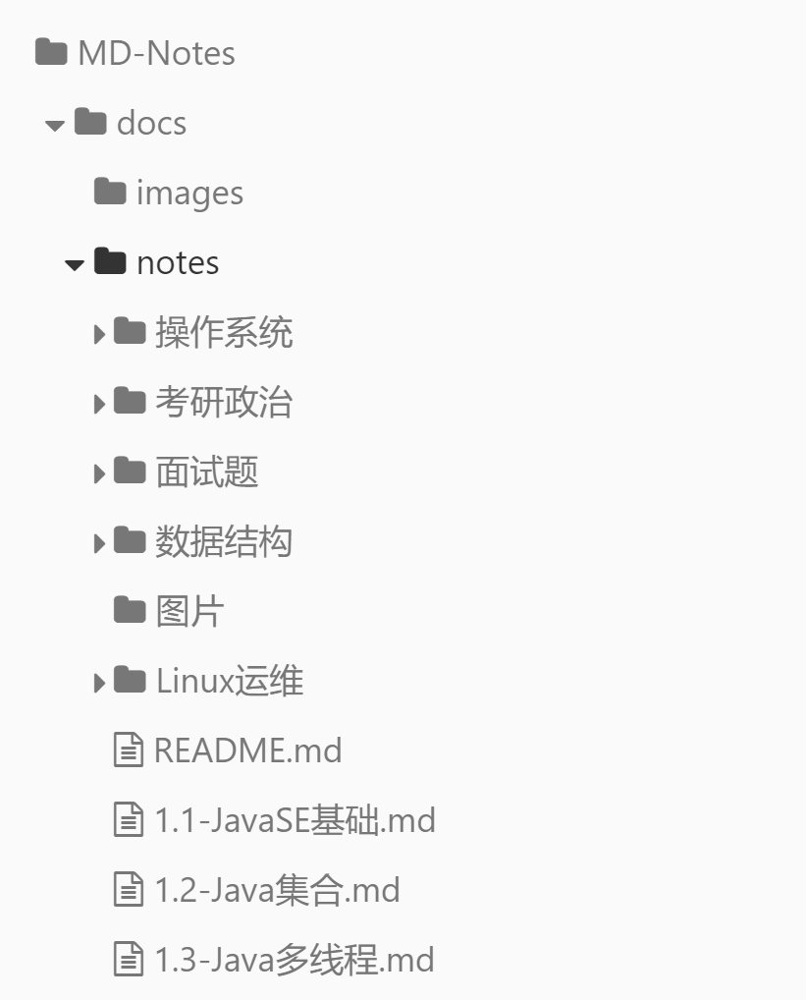

# MD-Notes：后端笔记总结

##### 关于 MD-Notes：

业余时间学习技术的同时，做一些记录和总结并乐于分享。

日常主要接触 Web 前后端开发、Linux 运维等，有 Java / Python 后端经验，有大数据开发 Flink，Spark 实战经验，熟练运用 MySQL，Redis，Zookeeper 及常用前后端框架 Vue，Spring，Flask 等，熟悉自动化运维工具 Docker, Kubernetes 等。

希望踏实走技术路线，对业务、架构以及技术的底层知识做一些更深入的研究。

CSDN博客地址：https://hanquan.blog.csdn.net/

Github 地址：[https://github.com/HanquanHq/MD-Notes](https://github.com/HanquanHq/MD-Notes)

**笔记持续更新中！喜欢的话，可以给个 star 噢 ~~** 

- 面向后端开发攻城狮
- 各种基础知识，包括计组、计网、Java、MySQL、Redis、k8s、zk 等等
- 操作系统
- 数据结构
- Linux运维
- P8架构
- 面试题汇总


---

# 目录

[1.1 JavaSE基础](/notes/1.1-JavaSE基础)：面向对象，集合，IO流等

[1.2 Java集合](/notes/1.2-Java集合)：HashMap，ConcurrentHashMap扩容原理等

[1.3 Java多线程](/notes/1.3-Java多线程)：线程状态，ThreadLocal，强软弱虚引用，自定义线程池

[1.4 Java类加载机制-双亲委派模型](/notes/1.4-Java类加载机制-双亲委派)：类加载过程，双亲委派机制

[1.5 Java锁机制](/notes/1.5-Java锁机制)：syncronized原理，锁升级，ReentrantLock，锁重入，volatile，CAS，AQS

[1.6 Java垃圾回收机制](/notes/1.6-Java垃圾回收机制)：JVM 堆分代模型，垃圾回收算法，JVM调优

[1.7 JVM内存模型](/notes/1.7-JVM内存模型)：对象内存布局，Markword，对象分配过程，JVM内存模型

[1.8 Spring原理](/notes/1.8-Spring原理)：IOC，AOP原理

[1.9 JVM调优实战](/notes/1.9-JVM调优实战)：JVM 常用命令参数，CPU内存飙高，生产环境OOM排查方法

[2.1 MySQL](/notes/2.1-MySQL)：MySQL 基本架构，各种log，存储引擎，锁，事务，索引实现原理，索引下推

[3.1 Redis](/notes/3.1-Redis)：数据类型，内存模型，AOF/RDB持久化，缓存击穿/缓存穿透/缓存雪崩，Redis集群，AKF拆分原则，一致性哈希算法

[4.1 计组、操作系统](/notes/4.1-计组、操作系统)：缓存行对齐伪共享问题，总线分类，进程线程，中断，系统调用，用户态内核态，Linux内核同步机制

[5.1-网络BIO,NIO,epoll](/notes/5.1-网络BIO,NIO,epoll)：同步/异步模型、阻塞/非阻塞模型，netty

[5.2-网络TCP,IP基础](/notes/5.2-网络TCP,IP基础)：七层体系结构图，三次握手四次挥手，HTTP 长连接、短连接

[5.3-LVS负载均衡](/notes/5.3-LVS负载均衡)：网络协议原理，七层模型，下一跳机制，NAT 网路地址转换，负载均衡调度方法，keepalived

[6.1-数据结构与算法](/notes/6.1-数据结构与算法)：数据结构算法常见面试考题，树，排序，堆

[6.2-常见时间复杂度](/notes/6.2-常见时间复杂度)：大 O 复杂度图表，排序算法复杂度表

[7.1 设计模式](/notes/7.1-设计模式)：单例模式，策略模式，工厂模式等等

[8.1 zookeeper](/notes/8.1-zookeeper)：分布式协调服务，ZooKeeper 集群，节点间通信原理，Paxos 协议，ZAB协议对Paxos的简化，使用ZooKeeper实现分布式配置中心/分布式锁

[9.1 关于项目](/notes/9.1-关于项目)：整体概述，项目难点，项目优化

[10.1-其它](/notes/10.1-其它)：零碎资料


## 操作系统

程序员必须了解的操作系统原理！

[第1章-计算机系统概述](/notes/操作系统/第1章-计算机系统概述)

[第2章-进程管理1-进程线程](/notes/操作系统/第2章-进程管理1-进程线程)

[第2章-进程管理2-处理机调度](/notes/操作系统/第2章-进程管理2-处理机调度)

[第2章-进程管理3-同步互斥死锁](/notes/操作系统/第2章-进程管理3-同步互斥死锁)

[第3章-内存管理1-空间分配](/notes/操作系统/第3章-内存管理1-空间分配)

[第3章-内存管理2-虚拟内存](/notes/操作系统/第3章-内存管理2-虚拟内存)

[第4章-文件管理1-文件系统](/notes/操作系统/第4章-文件管理1-文件系统)

[第4章-文件管理2-磁盘管理](/notes/操作系统/第4章-文件管理2-磁盘管理)

[第5章-设备管理](/notes/操作系统/第5章-设备管理)


## 数据结构

会砌猪圈的泥瓦匠学完数据结构，就会盖个双层小楼啦~

[1-排序](/notes/数据结构/排序)

[2-树](/notes/数据结构/树)

[3-搜索结构](/notes/数据结构/搜索结构)

[4-图](/notes/数据结构/图)


## Linux运维

学习记录 Linux 系统运维工作心得，让 Linux 学习从此不再晦涩难懂！

[1-运维职责是什么](/notes/Linux运维/1-运维职责是什么)

[2-服务器硬件](/notes/Linux运维/2-服务器硬件)

[3-Linux系统](/notes/Linux运维/3-Linux系统)


## P8架构

P8 架构师究竟要掌握什么样的技术水平？

[1-架构理论](/notes/P8架构/1-架构理论)：缓冲、缓存、复用、分治、亲密性、技术选型，从过去到未来

[2-模板机封装](/notes/P8架构/2-模板机封装)：集群搭建：CentOS 7 模板机封装、配置静态 IP、简单优化

[2-etcd集群环境搭建](/notes/P8架构/2-etcd集群环境搭建)：什么是 etcd，etcd集群搭建，容易出现的问题

[3-分布式锁多种实现](/notes/P8架构/3-分布式锁多种实现)：基于 MySQL/Redis/zookeeper/etcd 的多种分布式锁实现原理

[4-美团leaf分布式id解决方案](/notes/P8架构/4-美团leaf分布式id解决方案)：美团 Leaf 分布式 ID 生成器部署过程

[4-zookeeper集群搭建](/notes/P8架构/4-zookeeper集群搭建)：主机规划（3台），Java 环境安装与配置，zookeeper 集群搭建与运行

[5-分布式ID业界解决方案](/notes/P8架构/5-分布式ID业界解决方案)：基于UUID，基于DB数据库多种模式，基于Redis，基于ZK、etcd，基于SnowFlake，美团Leaf，百度uid-generator

[6-ES和Redis环境安装与配置](/notes/P8架构/6-ES和Redis环境安装与配置)：IDC机房和P8架构中硬件设备选购案例；搭建ES环境P8集群架构；Redis cluster集群搭建（单主机3主3从，主机配置2C4G）

[](/notes/P8架构/)

[](/notes/P8架构/)


## 面试题汇总

收集自网络

[2019Java面试分模块总结](/notes/面试题/2019java面试分模块总结)

[2019阿里淘系面试](/notes/面试题/2019阿里淘系面试)

[2019百度面经](/notes/面试题/2019百度面经)

[2019菜鸟快递面经](/notes/面试题/2019菜鸟快递面经)

[2019滴滴面经](/notes/面试题/2019滴滴面经)

[2019京东金融面经](/notes/面试题/2019京东金融面经)

[2019京东面经](/notes/面试题/2019京东面经)

[2019美团面经](/notes/面试题/2019美团面经)

[2019顺丰面经](/notes/面试题/2019顺丰面经)

[2020阿里笔试7.27题目](/notes/面试题/2020阿里笔试7.27题目)

[2020百度](/notes/面试题/2020百度)

[2020跟谁学文思海辉面经](/notes/面试题/2020跟谁学文思海辉面经)

[2020快手,学堂在线,销售易,搜狐](/notes/面试题/2020快手,学堂在线,销售易,搜狐)

[2020美团,字节跳动](/notes/面试题/2020美团,字节跳动)

[2020拼多多Java](/notes/面试题/2020拼多多Java)

[2020域起网络面经](/notes/面试题/2020域起网络面经)

[2020字节面经](/notes/面试题/2020字节面经)

[2020字节提前批二面](/notes/面试题/2020字节提前批二面)

[20200728大厂三年经验-中间件](/notes/面试题/20200728大厂三年经验-中间件)

[20200730美团社招Java](/notes/面试题/20200730美团社招Java)

[20200808拼多多面经](/notes/面试题/20200808拼多多面经)

[20200826拼多多复习](/notes/面试题/20200826拼多多复习)

[HR常问](/notes/面试题/HR常问)

[其他面试题](/notes/面试题/其他面试题)


---

# 关于本 MD-Notes 的部署

docsify 可以快速帮你生成文档网站。不同于 GitBook、Hexo 的地方是它不会生成静态的 .html 文件，所有转换工作都是在运行时。如果你想要开始使用它，只需要创建一个 index.html 就可以开始编写文档并直接部署在 GitHub Pages。

##### 文档结构



##### 1、用 docsify 搭建文档类型网站

- docsify官方文档：https://docsify.js.org/#/zh-cn/

- 也可参考我的博客：https://hanquan.blog.csdn.net/article/details/111934332
- 也可参考：[使用 docsify 搭建文档类型网站](https://mp.weixin.qq.com/s?__biz=Mzg2OTA0Njk0OA==&mid=2247486555&idx=2&sn=8486026ee9f9ba645ff0363df6036184&chksm=cea24390f9d5ca86ff4177c0aca5e719de17dc89e918212513ee661dd56f17ca8269f4a6e303&token=298703358&lang=zh_CN#rd)

步骤1：在本地 Windows 上初始化文档

```shell
# windows安装docsify
npm i docsify-cli -g
# 初始化目录
docsify init ./docs
# 启动一个本地服务器，可以方便地实时预览效果。默认访问地址 http://localhost:3000
docsify serve docs
```

步骤2：在 Linux 上部署。部署不需要安装docsify，只需将服务器的访问根目录设定为 index.html 文件即可。

```shell
# 修改nginx配置后，reload一下
./nginx -s reload
```

##### 2、参考链接

Github上一篇较全的 Java 总结：[Java Giude](https://snailclimb.gitee.io/javaguide/#/?id=java)

在线图片压缩网站：https://www.bejson.com/ui/compress_img/，压缩图片后，方便提高页面访问速度

##### 3、待完善

github hooks 自动拉取代码更新

##### 4、2021 技术栈

- DDD领域驱动设计

- 全面拥抱云原生

  云原生从字面意思上来看可以分成**云**和**原生**两个部分。

  云是和本地相对的，传统的应用必须跑在本地服务器上，现在流行的应用都跑在云端，云包含了IaaS,、PaaS和SaaS。

  原生就是土生土长的意思，我们在开始设计应用的时候就考虑到应用将来是运行云环境里面的，要充分利用云资源的优点，比如️云服务的**弹性**和**分布式**优势。

- 5G 引发万物互联

  以前互联网设备只能提供数据收集、边缘计算，5G之后由于其极低延迟，可以提供远程手术、智能驾驶等

- 服务网格

  极大缩减整体研发成本、人员成本、运维成本，服务网格就是在云上部署运维的，云原生+服务网格是技术趋势，阿里已经落地service mash+istio，是技术的风口

- 系统底层技术，将是2021技术面试的竞争点

  高性能框架的原理，Linux等