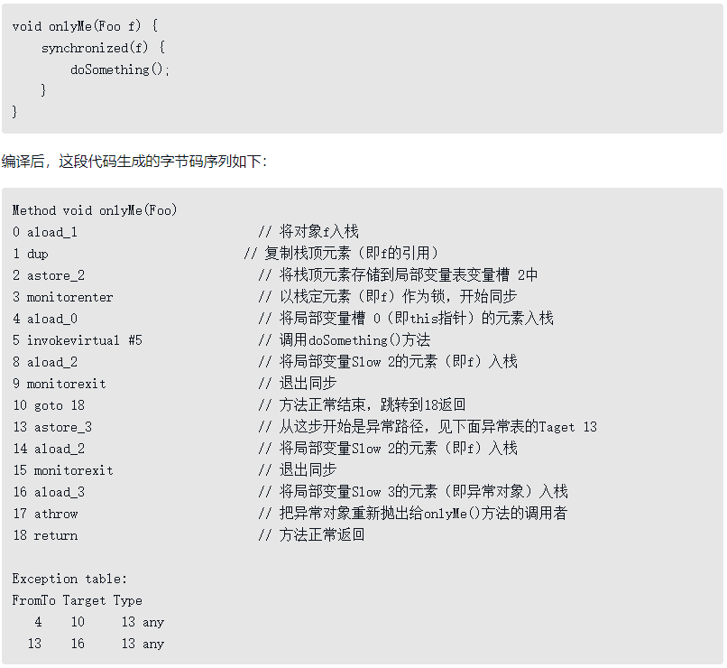
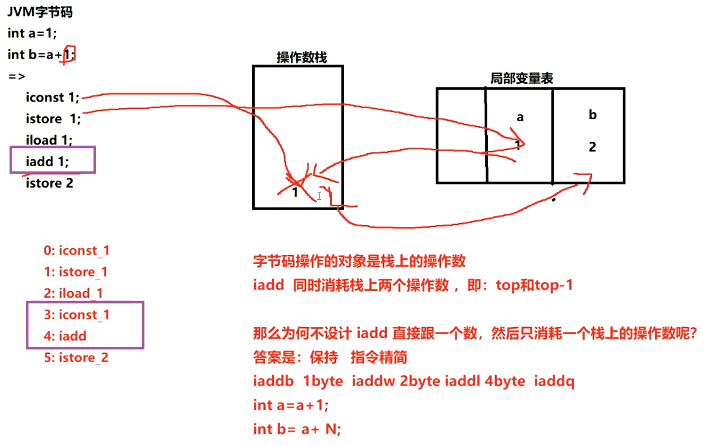
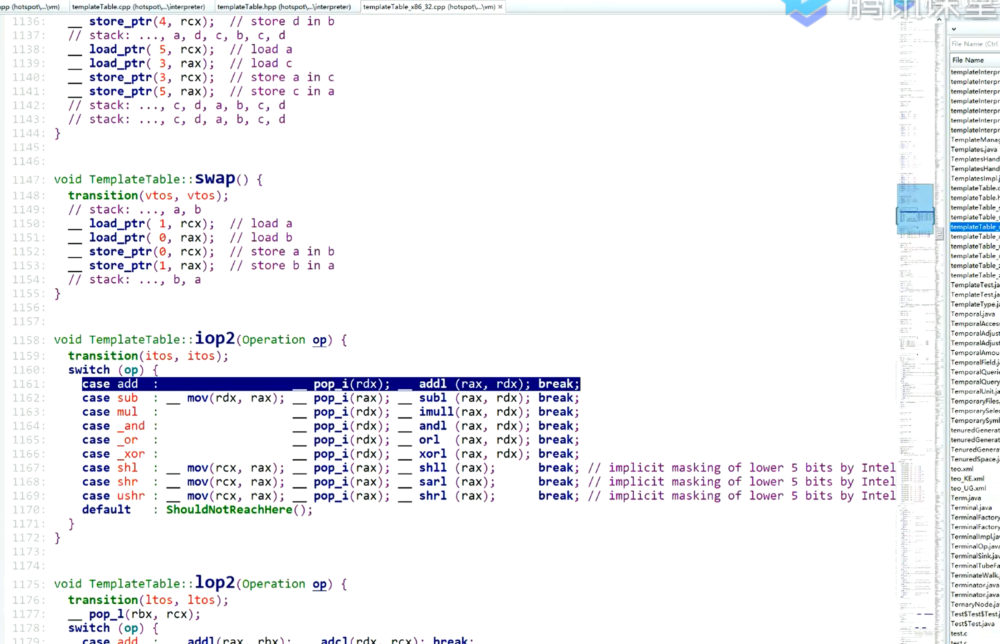

# Java SE 基础

### 面向对象

> @黄狮虎：面向对象，关注的是对象之间的交互；面向过程，关注是是数据的流向。

#### Integer 和 int 分别占用多少空间？

https://stackoverflow.com/questions/8419860/integer-vs-int-with-regard-to-memory

**int** is a primitive data type which takes **32 bits(4 bytes)** to store.

When your Java code uses the new operator to create an instance of a Java object, much more data is allocated than you might expect. For example, it might surprise you to know that the size ratio of an int value to an Integer object — the smallest object that can hold an int value — is typically 1:4.

**Integer** is an object which takes **128 bits (16 bytes)** to store int value.

When we creates new Integer using new Operator it allocates memory as per follows.

1. **Class** Object(32 bits) - which consist of a pointer to the class information, which describes the object in our case its point to java.lang.Integer class
2. **Flags** (32 bits)- It is collection of flags that describes the state of object. Like is it has hash-code, is it array or not i.e. its Shape.
3. **Lock** (32 bits) - It stores synchronization information of object. whether the object currently synchronized or not.

Above 3 points are called as **metadata** of an Object.

1. Lastly metadata is followed by the Object **data** (32 bits) itself. In case of Integer its single int value.

All the above explanation is as per 32 bit processor architecture. It can differ from **JVM version** and **vendor**.

> 黄狮虎：
>
> ##### 类似问题1：为什么有了包装类，还要有基本数据类型？
>
> 因为包装类占的空间是在堆中分配的，而在堆分配内存会导致性能严重下降。堆内存里的地址是不连续的，在堆中分配对象会加大垃圾回收器的回收工作量。
>
> 另一方面，如果没有基本数据类型，只有包装类的话，你考虑一下多线程中的对象头怎么办？
>
> ##### 类似问题2：为什么有了基本数据类型，还要有包装类？
>
> 因为 Java 面向对象，如果要用基本数据类型之间做面向对象分析，基本数据类型没有属性/方法，无法做面向对象分析。


#### Java 按值调用还是引用调用？

按值调用指方法接收调用者提供的值，按引用调用指方法接收调用者提供的变量地址。

Java 总是 **按值** 调用，方法得到的是所有参数值的副本，传递对象时，实际上方法接收的是 **对象引用的副本**。方法不能修改基本数据类型的参数，如果传递了一个 int 值 ，改变值不会影响实参，因为改变的是值的一个副本。

可以改变对象参数的状态，但不能让对象参数引用一个新的对象。如果传递了一个 int 数组，改变数组的内容会影响实参，而改变这个参数的引用并不会让实参引用新的数组对象。

#### 什么是多态？

同一操作作用于不同的对象，可以有不同的解释，产生不同的执行结果。

#### 什么是反射？

在运行状态中，对于任意一个类都能知道它的所有属性和方法，对于任意一个对象都能调用它的任意方法和属性，这种动态获取信息及调用对象方法的功能称为反射。缺点是破坏了封装性以及泛型约束。反射是框架的核心，Spring 大量使用反射。

#### Class 类的作用？如何获取一个 Class 对象？

在程序运行期间，Java 运行时系统为所有对象维护一个 **运行时类型标识**，这个信息会跟踪每个对象所属的类，虚拟机利用运行时类型信息选择要执行的正确方法，**保存这些信息的类就是 Class**，这是一个泛型类。

获取 Class 对象：① 类名.class 。②对象的 getClass方法。③ Class.forName(类的全限定名)。

#### 什么是注解？什么是元注解？

注解是一种标记，使类或接口附加额外信息，帮助编译器和 JVM 完成一些特定功能，例如 @Override 标识一个方法是重写方法。

元注解是自定义注解的注解，例如：

`@Target`：约束作用位置，值是 ElementType 枚举常量，包括 METHOD 方法、VARIABLE 变量、TYPE 类/接口、PARAMETER 方法参数、CONSTRUCTORS 构造方法和 LOACL_VARIABLE 局部变量等。

`@Rentention`：约束生命周期，值是 RetentionPolicy 枚举常量，包括 SOURCE 源码、CLASS 字节码和 RUNTIME 运行时。

`@Documented`：表明这个注解应该被 javadoc 记录。

#### 什么是泛型，有什么作用？

泛型本质是参数化类型，解决不确定对象具体类型的问题。泛型在定义处只具备执行 Object 方法的能力。

泛型的好处：① 类型安全，放置什么出来就是什么，不存在 ClassCastException。② 提升可读性，编码阶段就显式知道泛型集合、泛型方法等处理的对象类型。③ 代码重用，合并了同类型的处理代码。


#### 泛型擦除是什么？

泛型用于编译阶段，编译后的字节码文件不包含泛型类型信息，因为**虚拟机没有泛型类型对象**，所有对象都属于普通类。例如定义 `List<Object>` 或 `List<String>`，在编译后都会变成 `List` 。

定义一个泛型类型，会自动提供一个对应原始类型，类型变量会被擦除。如果没有限定类型就会替换为 `Object`，如果有限定类型就会替换为第一个限定类型，例如 `<T extends A & B>` 会使用 A 类型替换 T。


#### JDK8 新特性有哪些？

**lambda 表达式：**允许把函数作为参数传递到方法，简化匿名内部类代码。

**函数式接口：**使用 @FunctionalInterface 标识，有且仅有一个抽象方法，可被隐式转换为 lambda 表达式。

**方法引用：**可以引用已有类或对象的方法和构造方法，进一步简化 lambda 表达式。

**接口：**接口可以定义 default 修饰的默认方法，降低了接口升级的复杂性，还可以定义静态方法。

**注解：**引入重复注解机制，相同注解在同地方可以声明多次。注解作用范围也进行了扩展，可作用于局部变量、泛型、方法异常等。

**类型推测：**加强了类型推测机制，使代码更加简洁。

**Optional 类：**处理空指针异常，提高代码可读性。

**Stream 类：**引入函数式编程风格，提供了很多功能，使代码更加简洁。方法包括 forEach 遍历、count 统计个数、filter 按条件过滤、limit 取前 n 个元素、skip 跳过前 n 个元素、map 映射加工、concat 合并 stream 流等。

**日期：**增强了日期和时间 API，新的 java.time 包主要包含了处理日期、时间、日期/时间、时区、时刻和时钟等操作。

**JavaScript：**提供了一个新的 JavaScript 引擎，允许在 JVM上运行特定 JavaScript 应用。


#### 异常有哪些分类？

所有异常都是 Throwable 的子类，分为 Error 和 Exception。Error 是 Java 运行时系统的内部错误和资源耗尽错误，例如 StackOverFlowError 和 OutOfMemoryError，这种异常程序无法处理。

Exception 分为受检异常和非受检异常，受检异常需要在代码中显式处理，否则会编译出错，非受检异常是运行时异常，继承自 RuntimeException。

**受检异常：**① 无能为力型，如字段超长导致的 SQLException。② 力所能及型，如未授权异常 UnAuthorizedException，程序可跳转权限申请页面。常见受检异常还有 FileNotFoundException、ClassNotFoundException、IOException等。

**非受检异常：**① 可预测异常，例如 IndexOutOfBoundsException、NullPointerException、ClassCastException 等，这类异常应该提前处理。② 需捕捉异常，例如进行 RPC 调用时的远程服务超时，这类异常客户端必须显式处理。③ 可透出异常，指框架或系统产生的且会自行处理的异常，例如 Spring 的 NoSuchRequestHandingMethodException，Spring 会自动完成异常处理，将异常自动映射到合适的状态码。


#### Java 有哪些基本数据类型？

| 数据类型 | **内存大小**                         | **默认值** | **取值范围**                |
| -------- | ------------------------------------ | ---------- | --------------------------- |
| byte     | 1 B                                  | (byte)0    | -128 ~ 127                  |
| short    | 2 B                                  | (short)0   | -2^15 ~ 2^15-1              |
| int      | 4 B                                  | 0          | -2^31 ~ 2^31-1              |
| long     | 8 B                                  | 0L         | -2^63 ~ 2^63-1              |
| float    | 4 B                                  | 0.0F       | ±3.4E+38（有效位数 6~7 位） |
| double   | 8 B                                  | 0.0D       | ±1.7E+308（有效位数 15 位） |
| char     | 英文 1B，中文 UTF-8 占 3B，GBK 占 2B | ‘\u0000’   | ‘\u0000’ ~ ‘\uFFFF’         |
| boolean  | 单个变量 4B / 数组 1B                | false      | true、false                 |

JVM 没有 boolean 赋值的专用字节码指令，`boolean f = false` 就是使用 ICONST_0 即常数 0 赋值。单个 boolean 变量用 int 代替，boolean 数组会编码成 byte 数组。

> 黄狮虎：还有一种基本数据类型是 returnadress，是在 JVM 虚拟机堆栈里的一个基本数据类型，它代表了一个方法的返回值，叫 returnaddress

#### StringBuilder 或 StringBuffer 怎么实现的字符串拼接？

两者的 append 方法都继承自 AbstractStringBuilder，该方法首先使用 Arrays.copyOf 确定新的字符数组容量，再调用 getChars 方法使用 System.arraycopy 将新的值追加到数组中。StringBuilder 是 JDK5 引入的，效率高但线程不安全。StringBuffer 使用 synchronized 保证线程安全。


#### `String a = “a” + new String(“b”)` 创建了几个对象？

**一句话总结：常量池不会创建相同的字符串。**

> 黄狮虎：new String("hello"); 这个语句创建了几个对象？
>
> 如果“hello”这个字面值在前面已经出现过，那么只创建了一个对象。如果没有出现过，那么创建了两个对象。
>
> **拓展**：intern() 方法
>
> ```java
> String str = "aaa";
> System.out.println(str.intern());
> /*
> API docs:
> Returns a canonical representation for the string object.
> A pool of strings, initially empty, is maintained privately by the class String.
> When the intern method is invoked, if the pool already contains a string equal to this String object as determined by the equals(Object) method, then the string from the pool is returned. Otherwise, this String object is added to the pool and a reference to this String object is returned.
> It follows that for any two strings s and t, s.intern() == t.intern() is true if and only if s.equals(t) is true.
> All literal strings and string-valued constant expressions are interned. String literals are defined in section 3.10.5 of the The Java™ Language Specification.
> 
> Returns:
> a string that has the same contents as this string, but is guaranteed to be from a pool of unique strings.
> */
> ```

常量和常量拼接仍是常量，结果在常量池，只要有变量参与拼接结果就是变量，存在堆。

使用字面量时只创建一个常量池中的常量，使用 new 时如果常量池中没有该值就会在常量池中新创建，再在堆中创建一个对象引用常量池中常量。因此 String a = "a" + new String("b") 会创建四个对象，**常量池中的 a 和 b，堆中的 b 和堆中的 ab**。


#### 重载和重写的区别？

**重载**指方法名称相同，但**参数类型个数不同**，是行为水平方向不同实现。

**重写**，`@Override`，指子类实现接口或继承父类时，保持方法签名完全相同，实现不同方法体，是行为垂直方向不同实现。


#### Object 类有哪些方法？

**equals：**检测对象是否相等，默认使用 == 比较对象引用，可以重写 equals 方法自定义比较规则。equals 方法规范：自反性、对称性、传递性、一致性、对于任何非空引用 x，x.equals(null) 返回 false。

**hashCode：**散列码是由对象导出的一个整型值，没有规律，每个对象都有默认散列码，值由对象存储地址得出。字符串散列码由内容导出，值可能相同。为了在集合中正确使用，一般需要同时重写 equals 和 hashCode，要求 equals 相同 hashCode 必须相同，hashCode 相同 equals 未必相同，因此 hashCode 是对象相等的必要不充分条件。

**toString：**打印对象时默认的方法，如果没有重写打印的是表示对象值的一个字符串。

**clone：**clone 方法声明为 protected，类只能通过该方法克隆它自己的对象，如果希望其他类也能调用该方法必须定义该方法为 public。如果一个对象的类没有实现 Cloneable 接口，该对象调用 clone 方法会抛出一个 CloneNotSupport 异常。默认的 clone 方法是浅拷贝，一般重写 clone 方法需要实现 Cloneable 接口并指定访问修饰符为 public。

**finalize：**确定一个对象死亡至少要经过两次标记，如果对象在可达性分析后发现没有与 GC Roots 连接的引用链会被第一次标记，随后进行一次筛选，条件是对象是否有必要执行 finalize 方法。假如对象没有重写该方法或方法已被虚拟机调用，都视为没有必要执行。如果有必要执行，对象会被放置在 F-Queue 队列，由一条低调度优先级的 Finalizer 线程去执行。虚拟机会触发该方法但不保证会结束，这是为了防止某个对象的 finalize 方法执行缓慢或发生死循环。只要对象在 finalize 方法中重新与引用链上的对象建立关联就会在第二次标记时被移出回收集合。由于运行代价高昂且无法保证调用顺序，在 JDK 9 被标记为过时方法，并不适合释放资源。

**getClass：**返回包含对象信息的类对象。

**wait / notify / notifyAll：**阻塞或唤醒持有该对象锁的线程。

#### 接口和抽象类的异同？

接口和抽象类对实体类进行更高层次的抽象，仅定义公共行为和特征。

| **语法维度** | **抽象类**                                         | **接口**                                                     |
| ------------ | -------------------------------------------------- | ------------------------------------------------------------ |
| 成员变量     | 无特殊要求                                         | 默认 public static final 常量                                |
| 构造方法     | 有构造方法，不能实例化                             | 没有构造方法，不能实例化                                     |
| 方法         | 抽象类可以没有抽象方法，但有抽象方法一定是抽象类。 | 默认 public abstract，JDK8 支持默认/静态方法，JDK9 支持私有方法。 |
| 继承         | 单继承                                             | 多继承                                                       |

抽象类体现 is-a 关系，接口体现 can-do 关系。与接口相比，抽象类通常是对同类事物相对具体的抽象。

抽象类是模板式设计，包含一组具体特征，例如某汽车，底盘、控制电路等是抽象出来的共同特征，但内饰、显示屏、座椅材质可以根据不同级别配置存在不同实现。

接口是契约式设计，是开放的，定义了方法名、参数、返回值、抛出的异常类型，谁都可以实现它，但必须遵守接口的约定。例如所有车辆都必须实现刹车这种强制规范。

接口是顶级类，抽象类在接口下面的第二层，对接口进行了组合，然后实现部分接口。当纠结定义接口和抽象类时，推荐定义为接口，遵循接口隔离原则，按维度划分成多个接口，再利用抽象类去实现这些，方便后续的扩展和重构。

例如 Plane 和 Bird 都有 fly 方法，应把 fly 定义为接口，而不是抽象类的抽象方法再继承，因为除了 fly 行为外 Plane 和 Bird 间很难再找到其他共同特征。


#### 子类初始化的顺序

① 父类静态代码块和静态变量。

② 子类静态代码块和静态变量。

③ 父类普通代码块和普通变量。

④ 父类构造方法。

⑤ 子类普通代码块和普通变量。

⑥ 子类构造方法。


### 集合

#### 说一说 ArrayList

ArrayList 是容量可变的非线程安全列表，使用数组实现，集合扩容时会创建更大的数组，把原有数组复制到新数组。支持对元素的快速随机访问，但插入与删除速度很慢。ArrayList 实现了 RandomAcess 标记接口，如果一个类实现了该接口，那么表示使用索引遍历比迭代器更快。

elementData 是 ArrayList 的数据域，被 transient 修饰，序列化时会调用 writeObject 写入流，反序列化时调用 readObject 重新赋值到新对象的 elementData。原因是 elementData 容量通常大于实际存储元素的数量，所以只需发送真正有实际值的数组元素。

size 是当前实际大小，elementData 大小大于等于 size。

**modCount **记录了 ArrayList 结构性变化的次数，继承自 AbstractList。所有涉及结构变化的方法都会增加该值。expectedModCount 是迭代器初始化时记录的 modCount 值，每次访问新元素时都会检查 modCount 和 expectedModCount 是否相等，不相等就会抛出异常。这种机制叫做 fail-fast，所有集合类都有这种机制。

#### 说一说 LinkedList

LinkedList 本质是双向链表，与 ArrayList 相比插入和删除速度更快，但随机访问元素很慢。除继承 AbstractList 外还实现了 Deque 接口，这个接口具有队列和栈的性质。成员变量被 transient 修饰，原理和 ArrayList 类似。

LinkedList 包含三个重要的成员：size、first 和 last。size 是双向链表中节点的个数，first 和 last 分别指向首尾节点的引用。

LinkedList 的优点在于可以将零散的内存单元通过附加引用的方式关联起来，形成按链路顺序查找的线性结构，内存利用率较高。


#### Set 有什么特点，有哪些实现？

Set 不允许元素重复且无序，常用实现有 HashSet、LinkedHashSet 和 TreeSet。

HashSet 通过 HashMap 实现，HashMap 的 Key 即 HashSet 存储的元素，所有 Key 都使用相同的 Value ，一个名为 PRESENT 的 Object 类型常量。使用 Key 保证元素唯一性，但不保证有序性。由于 HashSet 是 HashMap 实现的，因此线程不安全。

HashSet 判断元素是否相同时，对于包装类型直接按值比较。对于引用类型先比较 hashCode 是否相同，不同则代表不是同一个对象，相同则继续比较 equals，都相同才是同一个对象。

LinkedHashSet 继承自 HashSet，通过 LinkedHashMap 实现，使用双向链表维护元素插入顺序。

TreeSet 通过 TreeMap 实现的，添加元素到集合时按照比较规则将其插入合适的位置，保证插入后的集合仍然有序。


#### TreeMap 有什么特点？

TreeMap 基于红黑树实现，增删改查的平均和最差时间复杂度均为 O(logn) ，最大特点是 Key 有序。Key 必须实现 Comparable 接口或提供的 Comparator 比较器，所以 Key 不允许为 null。

HashMap 依靠 hashCode 和 equals 去重，而 TreeMap 依靠 Comparable 或 Comparator。 TreeMap 排序时，如果比较器不为空就会优先使用比较器的 compare 方法，否则使用 Key 实现的 Comparable 的 compareTo 方法，两者都不满足会抛出异常。

TreeMap 通过 put 和 deleteEntry 实现增加和删除树节点。插入新节点的规则有三个：① 需要调整的新节点总是红色的。② 如果插入新节点的父节点是黑色的，不需要调整。③ 如果插入新节点的父节点是红色的，由于红黑树不能出现相邻红色，进入循环判断，通过重新着色或左右旋转来调整。TreeMap 的插入操作就是按照 Key 的对比往下遍历，大于节点值向右查找，小于向左查找，先按照二叉查找树的特性操作，后续会重新着色和旋转，保持红黑树的特性。


#### HashMap 有什么特点？

JDK8 之前底层实现是数组 + 链表，JDK8 改为数组 + 链表/红黑树，节点类型从Entry 变更为 Node。主要成员变量包括存储数据的 table 数组、元素数量 size、加载因子 loadFactor。

table 数组记录 HashMap 的数据，每个下标对应一条链表，所有哈希冲突的数据都会被存放到同一条链表，Node/Entry 节点包含四个成员变量：key、value、next 指针和 hash 值。

HashMap 中数据以键值对的形式存在，键对应的 hash 值用来计算数组下标，如果两个元素 key 的 hash 值一样，就会发生哈希冲突，被放到同一个链表上，为使查询效率尽可能高，键的 hash 值要尽可能分散。

HashMap 默认初始化容量为 16，扩容容量必须是 2 的幂次方、最大容量为 1<< 30 、默认加载因子为 0.75（问：为什么负载因子0.75？答：因为在“冲突的机会”与“空间利用率”之间，寻找一种平衡与折衷。详见：https://zhuanlan.zhihu.com/p/149687607）


#### HashMap 为什么线程不安全？

JDK7 存在死循环和数据丢失问题。

##### 数据丢失：

- 并发赋值被覆盖： 在 createEntry 方法中，新添加的元素直接放在头部，使元素之后可以被更快访问，但如果两个线程同时执行到此处，会导致其中一个线程的赋值被覆盖。

- 已遍历区间新增元素丢失： 当某个线程在 transfer 方法迁移时，其他线程新增的元素可能落在已遍历过的哈希槽上。遍历完成后，table 数组引用指向了 newTable，新增元素丢失。

- 新表被覆盖： 如果 resize 完成，执行了 table = newTable，则后续元素就可以在新表上进行插入。但如果多线程同时 resize ，每个线程都会 new 一个数组，这是线程内的局部对象，线程之间不可见。迁移完成后resize 的线程会赋值给 table 线程共享变量，可能会覆盖其他线程的操作，在新表中插入的对象都会被丢弃。

##### 死循环：

扩容时 resize 调用 transfer 使用头插法迁移元素，虽然 newTable 是局部变量，但原先 table 中的 Entry 链表是共享的，问题根源是 Entry 的 next 指针并发修改，某线程还没有将 table 设为 newTable 时用完了 CPU 时间片，导致数据丢失或死循环。

JDK8 在 resize 方法中完成扩容，并改用尾插法，不会产生死循环，但并发下仍可能丢失数据。可用 ConcurrentHashMap 或 Collections.synchronizedMap 包装成同步集合。


### IO 流

#### 同步/异步/阻塞/非阻塞 IO 的区别？

同步和异步是通信机制，阻塞和非阻塞是调用状态。

同步 IO 是用户线程发起 IO 请求后需要等待或轮询内核 IO 操作完成后才能继续执行。异步 IO 是用户线程发起 IO 请求后可以继续执行，当内核 IO 操作完成后会通知用户线程，或调用用户线程注册的回调函数。

阻塞 IO 是 IO 操作需要彻底完成后才能返回用户空间 。非阻塞 IO 是 IO 操作调用后立即返回一个状态值，无需等 IO 操作彻底完成。


#### 什么是 BIO？

**BIO** 是同步阻塞式 IO，JDK1.4 之前的 IO 模型。服务器实现模式为一个连接请求对应一个线程，服务器需要为每一个客户端请求创建一个线程，如果这个连接不做任何事会造成不必要的线程开销。可以通过线程池改善，这种 IO 称为伪异步 IO。适用连接数目少且服务器资源多的场景。


#### 什么是 NIO？

NIO 是 JDK1.4 引入的同步非阻塞 IO。服务器实现模式为多个连接请求对应一个线程，客户端连接请求会注册到一个多路复用器 Selector ，Selector 轮询到连接有 IO 请求时才启动一个线程处理。适用连接数目多且连接时间短的场景。

同步是指线程还是要不断接收客户端连接并处理数据，非阻塞是指如果一个管道没有数据，不需要等待，可以轮询下一个管道。

**核心组件：**

**Selector**： 多路复用器，轮询检查多个 Channel 的状态，判断注册事件是否发生，即判断 Channel 是否处于可读或可写状态。使用前需要将 Channel 注册到 Selector，注册后会得到一个 SelectionKey，通过 SelectionKey 获取 Channel 和 Selector 相关信息。

**Channel**： 双向通道，替换了 BIO 中的 Stream 流，不能直接访问数据，要通过 Buffer 来读写数据，也可以和其他 Channel 交互。

**Buffer**： 缓冲区，本质是一块可读写数据的内存，用来简化数据读写。Buffer 三个重要属性：position 下次读写数据的位置，limit 本次读写的极限位置，capacity 最大容量。

- flip 将写转为读，底层实现原理把 position 置 0，并把 limit 设为当前的 position 值。
- clear 将读转为写模式（用于读完全部数据的情况，把 position 置 0，limit 设为 capacity）。
- compact 将读转为写模式（用于存在未读数据的情况，让 position 指向未读数据的下一个）。
- 通道方向和 Buffer 方向相反，读数据相当于向 Buffer 写，写数据相当于从 Buffer 读。

使用步骤：向 Buffer 写数据，调用 flip 方法转为读模式，从 Buffer 中读数据，调用 clear 或 compact 方法清空缓冲区。


#### 什么是 AIO？

AIO 是 JDK7 引入的**异步非阻塞 IO**。服务器实现模式为一个有效请求对应一个线程，客户端的 IO 请求都是由操作系统先完成 IO 操作后再通知服务器应用来直接使用准备好的数据。适用连接数目多且连接时间长的场景。

异步是指服务端线程接收到客户端管道后就交给底层处理IO通信，自己可以做其他事情，非阻塞是指客户端有数据才会处理，处理好再通知服务器。

实现方式包括通过 Future 的 get 方法进行阻塞式调用以及实现 CompletionHandler 接口，重写请求成功的回调方法 completed 和请求失败回调方法 failed。


## 《深入理解Java虚拟机》

### 6.4.9 异常处理指令

在Java程序中显式抛出异常的操作（throw语句）都由athrow指令来实现，除了用throw语句显式抛出异常的情况之外，《Java虚拟机规范》还规定了许多运行时异常会在其他Java虚拟机指令检测到异常状况时自动抛出。例如前面介绍整数运算中，当除数为零时，虚拟机会在idiv或ldiv指令中抛出ArithmeticException异常。而在Java虚拟机中，处理异常（catch语句）不是由字节码指令来实现的（很久之前曾经使用jsr和ret指令来实现，现在已经不用了），而是采用异常表来完成。


### 6.4.10 同步指令

Java虚拟机可以支持方法级的同步和方法内部一段指令序列的同步，这两种同步结构都是使用管程（Monitor，更常见的是直接将它称为“锁”）来实现的。

**方法级的同步是隐式的，无须通过字节码指令来控制，它实现在方法调用和返回操作之中**。虚拟机可以从方法常量池中的方法表结构中的ACC_SYNCHRONIZED访问标志得知一个方法是否被声明为同步方法。当方法调用时，调用指令将会检查方法的ACC_SYNCHRONIZED访问标志是否被设置，如果设置了，执行线程就要求先成功持有管程，然后才能执行方法，最后当方法完成（无论是正常完成还是非正常完成）时释放管程。在方法执行期间，执行线程持有了管程，其他任何线程都无法再获取到同一个管程。如果一个同步方法执行期间抛出了异常，并且在方法内部无法处理此异常，那这个同步方法所持有的管程将在异常抛到同步方法边界之外时自动释放。

**同步一段指令集序列通常是由Java语言中的synchronized语句块来表示的**，Java虚拟机的指令集中有monitorenter和monitorexit两条指令来支持synchronized关键字的语义，正确实现synchronized关键字需要Javac编译器与Java虚拟机两者共同协作支持，譬如有代码清单6-6所示的代码。



编译器必须确保无论方法通过何种方式完成，方法中调用过的每条monitorenter指令都必须有其对应的monitorexit指令，而无论这个方法是正常结束还是异常结束。

从代码清单6-6的字节码序列中可以看到，为了保证在方法异常完成时monitorenter和monitorexit指令依然可以正确配对执行，编译器会自动产生一个异常处理程序，这个异常处理程序声明可处理所有的异常，它的目的就是用来执行monitorexit指令。


### TemplateTable 模板表




一个字节码对应一段机器码，这使得Java在Hotspot层面，尽管是解释执行，但性能不输C++：



模板表TemplateTable保存了各个字节码的模板（目标代码生成函数和参数），initialize()方法的实现如下：

源代码位置：/src/share/vm/interpreter/templateInterpreter.cpp

```c++
void TemplateTable::initialize() {
  if (_is_initialized) return;
 
 
  _bs = Universe::heap()->barrier_set();
 
  // For better readability
  const char _    = ' ';
  const int  ____ = 0;
  const int  ubcp = 1 << Template::uses_bcp_bit;
  const int  disp = 1 << Template::does_dispatch_bit;
  const int  clvm = 1 << Template::calls_vm_bit;
  const int  iswd = 1 << Template::wide_bit;
  //                                    interpr. templates
  // Java spec bytecodes                ubcp|disp|clvm|iswd  in    out   generator             argument
  def(Bytecodes::_nop                 , ____|____|____|____, vtos, vtos, nop                 ,  _           );
  def(Bytecodes::_aconst_null         , ____|____|____|____, vtos, atos, aconst_null         ,  _           );
  def(Bytecodes::_iconst_m1           , ____|____|____|____, vtos, itos, iconst              , -1           );
  def(Bytecodes::_iconst_0            , ____|____|____|____, vtos, itos, iconst              ,  0           );
  // ...
  def(Bytecodes::_tableswitch         , ubcp|disp|____|____, itos, vtos, tableswitch         ,  _           );
  def(Bytecodes::_lookupswitch        , ubcp|disp|____|____, itos, itos, lookupswitch        ,  _           );
  def(Bytecodes::_ireturn             , ____|disp|clvm|____, itos, itos, _return             , itos         );
  def(Bytecodes::_lreturn             , ____|disp|clvm|____, ltos, ltos, _return             , ltos         );
  def(Bytecodes::_freturn             , ____|disp|clvm|____, ftos, ftos, _return             , ftos         );
  def(Bytecodes::_dreturn             , ____|disp|clvm|____, dtos, dtos, _return             , dtos         );
  def(Bytecodes::_areturn             , ____|disp|clvm|____, atos, atos, _return             , atos         );
  def(Bytecodes::_return              , ____|disp|clvm|____, vtos, vtos, _return             , vtos         );
  def(Bytecodes::_getstatic           , ubcp|____|clvm|____, vtos, vtos, getstatic           , f1_byte      );
  def(Bytecodes::_putstatic           , ubcp|____|clvm|____, vtos, vtos, putstatic           , f2_byte      );
  def(Bytecodes::_getfield            , ubcp|____|clvm|____, vtos, vtos, getfield            , f1_byte      );
  def(Bytecodes::_putfield            , ubcp|____|clvm|____, vtos, vtos, putfield            , f2_byte      );
  def(Bytecodes::_invokevirtual       , ubcp|disp|clvm|____, vtos, vtos, invokevirtual       , f2_byte      );
  def(Bytecodes::_invokespecial       , ubcp|disp|clvm|____, vtos, vtos, invokespecial       , f1_byte      );
  def(Bytecodes::_invokestatic        , ubcp|disp|clvm|____, vtos, vtos, invokestatic        , f1_byte      );
  def(Bytecodes::_invokeinterface     , ubcp|disp|clvm|____, vtos, vtos, invokeinterface     , f1_byte      );
  def(Bytecodes::_invokedynamic       , ubcp|disp|clvm|____, vtos, vtos, invokedynamic       , f1_byte      );
  def(Bytecodes::_new                 , ubcp|____|clvm|____, vtos, atos, _new                ,  _           );
  def(Bytecodes::_newarray            , ubcp|____|clvm|____, itos, atos, newarray            ,  _           );
  def(Bytecodes::_anewarray           , ubcp|____|clvm|____, itos, atos, anewarray           ,  _           );
  def(Bytecodes::_arraylength         , ____|____|____|____, atos, itos, arraylength         ,  _           );
  def(Bytecodes::_athrow              , ____|disp|____|____, atos, vtos, athrow              ,  _           );
  def(Bytecodes::_checkcast           , ubcp|____|clvm|____, atos, atos, checkcast           ,  _           );
  def(Bytecodes::_instanceof          , ubcp|____|clvm|____, atos, itos, instanceof          ,  _           );
  def(Bytecodes::_monitorenter        , ____|disp|clvm|____, atos, vtos, monitorenter        ,  _           );
  def(Bytecodes::_monitorexit         , ____|____|clvm|____, atos, vtos, monitorexit         ,  _           );
  def(Bytecodes::_wide                , ubcp|disp|____|____, vtos, vtos, wide                ,  _           );
  def(Bytecodes::_multianewarray      , ubcp|____|clvm|____, vtos, atos, multianewarray      ,  _           );
  def(Bytecodes::_ifnull              , ubcp|____|clvm|____, atos, vtos, if_nullcmp          , equal        );
  def(Bytecodes::_ifnonnull           , ubcp|____|clvm|____, atos, vtos, if_nullcmp          , not_equal    );
  def(Bytecodes::_goto_w              , ubcp|____|clvm|____, vtos, vtos, goto_w              ,  _           );
  def(Bytecodes::_jsr_w               , ubcp|____|____|____, vtos, vtos, jsr_w               ,  _           );
 
  // wide Java spec bytecodes
  def(Bytecodes::_iload               , ubcp|____|____|iswd, vtos, itos, wide_iload          ,  _           );
  def(Bytecodes::_lload               , ubcp|____|____|iswd, vtos, ltos, wide_lload          ,  _           );
  // ...
 
  // JVM bytecodes
  def(Bytecodes::_fast_agetfield      , ubcp|____|____|____, atos, atos, fast_accessfield    ,  atos        );
  def(Bytecodes::_fast_bgetfield      , ubcp|____|____|____, atos, itos, fast_accessfield    ,  itos        );
  def(Bytecodes::_fast_cgetfield      , ubcp|____|____|____, atos, itos, fast_accessfield    ,  itos        );
  def(Bytecodes::_fast_dgetfield      , ubcp|____|____|____, atos, dtos, fast_accessfield    ,  dtos        );
  def(Bytecodes::_fast_fgetfield      , ubcp|____|____|____, atos, ftos, fast_accessfield    ,  ftos        );
  def(Bytecodes::_fast_igetfield      , ubcp|____|____|____, atos, itos, fast_accessfield    ,  itos        );
  def(Bytecodes::_fast_lgetfield      , ubcp|____|____|____, atos, ltos, fast_accessfield    ,  ltos        );
  def(Bytecodes::_fast_sgetfield      , ubcp|____|____|____, atos, itos, fast_accessfield    ,  itos        );
 
  def(Bytecodes::_fast_aputfield      , ubcp|____|____|____, atos, vtos, fast_storefield ,   atos        );
  def(Bytecodes::_fast_bputfield      , ubcp|____|____|____, itos, vtos, fast_storefield ,   itos        );
  def(Bytecodes::_fast_cputfield      , ubcp|____|____|____, itos, vtos, fast_storefield  ,  itos        );
  def(Bytecodes::_fast_dputfield      , ubcp|____|____|____, dtos, vtos, fast_storefield  ,  dtos        );
  def(Bytecodes::_fast_fputfield      , ubcp|____|____|____, ftos, vtos, fast_storefield  ,  ftos        );
  def(Bytecodes::_fast_iputfield      , ubcp|____|____|____, itos, vtos, fast_storefield  ,  itos        );
  def(Bytecodes::_fast_lputfield      , ubcp|____|____|____, ltos, vtos, fast_storefield  ,  ltos        );
  def(Bytecodes::_fast_sputfield      , ubcp|____|____|____, itos, vtos, fast_storefield  ,  itos        );
 
  def(Bytecodes::_fast_aload_0        , ____|____|____|____, vtos, atos, aload               ,  0           );
  def(Bytecodes::_fast_iaccess_0      , ubcp|____|____|____, vtos, itos, fast_xaccess        ,  itos        );
  def(Bytecodes::_fast_aaccess_0      , ubcp|____|____|____, vtos, atos, fast_xaccess        ,  atos        );
  def(Bytecodes::_fast_faccess_0      , ubcp|____|____|____, vtos, ftos, fast_xaccess        ,  ftos        );
 
  def(Bytecodes::_fast_iload          , ubcp|____|____|____, vtos, itos, fast_iload          ,  _       );
  def(Bytecodes::_fast_iload2         , ubcp|____|____|____, vtos, itos, fast_iload2         ,  _       );
  def(Bytecodes::_fast_icaload        , ubcp|____|____|____, vtos, itos, fast_icaload        ,  _       );
 
  def(Bytecodes::_fast_invokevfinal   , ubcp|disp|clvm|____, vtos, vtos, fast_invokevfinal   , f2_byte      );
 
  def(Bytecodes::_fast_linearswitch   , ubcp|disp|____|____, itos, vtos, fast_linearswitch   ,  _           );
  def(Bytecodes::_fast_binaryswitch   , ubcp|disp|____|____, itos, vtos, fast_binaryswitch   ,  _           );
 
  def(Bytecodes::_fast_aldc           , ubcp|____|clvm|____, vtos, atos, fast_aldc           ,  false       );
  def(Bytecodes::_fast_aldc_w         , ubcp|____|clvm|____, vtos, atos, fast_aldc           ,  true        );
 
  def(Bytecodes::_return_register_finalizer , ____|disp|clvm|____, vtos, vtos, _return       ,  vtos        );
 
  def(Bytecodes::_invokehandle        , ubcp|disp|clvm|____, vtos, vtos, invokehandle        , f1_byte      );
 
  def(Bytecodes::_shouldnotreachhere   , ____|____|____|____, vtos, vtos, shouldnotreachhere ,  _           );
  // platform specific bytecodes
  pd_initialize();
 
  _is_initialized = true;
}
```

