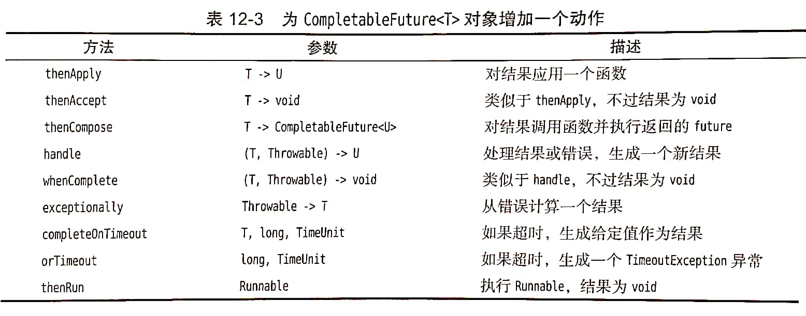

# Java异步计算

到目前为止，我们的并发计算方法都是先分解一个任务，然后等待，直到所有部分都已经完成。不过等待不总是个好方法。接下来的几节中，将介绍如何实现无等待或异步的计算。

### 1、可完成Future（CompletableFuture类）

1. **CompletableFuture**
   
    该类实现了Future接口，它提供了获得结果的另一种机制。你要注册一个回调，一旦结果可用，就会（在某个线程中）利用该结果调用这个回调；（而Future调用get时回阻塞，直到值可用）
    
    ```java
    CompletableFuture<String> f = ...;
f.thenAccept(s -> process the result string s); //通过这种方式，无须阻塞就可以在结果可用时对结果进行处理
   ```
   
2. **CompletableFuture.supplyAsync**

    要想异步运行任务并得到CompletableFuture，不要把它直接提交给执行器服务，而应当调用该静态方法 CompletableFuture.supplyAsync

3. **CompletableFuture 可以采用两种方式完成**

    (1)得到一个结果
    (2)有一个未捕的异常

    要处理这两种情况，可以使用whenComlete方法，让结果和异常调用我们提供的函数：

    ```java
    f.whenComplete((s,t)->{
        if(t==null) {process the result s;}
        else { process the throwable t; }	
    });
    ```

4. CompletableFuture之所以被称为是可完成的，是因为你可以手动地设置一个完成值。当然，用supplyAsync创建一个CompletableFuture时，任务完成时就会隐式地设置完成值。不过，显式地设置结果可以提供更大的灵活性。

    例如，两个任务可以同时计算一个答案：
    
    ```java
    var f = new CompletableFuture<Integer>();
    executor.execute(()->
        {
            int n = workHard(arg);
            f.complete(n);
        }
    );
    executor.execute(()->
        {
            int n = workSmart(arg);
            f.complete(n);
        }
    );
    ```
    
    

### 2、组合可完成Future（管线处理）

1. CompletableFuture类提供了一种机制来解决方法调用顺序（管线处理）问题，可以将异步任务组合为一个处理管线；
2. 为CompletableFuture<T>对象增加一个动作的类型：




### Example

```java
/**
 * 假设你能够提供一个服务
 * 这个服务查询各大电商网站同一类产品的价格并汇总展示
 */

package com.mashibing.juc.c_026_01_ThreadPool;

import java.io.IOException;
import java.util.Random;
import java.util.concurrent.CompletableFuture;
import java.util.concurrent.ExecutionException;
import java.util.concurrent.TimeUnit;

public class T06_01_CompletableFuture {
    public static void main(String[] args) throws ExecutionException, InterruptedException {
        long start, end;

        /*start = System.currentTimeMillis();
    
        priceOfTM();
        priceOfTB();
        priceOfJD();
    
        end = System.currentTimeMillis();
        System.out.println("use serial method call! " + (end - start));*/
    
        start = System.currentTimeMillis();
    
        CompletableFuture<Double> futureTM = CompletableFuture.supplyAsync(()->priceOfTM());
        CompletableFuture<Double> futureTB = CompletableFuture.supplyAsync(()->priceOfTB());
        CompletableFuture<Double> futureJD = CompletableFuture.supplyAsync(()->priceOfJD());
    
        CompletableFuture.allOf(futureTM, futureTB, futureJD).join();
    
        CompletableFuture.supplyAsync(()->priceOfTM())
                .thenApply(String::valueOf)
                .thenApply(str-> "price " + str)
                .thenAccept(System.out::println);


        end = System.currentTimeMillis();
        System.out.println("use completable future! " + (end - start));
    
        try {
            System.in.read();
        } catch (IOException e) {
            e.printStackTrace();
        }
    }
    
    private static double priceOfTM() {
        delay();
        return 1.00;
    }
    
    private static double priceOfTB() {
        delay();
        return 2.00;
    }
    
    private static double priceOfJD() {
        delay();
        return 3.00;
    }
    
    /*private static double priceOfAmazon() {
        delay();
        throw new RuntimeException("product not exist!");
    }*/
    
    private static void delay() {
        int time = new Random().nextInt(500);
        try {
            TimeUnit.MILLISECONDS.sleep(time);
        } catch (InterruptedException e) {
            e.printStackTrace();
        }
        System.out.printf("After %s sleep!\n", time);
    }
}
```


```

```