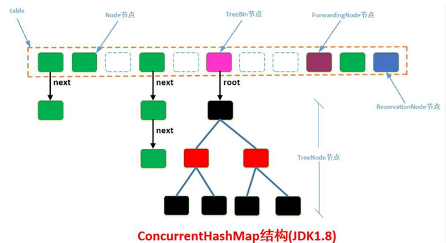

# 容器

连老师在公开课里面讲过相关的源码

### Collection

- List

  - **CopyOnWriteList**：读时不加锁，写时复制，适用于读线程多，写线程少的情况
  - Vector, Stack
  - ArrayList：会有并发问题
  - LinkedList

- Set

  - HashSet, LinkedHashSet
  - SortedSet, TreeSet
  - EnumSet
  - CopyOnWriteArraySet
  - ConcurrentSkipListSet

- Queue

  Queue和List的区别？Queue提供了很多在多线程访问下比较友好的API：

  `add`, `offer`, `peek`, `poll`, `remove`

  - Deque
    - ArrayDeque
    - BlockingDeque, LinkedBlockingDequeue
  - **BlockingQueue**：增加了更多API，比如put，take，可以阻塞/指定时间等待，是MQ的基础，MQ的本质，就是一个大型的生产者、消费者模型
    - ArrayBlockingQueue
    - PriorityBlockingQueue：阻塞的 PriorityQueue
    - **LinkedBlockingQueue**：用链表实现的BlockingQueue。阻塞用`await()`实现，底层是park
    - **TransferQueue, LinkedTransferQueue**：装完之后阻塞等待，直到有线程把它取走，再离开。场景：确认收钱完成之后，才能把商品取走。经典的 **交替打印** 面试题可以用 TransferQueue 实现
    - **SynchronousQueue**：容量为0，不能往里装东西，只有有一个线程等着的时候，才能把东西递到这个线程手里，是用来一个线程给另外一个线程传数据的。和Exchanger比较相似，也是需要两个线程同步对接，否则都会阻塞。在线程池里面，线程之间进行任务调度的时候，经常会用到。
  - **PriorityQueue**：内部进行了排序，底层是一个二叉树（小顶堆）的结构
  - **ConcurrentLinkedQueue**：里面很多方法是CAS实现的
  - **DelayQueue**：是一种阻塞的队列，需要实现compareTo方法，需要指定等待时间，用来按时间进行任务调度

- Map

  早期的 Vector 和 **Hashtable** 都自带锁，设计上有不完善的地方，基本上不用

  - **HashMap**, LinkedHashMap：多线程用 HashMap 要加锁
  - **Hashtable**：自带 synchronized，线程安全，但在线程竞争激烈的情况下效率非常低下。HashTable被认为是个遗留的类。如果你寻求在迭代的时候修改Map，你应该使用ConcurrentHashMap
  - **ConcurrentHashMap**：CAS操作，多线程读取的效率非常高
  - TreeMap：不存在ConcurrentTreeMap，但为了排序，用跳表**ConcurrentSkipListMap**代替树结构
  - WeakHashMap
  - IdentityHashMap


# HashMap

### HashMap数据结构

1.8 数组+链表+红黑树


#### JDK1.8 HashMap为什么在链表长度为8的时候转红黑树，为啥不能是9是10？

是不是随便什么情况下只要满足了链表长度为8就转红黑树呢？答案自然不是，为什么不是，看代码：

```java
     /**
     * The smallest table capacity for which bins may be treeified.
     * (Otherwise the table is resized if too many nodes in a bin.)
     * Should be at least 4 * TREEIFY_THRESHOLD to avoid conflicts
     * between resizing and treeification thresholds.
     */
    static final int MIN_TREEIFY_CAPACITY = 64; // 当哈希表的容量>该值时，才允许将链表转成红黑树

	/**
     * Replaces all linked nodes in bin at index for given hash unless
     * table is too small, in which case resizes instead.
     */
    final void treeifyBin(Node<K,V>[] tab, int hash) {
        int n, index; Node<K,V> e;
        if (tab == null || (n = tab.length) < MIN_TREEIFY_CAPACITY)
            resize();
        ......
    }
```

这是HashMap转红黑树的方法代码，可以看到，如果此时的HashMap的长度是小于MIN_TREEIFY_CAPACITY的或者为空，则进行扩容操作，而不是转红黑树，这其实也是容易忽略的点。

#### 为什么要转红黑树？

在JDK8里面，HashMap的底层数据结构已经变为数组+链表+红黑树的结构了，因为在hash冲突严重的情况下，链表的查询效率是O(n），所以JDK8做了优化对于单个链表的个数大于8的链表，会直接转为红黑树结构算是以空间换时间，这样以来查询的效率就变为O(logN)

为什么不直接使用红黑树，而是要先使用链表实在不行再转红黑树呢？

答案自然要在源码和注释里找：在HashMap类中第174行左右有描述：

```
     Because TreeNodes are about twice the size of regular nodes, we
     use them only when bins contain enough nodes to warrant use
     (see TREEIFY_THRESHOLD)
```

“因为树节点的大小是链表节点大小的两倍，所以只有在容器中包含足够的节点保证使用才用它”，显然尽管转为树使得查找的速度更快，但是在节点数比较小的时候，此时对于红黑树来说内存上的劣势会超过查找等操作的优势，自然使用链表更加好。但是在节点数比较多的时候，综合考虑，红黑树比链表要好。

为什么是8，而不是9不是10？

其实当时想回答面试官这是基于统计的结果，但是心里很虚还是没有说，再回头看看源码的描述：

```java
Ideally, under random hashCodes, the frequency of nodes in bins follows a Poisson distribution with a parameter of about 0.5 on average for the default resizing threshold of 0.75, although with a large variance because of resizing granularity. Ignoring variance, the expected occurrences of list size k are (exp(-0.5) * pow(0.5, k) / factorial(k)). The first values are:
理想情况下，在随机哈希码下，bin中节点的频率遵循泊松分布，参数平均约为0.5，默认大小调整阈值为0.75，尽管由于粒度调整的原因方差很大。忽略方差，列表大小k的期望出现次数为(exp(-0.5) * pow(0.5, k) / factorial(k))。第一个值是:
      0:    0.60653066
      1:    0.30326533
      2:    0.07581633
      3:    0.01263606
      4:    0.00157952
      5:    0.00015795
      6:    0.00001316
      7:    0.00000094
      8:    0.00000006
      more: less than 1 in ten million
```

理想情况下，在随机哈希码下，哈希表中节点的频率遵循泊松分布，而根据统计，忽略方差，列表长度为K的期望出现的次数是以上的结果，可以看到其实在为8的时候概率就已经很小了，再往后调整意义并不大。

### 扩容原理

负载因子：0.75，达到这个容量，则进行 2 倍扩容，复制过去

初始容量：16

初始容量为 2 的 n 次幂：为了方便哈希时进行按位与的取模运算，计算下标位置


## ConcurrentHashMap

几个参数：

- 默认大小：16
- 负载因子：0.75
- 默认并发级别：16
- put 方法调用的是 Unsafe 类的 CAS 操作

#### 结构变化：

##### JDK 1.7


##### JDK 1.7 的 ConcurrentHashMap 扩容

HashMap是线程不安全的，我们来看下线程安全的ConcurrentHashMap，在JDK7的时候，这种安全策略采用的是 **分段锁** 的机制，将数据分成一段一段的存储，给每一段数据配一把锁。一个线程访问其中一个段数据时，其他段数据能被其他线程访问。具体实现如下：


ConcurrentHashMap维护了一个Segment数组，Segment这个类继承了重入锁ReentrantLock，并且该类里面维护了一个 HashEntry<K,V>[] table数组，在写操作put，remove，扩容的时候，会对Segment加锁，所以仅仅影响这个Segment，不同的Segment还是可以并发的，所以解决了线程的安全问题，同时又采用了分段锁也提升了并发的效率。

##### JDK 1.8 的 ConcurrentHashMap 扩容



在JDK8中彻底抛弃了JDK7的分段锁的机制，新的版本主要使用了Unsafe类的CAS自旋赋值+synchronized同步+LockSupport阻塞等手段实现的高效并发，代码可读性稍差。 

ConcurrentHashMap的JDK8与JDK7版本的并发实现相比，最大的区别在于JDK8的锁粒度更细，理想情况下talbe数组元素的大小就是其支持并发的最大个数，在**JDK7里面最大并发个数就是Segment的个数，默认值是16，可以通过构造函数改变一经创建不可更改，这个值就是并发的粒度，每一个segment下面管理一个table数组，加锁的时候其实锁住的是整个segment**，这样设计的好处在于数组的扩容是不会影响其他的segment的，简化了并发设计，不足之处在于并发的粒度稍粗，所以**在JDK8里面，去掉了分段锁，将锁的级别控制在了更细粒度的table元素级别，也就是说只需要锁住这个链表的head节点，并不会影响其他的table元素的读写**，好处在于并发的粒度更细，影响更小，从而并发效率更好，但不足之处在于并发扩容的时候，由于操作的table都是同一个，不像JDK7中分段控制，所以这里需要等扩容完之后，所有的读写操作才能进行，所以扩容的效率就成为了整个并发的一个瓶颈点，好在Doug lea大神对扩容做了优化，**本来在一个线程扩容的时候，如果影响了其他线程的数据，那么其他的线程的读写操作都应该阻塞，但Doug lea说你们闲着也是闲着，不如来一起参与扩容任务**，这样人多力量大，办完事你们该干啥干啥，别浪费时间，于是在JDK8的源码里面就引入了一个ForwardingNode类，在一个线程发起扩容的时候，就会改变sizeCtl这个值，其含义如下： 

```shell
sizeCtl：
    0(默认):	 用来控制table的初始化和扩容操作，具体应用在后续会体现出来。  
    -1 :	  代表table正在初始化  
    -N :	  表示有N-1个线程正在进行扩容操作  
其余情况：  
    1、如果table未初始化，表示table需要初始化的大小。  
    2、如果table初始化完成，表示table的容量，默认是table大小的0.75倍  
```

扩容时候会判断这个值，如果超过阈值就要扩容，首先根据运算得到需要遍历的次数i，然后利用tabAt方法获得i位置的元素f，初始化一个forwardNode实例fwd，如果f == null，则在table中的i位置放入fwd，否则采用头插法的方式把当前旧table数组的指定任务范围的数据给迁移到新的数组中，然后 
给旧table原位置赋值fwd。直到遍历过所有的节点以后就完成了复制工作，把table指向nextTable，并更新sizeCtl为新数组大小的0.75倍 ，扩容完成。在此期间如果其他线程的有读写操作都会判断head节点是否为forwardNode节点，如果是就帮助扩容。 


扩容源码如下：

```java
/** (ConcurrentHashMap.java)
 * Moves and/or copies the nodes in each bin to new table. See
 * above for explanation.
 */
private final void transfer(Node<K,V>[] tab, Node<K,V>[] nextTab) {
```


##### put 操作具体步骤：

1. 计算key的hash值，即调用speed()方法计算hash值；

2. 获取hash值对应的Node节点位置，此时通过一个循环实现。有以下几种情况：

   - 如果table表为空，则首先进行初始化操作，初始化之后再次进入循环获取Node节点的位置；
   - 如果table不为空
     - 如果没有找到key对应的Node节点，则直接调用casTabAt()方法插入一个新节点，此时不用加锁；
     - 如果key对应的Node节点也不为空，但Node头结点的hash值为MOVED(-1)，则表示需要扩容，此时调用helpTransfer()方法扩容；
   
   其他情况下，则直接向Node中插入一个新Node节点，此时需要对这个Node链表或红黑树通过synchronized加锁。

3. 插入元素后，判断对应的Node结构是否需要改变结构，如果需要，则调用treeifyBin()方法将Node链表升级为红黑树结构；
4. 最后，调用addCount()方法记录table中元素的数量。


##### 在扩容时，读写操作如何进行？

(1)对于get读操作，如果当前节点有数据，还没迁移完成，此时不影响读，能够正常进行。 如果当前链表已经迁移完成，那么头节点会被设置成fwd节点，此时get线程会帮助扩容。 

(2)对于put/remove写操作，如果当前链表已经迁移完成，那么头节点会被设置成fwd节点，此时写线程会帮助扩容，如果扩容没有完成，当前链表的头节点会被锁住，所以写线程会被阻塞，直到扩容完成。 


##### 对于 size 和迭代器是弱一致性

volatile修饰的数组引用是强可见的，但是其元素却不一定，所以，这导致size的根据sumCount的方法并不准确。 

同理Iteritor的迭代器也一样，并不能准确反映最新的实际情况 .


#### Hastable / ConcurrentHashMap 对比

**Hashtable** 的任何操作都会把整个表锁住，是阻塞的。

- 好处：能获取最实时的更新，比如说线程A调用putAll写入大量数据，期间线程B调用get，线程B就会被阻塞，直到线程A完成putAll，因此线程B肯定能获取到线程A写入的完整数据。

- 坏处：是所有调用都要排队，效率较低。

**ConcurrentHashMap** 是设计为非阻塞的。在更新时会局部锁住某部分数据，但不会把整个表都锁住。同步读取操作则是完全非阻塞的。

- 好处：处是在保证合理的同步前提下，效率很高。

- 坏处：是严格来说读取操作不能保证反映最近的更新。

例如线程A调用putAll写入大量数据，期间线程B调用get，则只能get到目前为止已经顺利插入的部分数据。


#### ConcurrentHashMap 总结

Java7 中 ConcruuentHashMap 使用的分段锁，也就是每一个 Segment 上同时只有一个线程可以操作，每一个 Segment 都是一个类似 HashMap 数组的结构，它可以扩容，它的冲突会转化为链表。但是 Segment 的个数一但初始化就不能改变。

Java8 中的 ConcruuentHashMap 使用的 Synchronized 锁加 CAS 的机制。结构也由 Java7 中的 **Segment 数组 + HashEntry 数组 + 链表** 进化成了 **Node 数组 + 链表 / 红黑树**，Node 是类似于一个 HashEntry 的结构。它的冲突再达到一定大小时会转化成红黑树，在冲突小于一定数量时又退回链表。

有些同学可能对 Synchronized 的性能存在疑问，其实 Synchronized 锁自从引入锁升级策略后，性能不再是问题，有兴趣的同学可以自己了解下 Synchronized 的**锁升级**。