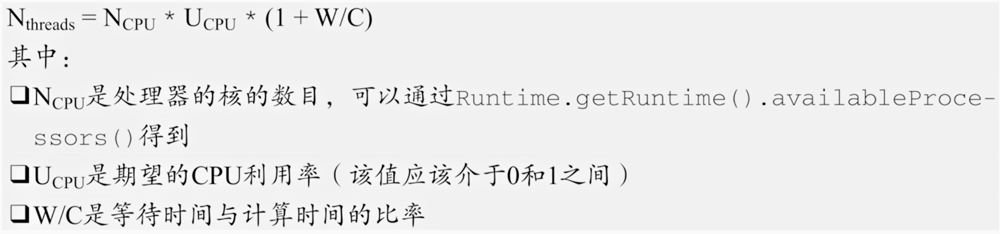
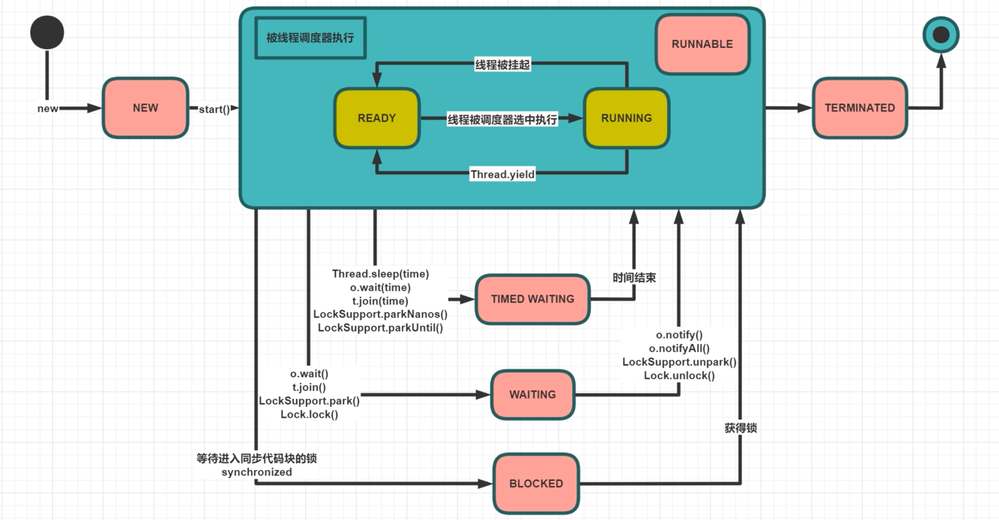
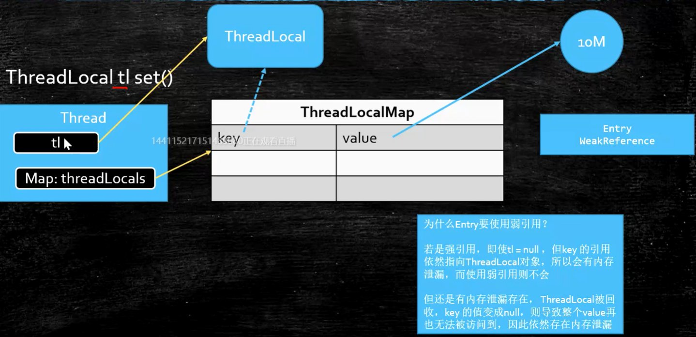

# 多线程

编程模型的发展过程，就是不停地压榨CPU性能的过程。

线程的历史：一部对于CPU性能压榨的历史。 

### 并发编程三大特性

- 可见性 Visibility
- 有序性 Ordering
- 原子性 atomicity


### 几个问题引入

##### 问题 1：单核CPU设定多线程是否有意义？

当然有意义。并不是所有的操作都是消耗CPU的（CPU密集型），当一个线程等待IO（IO密集型）时，可以把时间片让给其他线程。

##### 问题 2：工作线程数是否设置的越大越好？

当然不是，线程切换是要消耗CPU资源的。

##### 问题 3：那设置多少线程合适呢？

可以使用压侧的方式找到最优数量，也可以推算一下：如果没有其他程序的线程干扰的话，大约是 CPU核数 *2

而从安全的角度，未必 100% CPU就是最合适的，要留给其他线程空间，所以实际上我们通常用压侧来找一个性能最佳的合适的数。

《Java编程思想》中给出的公式如下：



其中，W/C通常通过工具进行测算，才能预测出来。例如，我们可以使用 Profiler（收费），或者你可以用 arthas，或者你自己打印日志

### 线程有多少种状态？

指定时刻，线程只可能处于下面 **6 种不同状态** 的其中一个状态（图源《Java 并发编程艺术》4.1.4 节）


#### 马士兵版本线程状态迁移图

##### 问：等待锁时，为什么 ReentrantLock 的 lock() 是 WAITING，而 synchronized 是 BLOCKED？

答：因为 JUC 包下的锁是 CAS 的方式来实现的，所以是 WAITING 忙等待状态。而考虑 synchronized 的锁原理，它经过操作系统调度的，只有经过操作系统调度的，才会是 BLOCKED 状态。




#### 《Java 并发编程艺术》版本线程状态迁移图

线程在生命周期中，而是随着代码的执行在不同状态之间切换。Java 线程状态变迁如下图所示（图源《Java 并发编程艺术》4.1.4 节）：

> 原图中 wait 到 runnable 状态的转换中，`join`实际上是`Thread`类的方法，但这里写成了`Object`。


在代码中，可以使用 getState 获取线程状态

```java
Thread t = new MyThread();
System.out.println(t.getState());
```


##### 面试题：既然调用 start() 方法时会执行 run() 方法，为什么不能直接调用 run() 方法？

new 一个 Thread，线程进入了新建状态;调用 start() 方法，会启动一个线程并使线程进入了就绪状态，当分配到时间片后就可以开始运行了。 start() 会执行线程的相应准备工作，然后自动执行 run() 方法的内容，这是真正的多线程工作。 

而直接执行 run() 方法，会把 run 方法当成一个 main 线程下的普通方法去执行，并不会在某个线程中执行它，所以这并不是多线程工作。

总结： 调用 start 方法方可启动线程并使线程进入就绪状态，而 run 方法只是 thread 的一个普通方法调用，还是在主线程里执行。

##### 面试题：说说 sleep() 方法和 wait() 方法区别和共同点?

- 两者最主要的区别在于：**sleep 方法没有释放锁，而 wait 方法释放了锁** 。

- 两者都可以暂停线程的执行。

- wait 通常被用于线程间交互/通信，sleep 通常被用于暂停执行。

- wait() 方法被调用后，线程不会自动苏醒，需要别的线程调用同一个对象上的 notify() 或者 notifyAll() 方法。或者可以使用 wait(long timeout)超时后线程会自动苏醒。

  sleep() 方法执行完成后，线程会自动苏醒。


### 多线程的使用

#### 启动线程的三种方式

- 继承 Thread 类，重写 run 方法
- 实现 Runnable 接口，重写 run 方法（或Lambda表达式）
- 通过线程池来启动 *Executors.newCachedThread*（实际上是以上两种之一）

```java
package com.mashibing.juc.c_000;

public class T02_HowToCreateThread {
    static class MyThread extends Thread {
        @Override
        public void run() {
            System.out.println("Hello MyThread!");
        }
    }

    static class MyRun implements Runnable {
        @Override
        public void run() {
            System.out.println("Hello MyRun!");
        }
    }

    public static void main(String[] args) {
        new MyThread().start();  // 第一种
        new Thread(new MyRun()).start();  // 第二种（1）
        new Thread(()->{  // 第二种（2）
            System.out.println("Hello Lambda!");
        }).start();
    }
}
```


#### sleep yield join 的含义

- `sleep`：当前线程暂停一段时间，让别的线程去执行。不释放锁。睡眠时间到，自动复活
- `yield`：当前线程执行时，停下来进入等待队列。系统调度算法决定哪个线程继续运行（有可能还是自己）
- `join`：在当前线程加入调用的 join 线程，等调用的线程运行完了，自己再继续执行

#### wait notify notifyAll 的含义

Object 对象中有三个方法 wait()、notify()、notifyAll()，它们的用途都是用来控制线程的状态。

- wait：必须在同步方法/同步代码块中被调用；释放锁，调用该线程的方法进入**等待队列**，直到被唤醒
- notify：随机唤醒等待队列中等待的一个线程，使得该线程由 **等待状态** 进入 **可运行状态**
- notifyAll：唤醒在此对象监视器上等待的所有线程，被唤醒的线程将以常规方式与在该对象上主动同步的其他所有线程进行竞争、

#### 线程的打断

sleep() 方法在睡眠的时候，是没有办法被叫醒的，这个时候可以用 interrupt 设置标志位，然后必须 catch InterruptedException 来处理，决定是否继续睡，或者去执行别的逻辑。（catch之后，中断标志位被自动复位）

- `interrupt()`：打断某个线程（设置标志位）。注意它并不是直接打折了腿，而是设标志位、抛异常，让开发者去决定如何处理
- `isInterrupted()`：查询某线程是否被打断过（查询标志位）
- `static interrupted()`：查询 **当前** 线程是否被打断过，并重置打断标志

##### 注意

不要使用 stop() 关闭线程，你应该让线程正常结束。

实验表明，sleep() 和 wait() 的过程均可以被 interrupt 抛异常干扰，而锁竞争（例如 synchronized，Reentrantlock 的 lock() 这类等待其他线程释放锁）的过程，不会被 interrupt 打断。

- sleep 阻塞时候会自动检测中断：抛出异常 `java.lang.InterruptedException: sleep interrupted`

- 如果想让 lock.lock() 能够被 interrupt 打断，可以使用 lock.lockInterruptably() 加锁，就是可以在锁竞争的过程中被打断的

```java
@Override
public void run() {
    while (true && !Thread.currentThread().isInterrupted()) {//判断是否处于中断状态，且isInterrupted()会重置标志位
        System.out.println("go");
        try {
            throwInMethod();
        } catch (InterruptedException e) { // catch异常后，Java会默认将interrupt标志位复位，以免别的线程再次被打断
            // 恢复设置中断状态，便于在下一个循环的时候检测到中断状态，正常退出(例如可以主动从循环中break)
            Thread.currentThread().interrupt();
            e.printStackTrace();// 可以记录一下日志
        }
    }
}
// JDK锁、框架源码的一些实现使用过interrupt，实际工程中，很少有人用它控制业务逻辑
```


#### 面试题：如何优雅地终止一个线程？

首先，最好的结束一个线程的方法，是让它自然结束。但是，7 * 24h 的服务器上的程序是不可能执行完的。好多用户登录在上面，你能随随便便把它打断吗？怎么尽量不丢失中间的状态呢？例如：

- 上传一个大文件，又点了取消，怎么才能终止掉呢？
- 正在处理的费时的计算，怎么才能结束掉呢？

有好多种方式，让我来逐一讲给你听。

##### 1、（不推荐）使用 (Thread)t.stop(); 方法

这个方法已经 deprecated 了，不建议使用。为什么不建议使用？因为它太粗暴了，会直接释放所有的锁，并且不会做后续的工作。因此在多线程之间需要互相配合时，可能会产生数据不一致的问题。

##### 2、（不推荐）使用 (Thread)t.suspend(); 和 t.resume(); 方法

suspend() 暂停一个线程，resume() 恢复暂停线程的执行。这两个方法也被 deprecated 了。原因是 suspend() 的时候，线程持有的锁是不会被释放的，如果你忘了让它继续的话，就永远不会释放了，会产生死锁的问题。

##### 3、（可行）使用 volatile 自定义标志位控制

方法是，使用 public static volatile boolean 的变量控制是否继续运行，在线程内部一直检测，如果为 false，就终止。这种方法的缺点是难以控制时间，例如要想精确的控制容量为10的容器要在容量为5的时候打断，是比较困难的。但只要在不依赖于线程内部的执行状态的情况下，使用起来还是很方便的。

##### 4、（可行）使用 interrupt 设置标志位来控制

Java 没有提供任何机制来安全地终止线程。它提供了 interrupt，这仅仅是会通知到被终止的线程“你该停止运行了”，由编写者决定如何处理 InterruptedException

与上述 “3、使用 volatile 控制” 不同的是，volatile 是手动设置的标志位，而 interrupted 是线程自带的标志位，会更加优雅一些。


# ThreadLocal

ThreadLocal 是线程引用对象，线程之间不共享。

- 为什么要有 ThreadLocal？

  - Spring的声明式事务会用到。（Spring 的声明式事务在一个线程里）

  - connection 在连接池里，不同的 connection 之间怎么形成完整的事务？

    把 connection 放在当前线程的 ThreadLocal 里面，以后拿的时候从 ThreadLocal 直接拿，不去线池里面拿。

- ThreadLocal是怎么做到线程独有的？

  

  - `ThreadLocalMap`是当前 Thread 的一个成员变量，其 Key 是 ThreadLocal 对象，值是 Entry 对象，Entry 中只有一个 Object 类的 vaule 值。
  - 使用 **虚引用**，让 `Key` 指向 `ThreadLocal`


#### 强软弱虚四种引用

- 强引用 StrongReference

  - `Object o = new Object()`
  - 只要有引用指向它，就算是OOM了，也不会被回收

- 软引用 SoftReference

  ```java
  SoftReference<byte[]> m = new SoftReference<>(new byte[1024 * 1024 * 10]);
  System.out.println(m.get());
  ```

  - 内存空间不够时，弱引用会被回收
  - 用来做缓存

- 弱引用 WeakReference

  ```java
  WeakReference<M> m = new WeakReference<>(new M());
  System.out.println(m.get());
  ```

  - 只要发生GC，弱引用就会被回收
  - ThreadLocal 中会使用弱引用

- 虚引用 PhantomReference

  虚引用，顾名思义，就是形同虚设，与其他几种引用都不同，虚引用并不会决定对象的生命周期。如果一个对象仅持有虚引用，那么它就和没有任何引用一样，在任何时候都可能被垃圾回收。
  
  ```java
  private static final ReferenceQueue<M> QUEUE = new ReferenceQueue<>();
  public static void main(String[] args) {
  	PhantomReference<M> phantomReference = new PhantomReference<>(new M(), QUEUE);
  ```
  
  - 虚引用主要用来跟踪对象被垃圾回收的活动，必须和 **引用队列** `ReferenceQueue` 联合使用
  - 虚引用对象被回收前，会被加入到队列中，我们需要另一线程不断检测队列，并以在所引用的对象的内存被回收之前采取必要的行动。
  - 用来管理 **堆外内存**，堆外内存包括：
    - 方法区
    - NIO 的 `DirectByteBuffer`


### 线程池

#### 线程池前值知识

##### Executor 接口关系


##### Callable

​		类似于Runnable，但是可以有返回值

##### Future

​		存储将来执行的结果。Callable被执行完之后的结果，被封装到Future里面。

##### FutureTask

​		更加灵活，是Runnable和Future的结合，既是一个Runnable，又可以存结果。

##### CompletableFuture

​		可以用来管理多个Future的结果，对各种各样的结果进行组合处理。提供了非常好用的接口，十分友好。

> 场景：假设你需要提供一个服务，这个服务查询 京东、淘宝、天猫 对于同一类产品的价格并汇总展示，你用CompletableFuture开启三个线程，来完成这个任务，三个任务全部完成之后，才能继续向下运行。


#### 线程池

**ThreadPoolExecutor**：是我们通常所说的线程池。多个线程共享同一个任务队列。

- SingleThreadPool

  为什么会有单线程的线程池？单线程的线程池是有任务队列的；线程池能帮你提供线程生命周期的管理。

  - 线程池里面只有一个线程
  - 保证我们扔进去的任务是被顺序执行的

- CachedThreadPool

  当任务到来时，如果有线程空闲，我就用现有的线程；如果所有线程忙，就启动一个新线程。

  - 核心线程数为0
  - 最大线程数是Integer.MAX_VALUE
  - 保证任务不会堆积
  - SynchronousQueue 是容量为0的阻塞队列，每个插入操作必须等待另一个线程执行相应的删除操作

- FixedThreadPool

  - 固定线程数的线程池
  - 适合做一些**并行**的计算，比如你要找1-200000之内所有的质数，你将这个大任务拆成4个小线程，共同去运行，肯定比串行计算要更快。

- ScheduledPool

  - 专门用来执行定时任务的一个线程池

**ForkJoinPoll**：先将任务分解，最后再汇总，可以有返回值或无返回值。每个线程有自己的任务队列。

- WorkStealingPool
  - 普通的线程池是有一个线程的集合，所有线程去同一个任务队列里面取任务，取出任务之后执行，而 WorkStealingPool 是每一个线程都有自己独立的任务队列，如果某一个线程执行完自己的任务之后，要去别的线程那里偷任务，分担别的线程的任务。
  - WorkStealingPool 本质上还是一个 ForkJoinPool


#### 自定义一个线程池

```java
public class TestThreadPool {
    static class Task implements Runnable {
        @Override
        public void run() {
            System.out.println(Thread.currentThread().getName() + " is running task");
        }
    }
    public static void main(String[] args) {
        // ThreadPoolExecutor 7个参数
        ThreadPoolExecutor tpe = new ThreadPoolExecutor(2, 4,
                60, TimeUnit.SECONDS,
                new ArrayBlockingQueue<Runnable>(4),
                Executors.defaultThreadFactory(),
                new ThreadPoolExecutor.CallerRunsPolicy()); // 调用者处理服务，这里是main调用
        for (int i = 0; i < 8; i++) { // 开启8个任务，放进线程池执行
            tpe.execute(new Task());
        }
        tpe.shutdown();
    }
}
```

##### new ThreadPoolExecutor() 7个参数

- corePoolSize：核心线程数

- maximumPoolSize：最大线程数

- keepAliveTime：空闲线程生存时间

- TimeUnit：生存时间的单位

- BlockingQueue<Runnable>：各种各样的任务队列

- ThreadFactory：线程工厂

  可以使用`Executors.defaultThreadFactory()`，也可以自定义工厂，指定线程名称

- RejectedExecutionHandler：线程池忙且任务队列满时的 **拒绝策略**

  - CallerRunsPolicy，让调用者线程去处理任务
  - AbortPolicy，抛异常
  - DiscardPolicy，扔掉，不抛异常
  - DiscardOldestPolicy，扔掉排队时间最久的