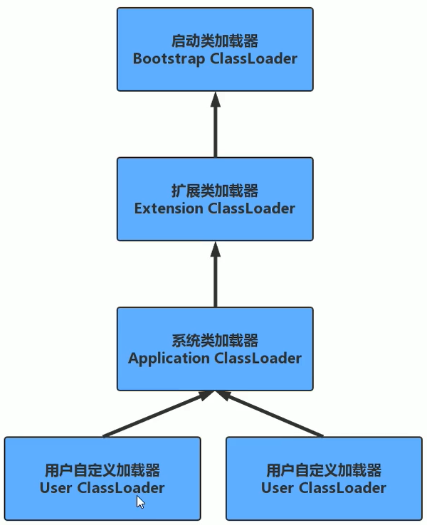

# 类加载机制

### 类加载机制，类加载的过程？

1. class loading 加载：JVM 把描述类的数据从 Class 文件加载到内存中
2. class linking 连接
   1. verification：校验装进来的 class 文件是否符合标准，比如 `CA FE BA BE`
   2. preparation：将 class 文件的静态变量赋默认值（不是初始值）
   3. resolution：把 class 文件常量池中用到的符号引用，转换为直接内存地址可以直接访问到的内容
3. class initializing 初始化：静态变量这时候才会赋初始值
4. 申请对象内存
5. 成员变量赋默认值
6. 调用构造方法
   - 成员变量按照顺序赋初始值
   - 执行构造方法语句
7. 最终形成可以被虚拟机直接使用的 Java 类型，这个过程称为虚拟机的类加载机制。

### 双亲委派机制（parent 翻译不准确，应为父类委派机制）

双亲委派机制是一个递归，不同的类加载器加载不同的 class。

##### Bootstrap ClassLoader 启动类加载器

- C++实现（只有C++实现代码，Java里没有真正的类）
- 加载 <JAVA_HOME>/lib下的类，是 jdk 最核心的内容，例如 rt.jar, charset.jar

- 加载路径：sun.boot.class.path

##### Extension ClassLoader 扩展类加载器

- Java 实现

- 加载扩展包中的类，在 jdk 安装目录 jre/lib/ext 下的 jar

- 加载路径：java.ext.dirs

##### Application ClassLoader 系统类加载器

- 我们写的代码默认就是由它来加载

- 加载 classpath 指定的内容

- 加载路径：java.class.path

##### User ClassLoader 用户自定义加载器

- 加载自己定义的加载器

#### 类加载器的加载过程

1. 子类先委托父类加载
2. 父类加载器有自己的**加载范围**，范围内没有找到，则不加载，并返回给子类
3. 子类在收到父类无法加载的时候，才会自己去加载

#### 为什么要搞双亲委派？

主要为了安全。如果任何一个 class 都可以把它 load 到内存的话，那我就可以自定义一个 java.lang.string 类，交给自定义的 ClassLoader，把这个我自己的 string 类打包给客户，它被 load 进内存，然后客户把密码存储成 String 类型对象，我偷摸把密码发给自己，这样就不安全了。

