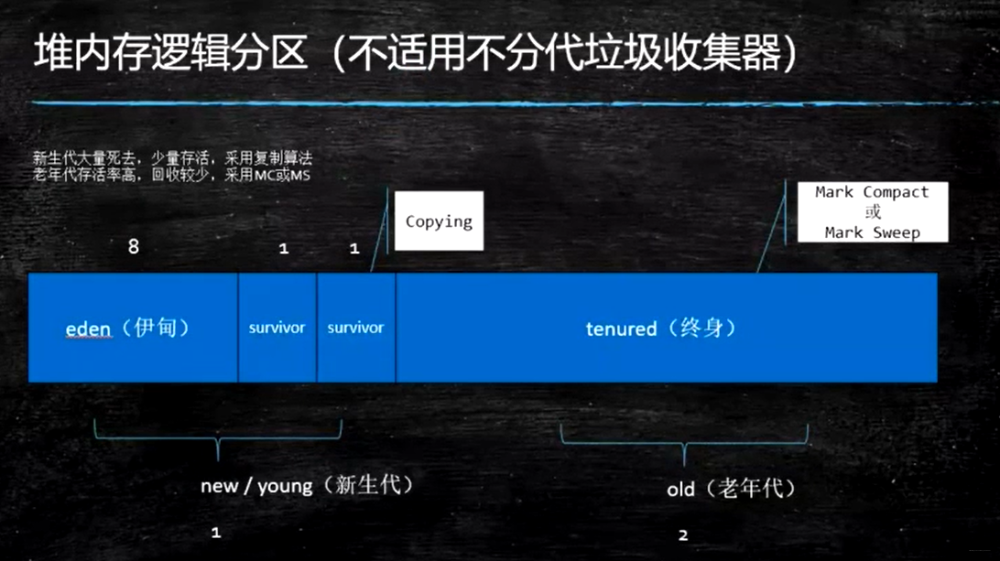
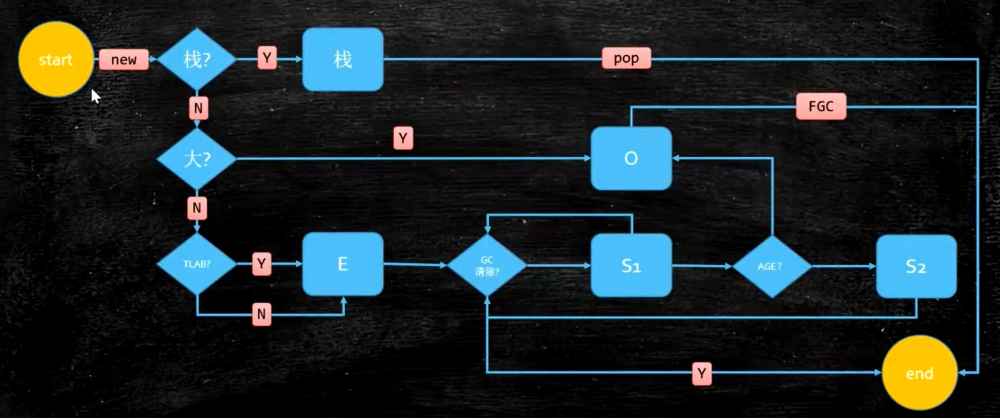
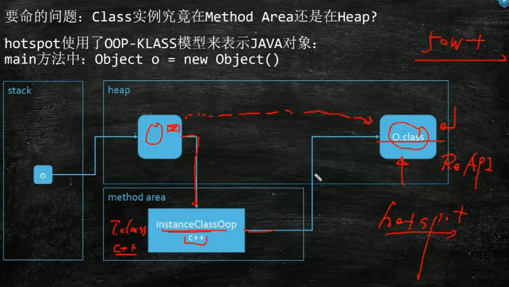
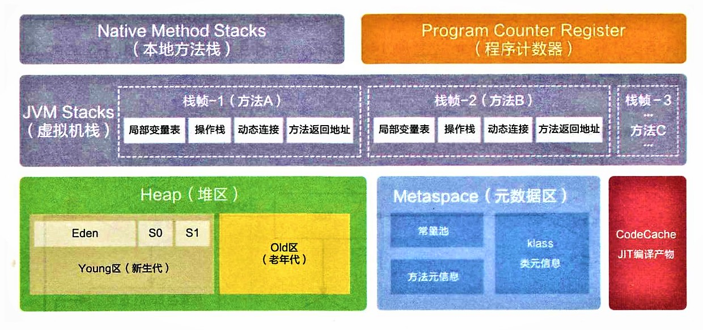
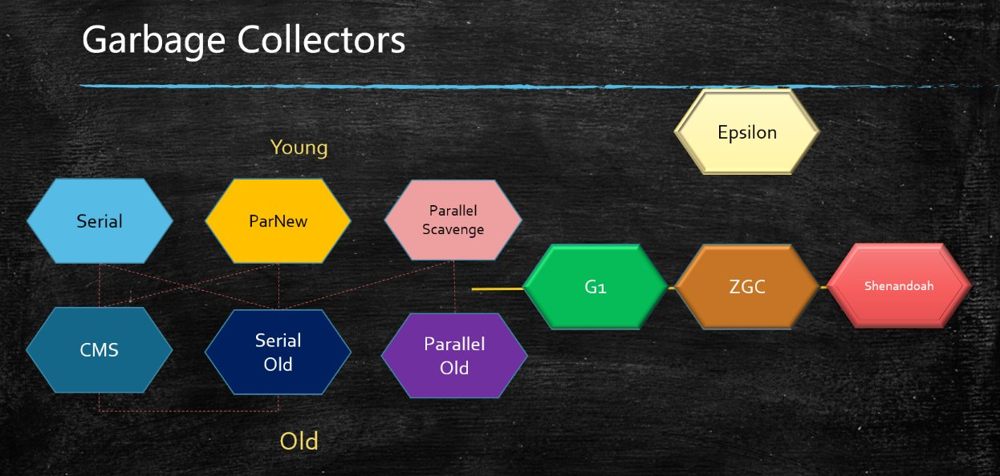
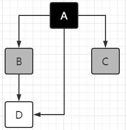

# 垃圾回收机制

垃圾：没有引用指向的对象

### JVM 堆分代模型

JVM 内存模型和具体的垃圾回收器有关，面试问的时候，你应该说明是哪一种回收器！

##### 新生代（堆空间）

- 分为 1 个 **伊甸区**，2 个 **survivor 区**
- 存活对象少，使用 **拷贝算法**

##### 老年代（堆空间）

- 存活对象多，使用 **标记压缩算法 / 标记清除算法**

##### 永久代（方法区 MethodArea）（堆之外空间）

存的是class的元信息，代码的编译信息等待等等

- 1.8 之前：Perm Generation，固定设置大小
- 1.8 之后：MetaSpace，默认受限于物理内存，可以设置
- 字符串常量1.7在Perm Generation，1.8在堆内存



除了 Epsilon，ZGC，Shenandoah 之外的垃圾回收器，都是 **逻辑分代** 模型

G1是 **逻辑分代，物理不分代**（物理分代就是内存里确实有这样一块空间）

除此之外，其余的不仅逻辑分代，而且物理分代。


#### 对象何时进入老年代？

对象头 MarkWord 中存储分代年龄的只有 4 bit，所以最大是15次。

PS 默认是15，CMS 默认是 6。


#### 对象分配过程？



1. new 一个对象，首先尝试在 **栈** 上分配。如果能分配到栈上，则分配到栈上。

   为什么？因为一旦方法弹出，整个生命周期就结束，不需要垃圾回收，提高了效率。

   什么样的对象能在栈上分配？满足可以进行 **逃逸分析**、**标量替换** 的对象，可以分配到栈上

   什么是逃逸分析？如果判断一段代码中堆上的所有数据都只被一个线程访问，就可以当作栈上的数据对待，认为它们是线程私有的，无须同步。例如，一个对象只出现在 for 循环内部，没有外部的引用。

   什么是标量替换？如果你这个对象可以被分解为基础数据类型来替换，比如一个对象 T 有两个 int 类型。类似于 C 的结构体。

2. 如果栈上分配不下，判断是否 **大对象**（多大？有参数可以设置）

   - 如果是大对象，直接进入 old 区
   - 如果不是大对象，放入 ThreadLocalAllocationBuffer（TLAB） 线程本地分配缓冲区，它其实是在 eden 区分配给每个线程的一小块空间，线程把对象 new 在自己兜里，兜里满了再去抢公共的空间，避免 new 对象的时候不同线程对空间的征用。

3. 进行 GC 清除，在分代模型 GC 下：

   - 如果 **是垃圾**，则对象被清除
   - 如果 **不是垃圾**，进入 survivor 区，或在 survivor 区之间复制
   - 如果 survivor 区年龄到达 15，进入 old 区

**动态年龄，分配担保**：了解即可

- **动态对象年龄判定**：为了适应不同内存状况，虚拟机不要求对象年龄达到阈值才能晋升老年代，如果在 Survivor 中相同年龄所有对象大小的总和大于 Survivor 的一半，年龄不小于该年龄的对象就可以直接进入老年代。

- **空间分配担保**：MinorGC 前虚拟机必须检查老年代最大可用连续空间是否大于新生代对象总空间，如果满足则说明这次 Minor GC 确定安全。

  如果不满足，虚拟机会查看 -XX:HandlePromotionFailure 参数是否允许担保失败，如果允许会继续检查老年代最大可用连续空间是否大于历次晋升老年代对象的平均大小，如果满足将冒险尝试一次 Minor GC，否则改成一次 FullGC。

  冒险是因为新生代使用复制算法，为了内存利用率只使用一个 Survivor，大量对象在 Minor GC 后仍然存活时，需要老年代进行分配担保，接收 Survivor 无法容纳的对象。


#### 为什么 hotspot 不使用 C++ 对象来代表 java 对象？

为什么不为每个Java类生成一个C++类与之对应？

因为 C++ 对象里面有一个 virtual table 指针，而HotSopt JVM的设计者不想让每个对象中都含有一个vtable（虚函数表），而是设计了一个 OOP-Klass Model，把对象模型拆成 klass 和 oop

- OOP 指的是 Ordinary Object Pointer （普通对象指针），它用来表示对象的实例信息，看起来像个指针实际上是藏在指针里的对象。OOP 中不含有任何虚函数。

- Klass 简单的说是Java类在HotSpot中的 C++ 对等体，用来描述 Java 类。Klass 含有虚函数表，可以进行method dispatch，Klass主要有两个功能：
  - 实现语言层面的Java类
  - 实现Java对象的分发功能


#### Class 对象是在堆还是在方法区？

在程序运行期间，Java 运行时系统为所有对象维护一个运行时类型标识，这个信息会跟踪每个对象所属的类，虚拟机利用运行时类型信息选择要执行的正确方法，保存这些信息的类就是 Class，这是一个泛型类。




#### 运行时常量池的作用是什么?



运行时常量池是 **方法区（hotspot 的实现为元数据区）** 的一部分

**Class 文件** 中除了有类的版本、字段、方法、接口等描述信息外，还有一项信息是 **常量池表**，用于存放编译器生成的各种 **字面量** 与 **符号引用**，这部分内容在类加载后，被存放到 **运行时常量池**。一般除了保存 Class 文件中描述的 **符号引用** 外，还会把符号引用翻译的 **直接引用** 也存储在运行时常量池。

运行时常量池相对于 Class 文件常量池的一个重要特征是动态性，Java 不要求常量只有编译期才能产生，运行期间也可以将新的常量放入池中，这种特性利用较多的是 String 的 intern 方法。

运行时常量池是方法区的一部分，受到方法区内存的限制，常量池无法申请到内存时抛出 OutOfMemoryError。


#### 如何判断一个常量是废弃常量？

我们需要对运行时常量池的废弃常量进行回收。那么，如何判断一个常量是废弃常量呢？

没有栈引用指向这个常量，这个常量就是废弃的。

假如在常量池中存在字符串 "abc"，如果当前没有任何 String 对象引用该字符串常量的话，就说明常量 "abc" 就是废弃常量，如果这时发生内存回收的话而且有必要的话，"abc" 就会被系统清理出常量池。


#### GC的分类

MinorGC / YoungGC：年轻代空间耗尽时触发

MajorGC / FullGC：老年代无法分配空间时触发，新生代、老年代同时进行回收


#### “找到”垃圾的算法？

##### 1、引用计数算法（ReferenceCount）

在对象中添加一个引用计数器，如果被引用计数器加 1，引用失效时计数器减 1，如果计数器为 0 则被标记为垃圾。原理简单，效率高，在 Java 中很少使用，因对象间循环引用的问题会导致计数器无法清零。

##### 2、根可达算法（RootSearching）

通过一系列 **GC Roots 对象** 作为起始点，开始向下搜索，若一个对象没有任何引用链相连，则不可达。

**GC Roots 对象** 包括：

- JVM stack - JVM 栈
- native method stack - 本地方法栈
- run-time constant pool - 运行时常量池
- static references in method area - 方法区静态方法
- Clazz - 类


#### “清除”垃圾的算法？


##### 1、Mark-Sweep 标记清除算法


- 需要两遍扫描：第一遍标记，第二遍清除
- 产生碎片，内存空间不连续，大对象分配不到内存触发 FGC
- 适合 **存活对象较多** 的情况，不适合Eden区

##### 2、Copying 拷贝算法


HotSpot 把新生代划分为一块较大的 Eden 和两块较小的 Survivor。垃圾收集时将 Eden 和 Survivor 中仍然存活的对象一次性复制到另一块 Survivor 上，然后直接清理掉 Eden 和已用过的那块 Survivor。

- 只扫描一次，效率高
- 不产生碎片
- 空间折半浪费
- 移动、复制对象时，需要调整对象引用
- 适合 **存活对象比较少** 的情况，老年代一般**不**使用此算法

##### 3、Mark-Compact 标记压缩算法


- 需要扫描两次，需要移动对象，效率偏低，开销大，停顿时间长
- 不产生碎片
- 不会产生内存减半
- 老年代使用

##### 4、分代收集算法

现在的商用虚拟机的垃圾收集器，基本都采用"分代收集"算法，根据对象存活周期的不同将内存分为几块。一般将java堆分为新生代、老年代，这样我们可以根据各个年代的特点，选择合适的垃圾收集算法。

**新生代** 每次收集都有大量对象死去，所以选择 **复制算法**，只要付出少量对象复制成本，就可以完成垃圾收集。IBM 做过统计，工业上一般来讲，一次回收会回收掉 90% 的对象。

**老年代** 对象存活几率比高，且无额外的空间对它进行分配担保，就必须选择 **标记-清除** 或者 **标记-压缩** 行垃圾收集。


### 常见的垃圾回收器

随着硬件内存越来越大，原有的回收器需要回收的时间变得越来越长，于是发展出了各种各样的垃圾回收器。



常见组合：

- Serial + Serial Old
- ParNew + CMS
- Parallel Scavenge + Parallel Old（PS + PO），1.8 默认
- G1

#### 1、Serial + Serial Old

- STW
- 单线程
- Serial 年轻代 **复制算法**，Serial Old 老年代 **标记-压缩算法**
- 与其他收集器的单线程相比，简单高效，对于运行在 client 模式下的虚拟机是个不错的选择

#### 2、Parallel Scavenge + Parallel Old（jdk 8 默认）

10G内存的话，回收一次要十几秒

- STW
- 多个GC线程并行回收
- 年轻代 **复制算法**，老年代 **标记-压缩算法**
- 线程数不可能被无限增多，CPU会将资源耗费在线程切换上

#### 3、ParNew + CMS

```shell
java -Xms20M -Xmx20M -XX:+PrintGCDetails -XX:+UseConcMarkSweepGC com.mashibing.jvm.gc.T15_FullGC_Problem01
```

##### ParNew 年轻代

- STW
- 多个GC线程
- ParNew  与 Parallel Scavenge 相似，只不过 ParNew 有可以与 CMS 结合的同步机制。除了 Serial 外，只有它能与 CMS 配合。

##### CMS 老年代

- 以 **获取最短回收停顿时间** 为目标，并发回收，**用户线程和 GC 线程同时进行**，暂停时间短

- 基于 **标记-清除** 算法

- 分为 **四个阶段**：

  - 初始标记（STW）：暂停所有其他线程，并记录直接与 root 相连的对象。初始垃圾并不多，因此很快。
  - 并发标记：垃圾回收线程和用户线程同时执行。一边产生垃圾，一边标记（最耗时的阶段**并发**执行）。
  - 重新标记（STW）：对并发标记的过程中新产生的垃圾进行重新标记 / 取消标记，修正错标。由于 CMS 的并发标记存在并发漏标的问题，所以 CMS 的 remark 阶段必须从头扫描一遍，耗时很长，也是为什么 JDK 默认并没有使用 CMS 的 原因。
  - 并发清理：开启用户线程，同时 GC 线程开始对未标记的区域做清扫。清理的过程也会产生新的“浮动垃圾”，需要等下一次CMS重新运行的时候再次清理，影响不大。

- CMS 存在的 **问题**：

  - Memory Fragmentation **内存碎片** 问题

    - 标记清除会产生碎片化，如果老年代不能再分配位置，CMS会让 Serial Old 来清理，效率很低。

    - 解决方案：

      `-XX:+UseCMSCompactAtFullCollection` 在 FGC 时进行压缩

      ` -XX:CMSFullGCsBeforeCompaction` 多少次 FGC 之后进行压缩，默认是 0

  - Floating Garbage **浮动垃圾** 问题

    - 如果老年代满了，浮动垃圾还没有清理完，会让 Serial Old 清理。

    - 解决方案：

      降低触发 CMS 的阈值，保持老年代有足够的空间

      `-XX:CMSInitiatingOccupancyFraction` 使用多少比例的老年代后开始CMS收集。实际回收的时候它是一个近似值，可能没达到这个值就已经触发了。默认是68%，有人说是 92%，好像有个计算公式，没有去深究。如果频繁发生SerialOld卡顿，应该把它调小，但是调小的缺点是频繁CMS回收。

      如何查看这个默认值？

      ```shell
      java -XX:+PrintFlagsFinal -version | grep CMSInitiatingOccupancyFraction
      ```

#### 4、G1 回收器

开创了收集器面向局部收集的设计思路和基于 Region 的内存布局，主要面向服务端，最初设计目标是替换 CMS

如果你生产是 1.8 的 jdk，推荐使用 G1 回收器。启动方式：

```shell
java -Xms20M -Xmx20M -XX:+PrintGCDetails -XX:+Use G1GC com.mashibing.jvm.gc.T15_FullGC_Problem01
```

G1的特点：适用于需要特别快的响应时间的场景（不需要很高吞吐量）。可由**用户指定期望停顿时间**是 G1 的一个强大功能，但该值不能设得太低，一般设置为100~300 ms

G1的新老年代的比例是动态的，默认年轻代占用 5%-60%，一般不用手工指定，也不要手工指定。因为这是G1预测停顿时间的基准。它会根据上次回收的时间，进行新老年代的比例的动态调整。

##### G1 的一些概念：

###### 1、card table 卡表

- 基于 card table，将堆空间划分为一系列2^n大小的 card page
- card table 用 bitmap 来实现，用于标记卡页的状态，每个 card table 项对应一个 card page
- 当对一个对象引用进行写操作时（对象引用改变），写屏障逻辑会标记对象所在的 card page 为 dirty

###### 2、Cset（collection set）

Cset 是一组可以被回收的分区的集合。它里面记录了有哪些对象需要被回收。

###### 3、Rset（remembered set）

Rset 中有一个 Hash 表，里面记录了其它 region 中的对象到本 region 的引用。

Rset 的价值在于，它使得垃圾收集器不需要扫描整个堆，去找谁引用了当前分区中的对象，只需要扫描 Rset 即可。

Rset 会不会影响赋值的效率？会！由于Rset的存在，那么每次给对象复制引用的时候，需要在Rset中做一些额外的记录，比如说记录有哪些引用指向了我的对象等等，这些操作在GC中被称为写屏障。此处不同于内存屏障，是GC专有的写屏障。NO Silver Bullet！只有特定条件下特定的解决方案，没有通用的解决方案。

##### G1 的回收过程：

- 把内存空间分为一块一块的 **region**，把内存化整为零。

- G1 收集器在后台维护了一个优先列表，当需要进行垃圾回收时，会优先回收存活对象最少的 region，也就是垃圾最多的 region，这就是“Garbage-First 垃圾优先”。**每一个 region 都有自己的逻辑分代**：

  - old
  - suvivor
  - eden
  - humongous 存放巨型对象（跨越多个region的对象）

- G1 的 GC 分为三种，不同种类的 GC 可能会同时进行。比如 YGC 和 MixedGC 的 initial mark 同时进行

  - **YGC**
  - **MixedGC**：比如YGC已经回收不过来的，堆内存空间超过了45%，默认就启动了MixedGC。
    
    - MixedGC 发生的阈值可以自行设定
    - MixedGC 相当于一套完整的 CMS
      - 初始标记 **需要STW**
      
        标记 GC Roots 能直接关联到的对象，让下一阶段用户线程并发运行时能正确地在可用 Region 中分配新对象。需要 STW 但耗时很短，在 Minor GC 时同步完成
      
      - 并发标记 **不需要STW**
      
        从 GC Roots 开始对堆中对象进行可达性分析，递归扫描整个堆的对象图。耗时长但可与用户线程并发，扫描完成后要重新处理 SATB 记录的在并发时有变动的对象，**三色标记** 算法
      
      - 最终标记 **需要STW**（重新标记）
      
        对用户线程做短暂暂停，处理并发阶段结束后仍遗留下来的少量 SATB 记录
      
      - 筛选回收 **需要STW**（并行）
      
        对各 Region 的回收价值排序，根据用户期望停顿时间制定回收计划。必须暂停用户线程，由多条收集线程并行完成
  - **FullGC**：G1 也是有 FGC 的，对象分配不下的时候，就会产生 FGC。我们说 G1 和 CMS 调优目标之一就是尽量不要有 FGC，但这并不容易达到。因此有了面试题：如果G1产生FGC，你应该做什么？
    
    1. 扩内存
    2. 提高CPU性能（回收的快，业务逻辑产生对象的速度固定，垃圾回收越快，内存空间越大）
    3. 降低MixedGC触发的阈值，让MixedGC提早发生（默认是45%）

  

  ##### 并发标记算法 - 三色标记算法

  

  - CMS 和 G1 用到的都是 **三色标记** 算法，“三色”只是逻辑概念，并不是真的颜色。
    - 白色：未被标记的对象，也就是还没有遍历到的节点
    - 灰色：自身标记完成，没来得及标记成员变量
    - 黑色：自身和成员变量均标记完成
  - 漏标：本来是 live object，但是由于没有遍历到，被当成 garbage 回收掉了。例如，在 remark 的过程中，B 原来指向 D 的线消失了，但是 A 又指向了 D。如果不对 A 进行重新扫描，则会漏标，导致D被当做垃圾回收掉。
  - 漏标解决方案：
    - **Incremental update，CMS 方案**：增量更新，关注引用的 **增加**，把黑色的 A 重新标记为灰色，下次重新扫描它。
    
    - **SATB（snapshot at the begining），G1方案**：关注引用的 **删除**。当 B->D 消失时，要把这个引用推到GC的堆栈，保证D还能被GC扫描到。下次扫描时会拿到这个引用，由于有Rset的存在，不需要扫描整个堆去查找指向白色的引用，效率比较高。
    
      SATB配合Rset，浑然天成。

#### 5、ZGC

[美团技术团队：新一代垃圾回收器ZGC的探索与实践](https://mp.weixin.qq.com/s?__biz=MjM5NjQ5MTI5OA==&mid=2651752559&idx=1&sn=c720b67e93db1885d72dab8799bba78c&chksm=bd1251228a65d834db610deb2ce55003e0fc1f90793e84873096db19027936f6add301242545&scene=0&xtrack=1&key=0a19845a51c584157d9ef0b6e660fc88f945b053ea8edc68d7eea9da2f28fc891473629a4ed61c76a8d0d600358fa4825e5d5803f68e03d42007d50900cbd240c1672d8db5d2e2cc16acc4202c32a8e766ba10eab8af2be93b38a25f1a88f24f19619ab21b9a9399da849e9c5758fc6ff9ac4100c98e4f04e9de3e9781091310&ascene=1&uin=MjMyNzQyMjkwMw%3D%3D&devicetype=Windows+10&version=62080079&lang=zh_CN&exportkey=Ab81jUJtduEH%2F9T2D2Z9DAA%3D&pass_ticket=r825oTfyP9vrVZScLqgSgOw6%2BB5kyOLUrLxq4r1gj2Lhfn7rCt0mZgAj%2FzAWKzAf)

ZGC 用了颜色指针


##### 一些拓展知识

- 阿里的多租户 JVM：把一个 JVM 分为还几个小块，分给租户用
- 专门针对 web application 的，session base 的 JVM。请求来访问的时候产生的垃圾，在请求结束之后被回收


### JVM 常用命令参数

#### HotSpot参数分类

    标准：  - 开头，所有的HotSpot都支持
    非标准：-X 开头，特定版本HotSpot支持特定命令
    不稳定：-XX 开头，下个版本可能取消

#### 调优前的基础概念：

所谓调优，首先确定：是吞吐量优先，还是响应时间优先？还是在一定的响应时间下，要求达到多大的吞吐量？

- 吞吐量：用户代码时间 /（用户代码执行时间 + 垃圾回收时间）
  - 科学计算、数据挖掘，一般吞吐量优先
  - PS + PO

- 响应时间：STW越短，响应时间越好
  - 网站、GUI、API，一般响应时间优先
  - 1.8 G1

并发：淘宝双11并发历年最高54万，据说12306并发比淘宝更高，号称上百万

- TPS
- QPS，Query Per Second

#### 什么是调优？

##### 1、如何根据需求进行 JVM 规划和预调优？

有人要问你，你应该选用多大的内存？什么样的垃圾回收器组合？你怎么回答？

- 要有实际的业务场景，才能讨论调优
- 要有监控，能够通过压力测试看到结果

步骤：

（1）熟悉业务场景，选择合适的垃圾回收器。是追求吞吐量，还是追求响应时间？

（2）计算内存需求。没有一定之规，是经验值。 1.5G -> 16G，突然卡顿了，为啥？

（3）选定CPU。预算能买到的，当然是越高越好，CPU多核，可以多线程运行呀！

（4）设定年代大小、升级年龄

（5）设定 **日志参数**

这个是 Java 虚拟机的参数，也可以在Tomcat里面配置，貌似是在叫 catalina options 里面指定java日志的参数

```shell
-Xloggc:/opt/xxx/logs/xxx-xxx-gc-%t.log -XX:+UseGCLogFileRotation 
-XX:NumberOfGCLogFiles=5 -XX:GCLogFileSize=20M -XX:+PrintGCDetails -XX:+PrintGCDateStamps -XX:+PrintGCCause HelloGC
```

5个日志文件循环产生，生产中的日志一般是这么设置，`%t`是生成时间的意思。

（6）观察日志情况

###### 案例1：垂直电商，最高每日百万订单，处理订单系统需要什么样的服务器配置？

> 这个问题比较业余，因为很多不同的服务器配置都能支撑(1.5G 16G 都有可能啊)
>
> 我们做一个假设吧，1小时360000个订单。在集中时间段， 100个订单/秒，（找一小时内的高峰期，可能是1000订单/秒）。我们就要找到这个最高峰的时间，保证你的架构能够承接的住。
>
> 大多数情况下，是靠经验值，然后做压测。
>
> 如果非要计算的话，你预估一下，一个订单对象产生需要多少内存？512K * 1000 = 500M
>
> 专业一点的问法：要求响应时间在多少时间的情况下，比如100ms，我们去挑一个市面上性价比比较高的服务器，做压测去测试，再不行加内存，再不行，就上云服务器…
> 这样说就OK了

###### 案例2：12306遭遇春节大规模抢票应该如何支撑？（架构上的一个设计，与调优关系不大）

> 12306应该是中国并发量最大的秒杀网站：号称并发量最高100W
>
> 架构模型：CDN -> LVS -> NGINX -> 业务系统 -> 100台机器，每台机器1W并发（单机10K问题），目前这个问题主要用Redis解决
>
> 业务流程：普通电商订单 -> 下单 -> 订单系统（IO）减库存 -> 生成订单，等待用户付款
>
> 12306的一种可能的模型，是异步来进行的： 下单 -> 减库存 和 订单(redis kafka) 同时异步进行 ->等付款，付完款，持久化到Hbase, MySQL等等
>
> 减库存最后还会把压力压到一台服务器，怎么办？可以做分布式本地库存 + 单独服务器做库存均衡
>
> 大流量的处理方法：分而治之，每台机器只减自己机器上有的库存
>
> **流量倾斜**的问题怎么解决？比如有的机器上已经没库存了，有的机器上还剩很多？这时候你还需要一台单独的服务器，去做所有服务器的平衡，如果某台服务器没库存了，从别的机器上挪一些过去。


##### 2、优化运行JVM运行环境（慢，卡顿）

###### 案例1：升级内存后反而网站更卡

有一个50万PV的文档资料类网站（从磁盘提取文档到内存）原服务器32位，1.5G的堆，用户反馈网站比较缓慢。因此公司决定升级，新的服务器为64位，16G的堆内存，结果用户反馈卡顿十分严重，反而比以前效率更低了！ 

1. **为什么原网站慢?**

   因为很多用户浏览数据，很多用户浏览导致很多数据Load到内存，产生了很多文档对应的Java包装对象（而不是文档对象，文档本身可以走Nginx）。内存不足，频繁GC，STW长，响应时间变慢

2. **为什么会更卡顿？**

   内存越大，FGC时间越长

3. **怎么解决？**

   PS 换成 PN + CMS，或者 G1
   或者业务上的调整，文档不走JVM


###### 案例2：系统CPU经常100%，如何排查、调优？

推理过程是：CPU 100%，那么一定有线程在占用系统资源，所以

1. 找出哪个进程cpu高（top 命令）

2. 该进程中的哪个线程cpu高（top -Hp）

3. 如果是java程序，导出该线程的堆栈 （jstack命令，列出当前程序有哪些线程，以及线程编号，使用arthas工具可以heapdump导出堆栈），导出之后就可以用图形界面了，也可以使用 jmap 分析堆文件，看哪个对象占用内存过多，再去分析业务逻辑。生产环境中，jmap 命令比 archas 好用一些，但是都会导致服务暂停。生产环境一般直接配置参数 -XX:+HeapDumpOnOutOfMemoryError

   archas 用的是 agent，可以线上替换 class

4. (查找哪个方法（栈帧）消耗时间，哪个方法调用的哪个方法 (jstack)，然后去看这个方法的代码)

5. 要区分是业务线程占比高 / 垃圾回收线程占比高？


###### 案例3：系统内存飙高，如何查找问题？

1. 导出堆内存 (jmap)
2. 分析 (jhat jvisualvm mat jprofiler … )


**如何监控 JVM?**

可以使用 jstat jvisualvm jprofiler arthas top…等等


##### 3、解决JVM运行过程中出现的各种问题(不完全等同于解决OOM的问题，因为前面两项也很重要)


##### OOM 案例

- C++ 转 Java 的程序员重写了 finalize 方法，当一个对象被回收的时候，这个函数默认被调用，如果你在这个函数中写了很多业务逻辑，回收这个对象就要花好长时间，对象产生速度大于回收速度，导致了 OOM 


