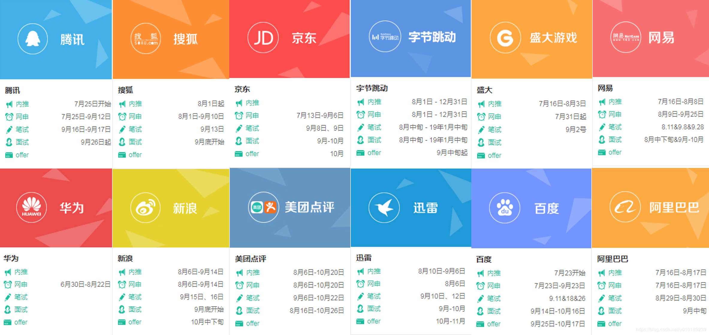

# 其他

##### 模板1

我是xxx，就读于xxxx，到目前为止，在一家公司有xxx的 java 后端开发实习经验，在公司主要参与过两个项目，并且在此期间，熟练的掌握了 Java基础、像多线程、锁机制、JVM、MySQL索引、事务，Redis，以及BIO，NIO等网络IO相关的一些内容，以及Spring全家桶的一些基础知识，和一些主流的框架，平时自己也研究过分布式集群下的一些解决方案，LVS负载均衡，Zookeeper，k8s之类的，有一些了解。因为项目规模不是很大，所以也机会接触到线上的 Linux 服务器，管理过一段时间，在这个期间还是得到了很多的锻炼，有很多的心得体会。 但是毕竟不是一家互联网公司，很多平台都是公司内部使用，我希望可以在互联网背景的公司或大一些的公司，开阔视野，提升自己的能力。面试官，我的自我介绍就是这些，你看有什么问我的。

##### 为什么选择使用某种技术？

- 性能上，有没有做过对比？
- 通俗的角度，它更常用一些...

##### 你不会的问题怎么回答？

- 这个我就没有再深入的去了解了，只知道它可以做到这个程度
- 我了解的不是很深，说一下我知道的吧
- 我没有用过xxx，但是我知道xxx（另一个）

##### 让你聊一下某个技术？

关于 xxx，它经常会使用在 xxx（使用场景），然后聊一下它的底层原理

**理想中的工作？**

**为什么选择xxx？**

1、广阔平台：提升自己的能力与价值

“大平台具有更完善的人才培养机制和技术基础设施，很重视技术人才的培养，在研发方面投入很多。应届生会更有机会接触到更核心、更为复杂和更具有挑战性的业务场景，有更多和业界大牛接触学习的机会。在这种环境下，自身的技术水平会在短时间内快速提升，而快节奏的工作，对自己处理和应对问题的能力也是一个很好的历练。更重要的是，和优秀的人共事，可以学习到他们做事的方法和习惯，看待问题的深度和广度，沟通技巧等等，这些都会让自己受益匪浅。”

2、基于现有资源，给你机会创造并擦出新的火花

我是软件工程专业的，比较喜欢互联网，感觉相对来说互联网公司会更有活力。这个行业的发展要比传统行业快很多，总是会创新很多先进的技术和概念。而客户端本身是比较贴近业务的，做的东西是能被用户看到的。我当时求职的时候，拼多多的用户量已经挺大了，身边挺多人在用。那时候就觉得如果可以加入拼多多，在增加自己阅历和能力的同时，能做真正有价值的、比较核心的事，能让亿级用户看到我的工作成果，会特别的有成就感。”

3、和同龄人一起拼的精神很关键

“拼搏，尤其是前几年的拼搏很重要，该拼就得拼。校招生刚毕业，一切都是从头开始，所以不管是以后的职业发展，还是生活的物质基础，都需要前期的努力做铺垫。拼多多年轻的开发很多，大家都想要做得更好，自然就会想要多花时间。和这么多优秀的同龄人一起工作，首先是沟通压力会比较小，没有代沟。在工作中遇到问题大家都会很热情的帮忙，还有可靠的大牛指导。”

4、成功的奥秘在于目标坚定

“我大概实习一周的时候就接到一个项目，要负责一个召回项目。刚接到项目的时候压力特别大，一方面是我自己对工作用的一些工具，和各个模块的理解和熟悉度不够。还有是需要把自己过往学到的知识和技术，跟实际工作相结合并获得产出，这也是挑战性比较大的事情。以前在学校比较多的是理论和实验，但在工作中要结合实际情况考虑数据量、业务特点等，会需要考虑更多东西。 但师傅和团队都给了我足够的信任和支持。当时觉得既然大家相信并且愿意把事情交给我，那就一定要完成。所以给自己定了个目标，在遇到困难的时候会想着自己的目标，想尽办法去解决问题。最终项目收益还不错，上线成为了我们广告系统的一个模块，在广告展示系统的第一环上保证了展示商品，以及广告的精确性和多样性。”

5、始终面向未来寻找机会

“从技术角度来讲，电商行业的高用户量，各种高并发场景是其他行业所没有的。拼多多的用户量达亿级，流量很大，尤其是大促活动的瞬间QPS很高。需要采取比如缓存、负载均衡和数据库优化等等一系列的措施来支撑高并发的场景，也需要比如熔断限流、容灾备份等机制来保证系统的稳定性。 公司的迅速发展，意味着有更多的机遇。而随着各种需求越来越多，公司服务的人越来越多，需要面临的行业技术挑战也会更多。我觉得这样的过程对于我个人技术的成长会有很大的促进作用，而且跟随着这样一家公司一起成长，对于我来说也是一件很有意义的事。”

6、从简单了解到深度使用，学到的知识被盘活

“小组和大组内会不定期进行技术分享会，在技术分享会上，可以学习到一些新的解决方案，了解前沿新兴技术，拓展自己知识面的广度和深度。另外，身边的同事技术实力雄厚，除了有丰富的经验和深度的知识外，还拥有较高的视野，教会我从这个系统或整个业务的层面看待手中的需求。从简单的了解知识到深度使用知识，在学校里学到的知识被盘活。”

学习成绩，专业排名

家庭情况，求职意向地，家里人意见

**最有成就感的一件事情，为什么？你是怎么做的才让最后有这样的成就感**

所谓成就感，无非是通过自己的努力全心全意去做一件别人认为不可思议的事情。

1、你的兴趣点。
坚持做一件平凡的事情，首先需要的是兴趣，即使你的执行力很牛，但是没有兴趣做导向，终有一天你会被无趣的石子绊倒。HR希望这个问题了解到你的兴趣到底在哪，是学习、社交、运动还是赚钱等等。
2、你满足感的基点。
这点涉及到野心的问题。怎么样就能使你有满足感？拿奖学金举例子吧，有的人，拿了一次三等奖就觉得非常满足，有的人则是没有拿够8次一等奖都没有兴奋点。你觉得哪个人更能获得HR的芳心呢？
3、你的自我评价。
所谓的自我评价，是需要摸着自己良心说的，有些人明明做得很少却喜欢无边地吹嘘，有些人做得很多却不懂阐述。实际上自我评价可以让自己表现得更加积极，会有企业不喜欢积极的人吗？

意向薪资，答普遍水平就好，问普遍水平是什么价位？就...随便说了一个，没有很有概念。

为什么选择拼多多？也是随便答了一下，就说了一两句，应该多说一点的。

##### 手头有没有其他的offer或者进行中的？拼多多会在意向offer中排第几？

目前还在面试初期，有两家公司在谈，还没有发书面offer

如果真的是面试了很多家都没有拿到offer，不要直接跟面试官“坦白”，很容易被认为是个人能力的原因，因此这个时候回答刚刚开始面试时最合适的答案。

表示自己对于加入所面试公司的渴望和热情。面试中求职者的态度非常重要，不要说谎，也不要夸夸其谈，表达出自己目前的求职状态以及对于公司的憧憬即可，点到为止，给自己之后谈薪等等环节留出余地。

最后问有没有什么想问的？

作者：～微澜......
链接：https://www.nowcoder.com/discuss/226035?type=all&order=time&pos=&page=1&channel=1013&source_id=search_all
来源：牛客网

1.知道你报的是拼多多什么岗位吗？ 

  2.你为什么报拼多多？ 

  3.你为什么想来上海？为什么选择上海？ 

  3.你的本硕专业都与这个无关，为什么要报数据分析这个岗位？ 

  4.你认为数据分析岗如何在拼多多这个企业里发挥作用？ 

  5.你还投了其他企业吗？有其他正在进程中的面试吗？ 

  6.你认为自己相对于别人来说，突出的3个优点和3个缺点？ 

  这个问题想的太久了，而且还是3个缺点😂  

  7.你理想中的薪酬大概是多少？ 

  8.你是明年6月份毕业，这期间你有时间过来实习吗？

  2⃣️简历项目深挖 

  1.介绍一下你的项目经历 

  2.第二个项目为什么对这几个产品进行竞品分析，你的目的？ 

  3.作为新成员如何融入团队？ 

  4.如何快速熟悉业务，推进项目？ 

  5.你觉得你是想法比较多，还是落实能力比较强 

  6.失败经历 

  7.相比于其他竞争者你的优势，你的缺点 

  8.你的问题？ 

  我问了我和岗位的匹配程度？ 

  面试官说我挺匹配的怎么怎么，但是我相对于其他人没有实习经历这个是很大一个短板。

hr面：（20min）

android or ios

为什么来上海

有男朋友吗

父母支持来上海吗

投了别家吗

研究生研究啥的

最近在忙什么，有做什么项目吗

对pdd了解吗

有什么想问的吗

### 并发和并行的区别？

并发指任务提交，并行指任务执行；

并行是多个CPU同时处理，并发是多个任务同时过来；

并行是并发的子集。

### CAP 原理

### Paxos 协议

### 大厂校招时间

- 精通Java核心，熟悉JDK中各种集合，队列，锁机制，多线程，高并发相关底层结构及原理
- 熟悉各种GC，各种垃圾回收算法，有JVM调优经验
- 精通NIO相关的常见IO模型以及优化策略
- 熟悉常用的数据结构与算法，熟悉常用的设计模式
- 熟悉LVS、Nginx负载均衡策略及原理
- 熟悉Redis内存模型，Redis缓存常见问题 
- 熟悉MySQL的存储引擎，索引、事务原理
- 熟悉SpringBoot框架
- 熟悉分布式系统设计方案和原理，熟悉Zookeeper分布式协调框架
- 熟悉Linux常用命令，了解Linux内核设计原理
- 有GitLab + Jenkins项目自动构建、自动部署经验；对docker，kubernetes有一定的了解
- 了解分布式系统AKF拆分原则，CAP定理，Paxos协议
- 了解集群下的并发解决方案，采用Nginx，LVS，KeepAlive，支持HA高可用

