# Maven
### 什么是Maven
目前无论使用IDEA还是Eclipse等其他IDE，使用里面ANT工具。ANT工具帮助我们进行编译，打包运行等工作。Apache基于ANT进行了升级，研发出了全新的自动化构建工具Maven。Maven是Apache的一款开源的项目管理工具。以后无论是普通javase项目还是javaee项目，我们都创建的是Maven项目。

Maven使用项目对象模型(POM-Project Object Model,项目对象模型)的概念,可以通过一小段描述信息来管理项目的构建，报告和文档的软件项目管理工具。在Maven中每个项目都相当于是一个对象，对象（项目）和对象（项目）之间是有关系的。关系包含了：依赖、继承、聚合，实现Maven项目可以更加方便的实现导jar包、拆分项目等效果。


## Maven的下载目录结构、IDEA整合Maven

##### 【1】IDEA默认整合了Maven：

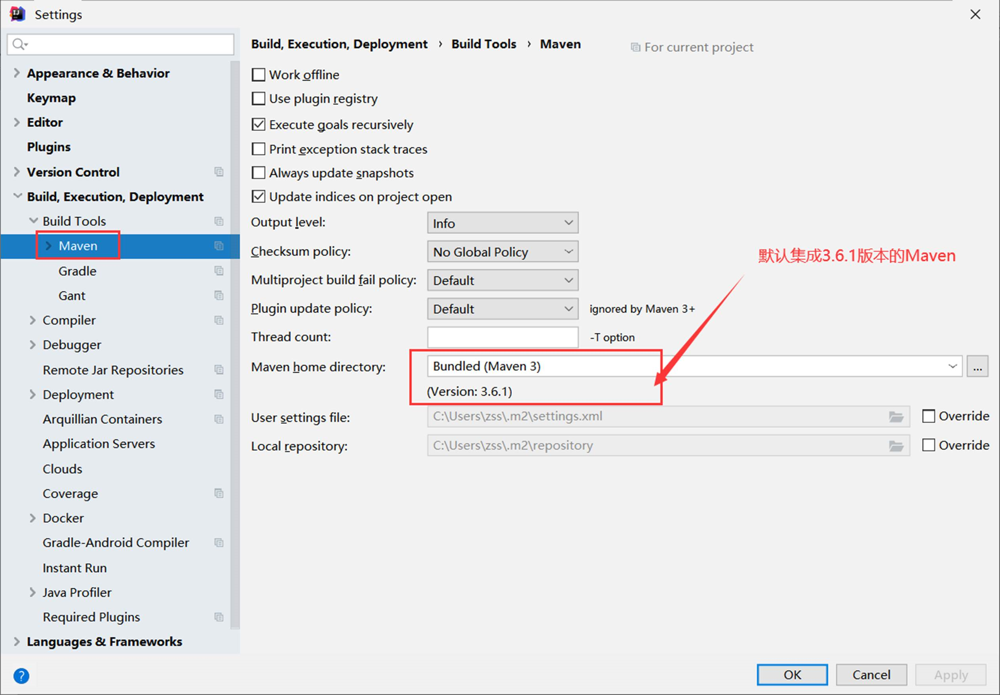

##### 【2】下载地址：

http://maven.apache.org/

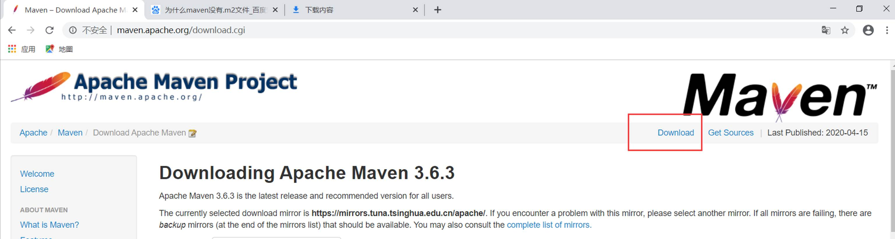

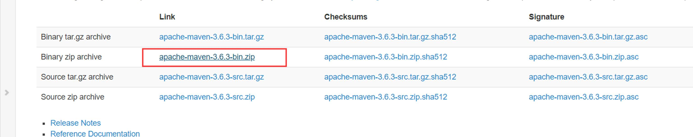


##### 【3】目录结构：

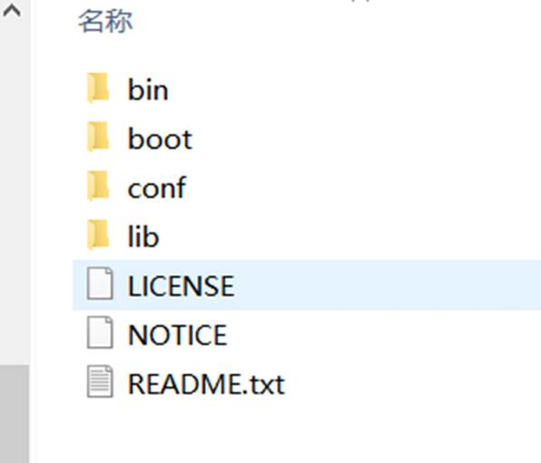

bin：存放的是执行文件，命令 
在IDEA中可以直接集成Maven:

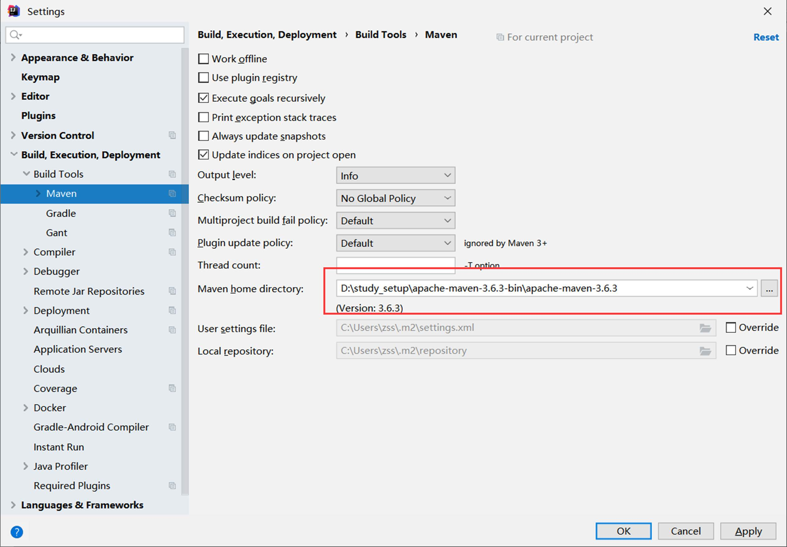

conf目录：下面有一个非常重要的配置文件--> settings.xml ---> maven的核心配置文件/全局配置文件。

##### 【4】如果没有.m2目录 ，自己手动执行mvn命令：

mvn help:system


## Maven仓库
Maven仓库是基于简单文件系统存储的，集中化管理Java API资源（构件）的一个服务。

仓库中的任何一个构件都有其唯一的坐标，根据这个坐标可以定义其在仓库中的唯一存储路径。得益于 Maven 的坐标机制，任何 Maven项目使用任何一个构件的方式都是完全相同的。

Maven 可以在某个位置统一存储所有的 Maven 项目共享的构件，这个统一的位置就是仓库，项目构建完毕后生成的构件也可以安装或者部署到仓库中，供其它项目使用。

对于Maven来说，仓库分为两类：本地仓库、远程仓库。

##### 远程仓库
不在本机中的一切仓库，都是远程仓库：分为 **中央仓库** 和 **本地私服仓库**

远程仓库指通过各种协议如file://和http://访问的其它类型的仓库。这些仓库可能是第三方搭建的真实的远程仓库，用来提供他们的构件下载（例如repo.maven.apache.org和uk.maven.org是Maven的中央仓库）。其它“远程”仓库可能是你的公司拥有的建立在文件或HTTP服务器上的内部仓库(不是Apache的那个中央仓库，而是你们公司的私服，你们自己在局域网搭建的maven仓库)，用来在开发团队间共享私有构件和管理发布的。

默认的远程仓库使用的Apache提供的中央仓库：
https://mvnrepository.com/

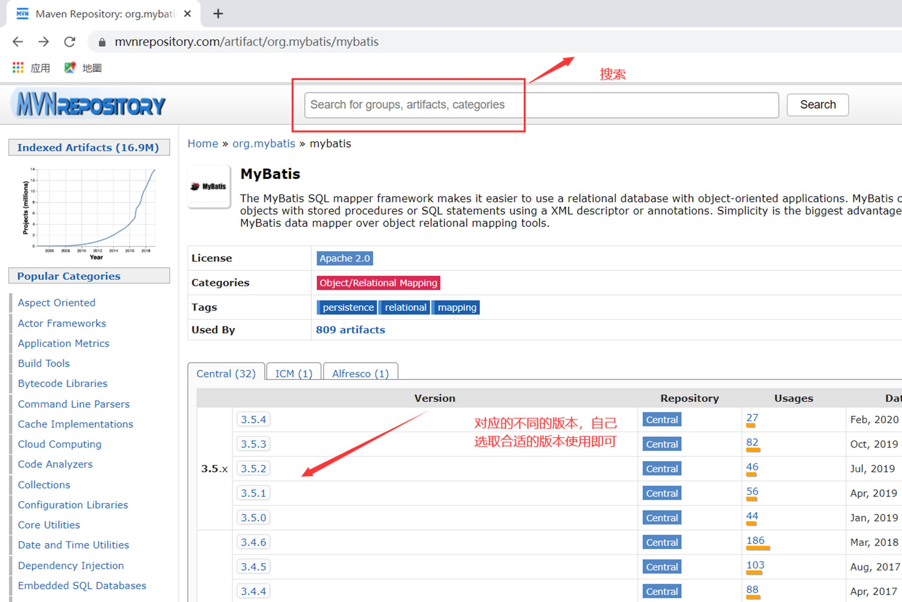

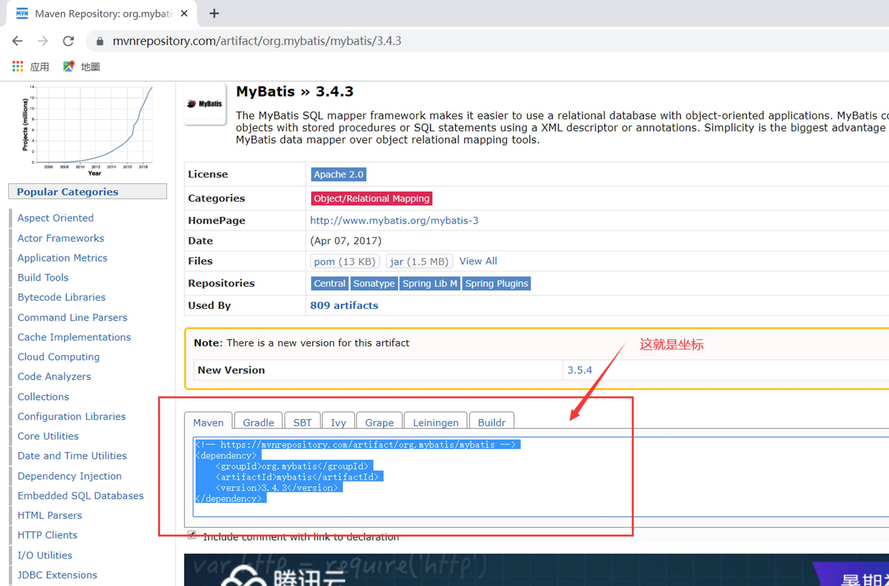


##### 本地仓库
本地仓库指本机的一份拷贝，用来缓存远程下载，包含你尚未发布的临时构件。


### 仓库配置

#### 在settings.xml文件中配置本地仓库
本地仓库是开发者本地电脑中的一个目录，用于缓存从远程仓库下载的构件。默认的本地仓库是${user.home}/.m2/repository。用户可使用settings.xml文件修改本地仓库。具体内容如下：
```xml
<?xml  version="1.0" encoding="UTF-8"?>
<settings
    xmlns="http://maven.apache.org/SETTINGS/1.0.0"
    xmlns:xsi="http://www.w3.org/2001/XMLSchema-instance" xsi:schemaLocation="http://maven.apache.org/SETTINGS/1.0.0  http://maven.apache.org/xsd/settings-1.0.0.xsd">
    <!-- 本地仓库配置 -->
    <localRepository>具体本地仓库位置</localRepository>
    <!-- 省略，具体信息参考后续内容。 -->
</settings>   
```
#### 在settings.xml文件中配置镜像仓库
如果仓库A可以提供仓库B存储的所有内容，那么就可以认为A是B的一个镜像。例如：在国内直接连接中央仓库下载依赖，由于一些特殊原因下载速度非常慢。这时，我们可以使用阿里云提供的镜像http://maven.aliyun.com/nexus/content/groups/public/来替换中央仓库http://repol.maven.org/maven2/。修改maven的setting.xml文件，具体内容如下：
```xml
<mirror>
    <!-- 指定镜像ID（可自己改名） -->
    <id>nexus-aliyun</id>
    <!-- 匹配中央仓库（阿里云的仓库名称，不可以自己起名，必须这么写）-->
    <mirrorOf>central</mirrorOf>
    <!-- 指定镜像名称（可自己改名）   -->
    <name>Nexus  aliyun</name>
    <!-- 指定镜像路径（镜像地址） -->
    <url>http://maven.aliyun.com/nexus/content/groups/public</url>
</mirror>   
```

#### 仓库优先级问题
优先级别：


## JDK的配置

当你的idea中有多个jdk的时候，就需要指定你编译和运行的jdk。在settings.xml中配置：
 ```xml
 <profile>
    <!-- settings.xml中的id不能随便起的 -->
    <!-- 告诉maven我们用jdk1.8 -->
    <id>jdk-1.8</id>
    <!-- 开启JDK的使用 -->
    <activation>
        <activeByDefault>true</activeByDefault>
        <jdk>1.8</jdk>
    </activation>
    <properties>
        <!-- 配置编译器信息 -->
        <maven.compiler.source>1.8</maven.compiler.source>
        <maven.compiler.target>1.8</maven.compiler.target>
        <maven.compiler.compilerVersion>1.8</maven.compiler.compilerVersion>
    </properties>
</profile>
 ```

配置的前提是，你的idea中要有1.8的jdk

##### 总结：

在settings.xml中：配置了三个信息：

【1】本地仓库

【2】镜像仓库

【3】JDK


## Maven工程类型
##### 【1】POM工程

POM工程是逻辑工程。用在父级工程或聚合工程中。用来做jar包的版本控制。

##### 【2】JAR工程

将会打包成jar，用作jar包使用。即常见的本地工程 ---> Java Project。

##### 【3】WAR工程

将会打包成war，发布在服务器上的工程。


## 在IDEA中创建Maven工程

##### 【1】过程：

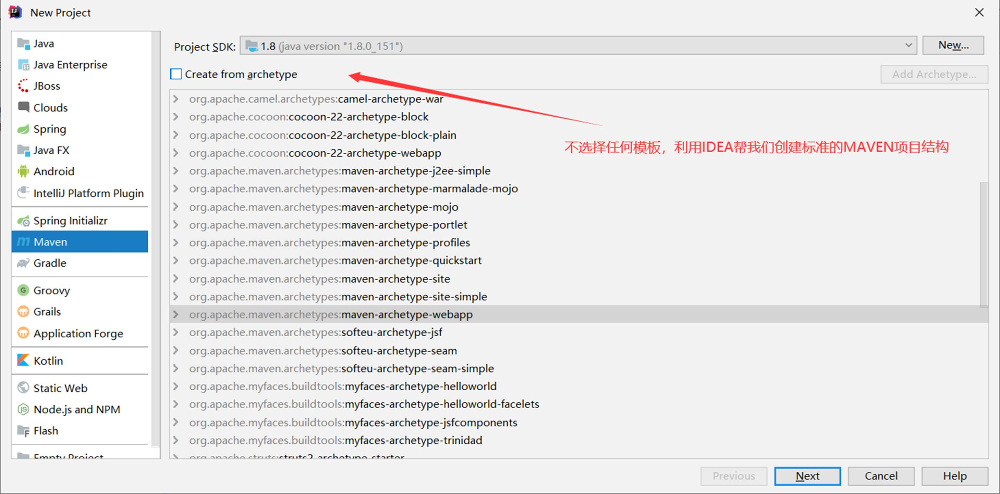


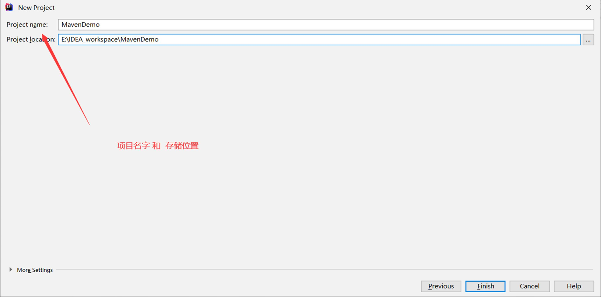


标准目录结构：

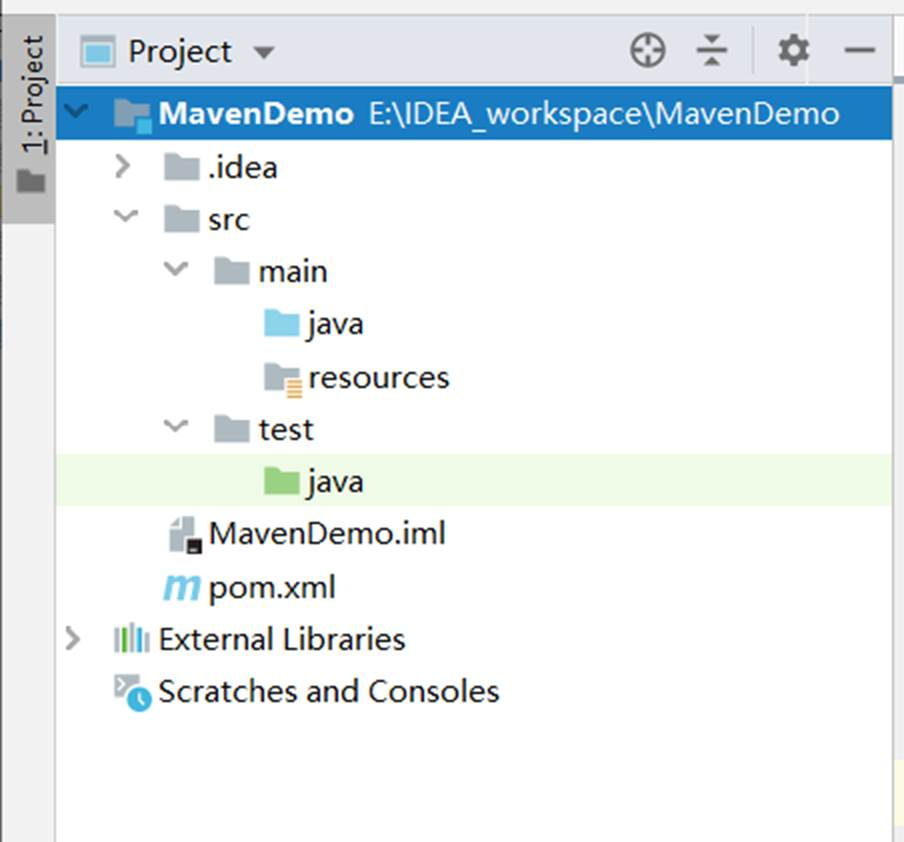


## Maven项目结构
标准目录结构：


##### ❀src/main/java 

这个目录下储存java源代码

##### ❀src/main/resources

储存主要的资源文件。比如xml配置文件和properties文件

##### ❀src/test/java

储存测试用的类，比如JUNIT的测试一般就放在这个目录下面
因为测试类本身实际是不属于项目的，所以放在任何一个包下都显得很尴尬，所以maven专门创建了一个测试包
用于存放测试的类

##### ❀src/test/resources

可以自己创建你，储存测试环境用的资源文件

##### ❀src

包含了项目所有的源代码和资源文件，以及其他项目相关的文件。

##### ❀target

编译后内容放置的文件夹 

##### ❀pom.xml

是Maven的基础配置文件。配置项目和项目之间关系，包括配置依赖关系等等

##### 目录结构图：

--MavenDemo 项目名    

--.idea 项目的配置，自动生成的，无需关注。    

--src     

--main 实际开发内容          

--java 写包和java代码，此文件默认只编译.java文件          

--resource 所有配置文件。最终编译把配置文件放入到classpath中。     

-- test 测试时使用，自己写测试类或junit工具等         

--java 储存测试用的类     

pom.xml 整个maven项目所有配置内容。

##### 注意：

目录名字不可以随便改，因为maven进行编译或者jar包生成操作的时候，是根据这个目录结构来找的，你若轻易动，那么就找不到了。


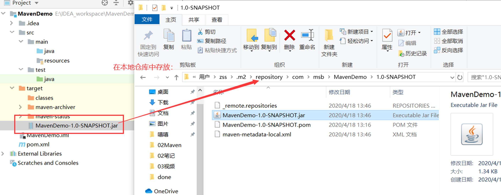


## POM模式-Maven工程关系
Maven工具基于POM（Project Object Model，项目对象模型）模式实现的。在Maven中每个项目都相当于是一个对象，对象（项目）和对象（项目）之间是有关系的。关系包含了：依赖、继承、聚合，实现Maven项目可以更加方便的实现导jar包、拆分项目等效果。
### 依赖关系
##### 【1】依赖关系：

即A工程开发或运行过程中需要B工程提供支持，则代表A工程依赖B工程。
在这种情况下，需要在A项目的pom.xml文件中增加下属配置定义依赖关系。

通俗理解：就是导jar包。
B工程可以是自己的项目打包后的jar包，也可以是中央仓库的jar包。

##### 【2】如何注入依赖呢？

在pom.xml文件 根元素project下的 dependencies标签中，配置依赖信息，内可以包含多个 dependence元素，以声明多个依赖。每个依赖dependence标签都应该包含以下元素：groupId, artifactId, version : 依赖的基本坐标， 对于任何一个依赖来说，基本坐标是最重要的， Maven根据坐标才能找到需要的依赖。

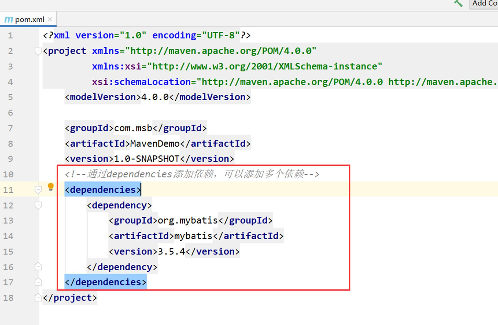

##### 【3】依赖的好处：

省去了程序员手动添加jar包的操作，省事！！

可以帮我们解决jar包冲突问题：


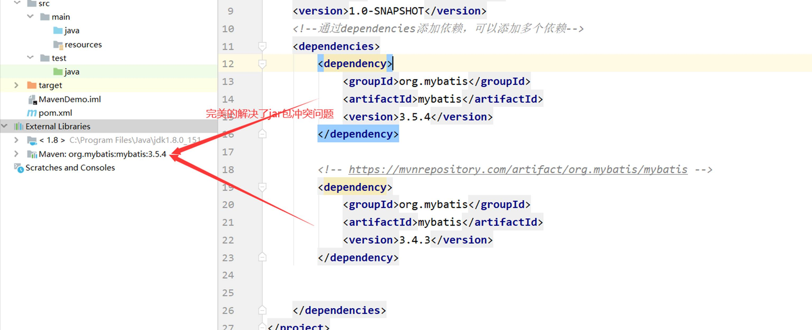


#### 特性_依赖的传递性
传递性依赖是Maven2.0的新特性。假设你的项目依赖于一个库，而这个库又依赖于其他库。你不必自己去找出所有这些依赖，你只需要加上你直接依赖的库，Maven会隐式的把这些库间接依赖的库也加入到你的项目中。这个特性是靠解析从远程仓库中获取的依赖库的项目文件实现的。一般的，这些项目的所有依赖都会加入到项目中，或者从父项目继承，或者通过传递性依赖。
如果A依赖了B，那么C依赖A时会自动把A和B都导入进来。


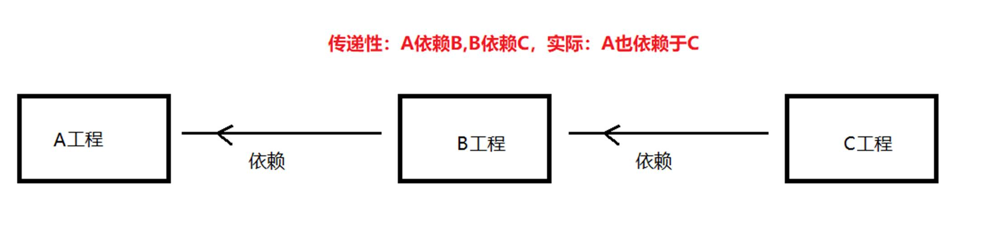

创建A项目后，选择IDEA最右侧Maven面板lifecycle，双击install后就会把项目安装到本地仓库中，其他项目就可以通过坐标引用此项目。

##### 案例：

项目1：MavenDemo项目依赖了Mybatis的内容：

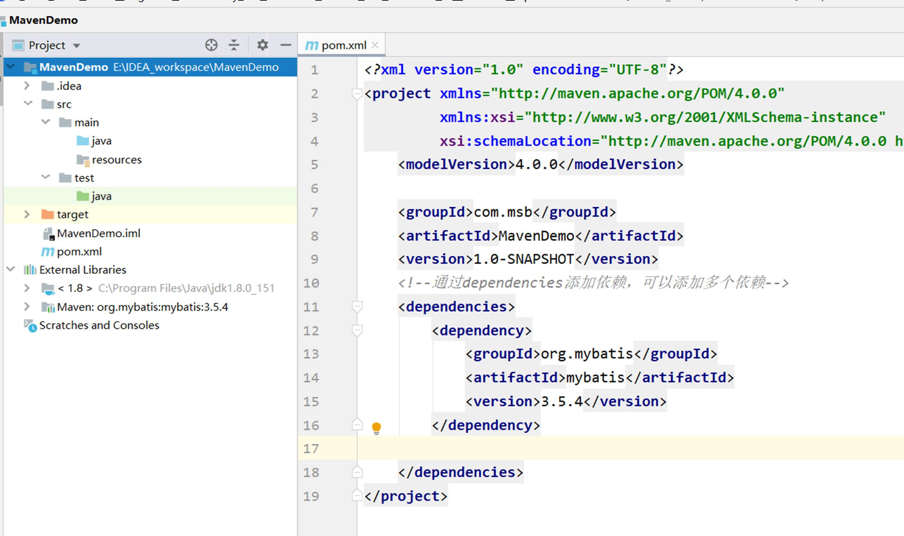

注意：请将项目1打包为jar包---》重新打包
再创建项目2：让项目2依赖项目1：

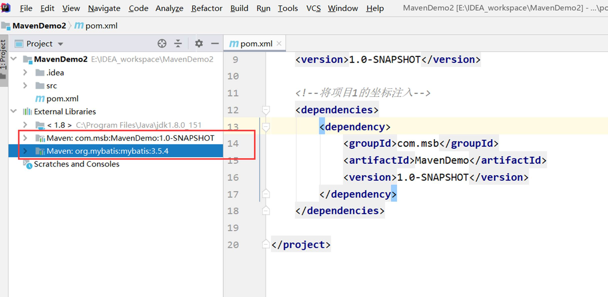

从上面可以证明：项目2依赖项目1，项目1依赖Mybatis工程，--》传递性---》项目2可以直接使用Mybatis工程

#### 原则：两个原则
##### 【1】第一原则：最短路径优先原则

“最短路径优先”意味着项目依赖关系树中路径最短的版本会被使用。
例如，假设A、B、C之间的依赖关系是A->B->C->D(2.0) 和A->E->(D1.0)，那么D(1.0)会被使用，因为A通过E到D的路径更短。

##### 【2】第二原则：最先声明原则

依赖路径长度是一样的的时候，第一原则不能解决所有问题，比如这样的依赖关系：A–>B–>Y(1.0)，A–>C–>Y(2.0)，Y(1.0)和Y(2.0)的依赖路径长度是一样的，都为2。那么到底谁会被解析使用呢？在maven2.0.8及之前的版本中，这是不确定的，但是maven2.0.9开始，为了尽可能避免构建的不确定性，maven定义了依赖调解的第二原则：第一声明者优先。在依赖路径长度相等的前提下，在POM中依赖声明的顺序决定了谁会被解析使用。顺序最靠前的那个依赖优胜。

#### 排除依赖
exclusions： 用来排除传递性依赖 其中可配置多个exclusion标签，每个exclusion标签里面对应的有groupId, artifactId, version三项基本元素。注意：不用写版本号。

比如：A--->B--->C (Mybatis.jar) 排除C中的Mybatis.jar  

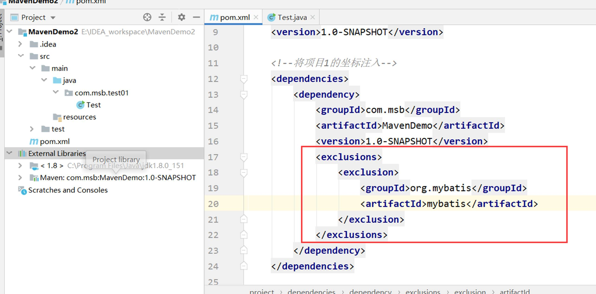


#### 依赖范围（重要！）

依赖范围就决定了你依赖的坐标 在什么情况下有效，什么情况下无效：

##### ❀compile

这是默认范围。如果没有指定，就会使用该依赖范围。表示该依赖在编译和运行时都生效。

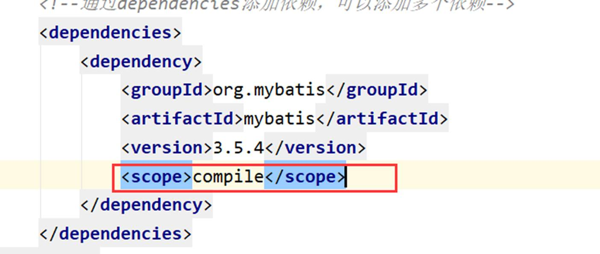


##### ❀provided（重要）

已提供依赖范围。使用此依赖范围的Maven依赖。典型的例子是servlet-api，编译和测试项目的时候需要该依赖，但在运行项目的时候，由于容器已经提供，就不需要Maven重复地引入一遍(如：servlet-api，例如tomcat)

##### ❀runtime

runtime范围表明编译时不需要生效，而只在运行时生效。典型的例子是JDBC驱动实现，项目主代码的编译只需要JDK提供的JDBC接口，只有在执行测试或者运行项目的时候才需要实现上述接口的具体JDBC驱动。

##### ❀system

系统范围与provided类似，不过你必须显式指定一个本地系统路径的JAR，此类依赖应该一直有效，Maven也不会去仓库中寻找它。但是，使用system范围依赖时必须通过systemPath元素显式地指定依赖文件的路径。

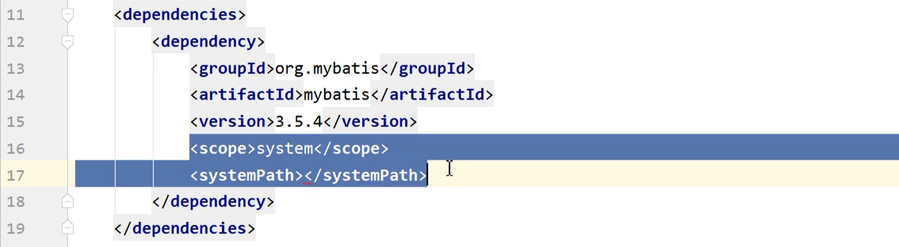

##### ❀test

test范围表明使用此依赖范围的依赖，只在编译测试代码和运行测试的时候需要，应用的正常运行不需要此类依赖。典型的例子就是JUnit，它只有在编译测试代码及运行测试的时候才需要。Junit的jar包就在测试阶段用就行了，你导出项目的时候没有必要把junit的东西到处去了就，所在在junit坐标下加入scope-test

##### ❀Import

> ##### 补充：dependencyManagement的使用
>
> 1. 作用：Maven中的dependencyManagement元素提供了一种管理依赖版本号的方式。在dependencyManagement元素中声明所依赖的jar包的版本号等信息，那么所有子项目再次引入此依赖jar包时则无需显式的列出版本号。Maven会沿着父子层级向上寻找拥有dependencyManagement 元素的项目，然后使用它指定的版本号。
>
>    如果有多个子项目都引用同一样依赖，则可以避免在每个使用的子项目里都声明一个版本号。当想升级或切换到另一个版本时，只需要在顶层父容器里更新，而不需要逐个修改子项目；另外如果某个子项目需要另外的一个版本，只需要声明version即可。
>
> 2. 注意：dependencyManagement中定义的只是依赖的声明，并不实现引入，因此子项目需要显式的声明需要用的依赖。

import范围只适用于pom文件中的<dependencyManagement>部分。表明指定的POM必须使用<dependencyManagement>部分的依赖。

注意：import只能用在dependencyManagement的scope里。

定义一个父工程 -->POM工程：

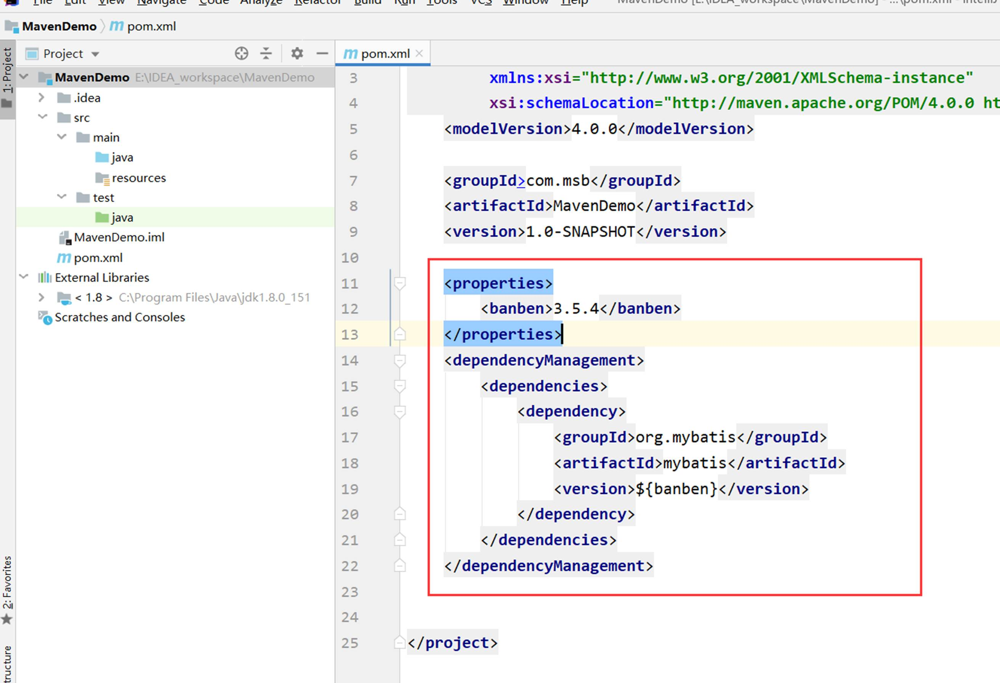

注意：工程1要 mvn install 打成自己的jar包，提供给子工程用

定义一个子工程：（里面写上父工程的坐标）

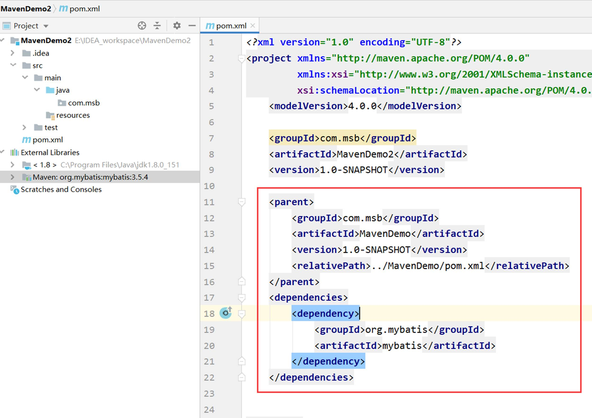

如果父工程中加入score-import，相当于强制的指定了版本号，子工程在引入父工程的时候，强制使用父工程的版本号，即子工程无法指定自己的版本号。

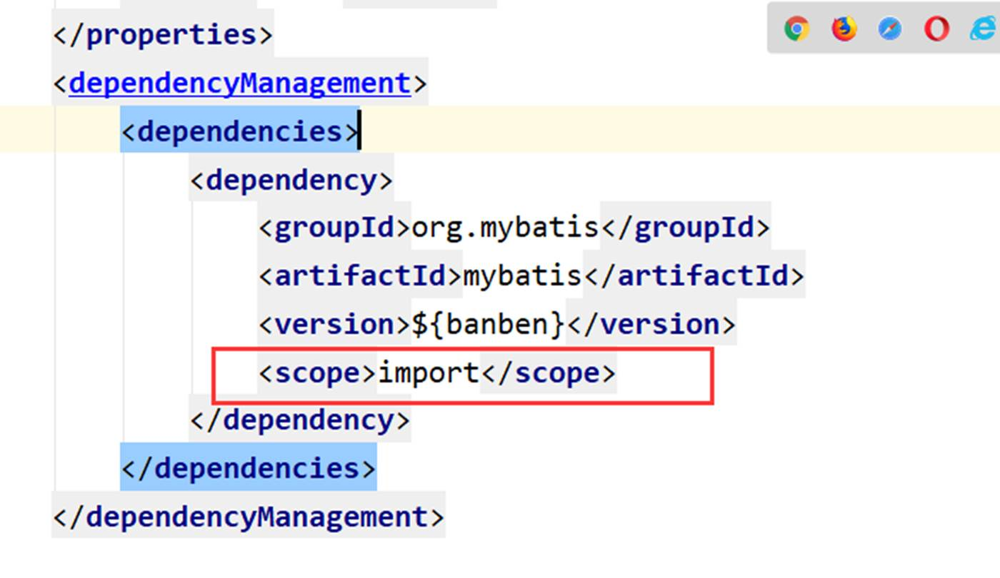

### 继承关系
如果A工程继承B工程，则代表A工程默认依赖B工程依赖的所有资源，且可以应用B工程中定义的所有资源信息。被继承的工程（B工程）只能是POM工程。

注意：在父项目中放在`<dependencyManagement>`中的内容时不被子项目继承，不可以直接使用

放在`<dependencyManagement>`中的内容主要目的是进行版本管理。里面的内容在子项目中依赖时坐标只需要填写`<group id>`和`<artifact id>`即可。（注意：如果子项目不希望使用父项目的版本，可以明确配置version）。

父工程是一个POM工程：

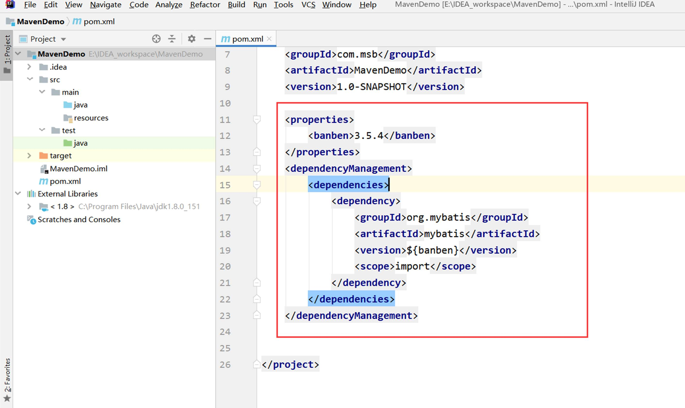


创建子工程：

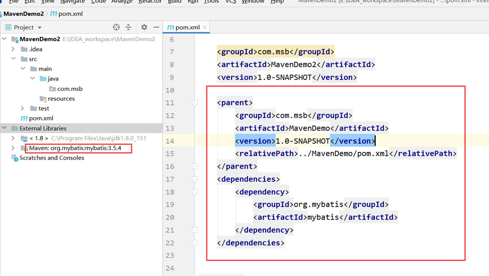

继承关系在本质上，是POM文件的继承

### 聚合关系
当我们开发的工程拥有2个以上模块的时候，每个模块都是一个独立的功能集合。比如某大学系统中拥有搜索平台，学习平台，考试平台等。开发的时候每个平台都可以独立编译，测试，运行。这个时候我们就需要一个聚合工程。

在创建聚合工程的过程中，总的工程必须是一个POM工程（Maven Project）（聚合项目必须是一个pom类型的项目，jar项目war项目是没有办法做聚合工程的），各子模块可以是任意类型模块（Maven Module）。

前提：继承。

聚合包含了继承的特性。

聚合时多个项目的本质还是一个项目。这些项目被一个大的父项目包含。且这时父项目类型为pom类型。同时在父项目的pom.xml中出现<modules>表示包含的所有子模块。

总项目：一般总项目：POM项目

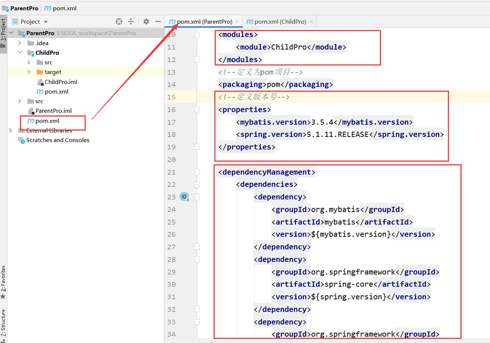

具体模块：

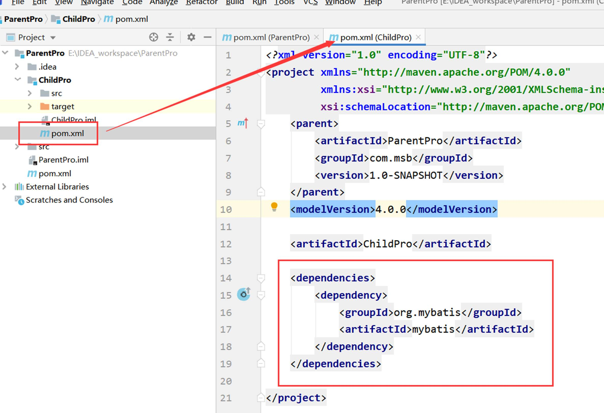


## Maven常见插件

#### 编译器插件
通过编译器插件，我们可以配置使用的JDK或者说编译器的版本：

##### 【1】 settings.xml文件中配置全局编译器插件：

找到profiles节点，在里面加入profile节点：

```xml
<profile>
    <!-- 定义的编译器插件ID，全局唯一，名字随便起 -->
    <id>jdk-1.7</id>
    <!-- 插件标记，activeByDefault ：true默认编译器，jdk提供编译器版本 -->
    <activation>
        <activeByDefault>true</activeByDefault>
        <jdk>1.7</jdk>
    </activation>
    <!-- 配置信息source-源信息，target-字节码信息，compilerVersion-编译过程版本 -->
    <properties>
        <maven.compiler.source>1.7</maven.compiler.source>
        <maven.compiler.target>1.7</maven.compiler.target>
        <maven.compiler.compilerVersion>1.7</maven.compiler.compilerVersion>
    </properties>
</profile> 
```

 

##### 【2】配置编译器插件：pom.xml配置片段
```xml
<!-- 配置maven的编译插件 -->
<build>
    <plugins>
        <!--JDK编译插件  -->
        <plugin>
            <!--插件坐标 -->
            <groupId>org.apache.maven.plugins</groupId>
            <artifactId>maven-compiler-plugin</artifactId>
            <version>3.2</version>
            <!-- -->
            <configuration>
                <!-- 源代码使用JDK版本-->
                <source>1.7</source>
                <!-- 源代码编译为class文件的版本，要保持跟上面版本一致-->
                <target>1.7</target>
                <encoding>UTF-8</encoding>
            </configuration>
        </plugin>
    </plugins>
</build>  
```


#### 资源拷贝插件
Maven在打包时默认只将src/main/resources里的配置文件拷贝到项目中并做打包处理，而非resource目录下的配置文件在打包时不会添加到项目中。

我们的配置文件，一般都放在：src/main/resources，然后打包后配置文件就会在target的classes下面放着：

测试：

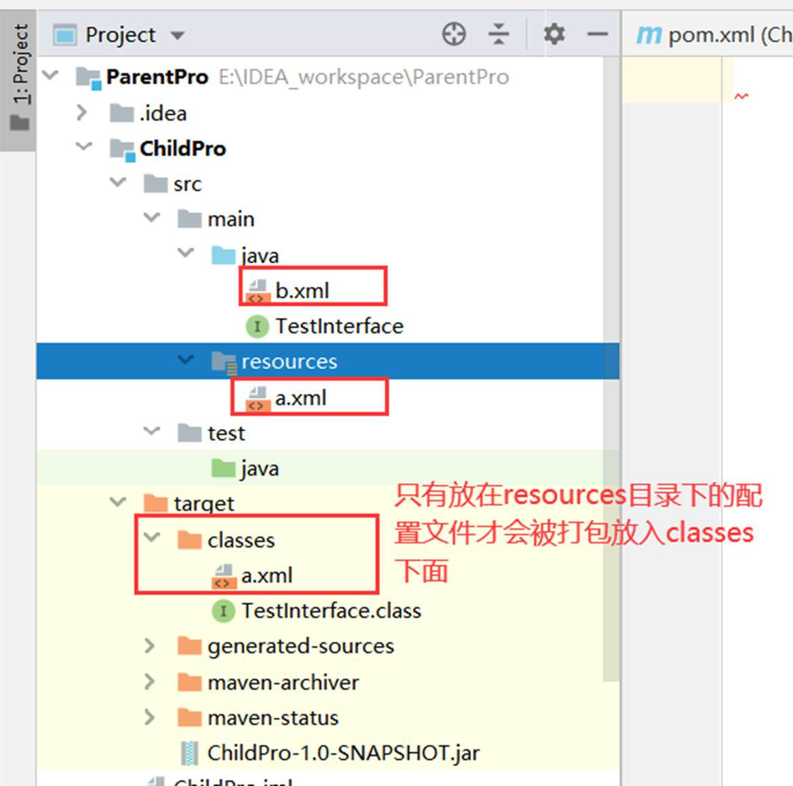


我现在想把非resources下面的文件也打包到classes下面，需要配置：
pom.xml配置片段：


```xml
<build>
    <resources>
        <resource>
            <directory>src/main/java</directory>
            <includes>
                <include>**/*.xml</include>
            </includes>
        </resource>
        <resource>
            <directory>src/main/resources</directory>
            <includes>
                <include>**/*.xml</include>
                <include>**/*.properties</include>
            </includes>
        </resource>
    </resources>
</build> 
```


配置好以后，那么你设置的位置下的配置文件都会被打包了：

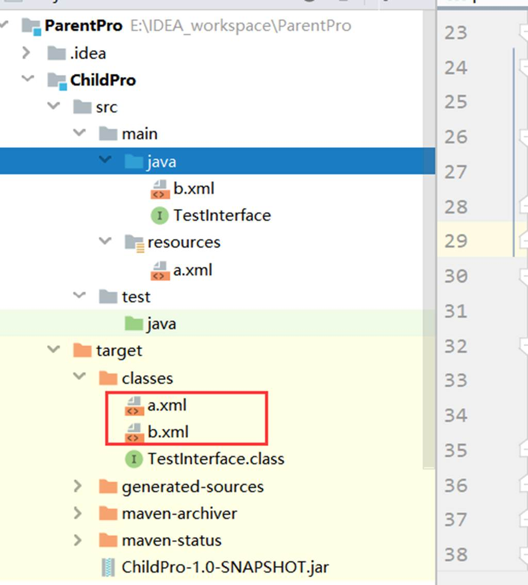

#### tomcat 插件
我们如果创建war项目，必然要部署在服务器上，方式：

（1）部署在远程服务器上

（2）将IDEA和外部tomcat产生关联，然后将项目部署在外部tomcat上

现在学习一个新的方式，不再依赖外部的tomcat，maven提供了tomcat插件，我们可以配置来使用。

创建web项目(war项目)：

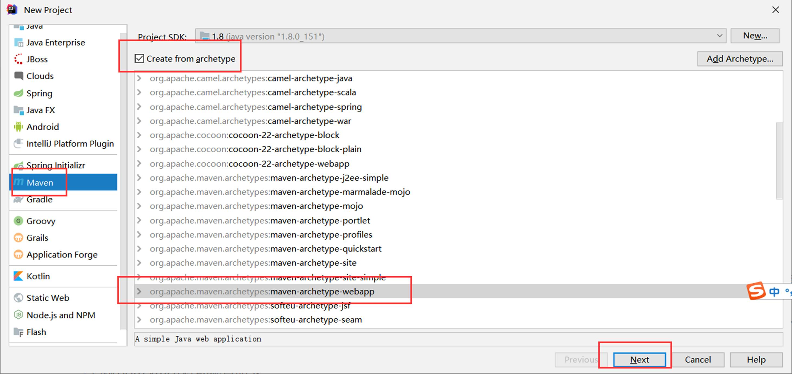


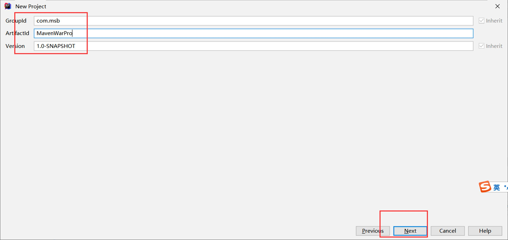


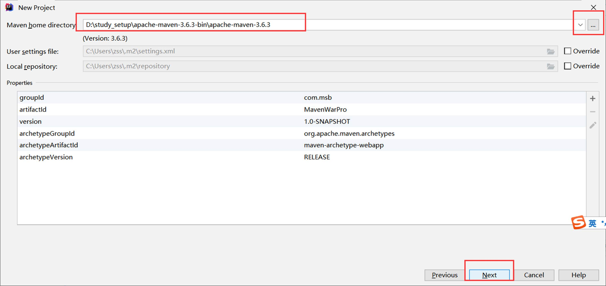


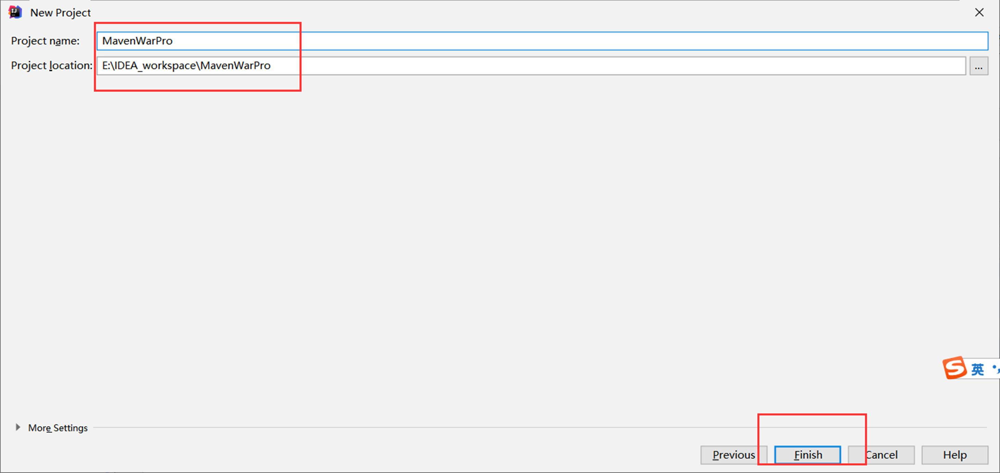


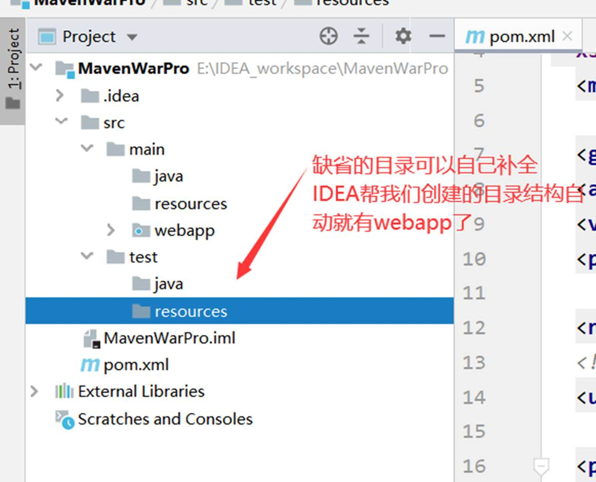


在index.jsp中随便写点东西：

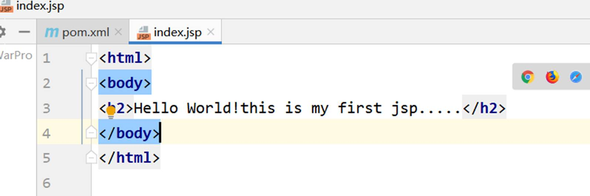


使用Tomcat插件发布部署并执行war工程的时候，需要使用启动命令，启动命令为： tomcat7:run。命令中的tomcat7是插件命名，由插件提供商决定。run为插件中的具体功能。
（注意：之前用的编译器插件，资源拷贝插件，不是可运行的插件，maven直接帮我们运行了，但是tomcat属于可运行插件，它什么时候工作需要程序员来控制，怎么控制呢？我们必须通过命令来运行控制）
具体pom.xml文件的配置如下：

```xml
<build>
    <plugins>
        <!-- 配置Tomcat插件 -->
        <plugin>
            <groupId>org.apache.tomcat.maven</groupId>
            <artifactId>tomcat7-maven-plugin</artifactId>
            <version>2.2</version>
            <configuration>
                <!-- 配置Tomcat监听端口 -->
                <port>8080</port>
                <!-- 配置项目的访问路径(Application Context) -->
                <path>/</path>
            </configuration>
        </plugin>
    </plugins>
</build>
```

右侧maven执行命令tomcat7:run：

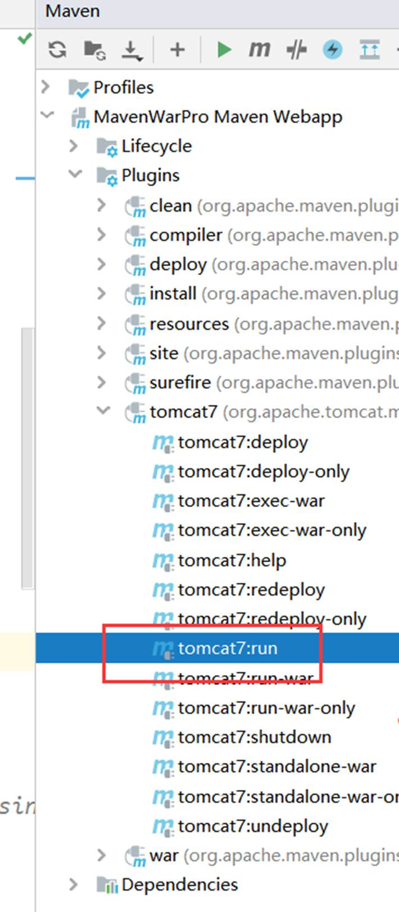

看到运行结果，显示tomcat启动成功：

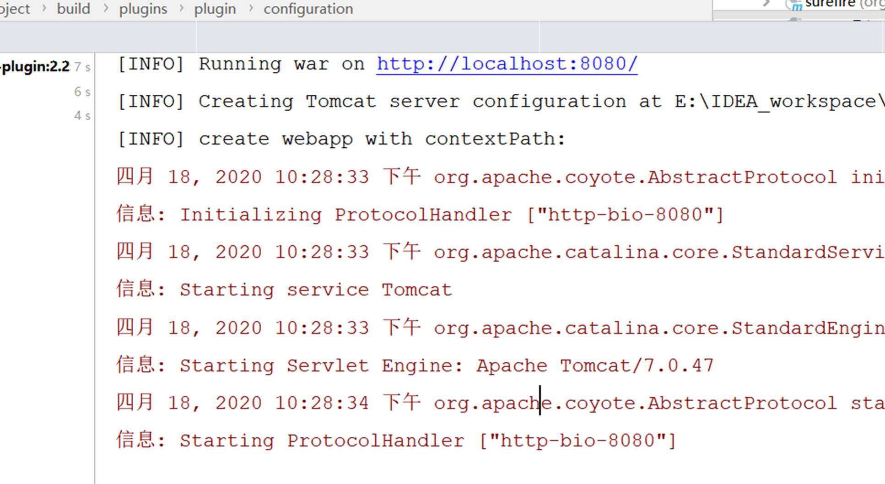

在浏览器中访问index.jsp页面：

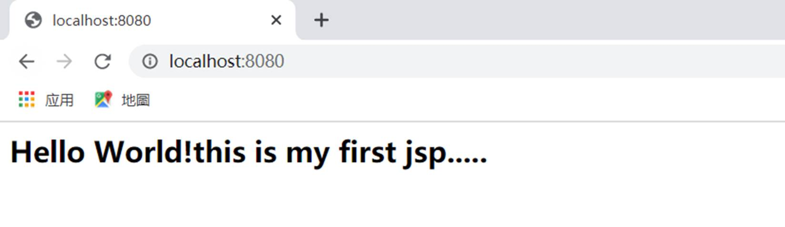


## Maven常见命令介绍

Maven的命令非常多，我们只是讲解常用的几个：（所有命令都可以在控制台运行的）
##### ❀ install
本地安装， 包含编译，打包，安装到本地仓库
编译 - javac
打包 - jar， 将java代码打包为jar文件
安装到本地仓库 - 将打包的jar文件，保存到本地仓库目录中。
##### ❀ clean
清除已编译信息。
删除工程中的target目录。

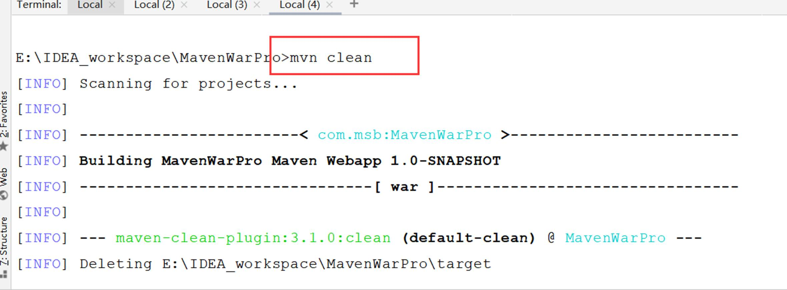

##### ❀ compile
只编译。 javac命令
##### ❀ package
打包。 包含编译，打包两个功能。


##### 注：install和package的区别

- package 命令完成了项目编译、单元测试、打包功能，但**没有**把打好的可执行jar包（war包或其它形式的包）布署到本地maven仓库和远程maven私服仓库

- install 命令完成了项目编译、单元测试、打包功能，同时把打好的可执行jar包（war包或其它形式的包）布署到本地maven仓库，但没有布署到远程maven私服仓库

