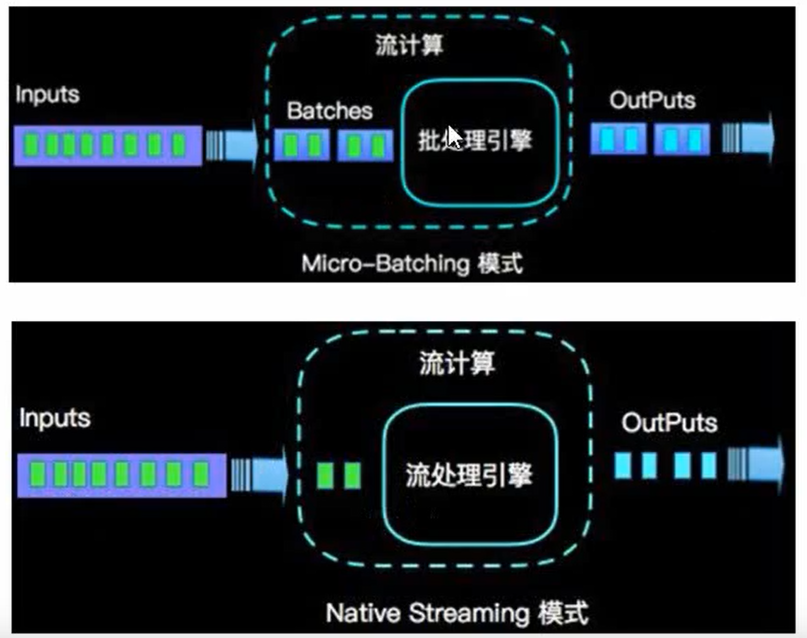
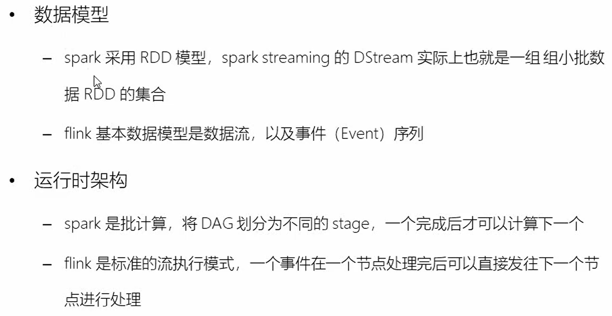
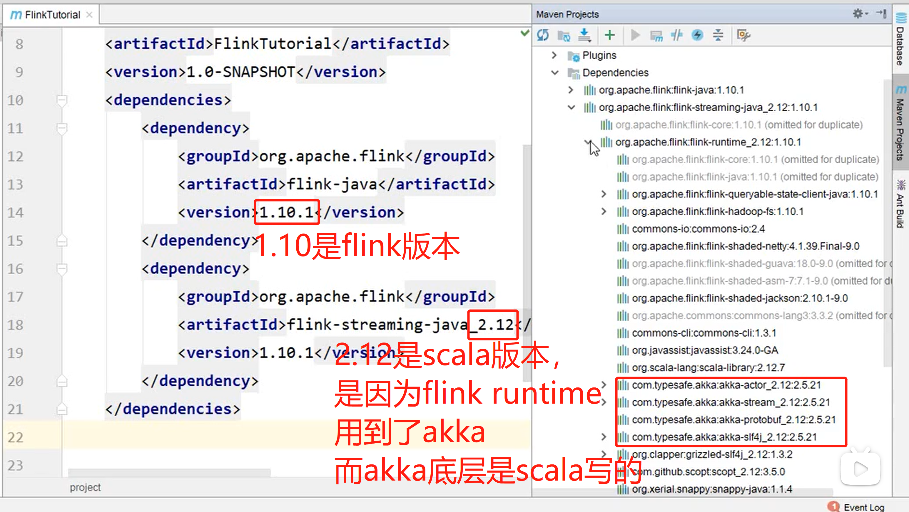
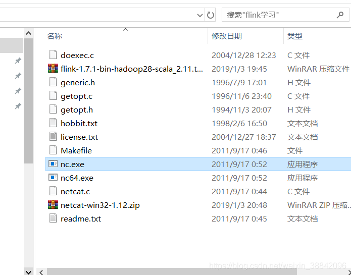
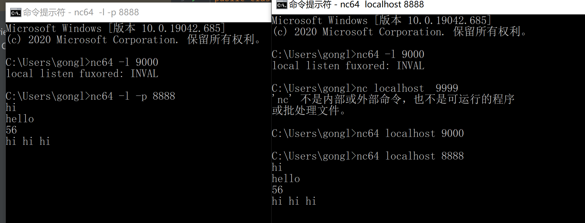

# Flink入门

### Flink vs Spark Streaming

- 流（stream）和微批（micro-batching）

  

  



### Flink的使用

pom中引入：





### Layered APIs（不同层面的API）

Flink provides three layered APIs. Each API offers a different trade-off between conciseness and expressiveness and targets different use cases.


We briefly present each API, discuss its applications, and show a code example.

### The ProcessFunctions

[ProcessFunctions](https://ci.apache.org/projects/flink/flink-docs-stable/dev/stream/operators/process_function.html) are the most expressive function interfaces that Flink offers. Flink provides ProcessFunctions to process individual events from one or two input streams or events that were grouped in a window. ProcessFunctions provide fine-grained control over time and state. A ProcessFunction can arbitrarily modify its state and register timers that will trigger a callback function in the future. Hence, ProcessFunctions can implement complex per-event business logic as required for many [stateful event-driven applications](https://flink.apache.org/usecases.html#eventDrivenApps).

The following example shows a `KeyedProcessFunction` that operates on a `KeyedStream` and matches `START` and `END` events. When a `START` event is received, the function remembers its timestamp in state and registers a timer in four hours. If an `END` event is received before the timer fires, the function computes the duration between `END` and `START` event, clears the state, and returns the value. Otherwise, the timer just fires and clears the state.

```java
/**
 * Matches keyed START and END events and computes the difference between 
 * both elements' timestamps. The first String field is the key attribute, 
 * the second String attribute marks START and END events.
 */
public static class StartEndDuration
    extends KeyedProcessFunction<String, Tuple2<String, String>, Tuple2<String, Long>> {

  private ValueState<Long> startTime;

  @Override
  public void open(Configuration conf) {
    // obtain state handle
    startTime = getRuntimeContext()
      .getState(new ValueStateDescriptor<Long>("startTime", Long.class));
  }

  /** Called for each processed event. */
  @Override
  public void processElement(
      Tuple2<String, String> in,
      Context ctx,
      Collector<Tuple2<String, Long>> out) throws Exception {

    switch (in.f1) {
      case "START":
        // set the start time if we receive a start event.
        startTime.update(ctx.timestamp());
        // register a timer in four hours from the start event.
        ctx.timerService()
          .registerEventTimeTimer(ctx.timestamp() + 4 * 60 * 60 * 1000);
        break;
      case "END":
        // emit the duration between start and end event
        Long sTime = startTime.value();
        if (sTime != null) {
          out.collect(Tuple2.of(in.f0, ctx.timestamp() - sTime));
          // clear the state
          startTime.clear();
        }
      default:
        // do nothing
    }
  }

  /** Called when a timer fires. */
  @Override
  public void onTimer(
      long timestamp,
      OnTimerContext ctx,
      Collector<Tuple2<String, Long>> out) {

    // Timeout interval exceeded. Cleaning up the state.
    startTime.clear();
  }
}
```

The example illustrates the expressive power of the `KeyedProcessFunction` but also highlights that it is a rather verbose interface.

### The DataStream API

The [DataStream API](https://ci.apache.org/projects/flink/flink-docs-stable/dev/datastream_api.html) provides primitives for many common stream processing operations, such as windowing, record-at-a-time transformations, and enriching events by querying an external data store. The DataStream API is available for Java and Scala and is based on functions, such as `map()`, `reduce()`, and `aggregate()`. Functions can be defined by extending interfaces or as Java or Scala lambda functions.

The following example shows how to sessionize a clickstream and **count the number of clicks per session**.

```java
// a stream of website clicks
DataStream<Click> clicks = ...

DataStream<Tuple2<String, Long>> result = clicks
  // project clicks to userId and add a 1 for counting
  .map(
    // define function by implementing the MapFunction interface.
    new MapFunction<Click, Tuple2<String, Long>>() {
      @Override
      public Tuple2<String, Long> map(Click click) {
        return Tuple2.of(click.userId, 1L);
      }
    })
  // key by userId (field 0)
  .keyBy(0)
  // define session window with 30 minute gap
  .window(EventTimeSessionWindows.withGap(Time.minutes(30L)))
  // count clicks per session. Define function as lambda function.
  .reduce((a, b) -> Tuple2.of(a.f0, a.f1 + b.f1));
```

### SQL & Table API

Flink features two relational APIs, the [Table API and SQL](https://ci.apache.org/projects/flink/flink-docs-stable/dev/table/index.html). Both APIs are unified APIs for batch and stream processing, i.e., queries are executed with the same semantics on unbounded, real-time streams or bounded, recorded streams and produce the same results. The Table API and SQL leverage [Apache Calcite](https://calcite.apache.org/) for parsing, validation, and query optimization. They can be seamlessly integrated with the DataStream and DataSet APIs and support user-defined scalar, aggregate, and table-valued functions.

Flink’s relational APIs are designed to ease the definition of [data analytics](https://flink.apache.org/usecases.html#analytics), [data pipelining, and ETL applications](https://flink.apache.org/usecases.html#pipelines).

The following example shows the SQL query to sessionize a clickstream and count the number of clicks per session. This is the same use case as in the example of the DataStream API.

```sql
SELECT userId, COUNT(*)
FROM clicks
GROUP BY SESSION(clicktime, INTERVAL '30' MINUTE), userId
```

## 


### 附：windows 使用 nc 命令

1. 下载netcat。下载地址：https://eternallybored.org/misc/netcat/

2. 解压文件

3. 把nc64.exe 复制到C:\Windows\System32的文件夹下（因为nc.exe被防病毒杀掉了，干脆用nc64.exe）

   

4. 进去黑窗口使用nc64




### Mac使用nc命令

```shell
nc -lk 8080
```


----


# Flink 性能调优指导


## [1.1 典型业务的调优](https://bbs.huaweicloud.com/forum/thread-70168-1-1.html#)

### [1.1.1 调优目标](https://bbs.huaweicloud.com/forum/thread-70168-1-1.html#)

Flink调优的目标是在不影响其他业务正常运行的前提下，高效的完成业务目标，通常为了达成该目标，一般需要最大限度利用集群的物理资源，如CPU、内存、磁盘IO，使其某一项达到瓶颈。

### [1.1.2 调优原则](https://bbs.huaweicloud.com/forum/thread-70168-1-1.html#)

\1.     提高CPU使用率同时减少额外性能开销。

调优方法：

a.     根据业务模型，设置合适的垃圾收集器，通过分析GC日志，设置合理的分区大小，GC线程并发度，减少full gc操作。

b.     设置合理的TaskManager数量和每个TaskManager对应的slot数量，使每个节点上的有合理的任务并行度，注意slot数量不宜太高，避免线程的额外开销。

c.     在算子中设置partition数量，防止内存不足GC。

d.     防止数据倾斜，可以使用rebalance等接口进行数据均匀划分。

\2.     提高内存使用率。

调优方法：

a.     根据任务情况，设置TaskManager的内存足够。

b.     根据数据处理大小，设置“taskmanager.network.numberOfBuffers”缓存buffer数据块多少。

\3.     优化业务逻辑，减少计算量和IO操作。

调优方法：

a.     提前过滤不必要的数据。

b.     尽量重用内存空间，避免重复计算。

### [1.1.3 性能调优常用方法-DataStream](https://bbs.huaweicloud.com/forum/thread-70168-1-1.html#)调优

#### [1.1.3.1 配置内存](https://bbs.huaweicloud.com/forum/thread-70168-1-1.html#)

操作场景

Flink是依赖内存计算，计算过程中内存不够对Flink的执行效率影响很大。可以通过监控GC（Garbage Collection），评估内存使用及剩余情况来判断内存是否变成性能瓶颈，并根据情况优化。

监控节点进程的YARN的Container GC日志，如果频繁出现Full GC，需要优化GC。

说明：

GC的配置：在客户端的“conf/flink-conf.yaml”配置文件中，在“env.java.opts”配置项中添加参数：“-Xloggc:<LOG_DIR>/gc.log -XX:+PrintGCDetails -XX:-OmitStackTraceInFastThrow -XX:+PrintGCTimeStamps -XX:+PrintGCDateStamps -XX:+UseGCLogFileRotation -XX:NumberOfGCLogFiles=20 -XX:GCLogFileSize=20M”。 此处默认已经添加GC日志。

操作步骤

l  优化GC。

调整老年代和新生代的比值。在客户端的“conf/flink-conf.yaml”配置文件中，在“env.java.opts”配置项中添加参数：“-XX:NewRatio”。如“ -XX:NewRatio=2”，则表示老年代与新生代的比值为2:1，新生代占整个堆空间的1/3，老年代占2/3。

l  开发Flink应用程序时，优化DataStream的数据分区或分组操作。

−      当分区导致数据倾斜时，需要考虑优化分区。

−      避免非并行度操作，有些对DataStream的操作会导致无法并行，例如WindowAll。

−      keyBy尽量不要使用String。

#### [1.1.3.2 设置并行度](https://bbs.huaweicloud.com/forum/thread-70168-1-1.html#)

操作场景

并行度控制任务的数量，影响操作后数据被切分成的块数。调整并行度让任务的数量和每个任务处理的数据与机器的处理能力达到最优。

查看CPU使用情况和内存占用情况，当任务和数据不是平均分布在各节点，而是集中在个别节点时，可以增大并行度使任务和数据更均匀的分布在各个节点。增加任务的并行度，充分利用集群机器的计算能力，一般并行度设置为集群CPU核数总和的2-3倍。

操作步骤

任务的并行度可以通过以下四种层次（按优先级从高到低排列）指定，用户可以根据实际的内存、CPU、数据以及应用程序逻辑的情况调整并行度参数。

l  算子层次

一个算子、数据源和sink的并行度可以通过调用setParallelism()方法来指定，例如

final StreamExecutionEnvironment env = StreamExecutionEnvironment.getExecutionEnvironment();
 
DataStream<String> text = [...]
DataStream<Tuple2<String, Integer>> wordCounts = text
  .flatMap(new LineSplitter())
  .keyBy(0)
  .timeWindow(Time.seconds(5))
  .sum(1).setParallelism(5);
 
wordCounts.print();
 
env.execute("Word Count Example");

l  执行环境层次

Flink程序运行在执行环境中。执行环境为所有执行的算子、数据源、data sink定义了一个默认的并行度。

执行环境的默认并行度可以通过调用setParallelism()方法指定。例如：

final StreamExecutionEnvironment env = StreamExecutionEnvironment.getExecutionEnvironment();
env.setParallelism(3);
DataStream<String> text = [...]
DataStream<Tuple2<String, Integer>> wordCounts = [...]
wordCounts.print();
env.execute("Word Count Example");

l  客户端层次

并行度可以在客户端将job提交到Flink时设定。对于CLI客户端，可以通过“-p”参数指定并行度。例如：

./bin/flink run -p 10 ../examples/*WordCount-java*.jar

l  系统层次

在系统级可以通过修改Flink客户端conf目录下的“flink-conf.yaml”文件中的“parallelism.default”配置选项来指定所有执行环境的默认并行度。

#### [1.1.3.3 配置进程参数](https://bbs.huaweicloud.com/forum/thread-70168-1-1.html#)

操作场景

Flink on YARN模式下，有JobManager和TaskManager两种进程。在任务调度和运行的过程中，JobManager和TaskManager承担了很大的责任。

因而JobManager和TaskManager的参数配置对Flink应用的执行有着很大的影响意义。用户可通过如下操作对Flink集群性能做优化。

操作步骤

​                步骤 1   配置JobManager内存。

JobManager负责任务的调度，以及TaskManager、RM之间的消息通信。当任务数变多，任务平行度增大时，JobManager内存都需要相应增大。

您可以根据实际任务数量的多少，为JobManager设置一个合适的内存。

l  在使用yarn-session命令时，添加“-jm MEM”参数设置内存。

l  在使用yarn-cluster命令时，添加“-yjm MEM”参数设置内存。

​                步骤 2   配置TaskManager个数。

每个TaskManager每个核同时能跑一个task，所以增加了TaskManager的个数相当于增大了任务的并发度。在资源充足的情况下，可以相应增加TaskManager的个数，以提高运行效率。

l  在使用yarn-session命令时，添加“-n NUM”参数设置TaskManager个数。

l  在使用yarn-cluster命令时，添加“-yn NUM”参数设置TaskManager个数。

​                步骤 3   配置TaskManager Slot数。

每个TaskManager多个核同时能跑多个task，相当于增大了任务的并发度。但是由于所有核共用TaskManager的内存，所以要在内存和核数之间做好平衡。

l  在使用yarn-session命令时，添加“-p NUM”参数设置SLOT数。

l  在使用yarn-cluster命令时，添加“-yp NUM”参数设置SLOT数。

​                步骤 4   配置TaskManager内存。

TaskManager的内存主要用于任务执行、通信等。当一个任务很大的时候，可能需要较多资源，因而内存也可以做相应的增加。

l  将在使用yarn-sesion命令时，添加“-tm MEM”参数设置内存。

l  将在使用yarn-cluster命令时，添加“-ytm MEM”参数设置内存。

----结束

#### [1.1.3.4 设计分区方法](https://bbs.huaweicloud.com/forum/thread-70168-1-1.html#)

操作场景

合理的设计分区依据，可以优化task的切分。在程序编写过程中要尽量分区均匀，这样可以实现每个task数据不倾斜，防止由于某个task的执行时间过长导致整个任务执行缓慢。

操作步骤

以下是几种分区方法。

l  **随机分区：**将元素随机地进行分区。

dataStream.shuffle();

l  **Rebalancing (Round-robin partitioning)****：**基于round-robin对元素进行分区，使得每个分区负责均衡。对于存在数据倾斜的性能优化是很有用的。

dataStream.rebalance();

l  **Rescaling****：**以round-robin的形式将元素分区到下游操作的子集中。如果你想要将数据从一个源的每个并行实例中散发到一些mappers的子集中，用来分散负载，但是又不想要完全的rebalance 介入（引入`rebalance()`），这会非常有用。

dataStream.rescale();

l  **广播：**广播每个元素到所有分区。

dataStream.broadcast();

l  **自定义分区：**使用一个用户自定义的Partitioner对每一个元素选择目标task，由于用户对自己的数据更加熟悉，可以按照某个特征进行分区，从而优化任务执行。

简单示例如下所示：

// fromElements构造简单的Tuple2流
DataStream<Tuple2<String, Integer>> dataStream = env.fromElements(Tuple2.of("hello",1), Tuple2.of("test",2), Tuple2.of("world",100));
 
// 定义用于分区的key值，返回即属于哪个partition的，该值加1就是对应的子任务的id号
Partitioner<Tuple2<String, Integer>> strPartitioner = new Partitioner<Tuple2<String, Integer>>() {
  @Override
  public int partition(Tuple2<String, Integer> key, int numPartitions) {
    return (key.f0.length() + key.f1) % numPartitions;
  }
};
 
// 使用Tuple2进行分区的key值
dataStream.partitionCustom(strPartitioner, new KeySelector<Tuple2<String, Integer>, Tuple2<String, Integer>>() {
  @Override
  public Tuple2<String, Integer> getKey(Tuple2<String, Integer> value) throws Exception {
    return value;
  }
}).print();

#### [1.1.3.5 配置netty](https://bbs.huaweicloud.com/forum/thread-70168-1-1.html#)网络通信

操作场景

Flink通信主要依赖netty网络，所以在Flink应用执行过程中，netty的设置尤为重要，网络通信的好坏直接决定着数据交换的速度以及任务执行的效率。

操作步骤

以下配置均可在客户端的“conf/flink-conf.yaml”配置文件中进行修改适配，默认已经是相对较优解，请谨慎修改，防止性能下降。

l  “taskmanager.network.netty.num-arenas”： 默认是“taskmanager.numberOfTaskSlots”，表示netty的域的数量。

l  “taskmanager.network.netty.server.numThreads”和“taskmanager.network.netty.client.numThreads”：默认是“taskmanager.numberOfTaskSlots”，表示netty的客户端和服务端的线程数目设置。

l  “taskmanager.network.netty.client.connectTimeoutSec”：默认是120s，表示taskmanager的客户端连接超时的时间。

l  “taskmanager.network.netty.sendReceiveBufferSize”：默认是系统缓冲区大小(cat /proc/sys/net/ipv4/tcp_[rw]mem) ，一般为4MB，表示netty的发送和接收的缓冲区大小。

l  “taskmanager.network.netty.transport”：默认为“nio”方式，表示netty的传输方式，有“nio”和“epoll”两种方式。

#### [1.1.3.6 经验总结](https://bbs.huaweicloud.com/forum/thread-70168-1-1.html#)

数据倾斜

当数据发生倾斜（某一部分数据量特别大），虽然没有GC（Gabage Collection，垃圾回收），但是task执行时间严重不一致。

l  需要重新设计key，以更小粒度的key使得task大小合理化。

l  修改并行度。

l  调用rebalance操作，使数据分区均匀。

缓冲区超时设置

l  由于task在执行过程中存在数据通过网络进行交换，数据在不同服务器之间传递的缓冲区超时时间可以通过setBufferTimeout进行设置。

l  当设置“setBufferTimeout(-1)”，会等待缓冲区满之后才会刷新，使其达到最大吞吐量；当设置“setBufferTimeout(0)”时，可以最小化延迟，数据一旦接收到就会刷新；当设置“setBufferTimeout”大于0时，缓冲区会在该时间之后超时，然后进行缓冲区的刷新。

示例可以参考如下：

env.setBufferTimeout(timeoutMillis);

env.generateSequence(1,10).map(new MyMapper()).setBufferTimeout(timeoutMillis);