# Flink笔记

flink各种版本合集：https://flink.apache.org/zh/downloads.html

官方文档：https://ci.apache.org/projects/flink/flink-docs-release-1.12/learn-flink/


## 目录

- 如何实现流数据处理管道
- Flink如何以及为什么管理状态
- 如何使用事件时间来一致地计算准确的分析
- 如何在连续流上构建事件驱动的应用程序
- Flink如何能够提供具有精确一次语义的容错、有状态流处理

四个关键概念:连续处理流数据、事件时间、有状态流处理和状态快照。


## Stream Processing 流式处理

数据是以流的形式产生的：有界流、无界流->批处理、流处理

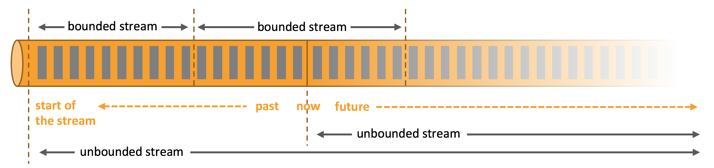

##### Flink流程

一个或多个流数据（sources）->用户定义的算子（operators,例如map,keyBy,timeWindow,apply）->sinks


## Parallel Dataflows 并行数据流

Flink中的程序本质上是并行和分布式的。在执行过程中，一个流有一个或多个**流分区stream partitions**，每个操作符有一个或多个操作符**子任务operator subtasks**。操作符子任务彼此独立，并在不同的线程中执行，可能在不同的机器或容器上执行。

操作符的**子任务**的数量，是该操作符的**并行度parallelism**。同一程序的不同运算符可能具有不同级别的并行性。


流可以在两个算子operators之间以一对一one-to-one(or 转发forwarding) 模式或重分配redistributing模式传输数据:

- **One-to-one** streams(例如上图中的Source和map()操作符之间的流)保留了元素的分区和排序。这意味着map()操作符的子任务[1]将以与Source操作符的子任务[1]相同的顺序看到相同的元素。
- **Redistributing** streams (就像上面的map()和keyBy/window之间，以及keyBy/window和Sink之间)改变流的分区。每个操作子任务将数据发送到不同的目标子任务，这取决于所选择的转换。例如keyBy()(通过散列键重新分区)、broadcast()或rebalance()(随机重新分区)。在重分配交换中，元素之间的顺序只在每一对发送和接收subtask中保留(例如，map()的子任务[1]和keyBy/window的子任务[2])。例如，上图的keyBy/window和Sink operators之间的重新分配，以及造成的不同key的聚合结果到达Sink的顺序。

## Timely Stream Processing 即时的流处理

对于大多数流媒体应用程序来说，能够用处理实时数据的相同代码重新处理历史数据是非常有价值的。

关注事件发生的顺序(而不是它们输出结果的顺序)以及能够推断一组事件何时完成(或应该完成)也很关键的。

通过使用记录在数据流中的**事件时间戳**，而不是使用处理数据的**机器的时钟**，可以满足这些对及时流处理的要求。

## Stateful Stream Processing 有状态的流处理

Flink的操作可以是有状态的。这意味着一个事件的处理方式取决于它之前发生的所有事件的累积效果。状态可以用于一些简单的事情，比如计算每分钟在仪表板上显示的事件，也可以用于更复杂的事情，比如欺诈检测模型的计算特性。

Flink应用程序在分布式集群上并行运行。给定操作符的不同并行实例将在不同的线程中独立执行，通常会在不同的机器上运行。

有状态操作符的并行实例集实际上是一个sharded分片键值存储。每个并行实例负责处理特定键组的事件，这些键的状态保存在本地。

下图显示了一个作业在作业图的前三个操作符中以两个并行度运行，在一个并行度为1的接收器中终止。**第三个操作符是有状态的**，您可以看到在第二个和第三个操作符之间发生了fully-connected network shuffle。这样做是为了根据某个键对流进行分区，以便所有需要一起处理的事件都将被处理。

**注：下图第二个operator中的key是没有被sharded的，而第二个和第三个操作符之间fully-connected是keyby的过程。第三个operator接收到的是sharding之后的数据，节点之间的数据是不重复的。**

两个流只有键一致的时候才能连接。 keyBy 的作用是将流数据分区，当 keyed stream 被连接时，他们必须按相同的方式分区。这样保证了两个流中所有键相同的事件发到同一个实例上。这样也使按键关联两个流成为可能。

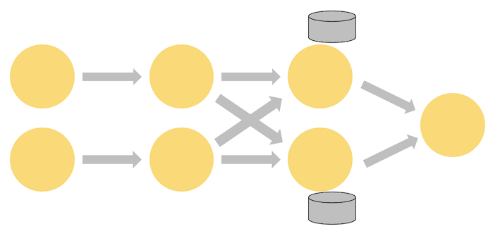

状态总是在本地访问，这有助于Flink应用程序实现高吞吐量和低延迟。您可以选择将状态保存在JVM堆上，如果JVM堆太大，则将状态保存在高效组织的磁盘数据结构中。

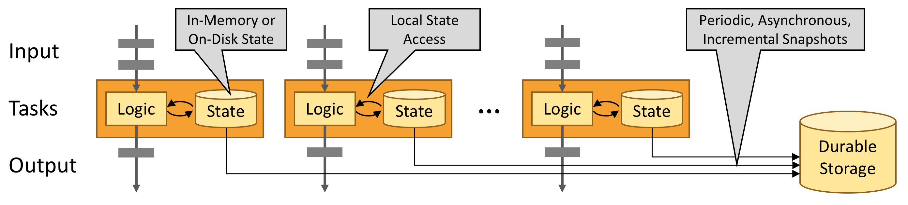

## Fault Tolerance via State Snapshots：通过状态快照进行容错

Flink能够通过状态快照和流重放的组合提供容错、精确一次的语义。这些快照捕获分布式管道的整个状态，将偏移量记录到输入队列中，以及整个作业图中的状态，这些状态是由于接收了该数据而产生的。当发生故障时，源文件将被**回滚rewound**，状态将被恢复，处理将继续进行。如上所述，这些状态快照是异步捕获的，不会妨碍正在进行的处理。

## Stream execution environment：Stream 执行环境

每个 Flink 应用都需要有执行环境，在该示例中为 `env`。流式应用需要用到 `StreamExecutionEnvironment`。

DataStream API 将你的应用构建为一个 job graph，并附加到 `StreamExecutionEnvironment` 。当调用 `env.execute()` 时此 graph 就被打包并发送到 JobManager 上，后者对作业并行处理并将其子任务分发给 Task Manager 来执行。每个作业的并行子任务将在 *task slot* 中执行。

注意，如果没有调用 execute()，应用就不会运行。


This distributed runtime depends on your application being **serializable**. It also requires that all dependencies are available to each node in the cluster.


# Flink Training（Github上的练习题）

在IDE中启动Flink程序就像运行main()方法一样简单。在底层，执行环境将在同一个进程中启动一个本地Flink实例。因此，也可以在代码中放置断点并调试它。

#### RichCoFlatMapFunction

- Flink 中文文档 https://ci.apache.org/projects/flink/flink-docs-release-1.12/zh/learn-flink/etl.html
- open(Configuration c) 仅在算子初始化时调用一次。可以用来加载一些静态数据，或者建立外部服务的链接等。
- close()
- getRuntimeContext() 为整套潜在有趣的东西提供了一个访问途径，最明显的，它是你创建和访问 Flink 状态的途径。

当 flatMap 方法调用 keyHasBeenSeen.value() 时，Flink 会在 *当前键的上下文* 中检索状态值，只有当状态为 null 时，才会输出当前事件。这种情况下，它同时也将更新 keyHasBeenSeen 为 true。

这种访问和更新按键分区的状态的机制也许看上去很神奇，因为在 Deduplicator 的实现中，键不是明确可见的。当 Flink 运行时调用 RichFlatMapFunction 的 open 方法时， 是没有事件的，所以这个时候上下文中不含有任何键。但当它调用 flatMap 方法，被处理的事件的键在运行时中就是可用的了，并且被用来确定操作哪个 Flink 状态后端的入口。

部署在分布式集群时，将会有很多 Deduplicator 的实例，每一个实例将负责整个键空间的互斥子集中的一个。所以，当你看到一个单独的 ValueState，比如

```java
ValueState<Boolean> keyHasBeenSeen;
```

要理解这个代表的不仅仅是一个单独的布尔类型变量，而是一个分布式的共享键值存储。

### Windows

窗口是将无限流切割为有限流的一种方式

- 时间窗口
  - 滚动时间窗口：将数据依据固定的窗口长度对数据进行切分，时间对其，窗口长度固定，没有重叠
  - 滑动时间窗口：固定的窗口长度+滑动间隔，长度固定，可以有重叠
  - 会话窗口：一系列事件组合+指定时间长度timeout。如果隔一段时间没有收到数据，则会话结束，后面会生成新的窗口。时间无对齐。
- 计数窗口 countwindow（一个参数是滚动，两个参数是滑动）

调用窗口方法（例如timewindow 或 .window等）之前，必须keyby，调用之后必须调用一个类似于聚合的窗口操作（例如minby），称为窗口函数

.windowAll(TumblingEventTimeWindows.of(Time.hours(1)))是因为TumblingEventTimeWindows的构造器是私有的，不能new，所以通过TumblingEventTimeWindows.of(窗口大小)来开窗口

也可以直接用timeWindow开窗，相当于对TumblingEventTimeWindows的简写，通过参数个数（1个/2个）来判断是滑动窗口还是滚动窗口

直接基于dataStream可以调用windowAll，相当于并行度变成1

##### 创建不同类型的窗口


##### 处理时间 Processing Time 和 事件时间 Event Time

参考：http://www.54tianzhisheng.cn/2018/12/11/Flink-time/

官方文档：https://ci.apache.org/projects/flink/flink-docs-release-1.12/zh/learn-flink/streaming_analytics.html

为了获得可重现的结果，例如在计算过去的特定一天里第一个小时股票的最高价格时，我们应该使用事件时间。这样的话，无论什么时间去计算都不会影响输出结果。然而如果使用处理时间的话，实时应用程序的结果是由程序运行的时间所决定。

- Processing Time 是指事件被处理时机器的系统时间。

当流程序在 Processing Time 上运行时，所有基于时间的操作(如时间窗口)将使用当时机器的系统时间。每小时 Processing Time 窗口将包括在系统时钟指示整个小时之间到达特定操作的所有事件。

- Event Time 是事件发生的时间，一般就是数据本身携带的时间。

这个时间通常是在事件到达 Flink 之前就确定的，并且可以从每个事件中获取到事件时间戳。在 Event Time 中，时间取决于数据，而跟其他没什么关系。Event Time 程序必须指定如何生成 Event Time 水印，这是表示 Event Time 进度的机制。

##### Watermarks

数据流到来的时候，其时间戳是乱序的，在任何时刻，我们并不知道当前的时间戳是否是全局最小的。例如：

··· 23 19 22 24 21 14 17 13 12 15 9 11 7 2 4 →

*watermarks 的作用* ：它们定义何时停止等待较早的事件。

- 延迟vs正确性 之间的权衡

  我们可以把 watermarks 的边界时间配置的相对较短，从而冒着在输入了解不完全的情况下产生结果的风险-即可能会很快产生错误结果。或者，你可以等待更长的时间，并利用对输入流的更全面的了解来产生结果。

  当然也可以实施混合解决方案，先快速产生初步结果，然后在处理其他（最新）数据时向这些结果提供更新。对于有一些对延迟的容忍程度很低，但是又对结果有很严格的要求的场景下，或许是一个福音。

##### min 和 minby 的区别

min和minBy的区别在于，min返回的是最小值，而minBy返回的是该字段中具有最小值的元素(max和maxBy也是如此)。


# Flink运行架构

### Flink运行时的组件

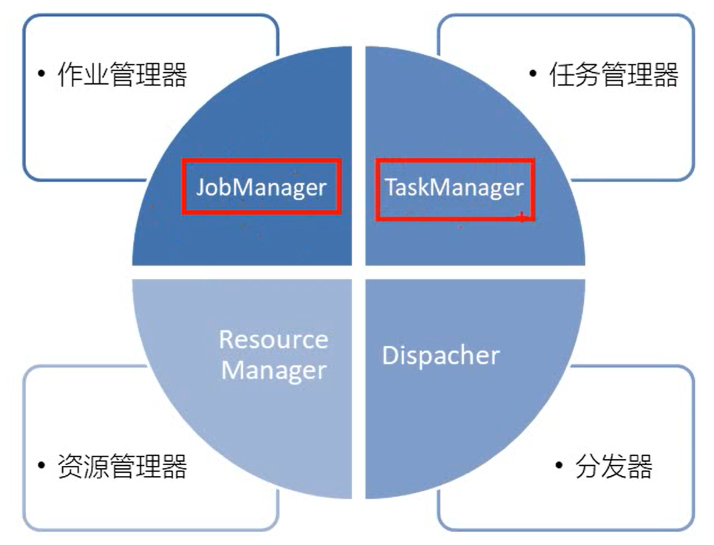

### 任务提交流程（抽象）

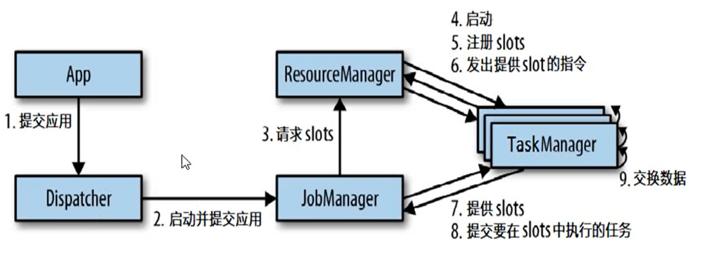

### 任务提交流程（yarn）

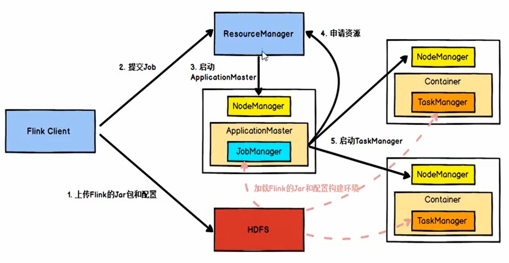

#### TaskManager和slots

我们推荐（默认也是）设置slot个数 = CPU核心个数

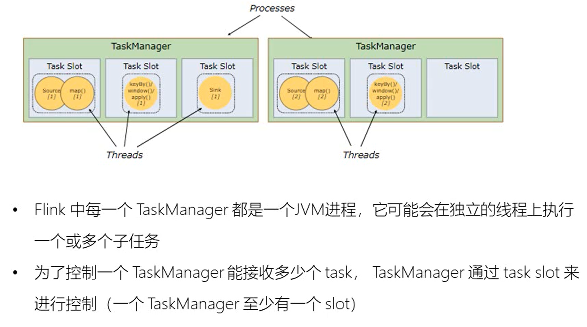

不同的任务可以放在同一个slot里，进行slot共享：

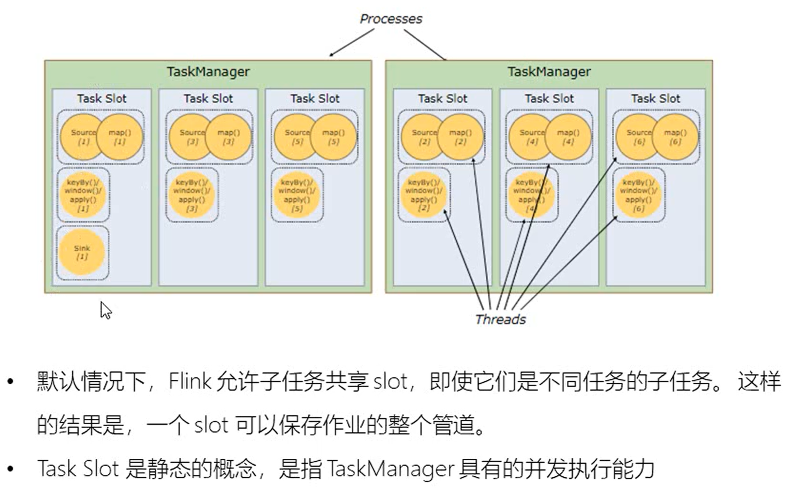

#### JobManager

一个job对应一个jobmanager

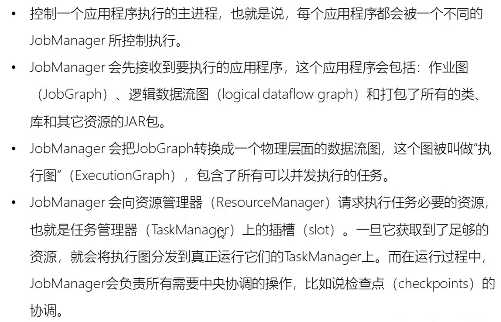

#### Dispacher 分发器

（非必须，取决于你使用的平台），目的是将作业转交给JobManager

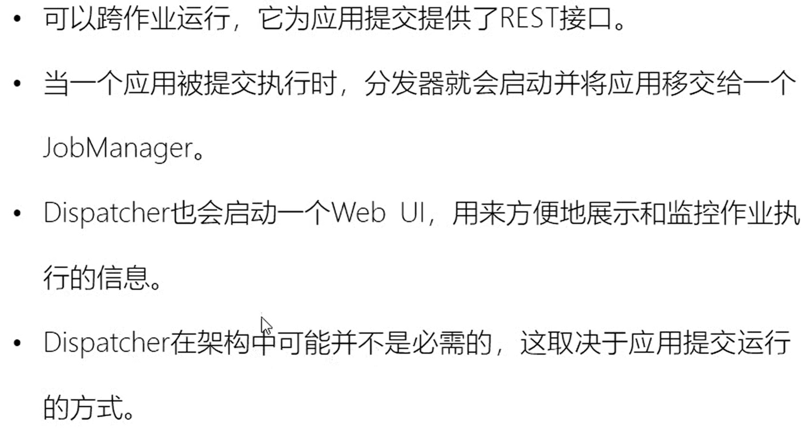

### 执行图（ExecutionGraph）

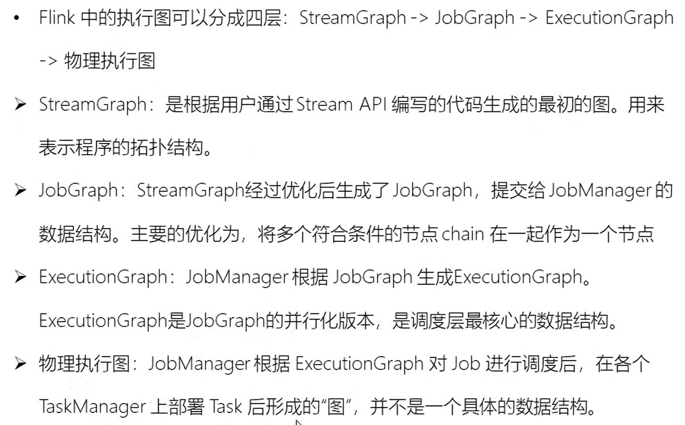


### 数据传输形式

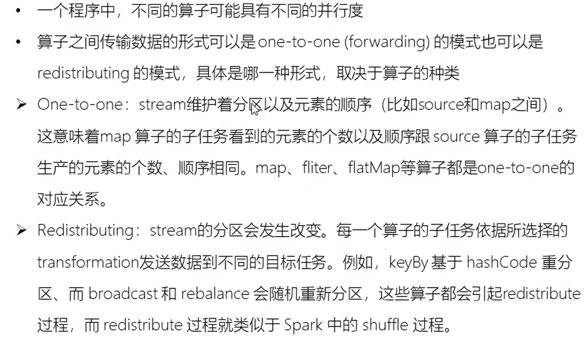