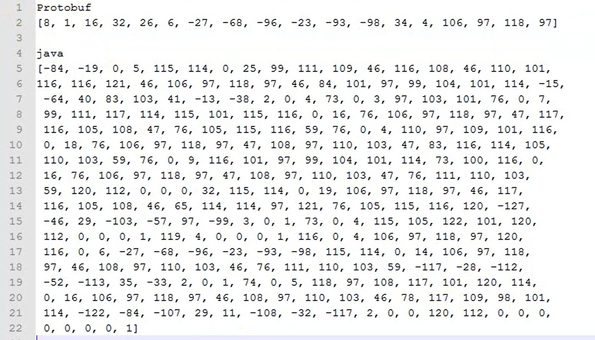

# Protobuf详解

### RPC调用要考虑的性能点

- 带宽（序列化的字节数组越小，传输时间越短）
- 编解码性能-CPU性能
- 序列化、反序列化（Java对象->二进制数组）

### 跨语言的序列化协议

- json
- xml
- hessian
- thrift（RPC框架）
- protobuf

### Java中原始的序列化、反序列化

- implements Serializable

- ObjectInputStream，ObjectIOutputStream

##### Java原生序列化 VS Protobuf



##### int转化为byteArray时，发生了什么？

首先，我们先来看看int型转换成byte型数组。

我们知道，Java中，一个int型占用4个字节，一个byte型占用1个字节，所以，对于一个int型，我们需要一个长度为4的byte型数组来对其进行存储。　　

| 31位——24位 | 23位——16位 | 15位——8位 | 7位——0位 |
| ---------- | ---------- | --------- | -------- |
| bytes[3]   | bytes[2]   | bytes[1]  | bytes[0] |

一个int型的4个字节如上图所示，假设用来存储的字节数组为bytes[]，那么，我们可以用：

- bytes[0]存储int型的第一个字节（7位——0位）
- bytes[1]存储int型的第二个字节（15位——8位）
- bytes[2]存储int型的第三个字节（23位——16位）
- bytes[3]存储int型的第四个字节（31位——24位)

具体代码如下：

```java
public static byte[] int2Bytes(int integer) {
    byte[] bytes = new byte[4];
    bytes[3] = (byte) (integer >> 24);
    bytes[2] = (byte) (integer >> 16);
    bytes[1] = (byte) (integer >> 8);
    bytes[0] = (byte) (integer);

    return bytes;
}
```

这里需要注意的是，当你将一个int型强制类型转换为byte型的时候，最高的三个字节会被砍掉，只留下最低的8位赋值给byte型。

接下来，我们来看一下byte型数组转换成int型。

我们知道，计算机是以补码的形式存放数值型数据，当我们对一个byte型进行移位操作的时候，这个byte型会先自动补全到32位（即一个int型），再进行移位操作。

> 举个例子：一个byte型的-1，在内存中的补码是八个1：11111111，当我们进行移位时，（比如说左移8位），它会进行补全，而且是有符号位的补全，再左移8位，所以最后结果是：11111111 11111111 11111111 00000000，但我们因为最后在将byte型数组转换成int型的时候，需要对数组元素使用按位或（ | ）操作，因此，移位结果前面的符号位如果不去除，将影响我们的运算，得出一个错误的结果。
>
> 上例中我们左移8位，需要将11111111 11111111 11111111 00000000去掉前面的那些1，只保留次低位上的1，即为：0000000000000000 11111111 00000000


我们可以先将byte数据元素与0xff（二进制的00000000 00000000 00000000 11111111）进行按位与运算（ & ），再进行移位，来去除前面的符号位。byte型数组转换成int型的代码如下：

```java
public static int bytes2Int(byte[] bytes) {
    //如果不与0xff进行按位与操作，转换结果将出错，有兴趣的同学可以试一下。
    int int1 = (bytes[0] & 0xff);
    int int2 = (bytes[1] & 0xff) << 8;
    int int3 = (bytes[2] & 0xff) << 16;
    int int4 = (bytes[3] & 0xff) << 24;

    return int1 | int2 | int3 | int4;
}
```

