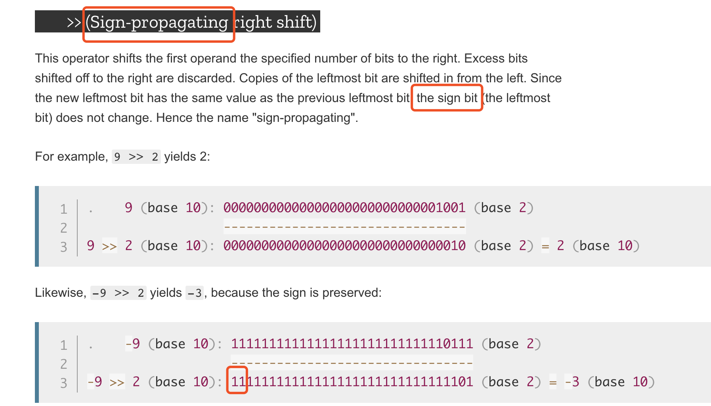
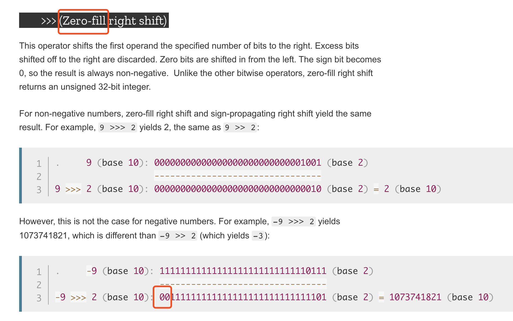

# How to set/unset a bit at specific position of a long?

## 一、Java位操作：如何将long类型的指定位设置为0或1？

[How to set/unset a bit at specific position of a long?](https://stackoverflow.com/questions/12015598/how-to-set-unset-a-bit-at-specific-position-of-a-long)

To set a bit, use:

```java
x |= 0b1; // set LSB bit
x |= 0b10; // set 2nd bit from LSB
```

to erase a bit use:

```java
x &= ~0b1; // unset LSB bit (if set)
x &= ~0b10; // unset 2nd bit from LSB
```

to toggle a bit use:

```java
x ^= 0b1;
```

Notice I use 0b?. You can also use any integer, eg:

```java
x |= 4; // sets 3rd bit
x |= 0x4; // sets 3rd bit
x |= 0x10; // sets 9th bit
```

However, it makes it harder to know which bit is being changed.

Using binary allows you to see which exact bits will be set/erased/toggled.

To dynamically set at bit, use:

```java
x |= (1 << y); // set the yth bit from the LSB
```

`(1 << y)` shifts the ...001 y places left, so you can move the set bit y places.

You can also set multiple bits at once:

```java
x |= (1 << y) | (1 << z); // set the yth and zth bit from the LSB
```

Or to unset:

```java
x &= ~((1 << y) | (1 << z)); // unset yth and zth bit
```

Or to toggle:

```java
x ^= (1 << y) | (1 << z); // toggle yth and zth bit
```

##### Example

```java
/**
* 功能：将num的高10位设置为 0000000001
* e.g. 输入有符号十进制     400910183048285260
*    对应二进制          1111101001 101111101011100101000000001000100100011111001110110100
*    转化为             0000000001 101111101011100101000000001000100100011111001110110100
*/
public static long setHigh10Bits(long num) {
    num |= 0b00000000_01000000_00000000_00000000_00000000_00000000_00000000_00000000L; // set bits（将1对应的位置设置为1）
    num &= ~0b11111111_10000000_00000000_00000000_00000000_00000000_00000000_00000000L; // unset bits（将1对应的位置设置为0）
    return num;
}
```


## 二、拓展：除了以上方法外，也可使用 BitSets API
参考：[https://www.baeldung.com/java-bitset](https://www.baeldung.com/java-bitset)


#### 4. The *BitSet* API

Now that we know enough about the theory, it's time to see what the *BitSet* API looks like.

For starters, let's compare the memory footprint of a *BitSet* instance with 1024 bits with the *boolean[]* we saw earlier:

```java
BitSet bitSet = new BitSet(1024);

System.out.println(GraphLayout.parseInstance(bitSet).toPrintable());
```

This will print both the shallow size of the *BitSet* instance and the size of its internal array:

```plaintext
java.util.BitSet@75412c2fd object externals:
          ADDRESS       SIZE TYPE             PATH         VALUE
        70f97d208         24 java.util.BitSet              (object)
        70f97d220        144 [J               .words       [0, 0, 0, 0, 0, 0, 0, 0, 0, 0, 0, 0, 0, 0, 0, 0]
```

As shown above, it uses a *long[]* with 16 elements (16 * 64 bits = 1024 bits) internally. Anyway, **this instance is using 168 bytes in total, while the \*boolean[]\* were using 1024 bytes**.

The more bits we have, the more the footprint difference increases. For example, to store 1024 * 1024 bits, the *boolean[]* consumes 1 MB, and the *BitSet* instance consumes around 130 KB.

#### 4.1. Constructing *BitSet*s

The simplest way to create a *BitSet* instance is to use [the no-arg constructor](https://docs.oracle.com/javase/8/docs/api/java/util/BitSet.html#BitSet--):

```java
BitSet bitSet = new BitSet();
```

**This will create a \*BitSet\* instance with a \*long[]\* of size one**. Of course, it can automatically grow this array if needed.

It's also possible to create a *BitSet* with an [initial number of bits](https://docs.oracle.com/javase/8/docs/api/java/util/BitSet.html#BitSet-int-):

```java
BitSet bitSet = new BitSet(100_000);
```

Here, the internal array will have enough elements to hold 100,000 bits. This constructor comes in handy when we already have a reasonable estimate on the number of bits to store. In such use cases, **it can prevent or decrease the unnecessary copying of array elements while growing it**.

It's even possible to create a *BitSet* from an existing *long[]*, *byte[]*, [*LongBuffer*](https://docs.oracle.com/javase/8/docs/api/java/nio/LongBuffer.html), and [*ByteBuffer*](https://docs.oracle.com/javase/8/docs/api/java/nio/ByteBuffer.html). For instance, here we're creating a *BitSet* instance from a given *long[]*:

```java
BitSet bitSet = BitSet.valueOf(new long[] { 42, 12 });
```

There are three more overloaded versions of the *[valueOf()](https://docs.oracle.com/javase/8/docs/api/java/util/BitSet.html#valueOf-byte:A-)* static factory method to support the other mentioned types.

#### 4.2. Setting Bits

We can set the value of a particular index to *true* using the *[set(index)](https://docs.oracle.com/javase/8/docs/api/java/util/BitSet.html#set-int-)* method:

```java
BitSet bitSet = new BitSet();

bitSet.set(10);
assertThat(bitSet.get(10)).isTrue();
```

As usual, the indices are zero-based. **It's even possible to set a range of bits to \*true\* using the \*[set(fromInclusive, toExclusive)](https://docs.oracle.com/javase/8/docs/api/java/util/BitSet.html#set-int-int-)\* method**:

```java
bitSet.set(20, 30);
for (int i = 20; i <= 29; i++) {
    assertThat(bitSet.get(i)).isTrue();
}
assertThat(bitSet.get(30)).isFalse();
```

As is evident from the method signature, the beginning index is inclusive, and the ending one is exclusive.

When we say setting an index, we usually mean setting it to *true*. Despite this terminology, we can set a particular bit index to *false* using the *[set(index, boolean)](https://docs.oracle.com/javase/8/docs/api/java/util/BitSet.html#set-int-boolean-)* method:

```java
bitSet.set(10, false);
assertThat(bitSet.get(10)).isFalse();
```

This version also supports setting a range of values:

```java
bitSet.set(20, 30, false);
for (int i = 20; i <= 29; i++) {
    assertThat(bitSet.get(i)).isFalse();
}
```

#### 4.3. Clearing Bits

Instead of setting a specific bit index to *false*, we can simply clear it using the *[clear(index)](https://docs.oracle.com/javase/8/docs/api/java/util/BitSet.html#clear-int-)* method:

```java
bitSet.set(42);
assertThat(bitSet.get(42)).isTrue();
        
bitSet.clear(42);
assertThat(bitSet.get(42)).isFalse();
```

Moreover, we can also clear a range of bits with the *[clear(fromInclusive, toExclusive)](https://docs.oracle.com/javase/8/docs/api/java/util/BitSet.html#clear-int-int-)* overloaded version:

```java
bitSet.set(10, 20);
for (int i = 10; i < 20; i++) {
    assertThat(bitSet.get(i)).isTrue();
}

bitSet.clear(10, 20);
for (int i = 10; i < 20; i++) {
    assertThat(bitSet.get(i)).isFalse();
}
```

Interestingly, **if we call this method without passing any arguments, it'll clear all the set bits**:

```java
bitSet.set(10, 20);
bitSet.clear();
for (int i = 0; i < 100; i++) { 
    assertThat(bitSet.get(i)).isFalse();
}
```

As shown above, after calling the *[clear()](https://docs.oracle.com/javase/8/docs/api/java/util/BitSet.html#clear--)* method, all bits are set to zero.

#### 4.4. Getting Bits

So far, we used the *[get(index)](https://docs.oracle.com/javase/8/docs/api/java/util/BitSet.html#get-int-)* method quite extensively. **When the requested bit index is set, then this method will return \*true\*. Otherwise, it'll return \*false\***:

```java
bitSet.set(42);

assertThat(bitSet.get(42)).isTrue();
assertThat(bitSet.get(43)).isFalse();
```

Similar to *set* and *clear*, we can get a range of bit indices using the *[get(fromInclusive, toExclusive)](https://docs.oracle.com/javase/8/docs/api/java/util/BitSet.html#get-int-int-)* method:

```java
bitSet.set(10, 20);
BitSet newBitSet = bitSet.get(10, 20);
for (int i = 0; i < 10; i++) {
    assertThat(newBitSet.get(i)).isTrue();
}
```

As shown above, this method returns another *BitSet* in the [20, 30) range of the current one. That is, index 20 of the *bitSet* variable is equivalent to index zero of the *newBitSet* variable.

#### 4.5. Flipping Bits

**To negate the current bit index value, we can use the \*[flip(index)](https://docs.oracle.com/javase/8/docs/api/java/util/BitSet.html#flip-int-)\* method**. That is, it'll turn *true* values to *false* and vice versa:

```java
bitSet.set(42);
bitSet.flip(42);
assertThat(bitSet.get(42)).isFalse();

bitSet.flip(12);
assertThat(bitSet.get(12)).isTrue();
```

Similarly, we can achieve the same thing for a range of values using the *[flip(fromInclusive, toExclusive)](https://docs.oracle.com/javase/8/docs/api/java/util/BitSet.html#flip-int-int-)* method:

```java
bitSet.flip(30, 40);
for (int i = 30; i < 40; i++) {
    assertThat(bitSet.get(i)).isTrue();
}
```

#### 4.6. Length

There are three length-like methods for a *BitSet*. **The \*[size()](https://docs.oracle.com/javase/8/docs/api/java/util/BitSet.html#size--)\* method returns the number of bits the internal array can represent**. For instance, since the no-arg constructor allocates a *long[]* array with one element, then the *size()* will return 64 for it:

```java
BitSet defaultBitSet = new BitSet();
assertThat(defaultBitSet.size()).isEqualTo(64);
```

With one 64-bit number, we can only represent 64 bits. Of course, this will change if we pass the number of bits explicitly:

```java
BitSet bitSet = new BitSet(1024);
assertThat(bitSet.size()).isEqualTo(1024);
```

**Moreover, the \*[cardinality()](https://docs.oracle.com/javase/8/docs/api/java/util/BitSet.html#cardinality--)\* method represents the number of set bits in a \*BitSet\***:

```java
assertThat(bitSet.cardinality()).isEqualTo(0);
bitSet.set(10, 30);
assertThat(bitSet.cardinality()).isEqualTo(30 - 10);
```

At first, this method returns zero as all bits are *false*. After setting the [10, 30) range to *true*, then the *cardinality()* method call returns 20.

**Also, the \*[length()](https://docs.oracle.com/javase/8/docs/api/java/util/BitSet.html#length--)\* method returns the one index after the index of the last set bit**:

```java
assertThat(bitSet.length()).isEqualTo(30);
bitSet.set(100);
assertThat(bitSet.length()).isEqualTo(101);
```

At first, the last set index is 29, so this method returns 30. When we set the index 100 to true, then the *length()* method returns 101. **It's also worth mentioning that this method will return zero if all bits are clear**.

Finally, the *[isEmpty()](https://docs.oracle.com/javase/8/docs/api/java/util/BitSet.html#isEmpty--)* method returns *false* when there is at least one set bit in the *BitSet*. Otherwise, it'll return *true*:

```java
assertThat(bitSet.isEmpty()).isFalse();
bitSet.clear();
assertThat(bitSet.isEmpty()).isTrue();
```


---

## 三、补充： JavaScript `>>`(有符号右移) 和 `>>>`(无符号右移)区别

之所以以 JS 为例，是因为Java中不支持无符号操作

直接看[MDN](https://developer.mozilla.org/en-US/docs/Web/JavaScript/Reference/Operators/Bitwise_Operators)英文吧：

#### >> (有符号右移)




`sign-propagating（符号位-传播）右移` 我们知道，计算机中以二进制存储数字，二进制中最左边的第一位，叫符号位，所以这就很明显了，右移2位后，最左边缺少2位数字，那就应该填充数字，那填充什么呢？符号位是什么，我就填什么，所以 `-9 >> 2` 中最左边2位和符号位一样，都是1。

#### >>> (无符号右移)



`zero-fill（零-填充）` 这个就更明显了，直接就说了，用0填充，所以右移后空位不管你符号位是啥，我都只填0。

#### 总结

因此，我们所说的 **有符号、无符号** 看的就是二进制的符号位

- 无符号：就是不管符号位，右移只填充0；
- 有符号：就是符号位是啥，我就填充啥。Java中也是同理。