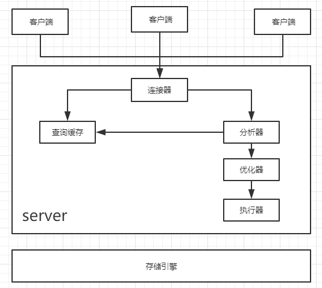
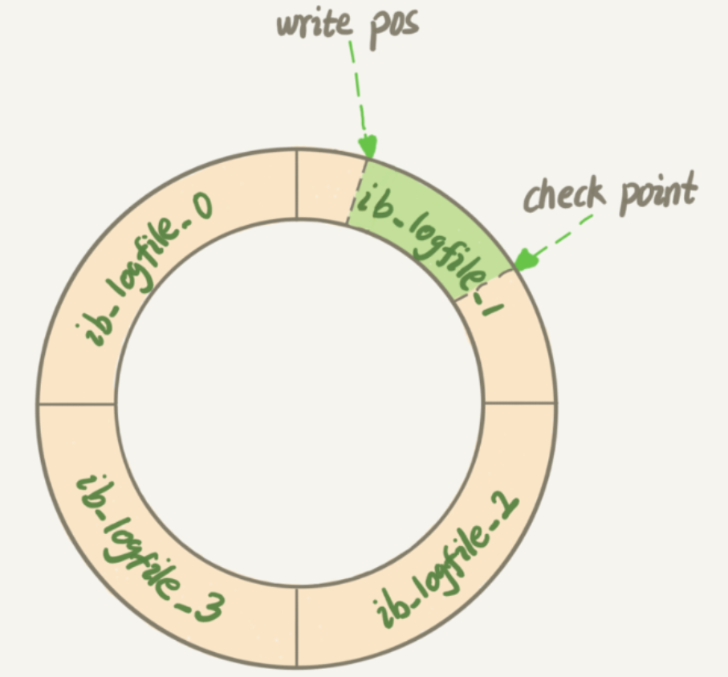
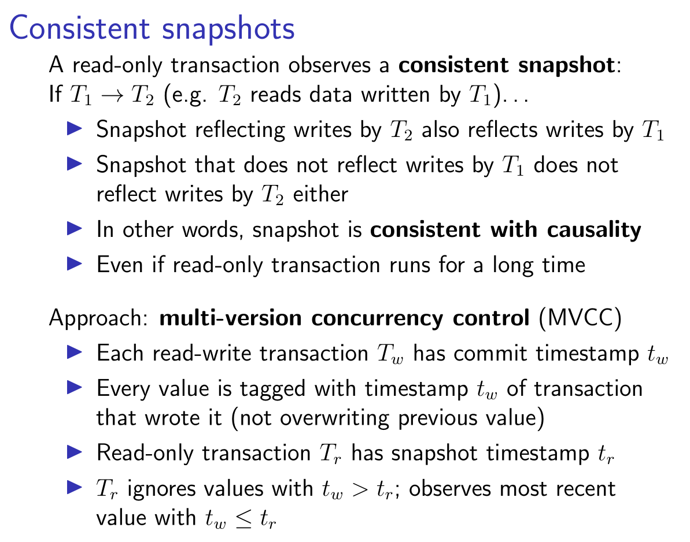
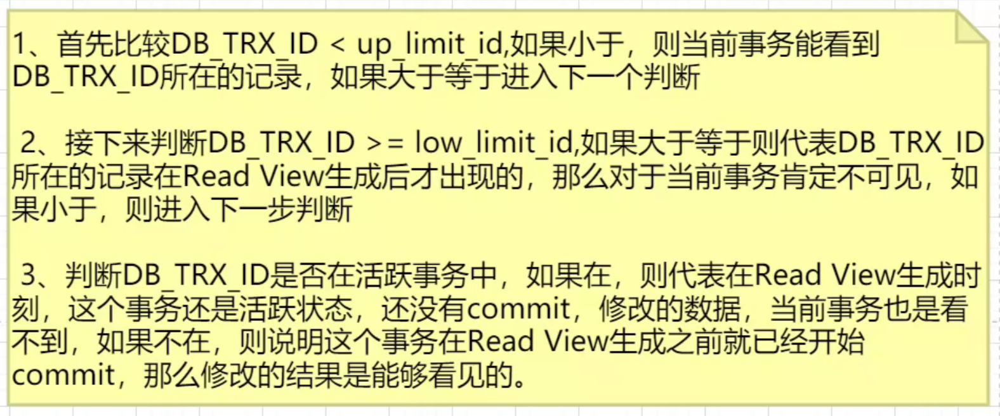
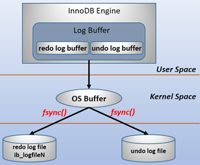
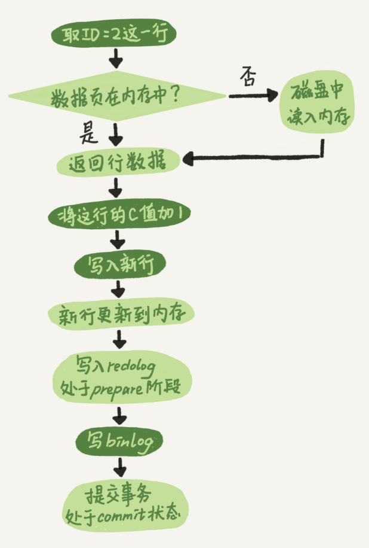
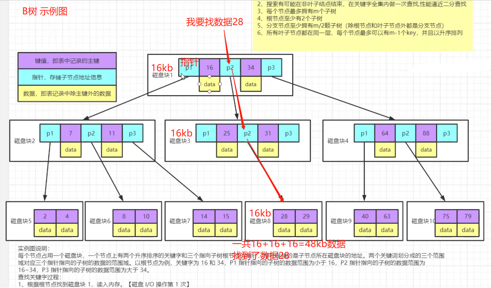
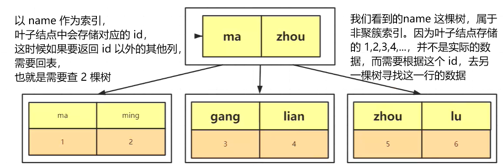
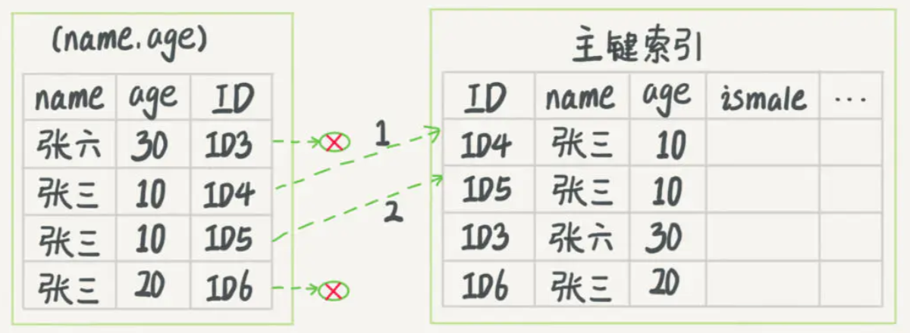

# MySQL

> 推荐一个博客：inside MySQL

### MySQL 基本架构



##### 连接器

1. 负责和客户端建立连接，获取权限，维持和管理连接
   - 用户名密码验证
   - 查询权限信息，分配对应的权限
   - 可以使用show processlist查看现有的连接
   - wait_timeout默认8小时，超时会断开连接

2. 连接分为两类
   - 长连接：推荐使用，但是要周期性的断开长连接
   - 短链接：一次执行完毕就关闭，比较消耗资源

##### 查询缓存

1. 当执行查询语句的时候，会先去查看缓存中的结果，之前执行过的SQL语句会以类似于key-value的形式存在缓存中，如果能找到就返回，找不到继续执行。
2. 不推荐使用缓存：
   - 查询缓存失效比较频繁，只要表更新，缓存就会清空
   - 缓存对应更新的市局命中率低

##### 分析器

1. 词法分析：Mysql需要把输入的字符串进行识别和翻译
2. 语法分析：语法解析，并判断是否符合规范

##### 优化器

1. 执行具体的SQL之前先进行优化
   - 索引优化
   - 条件顺序优化
   - 关联表顺序优化
   - ...

2. 不同的执行方式对效率影响很大
   - RBO:基于规则的优化
   - CBO:基于成本的优化

##### 执行器

操作引擎，返回结果

##### 存储引擎

存储数据，提供读写接口


### 零碎知识点

#### 局部性原理

##### 时间、空间局部性

数据和程序的存储，都有聚集成群的倾向，相关关联的数据可能被放在一起。同时，之前查询过的数据，短时间内可能再次被查询。

##### 磁盘预读

当内存和磁盘发生交互的时候，是以一个逻辑单元 **“页”** 为单位进行交互的，“页”是磁盘和内存交互的最小单位，一般是 4k 或 8k。读取的时候可以以页为单位，也可以是页的整数倍。

SSD 4K 对齐，能够加快查询效率


#### MySQL 日志有多少种？

binlog, undolog, redolog, relaylog（主从复制）, errorlog, slowlog 等

- 所有存储引擎，都有 binlog，errorlog，relaylog，slowlog

- Innodb 存储引擎，有 binlog, undolog, redolog

- MyISAM 不支持事务，没有 undolog, redolog，只有 binlog

##### Undolog 回滚日志

##### Redolog 物理日志

innodb存储引擎的日志文件。

- redolog是物理日志，记录的是在某个数据页上做了什么修改
  1. 当发生数据修改的时候，innodb存储引擎会先将记录写到redo_log中，并更新内存，此时更新就算是完成了，同时INNODB会在合适的时机将记录存储操做到磁盘中。
  2. redo_log是由固定大小的，是一个循环写的过程
  3. 有了redo_log之后，innodb可以保证数据库异常之后重启，之前的数据记录不会丢失，叫做crash-safe

- binlog是逻辑日志，记录的是这个语句的原始逻辑，比如给ID=2这一行的c字段加1；

有且仅有两个文件，是一个循环写的过程。


不知道你是否记得《孔乙己》这篇文章，酒店掌柜有一个粉板，专门记录客人的赊账记录。如果赊账的人不多，他可以将赊账的人姓名和账目写在板上，但是如果赊账的人太多，粉板总会有记不下的时候，这时候掌柜还有一个专门记录赊账的账本。

如果有人要赊账或者还账的时候，掌柜一般有两种方法：

1、一种直接将账本翻出来，把这次账加上或者删除

2、先在粉板上记下这次账，等打烊后再把账本翻出来核算

在生意很忙时，掌柜应该选择后者，第一种方法实在太麻烦了，极大的影响工作效率。

同样，在MySQL里也有这个问题，如果每一次更新操作都写进磁盘，然后磁盘找到对应的那条记录，然后再更新，整个过程的IO成本，查找成本都很高。为了解决这个问题，MySQL的设计者就用了类似酒店掌柜粉板的思路来提升工作效率。

粉板和账本配合的过程，其实就是MySQL里面经常说到的WAL技术，WAL技术全称是Write-Ahead Logging.他的关键点就是先写日志，再写磁盘。

具体来说，当有一条日志需要更新的时候。**InnoDB 会先把日志写到 redo log（粉板）中，并更新内存，这个时候更新就算完成了。同时，InnoDB 会在适当的时候将这个操作记录到磁盘中，这个更新往往实在系统比较空闲的时候**，这就像打样以后掌柜做的事。

如果今天赊账的不多，掌柜可以打烊后再整理，但是某天赊账的非常多，粉板写满了，又怎么办呢？这个时候掌柜只好放下手中的事，将粉板上的账整理到账本上，再将粉板擦掉，为记录新的赊账腾出空间。

与此类似，InnoDB 的 redo log 是固定大小的，比如可以配置为一组四个文件，每个文件的大小是1G，那么这块粉板共有4G的空间。从头开始写，写到末尾又回到开头循环写，如下图所示：



write pos 是当前记录的位置，一边写一边后移，写到第3号文件的末尾就回到0号文件开头。checkpoint 是当前要擦除的位置，也是往后推移并且魂环的，擦除记录前要将记录更新到数据文件。

wirte 和 checkpoint 之间是粉板空着的部分，可以用来记录新的操作。如果 write pos 追上 checkpoint，表示粉板满了，这个时候就不能执行新的更新操作，要先停下来擦掉一些记录，把checkpoint推进一下。

有了redo-log，InnoDB就可以保证即使数据库发生异常重启，之前提交的记录就不会丢失。这个能力成为crash-safe。

要理解crash-safe这个概念，可以想想赊账的例子。只要赊账记录记在粉板上或者写在账本上，之后即使掌柜忘记了，比如停业几天，恢复生意后依然可以通过账本和粉板上的数据明确赊账数目。


#### binlog，redolog 都会记录数据，先写哪个？

两阶段提交，不是分布式事务的 2PC

binlog 为了进行主从复制的

可以看下VIP课的PPT图，大意是先写redo log，再写binlog，而只有两个log都写成功的时候才提交


#### undolog 的原理？是否需要落盘？

innodb通过force log at commit机制实现事务的持久性，即在事务提交的时候，必须先将该事务的所有事务日志写入到磁盘上的 redo log file 和 undo log file 中，进行持久化。

undo日志会记录事务执行过程中，每次修改的数据的原始值。

```sql
x = 5, y = 8
t1 begin:
	// undo日志记录x=5
	x = x - 1;
	// undo日志记录y=8
	y = y - 2;
	// 事务执行临近结束，将 undolog 写入到磁盘
	// 将数据写入到磁盘
commit
```

每次进行事务修改之前，把未修改之前的值存储到 undo 日志中，提交的时候，先将 undo 写到磁盘，再把修改后的数据**写到磁盘**。

若undo写入磁盘之前发生了异常，根本就不需要做任何操作，这时候事务是被认为执行失败的，也不需要回滚，因为undo日志没有写入磁盘，数据库被认为处于没有执行事务的状态。


#### MySQL有多少种锁？

共享锁，排它锁，独占锁，间隙锁，临键锁，自增锁，意向锁

MVCC：multi version concurrency control 多版本并发控制，通过保存数据在某个时间点的快照来实现的。在同一个事务里能够看到数据一致的视图。



排它锁怎么加？query for update

共享锁怎么加？lock in share mode

WAL：Write Ahead Log 溢写日志


并发的几种情况：

- 读读（不存在任何问题，也不需要并发控制）
- 读写（有数据安全问题，脏读，幻读，不可重复读）
- 写写（有数据安全问题，可能存在更新丢失问题）

MVCC 避免了加锁的问题，因为加锁效率低

##### 两个窗口开启事务，为什么多一次 select 操作之后，结果就不一样了？

隐藏字段

- DB_TRX_ID，创建这条记录或者最后一次修改该记录的事物 id
- DB_ROLL_PTR，回滚指针，指向数据的上一个版本
- DB_ROW_ID，隐藏主键，如果没有显式主键的话，就会多一个隐藏主键

mysql purge 机制：解决 undolog 膨胀问题

##### read view

事物进行快照读操作的时候，产生的读视图

在当前的读视图里面，包含三个关键字段：

- trx_list，read view 生成时刻当前系统活跃的事物 id，他是一个列表
- up_limit_id，活跃列表中最小的事务 id 值
- low_limit_id，系统尚未分配的下一个事务 id 的值

生成 view 之后，会根据 **可见性算法** 来判断是否可以读取到对应的数据结果。




MVCC 解决不了幻读，幻读是通过加锁 for update 的方式解决的：根本插入不进去，所以不会有幻读问题。

幻读问题产生的本质原因是什么？如果事物中进行操作的都是快照读，那么是不会产生幻读问题的。但是当快照读和当前读一起使用的时候，才会产生幻读问题。update 操作用了当前读（select lock in share mode, select for update, update, delete, insert）。

##### 问：锁是server层还是引擎层

答：锁是给索引加的，不是给数据加的。


#### 使用自定义变量

在给一个变量赋值的同时，使用这个变量

```mysql
select actor_id, @rounum:=@rownum+1 as rownum from actor limit 10;
```


#### 分区表

创建表时使用 partition by 子句定义每个分区存放的数据，在执行查询的时候，优化器会根据分区定义过滤那些没有我们需要数据的分区，这样查询就无须扫描所有分区。


### 存储引擎

- innodb
  - 有 redolog, undolog
  - 簇族索引
- myisam
  - 非簇族索引
  - 不支持事务
- memory
  - 数据在内存中，有持久化文件
  - 默认使用哈希索引


### 事务

- 数据库事务
- spring 声明式事务：spring 提供了一个类，由这个类以 AOP 的方式管理，只需要`@Transactional`即可
- 分布式事务


### 事务的 ACID

#### 事务的实现原理

事务的原子性，是通过 undo log 来实现的

事务的持久性，是通过 redo log 来实现的

事务的隔离性，是通过 (读写锁+MVCC)来实现的

事务的一致性，是通过原子性，持久性，隔离性来实现的！！！

#### Atomicity 原子性：undolog

innodb 默认页 16k

- 事务中的所有操作作为一个整体，像原子一样不可分割（原子性），要么全部执行成功，要么全部失败

- 使用 undolog 逻辑日志实现回滚

  - Undo Log 是为了实现事务的原子性，在 MySQL 数据库 InnoDB 存储引擎中，还用 Undo Log 来实现 **MVCC 多版本并发控制**，记录原来数据的历史版本

  - 在操作任何数据之前，首先将数据备份到一个地方（这个存储数据备份的地方称为Undo Log）。然后进行数据的修改。如果出现了错误或者用户执行了ROLLBACK语句，系统可以利用Undo Log中的备份将数据恢复到事务开始之前的状态

    注意：undo log 是逻辑日志，可以理解为（仅理解，实际并不是这样的）：
    （区分逻辑日志、物理日志，只需要看页是否被修改。**逻辑日志** 是只对当前的 sql 语句做一条记录，而 **物理日志** 是对日志所在物理页 page 做修改）

    > 当delete一条记录时，undo log中会记录一条对应的insert记录
    > 当insert一条记录时，undo log中会记录一条对应的delete记录
    > 当update一条记录时，它记录一条对应相反的update记录

    如果某一次操作失败了，就去执行这些相反的逻辑语句，将数据恢复到上一次的一致性状态。

#### Consistency 一致性（数据库的根本追求）

一致性分类：强一致性、弱一致性、最终一致性

在事务的四个特点中，一致性是事务的根本追求。事务执行的结果必须使数据库从 **一个永久的一致性状态** 转变到 **另一个永久的一致性状态**。如果事务被迫中断，不应该有一部分被写入物理数据库。例如，转账前后，两个账户的总金额应该保持不变。而在某些情况下，会对事务的一致性造成破坏：

- 事务的并发执行

- 事务故障或系统故障

数据库系统通过**并发控制技术**和**日志恢复技术**，来避免这种情况的发生

- **并发控制技术**保证了事务的**隔离性**,使数据库的一致性状态不会因为并发执行的操作被破坏。

- **日志恢复技术**保证了事务的**原子性**,使一致性状态不会因事务或系统故障被破坏。同时使已提交的对数据库的修改不会因系统崩溃而丢失,保证了事务的持久性。

#### Isolation 隔离性

- 使用 **锁机制 + MVCC** 实现
- 并发环境中，并发的事务是相互隔离的，并发执行的事务之间不能相互干扰
- 隔离级别：假设 A，B 都开启了事务
  - 读未提交（未授权读取）：即使A事务未提交，B事务也能看到A的修改
  - 读已提交（授权读取）：A事务提交后，B事务中才能看到A的修改
  - 可重复读：**默认隔离级别**。无论A怎么修改，事务B在事务期间都不会看到A的修改
  - 串行化：所有事物只能一个接一个处理，不能并发执行
  
  （要能够模拟脏读、幻读、不可重复读的情况）
  
  

#### Durability 持久性：redolog  + binlog

我们知道，写数据的时候，数据会先存在用户空间内存中，然后由操作系统内核调用 fsync，才真正写入到磁盘。如果此时突然宕机，内存中的数据就会丢失。怎么解决这个问题？

事务提交前直接把数据写入磁盘就行啊。这么做有什么问题？只修改一个页面里的一个字节，就要将整个页面刷入磁盘，太浪费资源了。毕竟一个页面16kb大小，你只改其中一点点东西，就要将16kb的内容刷入磁盘，听着也不合理。毕竟一个事务里的SQL可能牵涉到多个数据页的修改，而这些数据页可能不是相邻的，也就是属于随机IO。显然操作随机IO，速度会比较慢。

##### 思想：WAL日志（Write Ahead Log，预写日志）

采用 redo log 解决上面的问题。当做数据修改的时候，不仅在内存中操作，还会在redo log中记录这次操作。当事务提交的时候，将redo log日志进行刷盘持久化即可(redo log一部分在内存中，一部分在磁盘上)，不需要将数据持久化。当数据库宕机重启的时候，虽然数据没有持久化，但是可以根据 redo log 中的内容，将数据恢复到数据库中，再根据 undo log 和 binlog 内容决定回滚数据还是提交数据。

##### 采用 redo log 的好处？

redo log 进行刷盘比对数据页刷盘效率高

- redo log体积小，毕竟只记录了哪一页修改了啥，因此体积小，刷盘快。
- redo log是一直往末尾进行追加，属于顺序IO。效率显然比随机IO来的快。



- 事务一旦提交，数据必须永久保存。即使宕机，重启后也能恢复到事务成功结束时的状态
- 使用 redolog 两阶段提交实现。事务提交前，需要将 redolog 持久化。系统崩溃时，虽然数据没有持久化，但是可以根据 redolog 的内容，将数据恢复到最新的状态。
- redolog 大小是固定的，相当于一个增量存储，redolog 满了之后，会进行持久化的同步归档。然后将redolog清空。

#### 三种数据溢写到磁盘的过程

0. 效率最高。只要 redolog 写成功了，断电也没关系
1. 最安全
2. 与 1 相比更安全，如果 MySQL 进程挂了，数据不会丢失，操作系统会继续处理写数据


#### 数据更新的流程？redo的两阶段提交

事实分析先写redolog后写binlog和先写binlog后写redolog都会有数据不一致的风险。
因此，采用两阶段提交，具体流程如下：

##### 数据更新的执行流程



1. 执行器先从存储引擎找到数据，如果在内存中直接返回，不在内存中查询返回

2. 执行器拿到数据后会先修改数据，然后调用引擎接口重新吸入数据

3. 引擎将数据更新到内存，同时写数据到redo中，此时处于prepare阶段，并通知执行器执行完成

4. 执行器生成这个操作的binlog

5. 执行器调用引擎的事务提交接口，引擎把刚写完的redo改为commit状态

6. 更新完成

使用 **两阶段提交的优势** 是：可以保证 binlog 和 redolog 的数据一致（先写 redolog 或者先写 binlog 都无法保证突然宕机时的数据一致性）。如果数据库发生了意外情况，宕机、断点、重启等等，可以保证使用 BinLog 恢复数据和当时数据状态一致。具体情况下的策略如下：

- binlog有记录，redolog状态commit：正常完成的事务，不需要恢复
- binlog有记录，redolog状态prepare：在binlog写完提交事务之前的crash，恢复操作：提交事务
- binlog无记录，redolog状态prepare：在binlog写完之前的crash，恢复操作：回滚事务
- binlog无记录，redolog无记录：在redolog写之前crash，恢复操作：回滚事务


### 锁

- 共享锁
- 排它锁
- 独占锁
- 临键锁
- 间隙锁
- 自增锁
- 意向锁


#### MyIsam

只能锁表

- 共享读锁
- 独占写锁

#### Innodb

支持表锁，行锁。实质上锁的是索引，如果没有索引的话，退化成为表锁。

- 共享锁（s），又称读锁
- 排它锁（x），又称写锁


### OLTP，OLAP

OLTP：联机事务处理，在尽可能短的时间内返回对应的结果值。例如我们常用的关系型数据库。

OLAP：联机分析处理，Hive，主要是对历史数据的分析，用于做出决策；常用于数据仓库。不支持范围查询，插入新数据要重排？

区别在于时效性，在很短的时间内返回结果。


### MySQL 索引实现原理

索引是和存储引擎相关联的。所谓存储引擎，指的是数据在磁盘上的不同组织形式。

Memory 存储引擎使用 Hash 索引。

#### 不同存储引擎的数据文件

Innodb：包括 frm（表结构），ibd（索引+数据放在一起，聚簇索引） 文件

MyISAM：包括 frm，myd，myi 文件，非聚簇索引

#### 聚簇索引就是主键索引吗？

不一定是。

- 如果你建表时不指定主键，innodb会选择 **唯一键** 创建索引。
- 如果没有唯一键的话，会生成一个 6 字节的 row_id 作为主键。

#### Innodb 采用自适应哈希：

当给 colA 建 立B+tree 索引的时候，这棵 B+ tree 会有个三四层，通过 colA = 'xxx' 会在树里查询 3、4 次才能查到，所以这里如果开启了自适应索引，就利用 buffer pool 来给 colA 建立一个哈希索引，这样就只用在哈希索引里查 1 次，不用在 B+ tree 里查询 3、4 次，加快了速度。

#### 扰动函数（Java HashMap相关的，自己看一下吧）

```java
static final int hash(Object key) {
    int h;
    return (key == null) ? 0 : (h = key.hashCode()) ^ (h >>> 16);
}
```

目的是为了减少hash冲突。


### MySQL B+ 树数据结构推导

#### 哈希表

哈希算法应该你可能多的案列，让数据分布均匀，使用扰动函数，减少hash冲突；对内存占用比较高；检索时无法进行范围查询，如果范围查询，必须逐个对比，相当耗费时间。

MySQL用到了哈希表吗？Memory 存储引擎使用的索引数据结构就是哈希表；Innodb使用自适应哈希。

#### 普通二叉树

查询效率太低，需要遍历整个树

#### BST Tree（二叉排序树）

有序，左子树<根节点<右子树，递增插入会退化成链表，是因为树不够平衡

#### AVL 树（二叉平衡树）

最短子树和最长子树高度之差不能超过1，是严格意义上的平衡树，在插入数据的时候要进行旋转操作来保证平衡，会损失部分插入性能，从而带来查询性能的提升

#### RBTree （红黑树）

非严格的平衡树，最长路径不超过最短路径的两倍。近似取得了插入和查询性能的平衡。

#### 为什么使用 B / B+ 树？

以上的“二叉”树都会越来越深，每一个节点中只能存一个元素。如果数据节点很多，查找的时候，需要进行多次 IO 交互。应该尽量在 4k 中存储尽可能多的数据节点。

B / B+ 树的每一个节点中可以有多个元素，采用有序、多分支的方式，解决二叉树的这些弊端。

#### 为什么推荐使用自增的 int 类型作为主键？

int 类型 相比 varchar，占用的索引空间比较小

自增可以直接追加在最后面，减少树的页分裂、合并带来的维护成本

#### 不同存储引擎的数据结构

Innodb 默认使用 B-tree，根据官网文档，Memory tables 也支持哈希索引。

Hash劣势：rehash，哈希冲突问题。不好的hash算法导致散列不均匀，浪费磁盘空间。

jdk 1.8 的哈希函数算法使用了扰动函数，也是为了让散列更均匀

| **索引**      | MyISAM引擎 | InnoDB引擎 | Memory引擎 |
| ------------- | ---------- | ---------- | ---------- |
| B-Tree索引    | 支持       | 支持       | 支持       |
| HASH索引      | 不支持     | 不支持     | 支持       |
| R-Tree索引    | 支持       | 不支持     | 不支持     |
| Full-text索引 | 支持       | 不支持     | 不支持     |


#### B 树



实例图说明：


#### B+ 树

每个节点可以包含多个元素，有 n 棵子树的节点中含有 n 个关键字。每个关键字不保存数据，只用来索引。

非叶子结点只存储 key，不存储数据。所有 **数据都放在叶子结点** 中存储。是为文件系统而生的。

B+Tree是在B Tree的基础之上做的一种优化，变化如下：

1. B+Tree每个节点可以包含更多的节点，这么做的原因有两个，一个原因是为了降低树的高度，第二个原因是将数据范围变为多个区间，区间越多，数据检索越快
2. 非叶子节点存储key，叶子节点存储key和数据
3. 叶子节点两两指针相互连接（符合磁盘预读性），顺序查询性能更高


### 索引分类

#### 1、按照索引的存储来划分：簇族索引、非簇族索引

**聚簇索引**：innodb 数据和索引放在一起。如果不设主键，innodb 会选择一个唯一键，如果没有唯一键，innodb会生成一个 6 字节的 rowid 存储，对用户是不可见的。因此，聚簇索引不一定是主键索引。

**非聚簇索引**：数据和索引不放在一起，myisam


#### 2、按照使用来分：

**主键索引**：主键所关联的数据

**唯一索引**：mysql 默认会给唯一键添加索引

**普通索引**：用来加速数据访问速度而建立的索引。多建立在经常出现在查询条件的字段和经常用于排序的字段。普通索引是非聚簇索引，叶子存放的是对应主键id值。

另外，如果主键是创建表之后才添加的，新建立的主键的索引使用的不是主键索引，而是在叶子上去关联原来默认的 rowid。因此，innodb 的主键索引也不一定是聚簇索引。


### 回表 & 覆盖索引



回表：通过普通索引去树中查找，会 **返回主键值**，再 **根据主键 **去索引树查找数据。

```sql
select id, age from test where name = '张三';
```


覆盖索引：执行计划能看到 using index。通过检索索引就可以读取想要的数据，那就不需要再到数据表中读取行了。也就是不需要回表。

```sql
select id, name from test where name = '张三';
```


### 索引下推

假设有这么个需求，查询表中“名字第一个字是张，性别男，年龄为10岁的所有记录”。那么，查询语句是这么写的：

```sql
mysq> select * from tuser where name like '张%' and age=10 and ismale=1;
```

根据前面说的“最左前缀原则”，该语句在搜索索引树的时候，只能匹配到名字第一个字是‘张’的记录（即记录ID3），接下来是怎么处理的呢？当然就是从ID3开始，逐个回表，到主键索引上找出相应的记录，再比对age和ismale这两个字段的值是否符合。

但是！MySQL 5.6引入了索引下推优化，可以在索引遍历过程中，**对索引中包含的字段先做判断，过滤掉不符合条件的记录，减少回表字数**。

#### 1、没有索引下推的情况


图 1 中，在 (name,age) 索引里面，我特意去掉了 age 的值，因为 **这个过程 InnoDB 并不会去看 age 的值**，只是按顺序把“name 第一个字是’张’”的记录一条条取出来回表。因此，需要回表 4 次。

#### 2、有索引下推的情况



图 2 跟图 1 的区别是，InnoDB **在 (name,age) 索引内部就判断了 age 是否等于 10**，对于不等于 10 的记录，直接判断并跳过。在我们的这个例子中，只需要对 ID4、ID5 这两条记录回表取数据判断，就只需要回表 2 次。

#### 3、总结

如果没有索引下推优化（或称ICP优化），当进行索引查询时，**首先根据索引来查找记录，然后再根据where条件来过滤记录**；在支持ICP优化后，MySQL会在取出索引的同时，**判断是否可以进行where条件过滤再进行索引查询**，也就是说提前执行where的部分过滤操作，在某些场景下，可以大大减少回表次数，从而提升整体性能。

