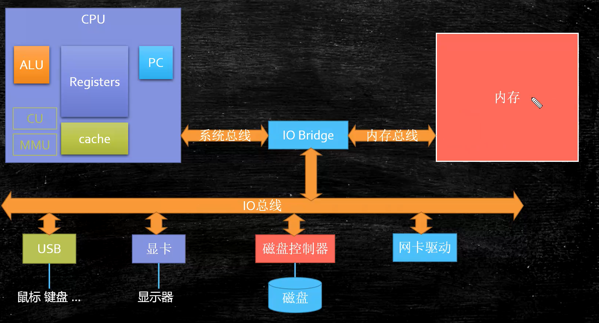
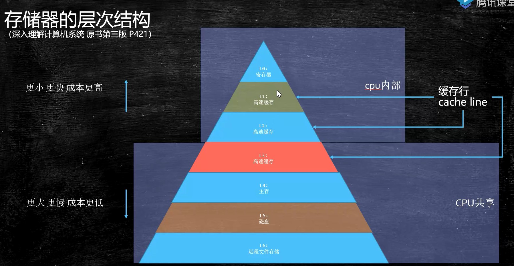
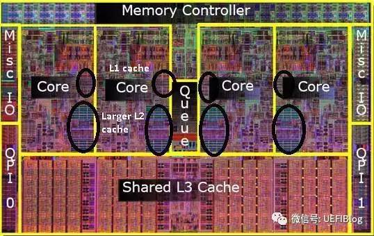
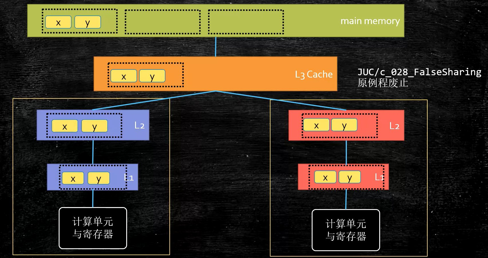
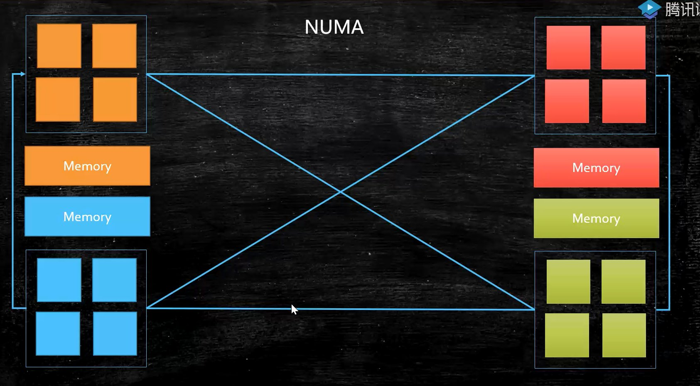
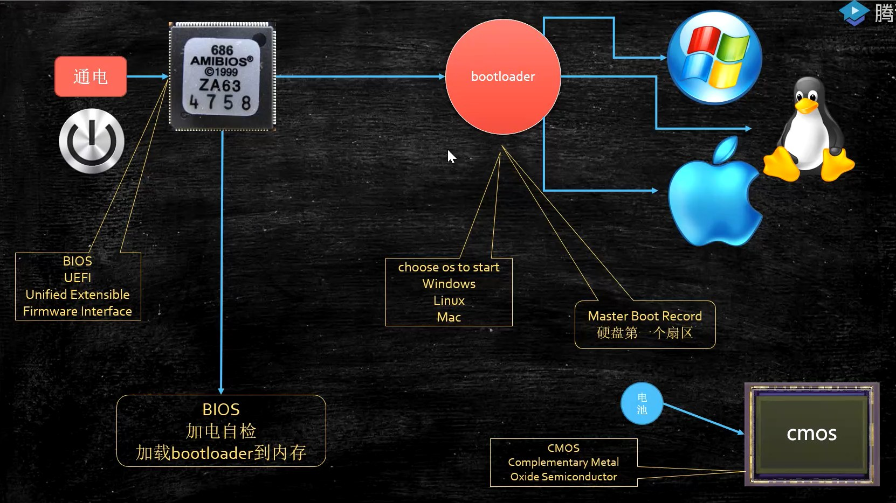
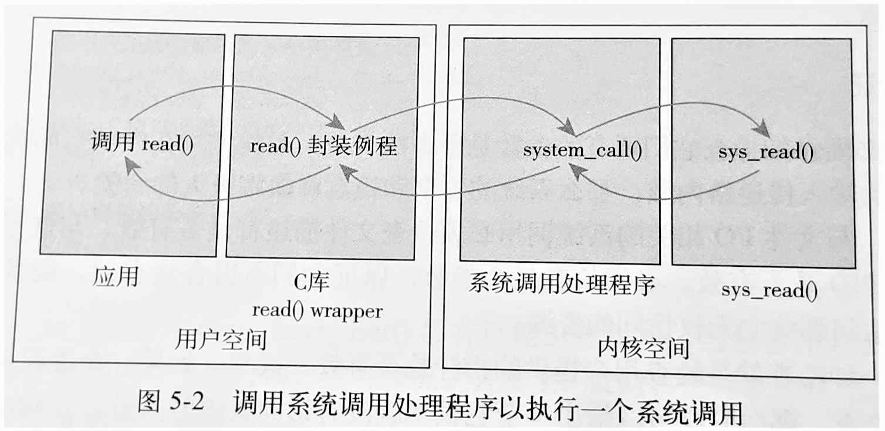

# 计组、操作系统

汇编和操作系统代码，又是不同层面的东西。汇编是针对CPU编程。系统内核方法，是针对操作系统编程。

#### CPU电路原理


#### CPU的基本组成

PC -> Program Counter 程序计数器 （记录当前指令地址）
Registers -> 暂时存储CPU计算需要用到的数据
ALU -> Arithmetic & Logic Unit 运算单元
CU -> Control Unit 控制单元
MMU -> Memory Management Unit 内存管理单元

#### 超线程

一个ALU对应多个Registers

切换线程的时候不需要进行上下文切换，只需要切换到对应的Registers即可


#### 计算机的组成



#### 存储器的层次结构

添加缓存，是为了解决 CPU 到不同部件的速度差别过大的问题



#### 多核CPU

不同的核心有各自独立的 L1，L2，但共享 L3 级缓存。为什么是3级？这是工业上的经验值。

按块读取：根据程序局部性原理，提高效率，充分发挥总线CPU针脚一次性读取更多数据的能力

读取数据是通过 DMA 硬件进行的，直接内存访问，用来做数据的搬运。通过协处理器，而不需要走CPU。偏向硬件，驱动开发的人员会接触。




#### 缓存行对齐伪共享问题

##### 缓存行大小

缓存行越大，局部性空间效率越高，但读取时间慢；缓存行越小，局部性空间效率越低，但读取时间快。取一个折中值，目前 Intel CPU 缓存行 64 字节

##### Intel CPU 缓存一致性协议

怎么保证数据的一致性？Intel MESI 缓存一致性协议，数据四种状态：

- M: 被修改（Modified)

  该缓存行只被缓存在该CPU的缓存中，并且是被修改过的（dirty),即与主存中的数据不一致，该缓存行中的内存需要在未来的某个时间点（允许其它CPU读取请主存中相应内存之前）写回（write back）主存。当被写回主存之后，该缓存行的状态会变成独享（exclusive)状态。

- E: 独享的（Exclusive)

  该缓存行只被缓存在该CPU的缓存中，它是未被修改过的（clean)，与主存中数据一致。该状态可以在任何时刻当有其它CPU读取该内存时变成共享状态（shared)。同样地，当CPU修改该缓存行中内容时，该状态可以变成Modified状态。

- S: 共享的（Shared)

  该状态意味着该缓存行可能被多个CPU缓存，并且各个缓存中的数据与主存数据一致（clean)，当有一个CPU修改该缓存行中，其它CPU中该缓存行可以被作废（变成无效状态（Invalid））。

- I: 无效的（Invalid）

  该缓存是无效的（可能有其它CPU修改了该缓存行）。

其工作原理是，当CPU1在获取计算机内存i时，这是CPU2也可以获取这个变量 i。当CPU1对它取回的变量进行操作后。CPU1的i会被标记为被修改的（Modified），他需要将 i 写入主内存将i标记为独享状态（Exclusive），这时CPU1会立即将i这个变量写入计算机内存。这时计算机内存中的i会被标记为共享的(Shared)同时CPU2中的i会被标记为无效的(Invalid)，然后CPU2就只能重新从计算机内存中获取新的i变量。然后在进行CPU2中i的操作。

##### 其他 CPU 缓存一致性协议

其他厂商的 CPU 也有缓存一致性协议，例如 MSI，MESI，MOSI，Synapse，Firefly，Dragon 等等。

尽管有缓存一致性协议，有些无法被缓存的数据，或者跨越多个缓存行的数据，依然必须使用总线锁。



一种情况，假设有两个线程想要修改的数据，位于同一个缓存行 cache line，你改的时候要通知我，我改的时候要通知你，于是因为缓存行的存在，相比没有缓存行而言，反而效率会比较低。

于是诞生了一种编程模式：缓存行对齐，对于某些高竞争级别访问的数据，为了保证不发生伪共享，可以采用缓存行对齐的编程方式，即，使用多个 long 类型的变量，将数据前后缓存行撑起来。

例如：单机最快的内存消息队列 disruptor，核心是一个 ring buffer 环形缓冲区，它的 cursor 游标前后分别放了 7个 long 类型数字。

- JDK1.7 中，很多采用 long padding 提高效率，例如 LinkedBlockingQueue

- JDK1.8 中，加入了`@Contended`注解（实验）需要加上：`JVM -XX:-RestrictContended`
- JDK1.9 中，`@Contended` 注解失效了...不建议你在实际项目中使用缓存行对齐的方式加快效率，除非你的项目追求极致


#### 非同一访问内存 NUMA

UMA：同一内存访问。多个CPU通过一条总线，访问同一个内存。
现在很多服务器的架构是使用NUMA的，因为UMA不以拓展：随着CPU的数量增多，许多时间被浪费在CPU争抢内存资源上。

NUMA：非同一访问内存。每个CPU有自己专属的内存，CPU对于自己插槽上的内存访问是有优先级的。

ZGC 垃圾回收器可以做到 NUMA aware，如果探测到计算机实现了NUMA的话，分配内存会优先分配该线程所在CPU的最近内存。




#### 操作系统启动过程

通电 -> bios uefi 工作 -> 自检 -> 到硬盘固定位置加载 bootloader -> 读取可配置信息 -> CMOS

bootloader 在硬盘上的位置是固定的，放在硬盘的第一个扇区上

CMOS 用来存储可以配置的信息，需要通电才能存储信息，例如开机密码。主板上有块电池给它通电。

操作系统的第一条指令在硬盘中也是固定的




### 汇编语言（机器语言）的执行过程

汇编语言的本质：机器语言的助记符 其实它就是机器语言

计算机通电 -> CPU读取内存中程序（电信号输入）->时钟发生器不断震荡通断电 ->推动CPU内部一步一步执行（执行多少步取决于指令需要的时钟周期）->计算完成->写回（电信号）->写给显卡输出（sout，或者图形）


### 名词

异地持久化


### 常识

> 秒 > 毫秒 > 微妙 > 纳秒

磁盘寻址：毫秒级别（磁头移动等）

内存寻址：纳秒级别（磁盘、内存差距10W倍）

##### 吞吐量：单位时间可以读取的数据

磁盘IO：百兆级别（SATA3 几百MB，PCI-E GB级别）


### 总线的分类

数据总线、地址总线、控制总线


### 进程、线程

<font color="red">**进程 **</font> 是操作系统 <font color="red">**分配资源**</font> 的基本单位，<font color="red">**线程**</font> 是操作系统执行 <font color="red">**调度**</font> 的基本单位。

#### 进程

- 进程 是处于执行期的程序以及相关资源的总称，分配了独立的内存空间
- 所有的进程都是 PID 为 1 的 init 进程的后代
- 内核把进程的列表放在任务队列  task list 中，链表中的每一项都是 **进程描述符**
  - 进程描述符包含：它打开的文件、进程的地址空间、挂起的信号、进程的状态等
- 进程状态
  - 运行：进程是可执行的
  - 可中断：正在睡眠，等待某些条件的达成，可以因为收到信号而提前被唤醒
  - 不可中断：即使收到信号，也不会被唤醒
  - 被其他进程跟踪：例如通过 ptrace 对调试程序进行跟踪
  - 停止：进程没有投入运行，也不能投入运行
- **进程的创建**
  - Linux 中，父进程通过 `fork()` 创建子进程，`fork()` 内部调用的是 `clone()`
  - Linux 的 `fork()` 使用 **写时拷贝** 页实现
- **进程的调度**
  - Linux 使用 CFS（Completely Fair Scheduler 完全公平调度）
    - 确保给每个进程公平的 **处理器使用比**，按 **优先级** 分配 **时间片的比例**，记录每个进程的执行时间，如果有一个进程执行时间不到他应该分配的比例（比如给了你50%，你只用了10%），就优先执行这个进程作为补偿。例如，一个是用户鼠标移动优先级高，另一个是 IO 密集型优先级低
    - 用 **红黑树** 维护 **可运行进程队列**，每次运行红黑树中 **最左边叶子结点** 代表的进程
    - 分为实时进程（始终优先于普通进程）、普通进程（根据 nice 值分配时间片）


###### 1、僵尸进程

在大多数情况下，少量僵尸进程的存在，对操作系统没有太大影响，它基本不再占用任何资源了，它在内存中唯一占用的资源就是PCB了。僵尸进程的产生原因，有可能父进程是一个daemon进程，C程序开发人员在父进程没有释放子进程，这时会出现僵尸进程。可以使用内核中的`wait`函数，释放僵尸进程。

###### 2、孤儿进程

孤儿进程产生的原因：子进程还活着，父进程挂了。孤儿进程和孤儿线程没有太大区别，因为在Linux中，进程和线程没有太大区别。孤儿进程的影响：影响不大。

#### 线程

- 线程是在进程中活动的对象
- 内核调度的对象是 **线程**，而不是 进程
- Linux 把所有的线程都当做进程来实现，线程仅仅被视为一个与其他进程共享某些资源的进程，只不过和其他线程共享同一个主进程中的内存空间 ——《Linux内核设计与实现》
- 线程共享进程的内存空间，没有自己独立的内存空间

##### 思考：java线程是用户级线程还是内核级线程？

1. java 线程不是纯用户级线程：java中有个 fork join 框架，利用多处理技术进行 maprudce 的工作，证明了内核是可以感知到用户线程的存在，因此才会将多个线程调度到多个处理器中。

   java应用程序中的某个线程阻塞，是不会引起整个进程的阻塞。

2. java 线程不是纯内核级线程：如果使用纯粹的内核级线程，那么有关线程的所有管理工作都是内核完成的，用户程序中没有管理线程的代码。显然，java线程库提供了大量的线程管理机制，因此java线程绝不是纯粹的内核级线程。

   马士兵：“ JVM 线程和内核中的线程是 1:1 的关系”

3. 综上，java线程是混合型的线程模型，一般而言，是通过lwp将用户级线程映射到内核线程中。

补充：《现代操作系统》P79：“Java 支持用户级线程”


#### 协程（纤程）

##### 线程和协程的区别

协程就是用户态的线程。协程和线程的区别在于：**线程切换需要陷入内核，然后进行上下文切换，而协程在用户态由协程调度器完成，不需要陷入内核**，这代价就小了；另外，协程的切换时间点是由调度器决定的，而不是系统内核决定的，尽管他们切换点都是时间片超过一定阈值，或者进入I/O或睡眠等状态；再次，还有垃圾回收的考虑，因为go实现了垃圾回收，而垃圾回收的必要条件时内存位于一致状态，这就需要暂停所有的线程，如果交给系统去做，那么会暂停所有的线程使其一致，而在go里面调度器知道什么时候内存位于一致状态，那么就没有必要暂停所有运行的协程。

##### JVM 线程与 OS 线程映射关系

JVM（HotSpot）和操作系统的线程是**一一对应**的：JVM空间的一个线程，对应操作系统中的一个线程，这是重量级线程。

操作系统可以开启的线程是有限的（1万个已经很卡了），而**纤程**是**用户空间**的，不需要与内核打交道，轻量级，切换速度快，可以启动几万个，甚至几十万个都没有问题。

##### 用户线程与内核线程映射关系

对线程来说，有三种映射模型：

- 一对一模型（1:1）。一个用户线程映射到一个内核线程，用户线程在存活期都会绑定到一个内核线程，一旦退出，2个线程都会退出。优点是实现了真正的并发，多个线程同时跑在不同的CPU上；缺点是，如果用户线程起多了，内核线程肯定不够用，那么就需要切换，涉及到上下文的切换，代价比较大。
- 多对一模型（M:1）。多个用户线程映射到一个内核线程。优点是，多个用户线程切换比较快，不需要内核线程上下文切换；缺点是，如果一个线程阻塞了，那么映射到同一个内核线程的用户线程将都无法运行。
- 多对多模型（M:N）。综合以上两种模型，go采用的就是这种。

##### 纤程

纤程可以被理解为：线程里的线程，在JVM层级用软件进行内部的线程协调。
纤程是被 JVM 管理，运行在用户态，操作和调度不经过操作系统内核。
关于纤程的实现：纤程可以分配自己独立的纤程栈，相当于自己实现了一个小小的操作系统级别的调度程序。

Java 通过 Quaser 类库可以支持纤程，但目前还不是很成熟，据说如果大规模应用在生产级别的话，还是有一些小bug存在的。

##### 纤程的优势

1、占有资源很少。操作系统启动一个线程，占用 1M 的内存空间，而启动一个纤程只需要 4K 空间
2、由于轻量级，切换简单
3、由于轻量级，可以启动几十万个纤程都没有问题。


### 原语

- 是一种特殊的程序，运行在 **内核态**
- 处于操作系统最底层，是最接近硬件的部分
- 这种程序的运行具有原子性，只能一气呵成，**不可被中断**
- 运行时间较短、调用频繁
- 原语采用“关中断指令”和“开中断指令”实现


### 中断、系统调用

系统调用表及源码链接 https://filippo.io/linux-syscall-table/



**系统调用** 是用户空间访问内核的唯一手段，除 **异常** 和 **陷入** 外，它是内核的唯一合法入口。

Linux 的系统调用，作为 C 库的一部分提供，**用户空间进程** 用 **系统调用号** 来指明执行哪个系统调用。

进行系统调用的步骤：

1. 用户空间应用程序把 **系统调用号** 放入 eax 寄存器中，**外部参数** 放在另外的 5 或 6 个寄存器中
2. 应用程序通过 `int $0x80` 触发 **软中断**（异常），系统切换到内核态，执行 **128 号异常处理程序**，即 `system_call()` **系统调用处理程序**
3. `system_call()` 运行，从 eax 寄存器中得到 **系统调用号**，检查其有效性，然后 **执行相应的系统调用**
4. 内核在执行系统调用的时候，处于 **进程上下文**。在进程上下文中，内核 **可以休眠**，并且 **可以被抢占**
5. **系统调用返回** 的时候，`system_call()` 负责 **切换回用户空间**，并让用户进程继续执行 `int $0x80` 的下一条指令

```asm
# Simple program that exits and returns a status code back to the Linux kernel
./section .data # 以.为开头的名称不会被翻译为机器指令，而是作为一种汇编提示告知汇编器 ，这个形式直接被称为 “汇编指令” 或 ”伪操作“
./section .text # .text 段位保存代码， 是只读和可执行的。后面的指令都是属于 .text 段。 
.globl _start # 告诉编译器，_start 这个符号就像c程序中的main函数一样，是整个程序的入口
_start : # 是一个符号，符号在汇编中表示一个地址，可以再指令中 ，汇编程序经过汇编器的处理后， 所有的符号都被替换成为它所代表的地址值。（通俗说，c语言中的函数变量名都属于符号）
# movl 是一条数据传送指令，要求CPU内部产生一个long数字1并保存到eax寄存器中。
# 1表示在CPU内部产生 ，称为立即数，立即数在前面要加个$ ,寄存器就加个%
movl $1 ,%eax # eax 寄存器用来指定系统调用号
movl $4 ,%ebx # _ebx 的值是传给 _exit 的参数，表示退出状态。_exit 的系统调用号为1。
int $0x80 # int 指令中的立即数 0x80 是一个参数，可以用于执行系统调用
```


### 用户态、内核态

**Intel CPU 分为三级：ring 0，1，2，3三个级别**

Linux 只使用了 0，3 两个级别。

Linux 内核是运行在 ring 0 级别的，能访问所有指令；应用程序只能访问 Ring 3 级。

用户空间的应用程序运行在 ring 3 级别，某些指令是不能被访问的，想要读硬盘、写硬盘、写网卡等，对于系统的关键访问，需要通过操作系统内核，因此需要转换为内核态。正是因为这样的分层，使得现在的Linux，Windows非常健壮，不会轻易被程序搞崩。

Linux 内核提供了 200 多个系统调用，例如 `sendfile` `read` `write` `pthread` `fork`等对外暴露的函数。

**内核空间**：只有内核能访问的空间。用户是不可能将这块内存干掉的。
**用户空间**：用户可以直接操作的空间。

### mmap

mmap 将 **用户的线性地址空间** 直接映射到了 **内核的 pagecache 地址**，如果是脏的需要写的话，依然受pagecache 的影响，才能最终刷写到磁盘中去。


### 内存管理


**DOS时代** - 同一时间只能有一个进程在运行（也有一些特殊算法可以支持多进程）

**windows9x** - 多个进程装入内存存在的问题：

- 内存不够用
- 互相打扰

为了解决这两个问题，诞生了现在的内存管理系统：使用虚拟地址、分页装入、软硬件结合寻址。

将内存分页（因为内存不够用），内存中分成固定大小的页框`4K`，把硬盘上的程序也分成`4K`大小的块。另外维护一个页框`page frame`，用到哪一块，就将哪一块加载进内存中。

例如，执行QQ.exe时，把它的页表记录下来，执行时，用到页表中的哪一页，就将这页加载进内存中。
在加载的过程中，如果内存已经满了，会把最不常用的一块放到`swap`分区， 把最新的一块加载进来，这个就是著名的LRU算法。**这就是交换分区的由来。**

##### LRU算法（解决内存不够用的问题）


LeetCode 146 题，头条要求15分钟内手撕，阿里去年也要求手撕。

只允许使用 `HashMap` 实现 LRU 算法，哈希表（保证查找操作`O(1)`） + 双向链表 （保证排序操作和新增操作 `O(1)`））

> - LRU (Least recently used) 最近最少使用，如果数据最近**时间**被访问过，那么将来被访问的几率也更高。
> - LFU (Least frequently used) 最不经常使用，如果一个数据在最近一段时间内使用**次数**很少，那么在将来一段时间内被使用的可能性也很小。


#### 虚拟内存

以DOS Win31 …这类系统为例，A进程、B进程是可以互相操作内存的。为了保证互不影响，让进程工作在**虚拟空间**。在程序中用到的空间地址不再是直接的物理地址，而是虚拟的地址，这样，A进程永远不可能访问到B进程的空间。

**虚拟空间多大呢？**虚拟空间的大小就是寻址空间，要看操作系统是多少位的。例如，64位系统的虚拟空间是`2^64`，32为系统的虚拟空间是`2^32`。虚拟空间比物理空间大很多 ，单位是 `byte`

**为什么使用虚拟内存？**站在虚拟的角度，进程是独享整个系统 + CPU

**地址是怎么映射的？**内存映射：偏移量 + 段的基地址 = 线性地址 （虚拟空间）
线性地址，是通过 OS + MMU（Memory Management Unit内存管理单元）来映射到真正的物理地址。只有操作系统内核知道虚拟内存中地址对应的真正的物理地址，应用程序是不知道的，这样保证了系统的安全。

#### 缺页中断

进程P1,P2,P3,P4都认为自己是独占整个内核的，实际上是共享操作系统内核。
MMU给每一个进程分配他们的内存资源。
如果内存装满了，使用LRU算法将最不常使用的页放入硬盘的交换空间中。

在执行一条指令时，如果发现需要用到页在内存中没有，那么停止该指令的执行，并产生一个缺页异常（中断），由内核处理并加载，之后，原先引起的异常的指令就可以继续执行，而不再产生异常。


### Linux 内核同步机制

#### 关于同步理论的一些基本概念

- 临界区（critical area）: 访问或操作共享数据的代码段
  简单理解：synchronized大括号中部分（原子性）
- 竞争条件（race conditions）两个线程同时拥有临界区的执行权
- 数据不一致：data unconsistency 由竞争条件引起的数据破坏
- 同步（synchronization）避免race conditions
- 锁：锁是完成同步的手段（门锁，门后是临界区，只允许一个线程存在）
  上锁解锁必须具备原子性（如果连上锁的过程都会被打断的话，就没有什么意义了）
- 原子性（象原子一样不可分割的操作）
- 有序性（禁止指令重排）
- 可见性（一个线程内的修改，另一个线程可见）

互斥锁 排他锁 共享锁 分段锁

#### Linux 内核同步常用方法

了解一下Linux内核实现的一些同步方法，了解一些关于线程控制的理论知识，可以去印证Java层面的同步知识。
用的话要用C语言去调用。

1. **原子操作** – Linux内核中提供了类似于 Java 中的 AtomicXXX 的原子操作，位于Linux内核源码的头文件``，是从原语层面的支持，不需要实现CAS
2. **自旋锁** – 内核中通过汇编支持的CAS自旋锁，位于``。
3. **读-写自旋** – 类似于`ReadWriteLock`，可以同时读，但只能一个写
   相当于：**读**的时候是共享锁，**写**的时候是排他锁
4. **信号量** – 类似于Java中的`Semaphore`(PV操作，down up操作，就是占有锁和释放锁）
   是一个重量级锁，线程会进入wait，适合长时间持有的锁情况
5. **读-写信号量** – downread upread downwrite upwrite
   （多个写，可以分段写，比较少用）(分段锁）
6. **互斥体**(mutex) – 特殊的信号量（二值信号量）
7. **完成变量** – 特殊的信号量（A发出信号给B，B等待在完成变量上）
   vfork() 在子进程结束时通过完成变量叫醒父进程 类似于(Latch)
   在网络编程中有完成端口(Completion Port)
8. **BKL**：大内核锁 Big kernel lock（早期，现在已经不用）
9. **顺序锁**（内核版本2.6之后新增加的）： – 线程可以挂起的读写自旋锁
   序列计数器（从0开始，写时增加(+1)，写完释放(+1)，读线程不对计数器做任何操作）
   写的时候，不妨碍读线程：
   如果读线程发现是偶数，说明在读的时候没有任何人改变过。
   如果读线程发现是奇数，说明你读到的可能是中间状态，你可以选择继续自旋，等待值变为偶数。
   读前读后序列一样，说明没有写线程打断。
10. **禁止抢占** – `preempt_disable()`：我这个线程在执行过程中，不允许任何线程打断我。
11. **内存屏障** – 见 volatile


### Linux VFS 虚拟文件系统

Virtual Filesystem Switch，虚拟文件系统，是一个目录树。树上不同的节点可映射到物理的文件地址，可挂载。

相当于一个解耦层，在具体的文件系统之上抽象的一层，为能够给各种文件系统提供一个通用的接口，使上层的应用程序能够使用通用的接口访问不同文件系统、不同的驱动。

#### 硬链接、软链接

- 硬链接
  - 两个变量名指向了同一个物理位置，硬链接的文件拥有相同的 inode，操作系统是靠inode来区分文件的。2个inode相同的文件，代表它们是一个文件。 
  - 如果删掉了其中一个文件，另外一方还能找到这个文件。相当于只是删除了一个引用。除非你把硬链接和源文件都删除， 这个文件才被删除。
- 软链接
  - 软链接是两个独立的文件，相当于创建了一个“快捷方式”
  - 文件的共享用户只有该文件的 **路径名**，只有文件拥有者才拥有 **指向其索引节点的指针**
  - 当符号链接被删除时，并不会影响源文件。但是当源文件被删除时，符号链接就找不到源文件了，会标红报错。
  - 软链接有着 **自己的 inode 号** 以及用户数据块。
  - 软链接可跨文件系统，硬链接不行
- 共性
  - 无论是硬链接还是软连接，如果修改任意一方，另外一个文件也会看到这个变化。

#### 文件描述符 fd

任何程序都有：0 标准输入，1 标准输出， 2 报错输出

- `lsof` 列出系统中打开的文件

  `lsof -op $$`看见当前进程的文件描述符的细节，包括偏移量、指针等等

- `/proc/$$/fd`是当前程序的所有的文件描述符


### PageCache  页缓存

PageCache  通常 4K，本来是用来优化IO的性能（优先走内存），但它的缺点是刷写硬盘不及时，在突然关机或异常断电时，有丢失数据的可能

##### 为什么 Java 程序员不要使用直接 IO，而要使用 Buffered 形式的IO？

一次写一个缓冲区大小，减少调用 write 的次数，只不过是每一次写入的数据量比较大。减少了用户态到内核态的来回切换带来的性能损耗。

- ByteBuffer
  - `allocate`将字节数组分配到了堆上，是 **JVM 堆内** 的线性地址空间
  - `allocateDirect`将字节数组分配到 **JVM 的堆外** 内存中，是 C 语言可以直接访问的。


> 操作系统没有绝对的数据可靠性。为什么要设计 pagecache，是为了减少硬件的IO的调用，想要优先使用内存，这样能够提速。如果追求性能，就要在一致性、可靠性之间做出权衡。
>
> 从大方面来看，在现在的分布式系统当中，如果你追求数据存储的可靠性（保持缓存和磁盘的强一致，对于每一次对数据的微小改变，都要去刷写磁盘），仍然避免不了单点故障的问题。单点故障会让你为了保持强一致而耗费的能损耗一毛钱收益都没有。
>
> 这就是为什么我们使用主从复制、主备HA
> 这就是为什么 Kafka，ES 都有副本的概念，而副本是从 socket 得到的。副本又分为同步的异步的区别，这些都是后话了，我们以后再讲…


# Linux

### Linux 目录树

**常见目录说明：**

- **/bin：** 存放二进制可执行文件(ls、cat、mkdir等)，常用命令一般都在这里；
- **/etc：** 存放系统管理和配置文件；
- **/home：** 存放所有用户文件的根目录，是用户主目录的基点，比如用户user的主目录就是/home/user，可以用~user表示；
- **/usr ：** 用于存放系统应用程序；
- **/opt：** 额外安装的可选应用程序包所放置的位置。一般情况下，我们可以把tomcat等都安装到这里；
- **/proc：** 虚拟文件系统目录，是系统内存的映射。可直接访问这个目录来获取系统信息；
- **/root：** 超级用户（系统管理员）的主目录（特权阶级^o^）；
- **/sbin:** 存放二进制可执行文件，只有root才能访问。这里存放的是系统管理员使用的系统级别的管理命令和程序。如ifconfig等；
- **/dev：** 用于存放设备文件；
- **/mnt：** 系统管理员安装临时文件系统的安装点，系统提供这个目录是让用户临时挂载其他的文件系统；
- **/boot：** 存放用于系统引导时使用的各种文件；
- **/lib ：** 存放着和系统运行相关的库文件 ；
- **/tmp：** 用于存放各种临时文件，是公用的临时文件存储点；
- **/var：** 用于存放运行时需要改变数据的文件，也是某些大文件的溢出区，比方说各种服务的日志文件（系统启动日志等。）等；
- **/lost+found：** 这个目录平时是空的，系统非正常关机而留下“无家可归”的文件（windows下叫什么.chk）就在这里。


### Linux 文件类型

Linux支持很多文件类型，其中非常重要的文件类型有: 普通文件，目录文件，链接文件，设备文件，管道文件，Socket套接字文件等。


### Linux 常用命令

#### 进程相关

**`ps -ef` / `ps -aux`：** 查看当前系统正在运行进程，展示格式不同。如果想查看特定的进程，使用：**`ps aux | grep redis`** （查看包括redis字符串的进程），也可使用 `pgrep redis`

**`kill -9 进程pid`：** 杀死进程（-9 表示强制终止）

#### 网络相关

**网络通信命令：**

- 查看当前系统的网卡信息：ifconfig / ip -a
- 查看当前系统的端口使用：netstat -an