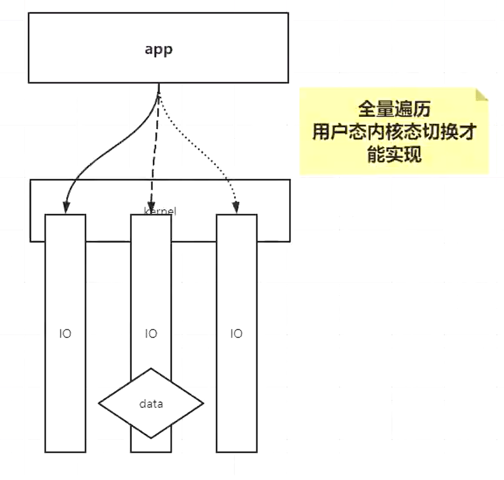

# BIO，NIO，epoll

### 同步/异步模型、阻塞/非阻塞模型

>  **同步**：当一个同步调用发出后，调用者要一直等待返回结果。通知后，才能进行后续的执行。
>  **异步**：当一个异步过程调用发出后，调用者不能立刻得到返回结果。实际处理这个调用的部件在完成后，通过状态、通知和回调来通知调用者。
>  **阻塞**：是指调用结果返回前，当前线程会被挂起，即阻塞。
>  **非阻塞**：是指即使调用结果没返回，也不会阻塞当前线程。
>
>  比喻：
>  小Q去钓鱼，抛完线后就傻傻的看着有没有动静，有则拉杆(同步阻塞)
>  小Q去钓鱼，拿鱼网捞一下，有没有鱼立即知道，不用等，直接就捞(同步非阻塞)
>  小Q去钓鱼，这个鱼缸比较牛皮，扔了后自己就打王者荣耀去了，因为鱼上钩了这个鱼缸带的报警器会通知我。这样实现异步(异步非阻塞）

##### 同步、异步 IO

客户端在请求数据的过程中，能否做其他事情

- 同步模型：程序自己调用 recv 读取数据，程序在 IO 上的模型就叫 **同步模型**
- 异步模型：程序把读取的过程交给 **内核**，自己做自己的事情，叫 **异步模型**

同步的意思是：客户端与服务端 相同步调。就是说 服务端 没有把数据给 客户端 之前，客户端什么都不能做。它们做同样一件事情，就是说它们有相同步调，即同步。

##### 阻塞、非阻塞

客户端与服务端是否从头到尾始终都有一个持续连接，以至于 **占用了通道**，不让其他客户端成功连接。

阻塞的意思是：客户端与服务端之间是否始终有个东西占据着它们中间的通道。就是说 客户端与服务端中间，始终有一个连接。导致其他客户端不能继续建立新通道连接服务器。

##### 那么，BIO NIO AIO就可以简单的理解为：

- BIO（同步阻塞）：客户端在请求数据的过程中，**保持一个连接（阻塞）**，**不能做其他事情（同步）**。
- NIO（同步非阻塞）：客户端在请求数据的过程中，**不用保持一个连接（非阻塞）**，不能做其他事情。（许多个小连接，也就是轮询）
- AIO（异步非阻塞）：客户端在请求数据的过程中，不用保持一个连接，**可以做其他事情**。（客户端做其他事情，数据来了等服务端来通知。）


### BIO 同步阻塞

- 阻塞式的 `ServerSocket`
  - 阻塞地等待客户端的连接，连接后抛出一个线程
  - 阻塞地等待客户端发送消息
  - C10K 问题，如果有1万个连接，就要抛出1万个线程
  
  

### NIO 同步非阻塞



Java：New IO 新的 IO 包

OS：Non-Blocking IO 非阻塞的 IO

- 非阻塞式的 `ServerSocketChannel`
  - `ss.configBlocking(false)` 设置非阻塞
  - 在`accept(3,`中空转，要么返回client的描述符，要么返回-1，如果拿到了新的连接，调用clientList.add()
- 缺点
  - `ByteBuffer`只有一个指针，用起来有很多坑
  - NIO的存在的问题：C10K问题

    - 放大：C10K当并发量很大的时候，需要遍历的文件描述符会很多，**每循环 **一次，**都要调用 10K 次recv 系统调用**（复杂度O(n)），进行用户态到内核态的切换，性能损耗大。
    - 缩小：你调用了 **那么多次 recv 系统调用**，但是如果 C10K 只有 1 个 Client 发来了数据，**只有 1 次系统调用是有效的**，剩余 n-1 次的监听都是无效的。我们希望，能够有一种方式，只需要调用 **有效** 的 **recv 系统调用** 就可以。
    
    

### 多路复用器 select poll epoll 同步非阻塞

OS 提供的 **多路复用器** 有 `select`, `pool`, `epoll`, `kqueue` 等

select，poll 的缺点是，每次你调用的时候，都需要将所有的文件描述符的集合 fds 作为参数传递给函数，而 epoll 的优势是在内核中开辟了一个空间（调用的是 epoll_create）

 Java 把所有的多路复用器封装成了 **Selector 类**

可以在启动时，指定使用哪种多路复用器（默认优先选择 epoll），注意 windows 上是没有 epoll 的。

```shell
-Djava.nio.channels.spi.SelectorProvider=sun.nio.ch.EPollSelectorProvider
```

- 允许程序去调用内核，来监控更多的客户端，直到一个或多个文件描述符是可用的状态，再返回。减少了用户态、内核态的无用切换。

- Linux 内核提供的 `select(传入参数:一堆文件描述符)` 多路复用器，会返回给程序一个 list，告诉程序 **哪些 fd 是可以读/写的状态**，然后**程序要自己读取**，这是 IO 同步模型。使用方法是：先调用 select，O(1) 复杂度，拿到有状态的fd，然后再进行 recv，复杂度 O(m)。要注意的是，select 传入的 fds 有最大是 1024 个的限制，poll 没有这个限制，所以用的更多的是 poll / epoll。

  为什么 select 要传入你这个应用的文件描述符作为参数？是因为 kernel 可能同时维护了很多其他的 IO，所以你要让内核知道只去遍历你的 IO 就行了。只不过，NIO 的遍历操作成本消耗在用户态内核态的切换上，而 select、poll 的情况下，这个遍历的过程只触发了一次系统调用，只需要一次用户态内核态的切换，就能够把很多的文件描述符传递给内核，内核**重新**（不保留之前状态）根据用户这次调用传过来的 fds，遍历并修改 fds 的可读可写状态。

  只有当 read 系统调用不需要你程序自己去做的时候，才属于异步的 IO，目前只有 windows iocp 实现了。

- 缺点
  
  - 每次都要重新传递 fds，每次内核被调用之后，都要针对这次调用产生一个遍历 fds 的全量的复杂度
  - 如果有很多长连接，内核每次都要给程序传递很多连接对象

### 多路复用器 epoll 同步非阻塞

相比 poll 来讲，epoll 比较依赖于内核自己的实现，在 linux 上是 epoll，在 unix 上是 kqueue，所有的多路复用器都遵守了 POSIX 的规范，select 是在哪个系统下都可以有的，实现的比较早，然后各个操作系统内核都有自己向上的优化。相当于 select 是 P5，poll 是 P6，epoll / kqueue 就是 P7/P8 了。

网卡中的数据先到达内存（DMA方式），然后最终通过中断，有 callback 回调函数事件响应，最终和 fd 关联起来。在 epoll 之前的 callback：只是完成了将网卡发来的数据，走内核网络协议栈（2,3,4层协议），最终关联到 fd 的 buffer。无论是 DMA 也好，网卡里的 buffer 也好，做的是把网卡里的数据挪到内核的 fd 的 buffer 中去，然后未来你 application 跟我要的时候，我可以读走。只不过在将数据拷贝到 buffer 里的时候，再加入一个操作，就是在内核里面的内存区域除了有 fd 的 buffer，还加入了一个红黑树，然后从红黑树中找 fd，将 fd 放在另外一个区域（一个list）里面。未来你程序只需要调一个 epoll_wait，就可以把这个list拿走了，你调 epoll_wait 的时候，就不像 select 那样需要一个遍历的过程，因为你在 event 到达的时候已经把事情全做了，把遍历的过程打散到事件到达，该忙的事情已经在终端里面忙完了，调 epoll_wait 的时候不需要再有一个内核忙碌的过程。所以你某一时间，如果从 application 询问内核某一个或者某些 fd 是否可读/可写，会有状态返回。如果内核在 callback 的处理中再加入（红黑树），

Nginx, Redis（C写的） 底层都使用了 epoll

假设你是一个 server 端，你需要调用的系统调用包括 socket（假设返回一个fd4），bind，listen fd4，这样你才能监听一个fd。内核做的，是建立一个红黑树，然后在基于中断处理完 fd 的 buffer 之后，做了一个延伸，去维护红黑树和链表。 基于中断的处理是内核中必然有的，epoll 相当于只是一个补丁，规避了遍历 fd 的问题。

可以使用 `strace` 命令，来监控指定的程序（字节码）发生了哪些系统调用

- epoll 也是多路复用器，但是它有一个 **存放结果集的链表**，**它与 select / poll 的区别如下：**

  - select：应用程什么时候调用 select，内核就什么时候遍历所有的文件描述符，修正 fd 的状态。

  - epoll：应用程序在内核的 **红黑树** 中存放过一些 fd，那么，内核基于中断处理完 fd 的 buffer/状态 之后，继续把有状态的 fd 拷贝到链表中。

    即便应用程序不调用内核，内核也会随着中断，完成所有fd状态的设置。这样，程序调用`epoll_wait`可以及时去取链表包含中有状态的 fd 的结果集。规避了对于文件描述符的全量遍历。

    拿到 fd 的结果集之后，**程序需要自己取处理 accept / recv 等系统调用的过程**。所以`epoll_wait`依然是同步模型。

- Epoll 是 Event poll，把有数据这个事件通知给程序，它不负责读取 IO，还需要程序自己取读取数据

- `man epoll` 帮助文档：

  The `epoll` API performs a similar task to `poll`(2): monitoring multiple file descriptors to see if I/O is possible on any of them.  The `epoll` API can be used either as an edge-triggered(边缘触发) or a  level-triggered(条件触发)  interface and scales well to large numbers of watched file descriptors(可以很好地扩展到大量监视文件描述符).  The following system calls are provided to create and manage an epoll instance. [ 注：这里 (2) 的意思是 2 类系统调用。类似地，还有 7 类杂项]

  - `epoll_create` creates an epoll instance  and  returns  a  file  descriptor  referring  to  that instance.

    创建成功之后，**返回一个 fd 文件描述符** 例如 `fd6`。实际上是在内核开辟一块空间，里面存放**红黑树**。

  - `epoll_ctl`, This  system  call  performs  control  operations  on  the `epoll`(7) instance referred to by the file descriptor epfd.  It requests that the operation op be performed for the target file descriptor, fd. 

    ```c
    int epoll_ctl(int epfd, int op, int fd, struct epoll_event *event);
    // epoll_create = 4
    // epoll_ctl(4, add, 7, accept)
    ```

    例如，在文件描述符`fd6`中，使用 `EPOLL_CTL_ADD` 添加服务器用于 listen 的文件描述符

    - 此系统调用对文件描述符 epfd 引用的 epoll(7) 实例执行控制操作，`int op` 可选参数：`EPOLL_CTL_ADD`, `EPOLL_CTL_MOD`, `EPOLL_CTL_DEL`

  - `epoll_wait` waits for I/O events, blocking the calling thread if no events are currently available.

    **epoll_wait 不传递 fds，不触发内核遍历。**你的程序需要写一个死循环，一直调用 epoll_wait，可以设置阻塞，或者非阻塞

- 早期在没有上述三个系统调用的时候，需要应用程序调用 mmap 来实现两端的内存共享提速，后期在 2.6 内核版本之后，提供了这些系统调用，就不需要 mmap 这种实现方式了

##### 边沿触发

只要缓冲区还有东西可以读，只要你调用了epoll_wait函数，它就会继续通知你

##### 水平触发

就像高低电平一样，只有从高电平到低电平或者低电平到高电平时才会通知我们。只有客户端再次向服务器端发送数据时，epoll_wait 才会再返回给你

##### 再谈 epoll

多路复用器比较偏内核的实现，和语言没有多大关系，语言只是对它的一个包装，不同语言对 IO 模型有自己的实现，比如 Java 中的 netty；有 IO 的读是一回事儿，IO 这个行为，是放在当前线程，还是放在异步线程，还是等待轮询？不同业务场景下，决定了你对 IO 和线程池的分配的关系。

讲了这么多，最终我们还是受制于 Java 对底层的整体的包装。在 Java 的 selector 中可以使用哪些，是整个操作系统的全量的能力的一个子集，这也是为什么已经有 Java 出现了，还要去学 C / C++，有些事儿 Java 不能全完搞过来，因为你 Java 的目的是在所有平台移植，所以他不能说因为你 linux 好优秀，我把 Java 所有的 API 都照着你做一遍，都能实现了，结果一移动到 windows 或者一移动到别的平台，咣当，傻了，代码移动不过去了。 

### AIO

异步一定是非阻塞的，异步阻塞是没有意义的。

- 目前 linux 没有通用的内核提供的异步的处理方案，老周说有个 Linux 5.x 版本之后，Linux 有了统一的异步IO实现

- AIO 是异步的模型，直接aio_read，立即返回，并不阻塞进程，然后由内核自行复制数据给 aio_read，这里的 aio_read 是不阻塞进程的，它直接读内核，不管是否准备好。
- 使用的是 callback / hook / templateMethod 回调，是基于事件模型的 IO
- Netty封装的是NIO，不是AIO
  - AIO 只有 Window 支持（内核中使用CompletionPort完成端口），真正的异步IO是windows上的IOCP和FreeBSD上的kqueue
  - 在 Linux 上的 AIO 只不过是对 NIO 的封装而已（是基于epoll 的轮询）


##### 关于 Linux 上的 同步/异步 IO

Linux 在 [论坛](https://www.realworldtech.com/forum/?threadid=193189&curpostid=193190) 中说，Stop with the special-case garbage, and make all the core common stuff that everybody cares about run as well as you humanly can. “停止使用这种只适用于特殊情况的垃圾，让所有人都在乎的系统核心尽其所能地运行好其基本的性能”，就是说，你cpu做你cpu该做的事，别净整些没用的。

就像系统调用那样，尽管Linux上建立一个新的系统调用非常容易，但并不提倡每出现一种新的抽象就简单的加入一个新的系统调用。这使得它的系统调用接口简洁得令人叹为观止（2.6版本338个），新系统调用增加频率很低也反映出它是一个相对较稳定并且功能已经较为完善的操作系统。

这也是为什么以前Linux版本的主内核树中没有类似于windows 上 AIO这样的通用的内核异步IO处理方案（在Linux 上的AIO只不过是对 NIO 的封装而已），因为不安全，会让内核做的事情太多，容易出bug。windows敢于这么做，是因为它的市场比较广，一方面是用户市场，一方面是服务器市场，况且windows比较注重用户市场，所以敢于把内核做的胖一些，也是因此虽然现在已经win10了，但是蓝屏啊，死机啊，挂机啊这些问题也还是会出现。

现在 Linux 对异步 IO 也开始上心了，根据 https://www.infoq.cn/article/zPhDatkQx5OPKd9J53mX Linux内核发展史，2019.5.5 发布的 5.1 版本的内核，包括用于异步 I/O 的高性能接口 io_uring， 是 Linux 中最新的原生异步 I/O 实现，是良好的 epoll 替代品。

参考文献：

> 异步IO一直是 Linux 系统的痛。Linux 很早就有 POSIX AIO 这套异步IO实现，但它是在用户空间自己开用户线程模拟的，效率极其低下。后来在 Linux 2.6 引入了真正的内核级别支持的异步IO实现（Linux aio），但是它只支持 Direct IO，只支持磁盘文件读写，而且对文件大小还有限制，总之各种麻烦。到目前为止（2019年5月），libuv 还是在用pthread+preadv的形式实现异步IO。
>
> 随着 [Linux 5.1 的发布](https://www.oschina.net/news/106489/linux-kernel-5-1-released)，Linux 终于有了自己好用的异步IO实现，并且支持大多数文件类型（磁盘文件、socket，管道等），这个就是本文的主角：io_uring
>
> 作者：CarterLi
>         链接：https://segmentfault.com/a/1190000019300089

> 前面的[文章](https://segmentfault.com/a/1190000019300089)说到 `io_uring` 是 Linux 中最新的原生异步 I/O 实现，实际上 `io_uring` 也支持 polling，是良好的 epoll 替代品。
>
> 作者：CarterLi
>         链接：https://segmentfault.com/a/1190000019361819?utm_source=tag-newest


### Netty

Netty主要用于网络通信。

- 很多网页游戏的服务器都是用Netty写的。
- Tomcat，Zookeeper，很多开源分布式的底层也是netty写的。


