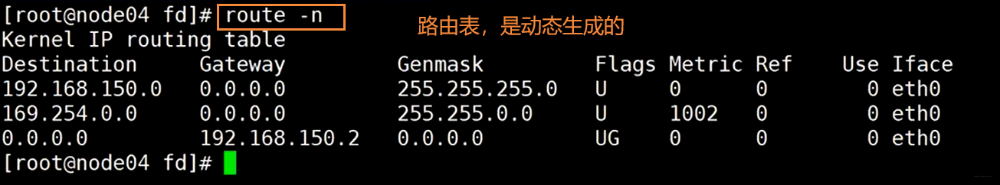
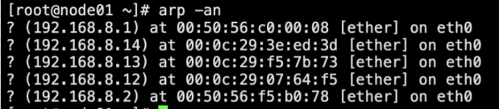
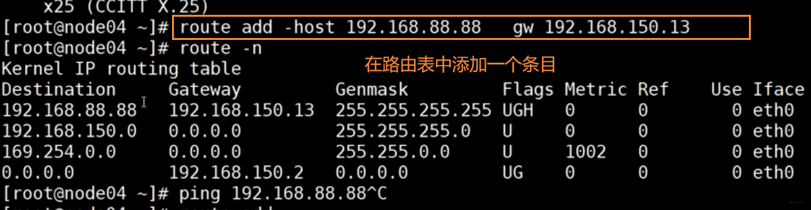
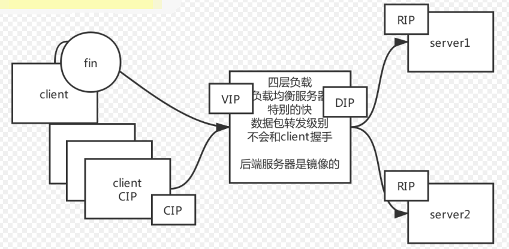
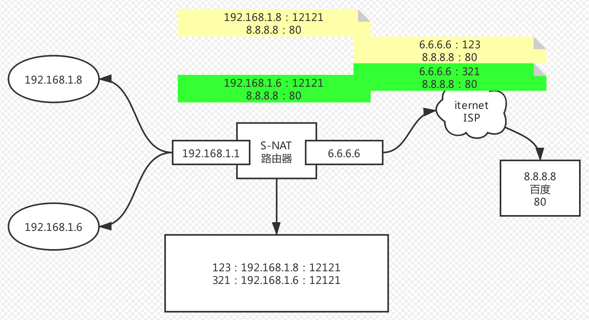
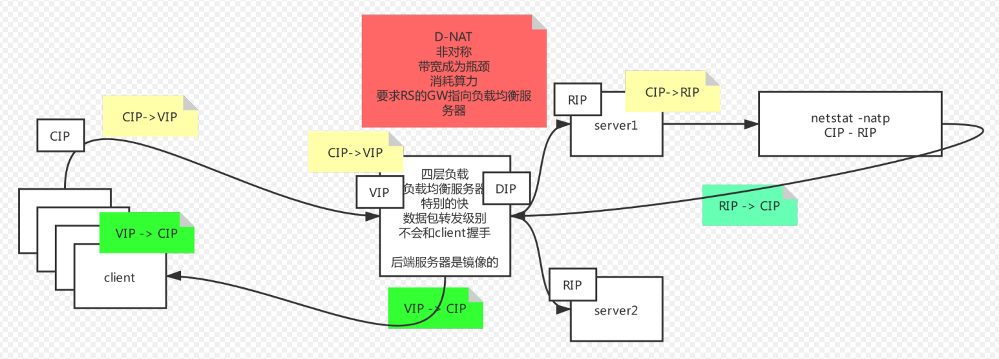
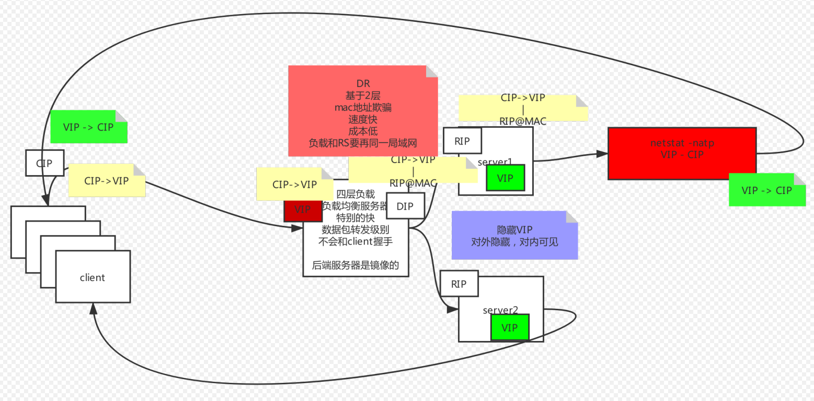
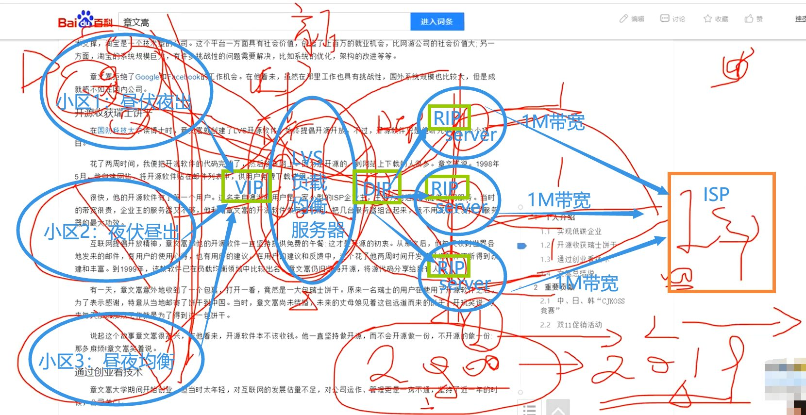

# LVS 负载均衡

### 网络协议原理

#### 引入

中国网络上可以产生消费的活跃用户约2.4亿，互联网人数较多，基础人群大。企业应该把钱花在哪里？营销上，而不是技术上。这样你赚得更多。案例比如，陌陌：CCTV广告，营销让人们下载去使用这个软件，你可以去百度买关键字排名，你可以去找微博大V，等等。假设你的营销手段能让20%人看到，有2%的人点击下载，大约1000万人。这时候你的“首屏广告”已经赚了好多了。再如果有的用户愿意付费，…，于是，在这个时代，高并发已经是每一家企业都要面临的。

假设高并发被解决了，在web容器的日志里你要记录些什么？分析渠道的流量的质量，分析不同的渠道给我带来多少的访问量。每个渠道的转化率，购买力。这样就可以知道下一轮投资应该在什么渠道多投广告。中国在从制造向服务行业转型（service）。


#### 七层模型

软件“工程”学：有分层、解耦的概念，因此我们有**七层模型**。


#### TCP / IP（详见5.2节）

TCP 是面向连接的，可靠的传输协议，是有确认的。三次握手->数据传输->四次分手，这个过程称为一个最小粒度，不可被分割。service mesh 号称微服务的下一代，你要懂点网络，学service mesh就好懂了。

子网掩码：将 IP 地址与子网掩码做按位与运算，得到网络号。


#### 路由表

route -n 查看路由表，路由表是动态生成的。

192.168.150.2 是网关，能够和任何目标地址匹配上。指示了你发送的数据包想要出这个局域网，就需要走 192.168.150.2 ，同一局域网的两个端点想要通信，不需要走下一跳，可以直接通信。只有在不同局域网之间的通信，才需要下一跳机制。




#### 下一跳机制

基于下一跳机制：每一个互联网的设备，内存中不需要存储全网的数据，只需要存储它周边一个网络当中的数据。有人做过一个实验，从美国向外发送所有的数据包，另一端都能够按照正确的顺序拼接。这个实验证明了基于下一跳的TCP传输方式是可以保证可靠传输的！

路由判定：通过按位与找到下一跳

链路层：在网络层的基础上，又封装了一层。在发送方发出的网络包去寻找接收方的整个过程中，ip地址和port不会发生变化，变化的是随着每一次发到下一跳的时候的mac地址的改变。
`arp -a`，查看同一局域网内，ip地址和硬件地址的映射

TCP/IP 协议是基于 **下一跳** 的机制：在不同跳之间，MAC地址会发生变化，改成下一跳的MAC地址。而IP地址/端口号不会发生变化。

- IP 地址的最终目标是 **端点** 间的
- MAC 地址的目标是是 **节点** 间的


#### 路由器、交换机

**路由器**就是要连接不同的网段，它是用来选择路线的。它里面有路由表，可以进行路由转发的判定。

**交换机**是负责同一个网络中转发，他只要转发就行了。


#### ARP 协议

发送端必须获取到目的MAC地址，MAC地址通过ARP协议来获取。
`arp -a`本质就是一个IP地址->MAC地址的对应表，表中每一个条目分别记录了网络上其他主机的IP地址和对应的MAC地址。
ARP表在初始的时候是空的。



##### ARP 请求

主机A的ARP缓存表中不存在主机C的MAC地址，所以主机A会发送ARP Request来获取目的MAC。主机A不知道主机C的MAC地址，所以目的MAC地址为广播地址`FF-FF-FF-FF-FF-FF`。交换机收到这个特殊的包之后会广播出去，ARP request报文会在整个网络上传播，该网络中所有主机包括网关都会接受到此ARP request 报文。网关会阻止该报文发送到其他网络上。

##### ARP 响应

所有主机接收到该ARP request报文后，会检查它的目的协议地址（一般是`00-00-00-00-00-00-00`与所有的匹配）字段与自身的IP地址是否匹配。如果不匹配，则该主机将不会响应该ARP request报文。如果匹配，则该主机会将ARP报文中的源MAC地址和源IP地址信息记录到自己的ARP缓存表中，然后通过ARP Reply报文进行响应。

另外，交换机具有记忆，下一次再遇到相同的目标地址时，就不需要广播了，直接发送到目标端口。现在通常情况下，计算机联网后会主动向外通告自己的mac地址，减少了主动通过ARP拉取的过程。

##### 案例

假如我有另一台主机B，主机B的IP地址是192.168.150.3，我主机B上添加了一个虚拟网卡192.168.88.88之后，想要在当前这主机A上ping通这个新添加的网卡地址，需要手动配一下路由表条目，否则这个ping会被发送到网关192.168.150.2上，导致ping不通。




#### 网络包传输的过程

看下图，一个网络包在发送的过程中，每经过一跳，它的**目标mac地址、源mac地址**都要通过路由器发生改变，而**源IP、目标IP**始终是不变的。


#### 负载均衡 & LVS 的引入

同一网络当中IP地址不能重复出现，否则会冲突，不知道应该发给谁。那怎么使用多个服务器实现多并发呢？

为什么Tomcat承受的并发少？因为Tomcat是在协议的第7层，也就是应用层的软件，是整个网络通信过程中最末端的层次。况且Tomcat是Java开发的，它跑在JVM上，又要进行用户态内核态的切换，这样就更慢了。（**Nginx也是在7层**应用层，所以Nginx的带宽是有上限的，官方压测单机并发5万。但是**LVS是在4层的**，可以承受更大的并发；socket可以看做是在第4层的，是一个规范的接口）

路由器只是三层的设备，只需要做转发。

现在我们从通信的角度考虑，如果有一个负载均衡服务器设备，可以根本不需要和客户端握手，收到数据包就直接转发出去，是数据包级别的转发。这样能够提高性能，但看不到数据包的内容（uri 等），所以要求后台的客户端是镜像的，一模一样的。这就是一种 **数据包级别的四层负载均衡技术**。

我们得到下面这样的拓扑模型，可以解决负载均衡的问题。



首先，我们统一下命名：
CIP：客户端client IP地址
VIP：负载均衡服务器的虚拟virtual IP
DIP：用于分发的dispacher IP
RIP：真实的服务器的real IP


#### NAT 网路地址转换

网路地址转换一般出现在路由器上
首先我们要知道，私有地址不会出现在互联网上

##### （1）S-NAT 模式：源地址替换协议

假设你和你女朋友在家都要访问百度，你的IP:port是`192.168.1.8:12121`，你女朋友IP:port是`192.168.1.6:12121`，如果不进行地址转换的话，你们俩的地址发到百度`8.8.8.8:80`之后，百度看到的都是`6.6.6.6:12121`，这时候百度服务器就懵了，不知道这俩有什么区别。那怎么解决这个问题呢？
使用NAT网络地址转换，路由器自己维护一张转换表，把你俩的`192.168.1.8:12121`和`192.168.1.6:12121`分别转换成`6.6.6.6:123`和`6.6.6.6:321`，用不同的端口发送给百度。等收到返回的数据包后，再按照自己记录的转换表，把网络包发送回给你和你女朋友。你家、你单位、你的虚拟机都是选的NAT这种模式。




##### （2）D-NAT 模式：目标地址转换协议（基于3层网络层）

可以用下图这种方式实现负载均衡：客户端发来的请求到负载均衡服务器，负载均衡服务器将请求分发到后面的server上，server将响应返回给负载均衡服务器，注意这之间需要多次源IP与目标IP的替换。

**弊端：**

- 它在通信的时候是非对称的，负载均衡服务器的带宽成为瓶颈：客户端给服务端发送的请求数据量是很小的，但是服务端给客户端返回的数据量很大。于是，下行的数据使服务器带宽成为瓶颈。早期的 ADSL 电话线理论上可以达到 6M 的全速单一方向带宽，分为上行和下行，如果平分的话，上下行都是3M。所以运营商做了手脚进行了调整，将下行的带宽调的很大，将上传的带宽调的比较小。
- 地址转换消耗算力



怎么解决上述弊端？如果能够让 real server **返回的数据不经过负载均衡服务器**，而是**直接返回给客户端**就好了。

##### （3）DR 模型：直接路由模型（基于2层链路层）

DR 模型，替换的是MAC地址而不是IP地址，也就是我们所说的“MAC地址欺骗”

于是我们想啊，如果有这么一种技术：每一个server都能够配一个VIP，但由于IP不能重复，这个VIP对外隐藏，只对内可见（其实是对ARP协议进行手术）。两台server共同在负载均衡服务器上对外暴露同一个VIP，别人请求只能请求到这台负载均衡服务器上来，这样就能从server直接向客户端返回数据包，而不需要走负载均衡服务器了。

负载均衡服务器在转发数据包的时候，将封装的目标 mac 地址修改为 real server 的 mac 地址。mac 地址是点到点的，代表的是一跳的距离，要保证负载均衡服务器与你的 server 在同一个网络中，不能下一跳跳到别的网络去。这种修改 mac 地址的模式是基于2层链路层的，没有修改3层网络层。

**缺点**：是不能跨网络，负载均衡服务器和真实服务器 RS（real server）要在同一个局域网。这是一个约束。
**优势**：速度快，成本低



##### （4）隧道模式

假设我们有好多好多的RS（real server），现在这些RS和负载均衡服务器不在同一个机房了。怎么解决这个问题？使用隧道技术。啥是隧道技术？

在`CIP->VIP`外面包裹一层`DIP->RIP`地址，这样数据包就可以顺利的从负载均衡服务器被发送到 server1
server1收到这个数据包之后，把外层的`DIP->RIP`撕掉，就能看到真正的`CIP->VIP`，自己处理之后，根据`CIP->VIP`直接返回给客户端。

我们以往用到的PPPOE这种协议就是这种技术。我们所说的 VPN，翻墙，用到的也是这种技术。


#### LVS

LVS是Linux Virtual Server的简写，意即Linux虚拟服务器，是一个虚拟的服务器集群系统。

我们定义一些名词缩写：


早期的小型运营商使用的 LVS：




#### 隐藏的Virtual IP 配置原理

**隐藏VIP方法：对外隐藏，对内可见 ：**
**kernel parameter:**
目标mac地址为全F，交换机触发广播
`/proc/sys/net/ipv4/conf/*IF*/`
**arp_ignore: 定义接收到ARP请求时的响应级别；**
0：只要本地配置的有相应地址，就给予响应；
1：仅在请求的目标(MAC)地址配置请求到达的接口上的时候，才给予响应；

**arp_announce：定义将自己地址向外通告时的通告级别；**
0：将本地任何接口上的任何地址向外通告；
1：试图仅向目标网络通告与其网络匹配的地址；
2：仅向与本地接口上地址匹配的网络进行通告；

将VIP配置在环回接口lo上


#### 负载均衡调度方法

**四种静态调度方法：**
rr: 轮叫调度（Round-Robin Scheduling）
wrr:加权轮叫调度（Weighted Round-Robin Scheduling）
dh: 目标地址散列调度（Destination Hashing Scheduling）
sh:源地址散列调度（Source Hashing Scheduling）

**动态调度方法：**
lc: 最小连接调度（Least-Connection Scheduling）
wlc: 加权最小连接调度（Weighted Least-Connection Scheduling）
sed: 最短期望延迟
nq: never queue
LBLC: 基于局部性的最少链接（Locality-Based Least Connections Scheduling）
DH:
LBLCR:带复制的基于局部性最少链接（Locality-Based Least Connections with Replication Scheduling）


#### LVS在Linux中自带的ipvs内核模块

**ipvs内核模块**
yum install ipvsadm -y

**管理集群服务**

```bash
添加：-A -t|u|f service-address [-s scheduler]
-t: TCP协议的集群 
-u: UDP协议的集群
service-address:     IP:PORT
-f: FWM: 防火墙标记 
service-address: Mark Number
修改：-E
删除：-D -t|u|f service-address
12345678
```

例如，`ipvsadm -A -t 192.168.9.100:80 -s rr`

**管理集群服务中的RS**

```bash
添加：-a -t|u|f service-address -r server-address [-g|i|m] [-w weight]
  -t|u|f service-address：事先定义好的某集群服务
  -r server-address: 某RS的地址，在NAT模型中，可使用IP：PORT实现端口映射；
  [-g|i|m]: LVS类型 
  -g: DR
  -i: TUN
  -m: NAT
  [-w weight]: 定义服务器权重
修改：-e
删除：-d -t|u|f service-address -r server-address
# ipvsadm -a -t 172.16.100.1:80 -r 192.168.10.8 –g
# ipvsadm -a -t 172.16.100.1:80 -r 192.168.10.9 -g
查看
  -L|l
  -n: 数字格式显示主机地址和端口
  --stats：统计数据
  --rate: 速率
  --timeout: 显示tcp、tcpfin和udp的会话超时时长
  -:c 显示当前的ipvs连接状况
删除所有集群服务
  -C：清空ipvs规则
保存规则，下次重启电脑还可以使用
  -S 
# ipvsadm -S > /path/to/somefile
载入此前的规则：
  -R
# ipvsadm -R < /path/form/somefile 
123456789101112131415161718192021222324252627
```


#### LVS 实验手册

DR模型（直接路由模型）


#### 学习 keepalived 之前，关于高可用，你需要知道：

1、如果你的**LVS负载均衡服务器挂掉了**，你整个公司的业务就下线了，这是不能容忍的。
这属于单点故障。
解决方法：一变多！但是入口的IP地址只能有一个，怎么变多？怎么实现多点？有2种形式：要么是**主备**，要么是**主主**
**主备模型**：备用机要以最快的速度接管原来的`VIP（virtual IP）`，只有主机对外提供服务，只有主机挂了的时候，备机才顶上去。
**主主模型**：所有的LVS都是主，现在要借用其他形式搞定只有一个的入口IP地址，比如动态DNS。主和主之间是协作的形式。
我们首先讨论主备，有两个点需要考虑：方向性、效率性。

**怎么知道主机挂没挂？**
可以由备机**轮询**主机，但是这样会对主或多或少造成一些压力。
可以由主机发**广播**到所有的备机，但是网络是不可靠的，所以有一种重试机制。

**如果已经确定主机挂了，谁来作为新的主机？**
使用**加权重**的方式，这也是paxos和zookeeper的区别。官方压测200ms就能选出新的主机出来。

2、如果你后台的**某一个`RS（Real Server）`挂掉了**，负载均衡服务器还会对另外两台正常连接，会造成一部分人的业务请求异常，另一部分人的业务正常。

**怎么知道RS挂了？可以用ping吗？**
不可以！ping命令是网络层的只能检验网络能不能通，连TCP握手都不做，而web服务是应用层的。能ping通不能代表web服务可用。那怎么知道RS挂没挂？最简单的方式是“访问一下”。
“访问一下”这个操作，它的底层验证的是 应用层的HTTP协议，你发一个请求，返回的是`200ok`，就说明是可用的。

LVS内核中有模块：ipvs负载均衡模块。你想要检测各个RS是否可用的话，可以直接去修改模块的源码，也可以使用第三方实现。第三方可以是人，也可以是自动化（也就有了自动化运维）。

**这个自动化的程序就是 keepalived！它可以代替人工，实现自动运维。解决LVS单点故障，实现HA**


#### keepalived

（1）监控自己的LVS服务
（2）每一台机器上都安装keepalived。Master（主机）通告自己还活着，Backup（备机）监听Master状态。如果Master挂了，一堆Backup推举选出一个新的Master.
（3）你不需要再手动配置VIP，添加LVS（ipvs模块）配置，只需要写到配置文件中即可。
（4）对后端的RS（real server）做健康检查，及时剔除不可用的节点
（5）最后，keepalived不仅仅用来解决LVS，它是一个通用的环境，主要作为linux上的HA的实现。例如，当你并发量不大的时候，nginx可以作为公司的负载均衡来使用，此时nginx成为了单点故障。这个问题也可以用keepalived来解决。


#### keepalived 实验手册

