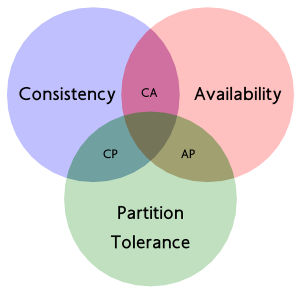
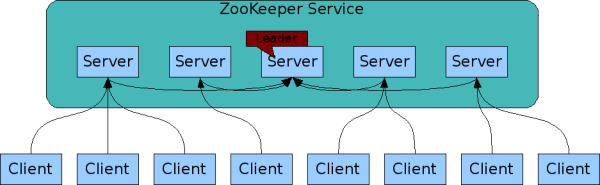
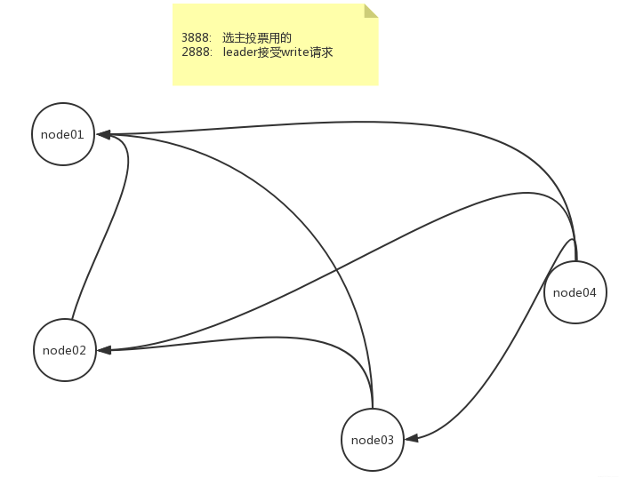
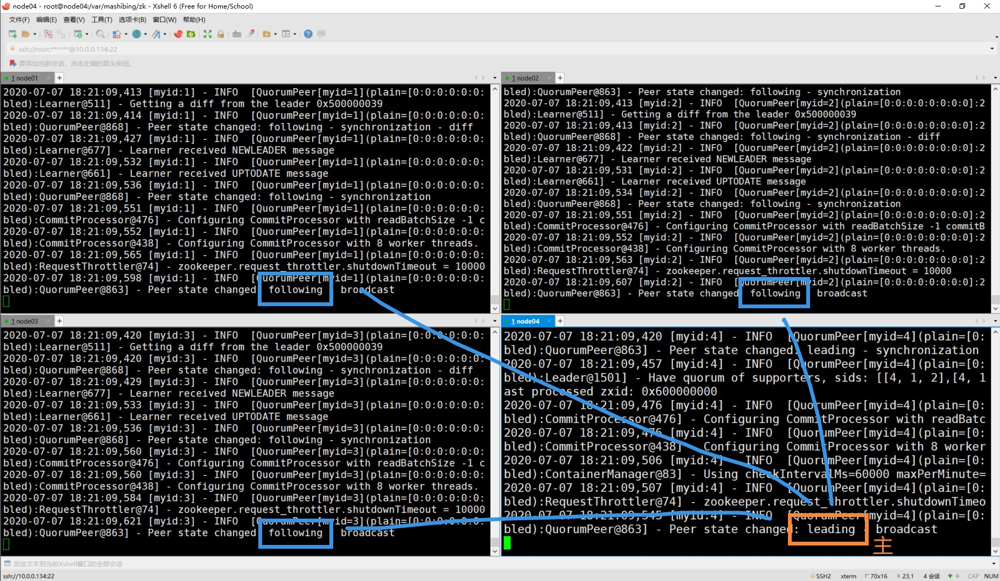
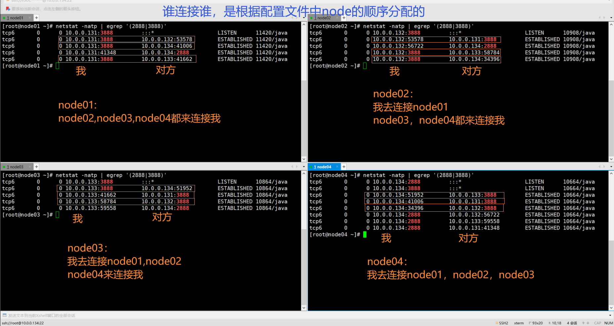

# CAP 定理与 Zookeeper

#### 1、什么是 CAP 定理？

CAP理论告诉我们，一个分布式系统不可能同时满足以下三种：

- 一致性（C:Consistency）
- 可用性（A:Available）
- 分区容错性（P:Partition Tolerance）

这三个基本需求，最多只能同时满足其中的两项，因为 P 是必须的，因此往往选择就在 CP 或者 AP 中。

##### 一致性（C:Consistency）

在分布式环境中，一致性是指数据在多个副本之间是否能够保持数据一致的特性。在一致性的需求下，当一个系统在数据一致的状态下执行更新操作后，应该保证系统的数据仍然处于一致的状态。例如一个将数据副本分布在不同分布式节点上的系统来说，如果对第一个节点的数据进行了更新操作并且更新成功后，其他节点上的数据也应该得到更新，并且所有用户都可以读取到其最新的值，那么这样的系统就被认为具有强一致性（或严格的一致性，最终一致性）。

##### 可用性（A:Available）

可用性是指系统提供的服务必须一直处于可用的状态，对于用户的每一个操作请求总是能够在有限的时间内返回结果。“有效的时间内”是指，对于用户的一个操作请求，系统必须能够在指定的时间（即响应时间）内返回对应的处理结果，如果超过了这个时间范围，那么系统就被认为是不可用的。

“返回结果”是可用性的另一个非常重要的指标，它要求系统在完成对用户请求的处理后，返回一个正常的响应结果。正常的响应结果通常能够明确的反映出对请求的处理结果，即成功或失败，而不是一个让用户感到困惑的返回结果。

##### 分区容错性（P:Partition Tolerance）

分区容错性约束了一个分布式系统需要具有如下特性：分布式系统在遇到任何网络分区故障的时候，仍然需要能够保证对外提供满足一致性和可用性的服务，除非是整个网络环境都发生了故障。

网络分区是指在分布式系统中，不同的节点分布在不同的子网络（机房或异地网络等）中，由于一些特殊的原因导致这些子网络之间出现网络不连通的状况，但各个子网络的内部网络是正常的，从而导致整个系统的网络环境被切分成了若干个孤立的区域。需要注意的是，组成一个分布式系统的每个节点的加入与退出都可以看作是一个特殊的网络分区。

由于一个分布式系统无法同时满足上面的三个需求，而只能满足其中的两项，因此在进行对CAP定理的应用的时候，需要根据业务的要求抛弃其中的一项，下表所示是抛弃CAP定理中任意一项特性的场景说明。

因此，将精力浪费在思考如何设计能满足三者的完美系统上是愚钝的，应该根据应用场景进行适当取舍。

#### 2、一致性的分类

一致性是指从系统外部读取系统内部的数据时，在一定约束条件下相同，即数据变动在系统内部各节点应该是同步的。根据一致性的强弱程度不同，可以将一致性的分类为如下几种：

- 强一致性：（strong consistency）。任何时刻，任何用户都能读取到最近一次成功更新的数据。

- 单调一致性：（monotonic consistency）。任何时刻，任何用户一旦读到某个数据在某次更新后的值，那么就不会再读到比这个值更旧的值。也就是说，可获取的数据顺序必是单调递增的。

- 会话一致性：（session consistency）。任何用户在某次会话中，一旦读到某个数据在某次更新后的值，那么在本次会话中就不会再读到比这值更旧的值，会话一致性是在单调一致性的基础上进一步放松约束，只保证单个用户单个会话内的单调性，在不同用户或同一用户不同会话间则没有保障。

- 最终一致性：（eventual consistency）。用户只能读到某次更新后的值，但系统保证数据将最终达到完全一致的状态，只是所需时间不能保障。

- 弱一致性：（weak consistency）。用户无法在确定时间内读到最新更新的值。

#### 3、ZooKeeper 提供的一致性服务

ZooKeeper从以下几点保证了数据的一致性：

- 顺序一致性：来自任意特定客户端的更新都会按其发送顺序被提交保持一致。也就是说，如果一个客户端将Znode z的值更新为a，在之后的操作中，它又将z的值更新为b，则没有客户端能够在看到z的值是b之后再看到值a（如果没有其他对z的更新）。

- 原子性：每个更新要么成功，要么失败。这意味着如果一个更新失败，则不会有客户端会看到这个更新的结果。

- 单一系统映像：一个客户端无论连接到哪一台服务器，它看到的都是同样的系统视图。这意味着，如果一个客户端在同一个会话中连接到一台新的服务器，它所看到的系统状态不会比 在之前服务器上所看到的更老。当一台服务器出现故障，导致它的一个客户端需要尝试连接集合体中其他的服务器时，所有滞后于故障服务器的服务器都不会接受该 连接请求，除非这些服务器赶上故障服务器。

- 持久性：一个更新一旦成功，其结果就会持久存在并且不会被撤销。这表明更新不会受到服务器故障的影响。

- 实时性：在特定的一段时间内，客户端看到的系统需要被保证是实时的（在十几秒的时间里）。在此时间段内，任何系统的改变将被客户端看到，或者被客户端侦测到。

#### 4、用 CAP 理论来分析 ZooKeeper

CAP理论告诉我们，一个分布式系统不可能同时满足以下三种

- 一致性（C:Consistency）
- 可用性（A:Available）
- 分区容错性（P:Partition Tolerance）

这三个基本需求，最多只能同时满足其中的两项，因为P是必须的,因此往往选择就在CP或者AP中。

##### ZooKeeper 保证的是 CP

分析：可用性（A:Available）

zk 不能保证每次服务请求的可用性。任何时刻对ZooKeeper的访问请求能得到一致的数据结果，同时系统对网络分割具备容错性；但是它不能保证每次服务请求的可用性（注：也就是在极端环境下，ZooKeeper可能会丢弃一些请求，消费者程序需要重新请求才能获得结果）。所以说，ZooKeeper不能保证服务可用性。

进行leader选举时，集群都是不可用状态。在使用ZooKeeper获取服务列表时，当master节点因为网络故障与其他节点失去联系时，剩余节点会重新进行leader选举。问题在于，选举leader的时间太长，30 ~ 120s, 且选举期间整个zk集群都是不可用的，这就导致在选举期间注册服务瘫痪，虽然服务能够最终恢复，但是漫长的选举时间导致的注册长期不可用是不能容忍的。所以说，ZooKeeper不能保证服务可用性。

---

# ZooKeeper介绍

### 什么是 ZooKeeper？

官方文档：https://zookeeper.apache.org/doc/current/zookeeperOver.html

**ZooKeeper：分布式应用程序的分布式协调服务**

- ZooKeeper使用了按照**文件系统**熟悉的**目录树结构**命名的**数据模型**。
- ZooKeeper提供的**名称空间**与标准**文件系统的名称空间**非常**相似**。名称是由斜杠（/）分隔的一系列路径元素。ZooKeeper**命名空间**中的**每个节点都由路径标识**。
- 名称空间由**数据寄存器**（称为**znode**）组成，它们类似于文件和目录。与设计用于存储的典型文件系统不同，ZooKeeper数据保留在**内存**中，这意味着ZooKeeper可以实现高吞吐量和低延迟数。
- 像它协调的分布式进程一样，ZooKeeper本身也可以在称为集合的一组主机上进行**复制**。
- 众所周知，协调服务很难做到。它们特别容易出现诸如比赛条件和死锁之类的错误。ZooKeeper背后的动机是**减轻分布式应用程序从头开始实施协调服务的责任**。

### Zookeeper客户端常用命令

`ls /`列出根目录所有节点名称
`create /testLock/AppConf "foo"`创建节点并设置节点内容
`set /testLock/AppConf "bar"`更新节点内容
`delete /testLock/AppConf`删除节点

### ZooKeeper 集群

每个节点的数据都一样。有一个leader，其他都是follower，是一个主从集群。写操作只能发生在leader身上。
主挂了怎么办？zk可以快速自我修复。

下图左侧：可用状态
下图右侧：不可用状态（leader挂掉了）

（图待补充）

不可用状态恢复到可用状态，应该越快越好！

#### 官方压测

存在错误中的可靠性表明部署如何响应各种故障。图中标记的事件如下：

1、追随者的失败和恢复
2、其他追随者的失败和恢复
3、领导者的失败
4、两个追随者的失败和恢复
5、另一个领导者的失败

官方压测结果：**ZooKeeper只需不到200毫秒即可选出新的领导者。**

### 不要把zk当数据库用

redis 可以作为数据库使用，但zk不应该作为数据库。

zk每个node只能存1M，是为了保证对外提供分布式协调时的速度。

### 临时节点

每个客户端连接到zk之后，一定会有一个session来代表这个客户端，用来表示当前的会话。

依托session，我们有了**临时节点**的概念，可以用来解决之前redis加锁时需要设置过期时间的问题：

- 客户端在，session就在，锁就在。

- 客户端不在了，session就不在了，锁就释放了。

### 序列节点

持久节点 和 临时节点，都可以作为序列节点。

### ZooKeeper 的特点

- 顺序一致性：来自客户端的更新将按照发送的顺序应用。
- 原子性：数据更新的成功或失败，要么全部节点都成功，要么全部节点都失败（最终一致性）
- 统一视图：无论客户端连接到哪个服务器，客户端都将看到相同的服务视图。即使客户端故障转移到具有相同会话的其他服务器，客户端也永远不会看到系统的较旧视图。
- 可靠性：一旦应用了更新，该更新将一直持续到客户端覆盖更新为止。
- 及时性：确保系统的客户视图在特定时间范围内是最新的（很短的时间内内达成最终一致性）。

### 安装

我的博客 https://blog.csdn.net/sinat_42483341/article/details/107154663

### 节点间通信原理

以 node04 是 leader 的情况为例，节点间连接情况如下：

 

使用 `netstat -natp | egrep '(2888|3888)'` 查看

### Zookeeper 应用

ZooKeeper是提供分布式“协调”的，而不是提供分布式服务的。

- 在以往的分布式系统中，最典型的集群模式是 master/slave 模式（主备模式），我们把所有能够处理写操作的机器成为Master机器，把所有通过异步复制方式获取最新数据，并提供度服务的机器称为Slave机器
- 而在 ZooKeeper中，这些概念被颠覆了。它没有引入 master/slave 的概念 ，而是引入了 leader、follower、observer三种角色。
- leader服务器为客户端提供读和写服务
- follower、observer 都能提供读服务，区别在于 observer 不参与 leader 的选举过程，也不参与写操作的“过半写成功”策略。
- 因此，observer 可以在不影响写性能的情况下，提升集群的读性能。

##### 在最终一致性过程中，ZooKeeper 各节点是否对外提供服务？

根据 ZAB 协议，各个节点的数据达成一致后，zookeeper集群才恢复正常服务。

#### Paxos 协议

Paxos还被认为是到目前为止唯一的**分布式一致性算法**，其它的算法都是Paxos的改进或简化。

Paxos描述了这样一个场景，有一个叫做Paxos的小岛(Island)上面住了一批居民，岛上面所有的事情由一些特殊的人决定，他们叫做议员(Senator)。议员的总数(Senator Count)是确定的，不能更改。岛上每次环境事务的变更都需要通过一个提议(Proposal)，每个提议都有一个编号(PID)，这个编号是一直增长的，不能倒退。每个提议都需要超过半数((Senator Count)/2 +1)的议员同意才能生效。每个议员只会同意大于当前编号的提议，包括已生效的和未生效的。如果议员收到小于等于当前编号的提议，他会拒绝，并告知对方：你的提议已经有人提过了。这里的当前编号是每个议员在自己记事本上面记录的编号，他不断更新这个编号。整个议会不能保证所有议员记事本上的编号总是相同的。现在议会有一个目标：保证所有的议员对于提议都能达成一致的看法。

好，现在议会开始运作，所有议员一开始记事本上面记录的编号都是0。有一个议员发了一个提议：将电费设定为1元/度。他首先看了一下记事本，嗯，当前提议编号是0，那么我的这个提议的编号就是1，于是他给所有议员发消息：1号提议，设定电费1元/度。其他议员收到消息以后查了一下记事本，哦，当前提议编号是0，这个提议可接受，于是他记录下这个提议并回复：我接受你的1号提议，同时他在记事本上记录：当前提议编号为1。发起提议的议员收到了超过半数的回复，立即给所有人发通知：1号提议生效！收到的议员会修改他的记事本，将1好提议由记录改成正式的法令，当有人问他电费为多少时，他会查看法令并告诉对方：1元/度。

现在看冲突的解决：假设总共有三个议员S1-S3，S1和S2同时发起了一个提议:1号提议，设定电费。S1想设为1元/度, S2想设为2元/度。结果S3先收到了S1的提议，于是他做了和前面同样的操作。紧接着他又收到了S2的提议，结果他一查记事本，咦，这个提议的编号小于等于我的当前编号1，于是他拒绝了这个提议：对不起，这个提议先前提过了。于是S2的提议被拒绝，S1正式发布了提议: 1号提议生效。S2向S1或者S3打听并更新了1号法令的内容，然后他可以选择继续发起2号提议。

好，我觉得Paxos的精华就这么多内容。现在让我们来对号入座，看看在ZK Server里面Paxos是如何得以贯彻实施的。

- 小岛(Island)——ZK Server Cluster

- 议员(Senator)——ZK Server

- 提议(Proposal)——ZNode Change(Create/Delete/SetData…)

- 提议编号(PID)——Zxid(ZooKeeper Transaction Id)

- 正式法令——所有ZNode及其数据

貌似关键的概念都能一一对应上，但是等一下，Paxos岛上的议员应该是人人平等的吧，而ZK Server好像有一个Leader的概念。没错，其实Leader的概念也应该属于Paxos范畴的。如果议员人人平等，在某种情况下会由于提议的冲突而产生一个“活锁”（所谓活锁我的理解是大家都没有死，都在动，但是一直解决不了冲突问题）。Paxos的作者Lamport在他的文章”The Part-Time Parliament“中阐述了这个问题并给出了解决方案——在所有议员中设立一个总统，只有总统有权发出提议，如果议员有自己的提议，必须发给总统并由总统来提出。好，我们又多了一个角色：总统。

总统——ZK Server Leader

又一个问题产生了，总统怎么选出来的？oh, my god! It’s a long story. 在淘宝核心系统团队的Blog上面有一篇文章是介绍如何选出总统的，有兴趣的可以去看看：http://rdc.taobao.com/blog/cs/?p=162

现在我们假设总统已经选好了，下面看看ZK Server是怎么实施的。

**情况一：**
屁民甲(Client)到某个议员(ZK Server)那里询问(Get)某条法令的情况(ZNode的数据)，议员毫不犹豫的拿出他的记事本(local storage)，查阅法令并告诉他结果，同时声明：我的数据不一定是最新的。你想要最新的数据？没问题，等着，等我找总统Sync一下再告诉你。

**情况二：**
屁民乙(Client)到某个议员(ZK Server)那里要求政府归还欠他的一万元钱，议员让他在办公室等着，自己将问题反映给了总统，总统询问所有议员的意见，多数议员表示欠屁民的钱一定要还，于是总统发表声明，从国库中拿出一万元还债，国库总资产由100万变成99万。屁民乙拿到钱回去了(Client函数返回)。

**情况三：**
总统突然挂了，议员接二连三的发现联系不上总统，于是各自发表声明，推选新的总统，总统大选期间政府停业，拒绝屁民的请求。

呵呵，到此为止吧，当然还有很多其他的情况，但这些情况总是能在Paxos的算法中找到原型并加以解决。这也正是我们认为Paxos是Zookeeper的灵魂的原因。当然ZK Server还有很多属于自己特性的东西：Session, Watcher，Version等等等等，需要我们花更多的时间去研究和学习。

##### raft 协议：对 paxos 的简化

### ZAB协议：对Paxos的简化

我的博客：https://blog.csdn.net/sinat_42483341/article/details/107193854

- 两阶段提交，先写磁盘日志，再写到内存。
- zk的数据保存在内存
- zk的日志保存在磁盘

#### 二阶段提交

通常，二阶段提交协议被认为是一种一致性协议，用来保证分布式系统数据的一致性。目前，绝大多数关系型数据库都是采用二阶段提交协议来完成分布式事务处理的。

顾名思义，二阶段提交协议，是将事物的提交过程分成了两个阶段来处理。简单的讲，二阶段提交将一个事物的处理过程分为了投票和执行两个阶段，其核心是对每个事物都采用先尝试后提交的处理方式。因此也可以将二阶段提交看做一个强一致性的算法。

##### 阶段一：提交事务请求

##### 阶段二：执行事务提交

### 使用ZooKeeper实现分布式配置中心、分布式锁

我的博客：https://blog.csdn.net/sinat_42483341/article/details/107224842

#### 分布式配置中心

我们将所有的配置数据用data配置到zk中去，在客户端我们既可以get它，也可以watch它。
一旦外界对这个数据进行了修改，这个修改就会引发watch的回调。

#### 分布式锁

10个线程在创建之后，都拿到了自己的自增目录名称，然后按照自己的目录名称顺序依次进行：拿到锁，干活，释放锁。

在程序执行的同时，从Zookeeper的Client端不断获取目录内容，看到整个过程大致是这样的：当一个线程中的任务执行完之后，显示调用`zk.delete(pathName, -1);`将节点删除。这样就能触发下一个正在watch它的节点所在的线程，去判断自己是不是在排名的第一个。

- 如果是第一个，开始干活
- 如果不是第一个，watch它的前一个（这种情况出现在前一个节点突然挂了的情况）

