# Kafka 实战

Kafka是由Apache软件基金会开发的一个开源流处理平台，由Scala和Java编写。Kafka是一种高吞吐量的分布式发布订阅消息系统，它可以收集并处理用户在网站中的所有动作流数据以及物联网设备的采样信息。

### 本文目录


### 前置知识：kafka架构模型，角色功能梳理

##### Kafka 架构

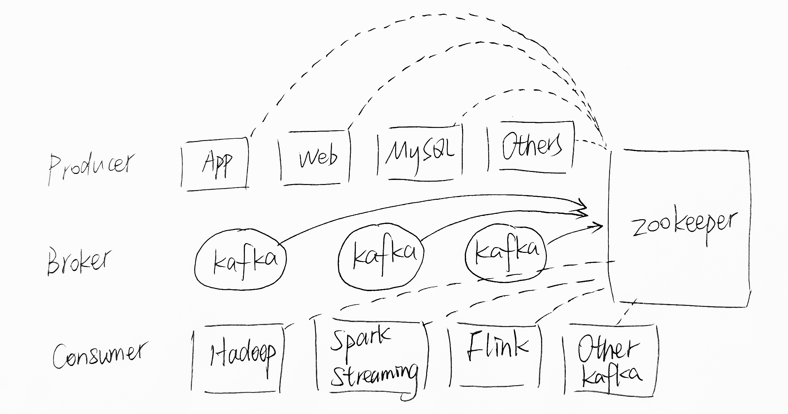

##### Topic & Partition & Segment

写数据是一个 appent only 顺序写的过程，顺序写磁盘性能比随机读写内存还快，不会造成性能下降问题。可以看作一个大数组，offset相当于数组中的index，读数据也是根据下标进行顺序读。


- record（也叫作event）
  - key-value 形式存储，但不是用来查询的
  - timestamp
- topic
  - 逻辑概念，一个topic相当于一个消息类别
  - 发布-订阅均基于 topic
- partition
  - 每一个 topic 包含一个或多个 partition
  - 每个 partition 物理上对应一个文件夹
- segment
  - 一个partition不是**一个**文件，而是看做一个文件夹，将一个超长的数组分成一段一段的（对应很**多个文件**），删除时只需要将较早的segment删除即可。

##### Producer

- producer 何时发送消息——同步vs异步

  - batch.size()
  - lingers.ms
  - flush()

- producer 如何保证消息的顺序性——queue与retry机制

  - retry.backoff.ms
  - retires
  - 重试机制可能导致的同一个 broker 收到的消息的乱序。对于保证单个partition的顺序性, Kafka client 0.11之后可以通过 enable.idempotence=true 解决, 同时max.in.flight.requests.per.connection可以＞1

- 消息路由策略——partitioner，控制从 key 到 partition 的映射

  - partitioner.class 默认的 partition 分发策略，保证了 key 相同的一定分到同一个 partition

    kafka 0.8 版本 kafka-clients-0.8.2.2-sources.jar!/org/apache/kafka/clients/producer/internals/Partitioner.java 如下

    ```java
    /**
     * The default partitioning strategy:
     *    If a partition is specified in the record, use it
     *    If no partition is specified but a key is present choose a partition based on a hash of the key
     *    If no partition or key is present choose a partition in a round-robin fashion
     */
    public class Partitioner {
    
        private final AtomicInteger counter = new AtomicInteger(new Random().nextInt());
    
        /**
         * Compute the partition for the given record.
         * 
         * @param record The record being sent
         * @param cluster The current cluster metadata
         */
        public int partition(ProducerRecord<byte[], byte[]> record, Cluster cluster) {
            List<PartitionInfo> partitions = cluster.partitionsForTopic(record.topic());
            int numPartitions = partitions.size();
            if (record.partition() != null) {
                // they have given us a partition, use it
                if (record.partition() < 0 || record.partition() >= numPartitions)
                    throw new IllegalArgumentException("Invalid partition given with record");
                return record.partition();
            } else if (record.key() == null) {
                int nextValue = counter.getAndIncrement();
                List<PartitionInfo> availablePartitions = cluster.availablePartitionsForTopic(record.topic());
                if (availablePartitions.size() > 0) {
                    int part = Utils.abs(nextValue) % availablePartitions.size();
                    return availablePartitions.get(part).partition();
                } else {
                    // no partitions are available, give a non-available partition
                    return Utils.abs(nextValue) % numPartitions;
                }
            } else {
                // hash the key to choose a partition
                return Utils.abs(Utils.murmur2(record.key())) % numPartitions;
            }
        }
    }
    ```

  - 也可以自定义实现

    ```java
    import org.apache.kafka.clients.producer.Partitioner;
    import org.apache.kafka.common.Cluster;
    import org.apache.kafka.common.PartitionInfo;
     
    import java.util.List;
    import java.util.Map;
    import java.util.Random;
     
    /**
     * 消息发送后会调用自定义的策略
     */
    public class MyPartitioner implements Partitioner {
         /**
         * Compute the partition for the given record.
         *
         * @param topic The topic name
         * @param key The key to partition on (or null if no key)
         * @param keyBytes The serialized key to partition on( or null if no key)
         * @param value The value to partition on or null
         * @param valueBytes The serialized value to partition on or null
         * @param cluster The current cluster metadata
         */
        @Override
        public int partition(String topic, Object key, byte[] keyBytes, Object value, byte[] valueBytes, Cluster cluster) {
            //获取当前 topic 有多少个分区（分区列表）
            List<PartitionInfo> partitions = cluster.partitionsForTopic(topic);
            int partitionNum = 0;
            if (key == null) { //之前介绍过 Key 是可以传空值的
                partitionNum = new Random().nextInt(partitions.size());   //随机
            } else { //取 %
                partitionNum = Math.abs((key.hashCode()) % partitions.size());
            }
            System.out.println("key：" + key + "，value：" + value + "，partitionNum：" + partitionNum);
            //发送到指定分区
            return partitionNum;
        }
     
        @Override
        public void close() {
        }
     
        @Override
        public void configure(Map<String, ?> configs) {
        }
    }
    ```

##### high / low level API

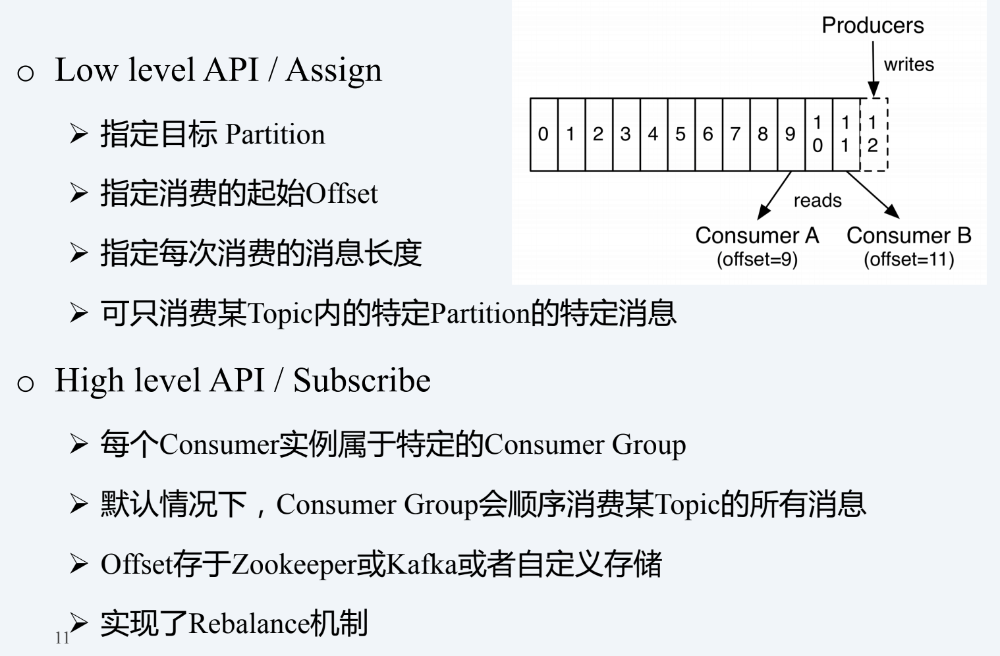

##### consumer group


- 首先kafka 有producer 和consumer的概念，一个生产数据，一个消费数据，中间是一个broker（也就是一个消息队列），producer是以push的方式向broker推数据，consumer以pull 的方式从broker消费数据。
- producer 与consumer是通过topic 关联在一块的。topic类似于一个特定的分类。producer向某个指定的topic push数据，consumer从指定的topic消费数据。
- partition 的引入是为了解决并发量的问题，一个topic （至少有一个partition）可以有多个partition，多个partition并发的处理一个topic的消息。每一个partition以顺序不变的方式保存消息。
- broker 是kafka集群中维护发布消息的系统。每个broker针对每个topic可能包含0个或多个该topic的分区。假设，一个topic拥有N个分区，并且集群拥有N个broker,则每个broker会负责一个分区。 假设，一个topic拥有N个分区，并且集群拥有N+M个broker,则前N个broker每个处理一个分区，剩余的M个broker则不会处理任何分区 。 假设，一个topic拥有N个分区，并且集群拥有M个broker（M < N），则这些分区会在所有的broker中进行均匀分配。每个broker可能会处理一个或多个分区。这种场景不推荐使用，因为会导致热点问题和负载不均衡问题。
- Replicas of partition 分区副本仅仅是分区的备份，不会对副本分区进行读写操作，只是用来防止数据丢失。上图中topic2 就设置了 partition=2，副本会均衡地分布在broker中。
- consumer group: 一个consumergroup 里面会有若干个consumer实例，对应一个topic，这几个consumer实例都会消费该topic 中的消息，如果consumer实例的数量等于对应topic的partition数量，那么一个consumer对应一个partition（推荐）。如果consumer实例的数量小于对应topic的partition数量，那么一个consumer可能对应多个partition。如果consumer实例的数量大于对应topic的partition数量，那么多出的consumer不会参与到topic的消息消费。

##### 自治式Rebalance

什么是 Rebalance？Rebalance 本质上是一种协议，规定了一个 Consumer Group 下的所有 consumer 如何达成一致，来分配订阅 Topic 的每个分区。

例如：某 Group 下有 20 个 consumer 实例，它订阅了一个具有 100 个 partition 的 Topic 。正常情况下，kafka 会为每个 Consumer 平均的分配 5 个分区。**这个分配的过程就是 Rebalance**。

Rebalance 的触发条件有3个。

- 组成员个数发生变化。例如有新的 consumer 实例加入该消费组或者离开组。
- 订阅的 Topic 个数发生变化。
- 订阅 Topic 的分区数发生变化。

##### AKF 原则


- y轴：y轴是topic，topic又被分为不同的partition
- x轴：不同机器上的副本，保证可靠性
- z轴：binlog

##### partition 的划分

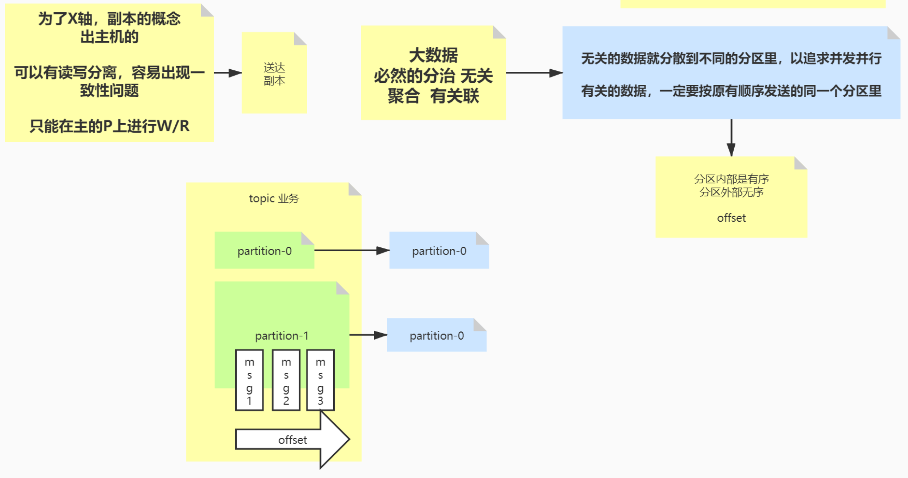

- 没有关联的数据，放在不同的 partition 中，增加并行度，让并行最大化，避免加锁

- 有关联的数据，一定要放在同一个分区中

##### offset 概念

分区内部是有序的，分区外部是无序的。不同的 consumer 维护自己的 offset，顺序由 offset 控制。

##### kafka 对 zookeeper 的依赖

kafka 的 broker 依赖于 zookeeper

- 使用 zk 存储 broker 的元数据
- 使用到 zk 的选举机制


### 一、初识Kafka [Main Concepts and Terminology](http://kafka.apache.org/intro#intro_concepts_and_terms)

An **event** records the fact that "something happened" in the world or in your business. It is also called record or message in the documentation. When you read or write data to Kafka, you do this in the form of events. Conceptually, an event has a key, value, timestamp, and optional metadata headers. Here's an example event:

- Event key: "Alice"
- Event value: "Made a payment of $200 to Bob"
- Event timestamp: "Jun. 25, 2020 at 2:06 p.m."

**Producers** are those client applications that publish (write) events to Kafka, and **consumers** are those that subscribe to (read and process) these events. In Kafka, producers and consumers are fully decoupled and agnostic of each other, which is a key design element to achieve the high scalability that Kafka is known for. For example, producers never need to wait for consumers. Kafka provides various [guarantees](http://kafka.apache.org/documentation/#intro_guarantees) such as the ability to process events exactly-once.

Events are organized and durably stored in **topics**. Very simplified, a topic is similar to a folder in a filesystem, and the events are the files in that folder. An example topic name could be "payments". Topics in Kafka are always multi-producer and multi-subscriber: a topic can have zero, one, or many producers that write events to it, as well as zero, one, or many consumers that subscribe to these events. Events in a topic can be read as often as needed—unlike traditional messaging systems, events are not deleted after consumption. Instead, you define for how long Kafka should retain your events through a per-topic configuration setting, after which old events will be discarded. Kafka's performance is effectively constant with respect to data size, so storing data for a long time is perfectly fine.

Topics are **partitioned**, meaning a topic is spread over a number of "buckets" located on different Kafka brokers. This distributed placement of your data is very important for scalability because it allows client applications to both read and write the data from/to many brokers at the same time. When a new event is published to a topic, it is actually appended to one of the topic's partitions. Events with the same event key (e.g., a customer or vehicle ID) are written to the same partition, and Kafka [guarantees](http://kafka.apache.org/documentation/#intro_guarantees) that any consumer of a given topic-partition will always read that partition's events in exactly the same order as they were written.


Figure: This example topic has four partitions P1–P4. Two different producer clients are publishing, independently from each other, new events to the topic by writing events over the network to the topic's partitions. Events with the same key (denoted by their color in the figure) are written to the same partition. Note that both producers can write to the same partition if appropriate.

To make your data fault-tolerant and highly-available, every topic can be **replicated**, even across geo-regions or datacenters, so that there are always multiple brokers that have a copy of the data just in case things go wrong, you want to do maintenance on the brokers, and so on. A common production setting is a replication factor of 3, i.e., there will always be three copies of your data. This replication is performed at the level of topic-partitions.

This primer should be sufficient for an introduction. The [Design](http://kafka.apache.org/documentation/#design) section of the documentation explains Kafka's various concepts in full detail, if you are interested.

#### Kafka 的优势

Apache Kafka是Apache软件基金会的开源的流处理平台，该平台提供了消息的订阅与发布的消息队列，一般用作系统间解耦、异步通信、削峰填谷等作用。同时Kafka又提供了Kafka streaming插件包实现了实时在线流处理。相比较一些专业的流处理框架不同，Kafka Streaming计算是运行在应用端，具有简单、入门要求低、部署方便等优点。

- 消息队列Message Queue 
- Kafka Streaming 流处理 

##### 系统间解耦、异步通信

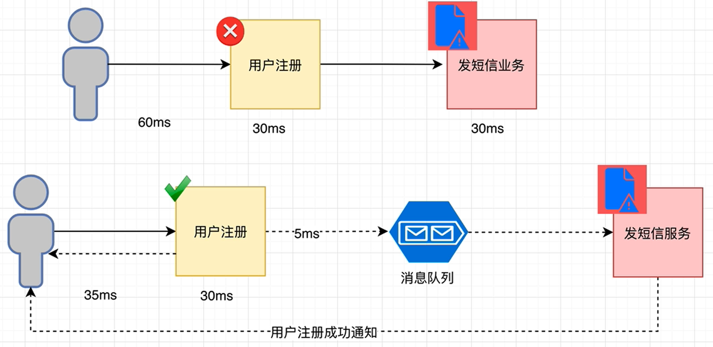

##### 削峰填谷

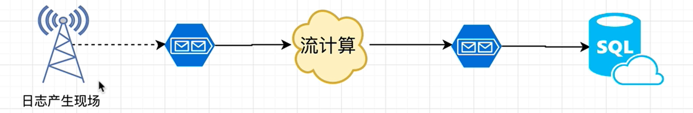


#### 常见的消息队列工作模式

消息队列是一种在分布式和大数据开发中不可或缺的中间件。在分布式开发或者大数据开发中通常使用消息队列进行缓冲、系统间解耦和削峰填谷等业务场景，常见的消息队列工作模式大致会分为两大类：

- 至多一次：消息生产者将数据写入消息系统，然后由消费者负责去拉去消息服务器中的消息，一旦消息被确认消费之后 ，由消息服务器主动删除队列中的数据，这种消费方式一般只允许被**一个消费者**消费，并且消息队列中的数据不允许被重复消费。（activemq）
- 没有限制:同上诉消费形式不同，生产者发不完数据以后，该消息可以被**多个消费者**同时消费，并且同一个消费者**可以多次消费**消息服务器中的同一个记录。主要是因为消息服务器一般可以长时间存储海量消息。（kafka）

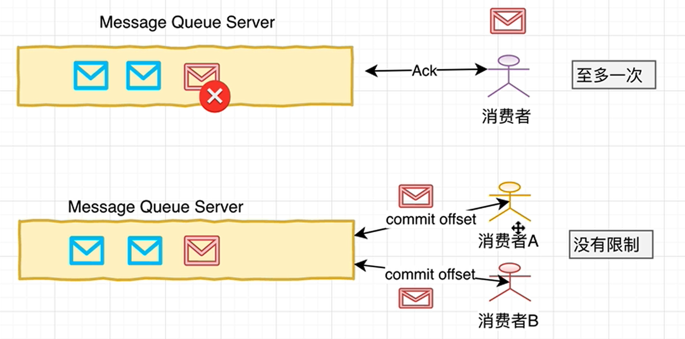


#### kafka工作模式

Kafka集群以Topic形式负责分类集群中的Record。每一个Record属于一个Topic。每个Topic底层都会对应一组分区的日志用于持久化Topic中的Record。同时，在Kafka集群中，Topic的每一个日志的分区都一定会有1个Borker担当该分区的Leader，其他的Broker担当该分区的follower，Leader负责分区数据的读写操作，follower负责同步改分区的数据。这样如果分区的Leader宕机，改分区的其他follower会选取出新的leader继续负责该分区数据的读写。其中集群的中Leader的监控和Topic的部分元数据是存储在Zookeeper中.


对应到架构图中：

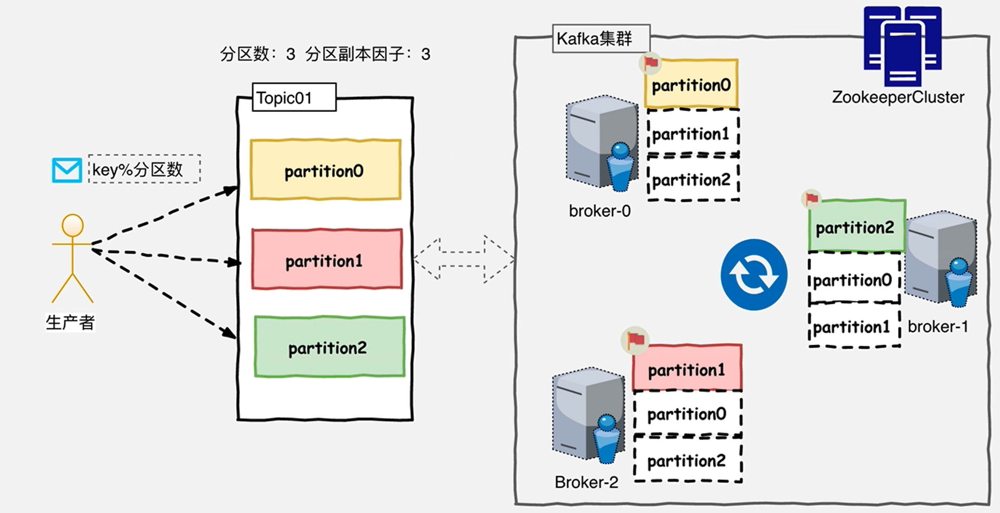


#### kafka的Topic与日志

Kafka中所有消息是通过Topic为单位进行管理，每个Kafka中的Topic通常会有多个订阅者，负责订阅发送到改Topic中的数据。Kafka负责管理集群中每个Topic的一组日志分区数据。

生产者将数据发布到相应的Topic。负责选择将哪个记录分发送到Topic中的哪个Partition。例如可以round-robin（轮训）方式完成此操作，然而这种仅是为了平衡负载。也可以根据某些语义分区功能（例如基于记录中的Key）进行此操作。

每组日志分区是一个有序的不可变的的日志序列，分区中的每一个Record都被分配了唯一的序列编号称为是offset，Kafka 集群会持久化所有发布到Topic中的Record信息，改Record的持久化时间是通过配置文件指定,默认是168小时（7天）。

```
log.retention.hours=168
```

Kafka底层会定期的检查日志文件，然后将过期的数据从log中移除，由于Kafka使用硬盘存储日志文件，因此使用Kafka长时间缓存一些日志文件是不存在问题的。

疑问：kafka是如何在落盘的同时，还能做到高性能的？不同分区的写入是可以并行的，因此kafka的分区一定程度上提高了它的写入性能。因此kafka可以应用组一些高并发、大数据场景下。

##### 分区与有序性

kafka消息队列并不是严格意义上的先进先出。由于是按照 hash(key)%分区数，是无法保证partition分区之间的顺序的，只能保证分区内部的数据先后顺序。

除非设定只有一个分区，才能保证严格的有序。


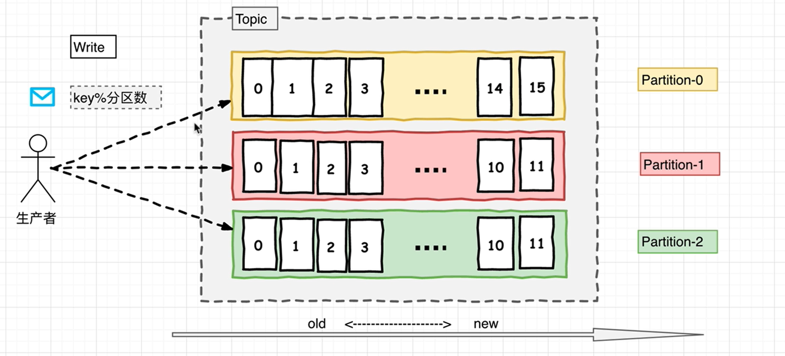


##### 消费者如何消费数据

在消费者消费Topic中数据的时候，每个消费者会维护本次消费对应分区的偏移量，消费者会在消费完一个批次的数据之后，会将本次消费的偏移量提交给Kafka集群，因此对于每个消费者而言可以随意的控制改消费者的偏移量。因此在Kafka中，消费者可以从一个topic分区中的任意位置读取队列数据，由于每个消费者控制了**自己的消费的偏移量**，因此**多个消费者之间彼此相互独立**。

Kafka中对Topic实现日志分区的有以下目的：

- 首先，它们允许日志扩展到超出单个服务器所能容纳的大小。每个单独的分区都必须适合托管它的服务器，但是一个Topic可能有很多分区，因此它可以处理任意数量的数据。

- 其次每个服务器充当其某些分区的Leader，也可能充当其他分区的Follwer，因此群集中的负载得到了很好的平衡。 

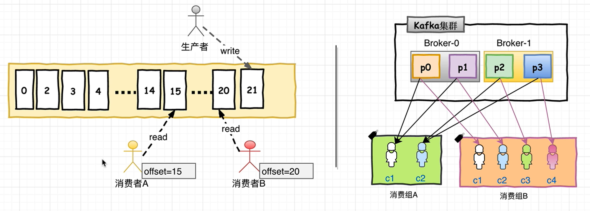


##### 生产者&消费者：如何避免重复消费？

消费者使用Consumer Group名称标记自己，并且发布到Topic的每条记录都会传递到每个订阅Consumer Group中的一个消费者实例。如果所有Consumer实例都具有相同的Consumer Group，那么Topic中的记录会在改ConsumerGroup中的Consumer实例进行均分消费；如果所有Consumer实例具有不同的ConsumerGroup，则每条记录将广播到所有Consumer Group进程。

更常见的是，我们发现Topic具有少量的Consumer Group，每个Consumer Group可以理解为一个“逻辑的订阅者”。每个Consumer Group均由许多Consumer实例组成，以实现可伸缩性和容错能力。这无非就是发布-订阅模型，其中订阅者是消费者的集群而不是单个进程。这种消费方式Kafka会将Topic按照分区的方式均分给一个Consumer Group下的实例，如果ConsumerGroup下有新的成员介入，则新介入的Consumer实例会去接管ConsumerGroup内其他消费者负责的某些分区，同样如果一下ConsumerGroup下的有其他Consumer实例宕机，则由改ConsumerGroup其他实例接管。

由于Kafka的Topic的分区策略，因此Kafka仅提供分区中记录的有序性，也就意味着相同Topic的不同分区记录之间无顺序。因为针对于绝大多数的大数据应用和使用场景， 使用分区内部有序或者使用key进行分区策略已经足够满足绝大多数应用场景。但是，如果您需要记录全局有序，则可以通过只有一个分区Topic来实现，尽管这将意味着每个ConsumerGroup只有一个Consumer进程（可能要损失kafka的高吞吐量）。

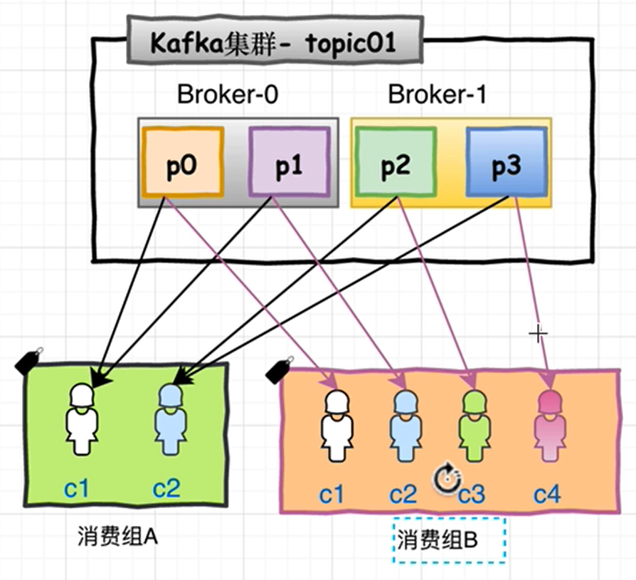

##### 高性能之道-顺序写&mmap

Kafka的特性之一就是高吞吐率，但是Kafka的消息是保存或缓存在磁盘上的，一般认为在磁盘上读写数据是会降低性能的，但是Kafka即使是普通的服务器，Kafka也可以轻松支持每秒百万级的写入请求，超过了大部分的消息中间件，这种特性也使得Kafka在日志处理等海量数据场景广泛应用。Kafka会把收到的消息都写入到硬盘中，防止丢失数据。为了优化写入速度Kafka采用了两个技术顺序写入和MMFile（memory mapped file，内存映射文件） 。

因为硬盘是机械结构，每次读写都会寻址->写入，其中寻址是一个“机械动作”，它是最耗时的。所以硬盘最讨厌随机I/O，最喜欢顺序I/O。为了提高读写硬盘的速度，Kafka就是使用顺序I/O。这样省去了大量的内存开销以及节省了IO寻址的时间。但是单纯的使用顺序写入，Kafka的写入性能也不可能和内存进行对比，因此Kafka的数据并不是实时的写入硬盘中 。

Kafka充分利用了现代操作系统分页存储来利用内存提高I/O效率。Memory Mapped Files(后面简称mmap)也称为内存映射文件，在64位操作系统中一般可以表示20G的数据文件，它的工作原理是直接利用操作系统的Page实现文件到物理内存的直接映射。完成MMP映射后，用户对内存的所有操作会被操作系统自动的刷新到磁盘上，极大地降低了IO使用率。

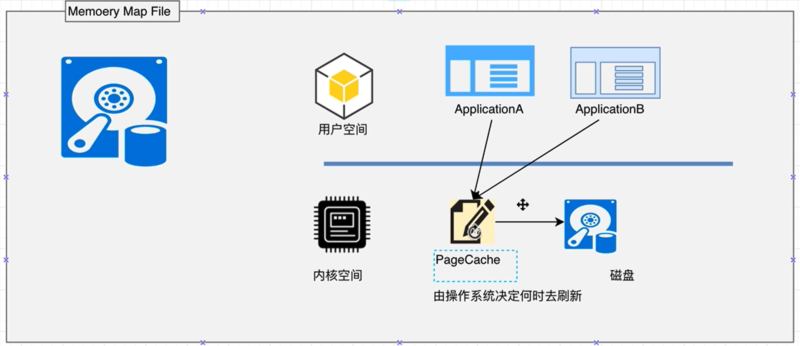

##### Zero Copy

Kafka服务器在响应客户端读取的时候，底层使用ZeroCopy技术，直接将磁盘无需拷贝到用户空间，而是直接将数据通过内核空间传递输出，数据并没有抵达用户空间。

传统IO操作

1. 用户进程调用read等系统调用向操作系统发出IO请求，请求读取数据到自己的内存缓冲区中。自己进入阻塞状态。

2. 操作系统收到请求后，进一步将IO请求发送磁盘。

3. 磁盘驱动器收到内核的IO请求，把数据从磁盘读取到驱动器的缓冲中。此时不占用CPU。当驱动器的缓冲区被读满后，向内核发起中断信号告知自己缓冲区已满。

4. 内核收到中断，使用CPU时间将磁盘驱动器的缓存中的数据拷贝到内核缓冲区中。

5. 如果内核缓冲区的数据少于用户申请的读的数据，重复步骤3跟步骤4，直到内核缓冲区的数据足够多为止。

6. 将数据从内核缓冲区拷贝到用户缓冲区，同时从系统调用中返回。完成任务

##### 常规IO vs DMA

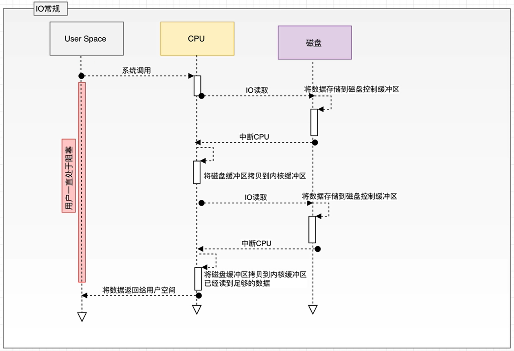


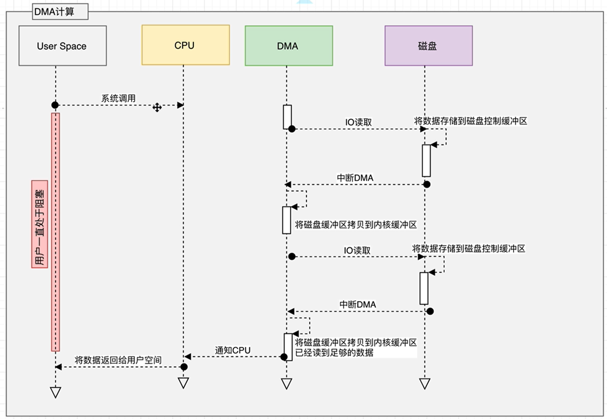

##### 常规IO vs 零拷贝

一般方案：

1、文件在磁盘中数据被copy到内核缓冲区

2、从内核缓冲区copy到用户缓冲区

3、用户缓冲区copy到内核与socket相关的缓冲区。

4、数据从socket缓冲区copy到相关协议引擎发送出去

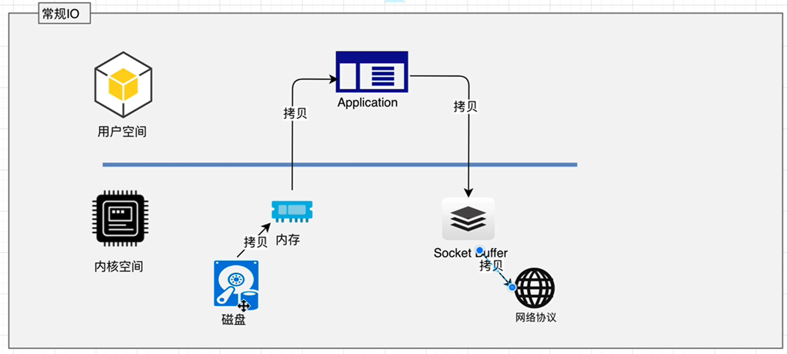

零拷贝：

1、文件在磁盘中数据被copy到内核缓冲区

2、从内核缓冲区copy到内核与socket相关的缓冲区。

3、数据从socket缓冲区copy到相关协议引擎发送出去

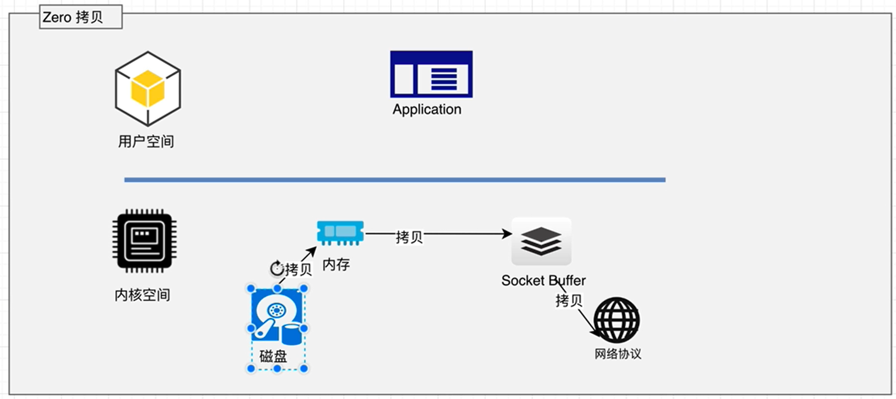


## kafka安装

#### 添加IP地址与主机名映射

```shell
# 添加IP地址与主机名映射：
vi /etc/hosts 
# 内容如下
127.0.0.1   localhost localhost.localdomain localhost4 localhost4.localdomain4
::1         localhost localhost.localdomain localhost6 localhost6.localdomain6

10.0.0.150 zk-node01
10.0.0.151 zk-node02
10.0.0.152 zk-node03
```

添加之后，三台机器能够互相ping通：例如 ping zk-node01

准备：kafka_2.11-2.2.0.tgz


修改配置文件

```
vim /usr/local/kafka/config/server.properties
```

修改如下

```shell
#....未修改部分已省略
############################# Server Basics #############################
# The id of the broker. This must be set to a unique integer for each broker.
broker.id=0 # 三台机器broker.id分别是 0 1 2

############################# Socket Server Settings #############################
listeners=PLAINTEXT://zk-node01:9092 # 根据每一台机器的主机名称

############################# Log Basics #############################
# A comma separated list of directories under which to store log files
log.dirs=/usr/local/kafka/kafka-logs

############################# Zookeeper #############################
zookeeper.connect=zk-node01:2181,zk-node02:2181,zk-node03:2181
```


启动 kafka

```shell
cd /usr/local/kafka/bin
./kafka-server-start.sh -daemon /usr/local/kafka/config/server.properties
```

关闭 kafka

```shell
./kafka-server-stop.sh
```

查看 topic 帮助

```shell
./kafka-topics.sh --help
```

添加 topic（例如创建 topic01）

```shell
/usr/local/kafka/bin/kafka-topics.sh --bootstrap-server zk-node01:9092,zk-node01:9092,zk-node01:9092 --create --topic topic01 --partitions 3 --replication-factor 3
```

查看 topic

```shell
/usr/local/kafka/bin/kafka-topics.sh --bootstrap-server zk-node01:9092,zk-node01:9092,zk-node01:9092 --list

/usr/local/kafka/bin/kafka-topics.sh --bootstrap-server zk-node01:9092,zk-node01:9092,zk-node01:9092 --describe topic01
```

删除 topic

```shell
/usr/local/kafka/bin/kafka-topics.sh --bootstrap-server zk-node01:9092,zk-node01:9092,zk-node01:9092 --delete --topic topic01
```

订阅

```shell
/usr/local/kafka/bin/kafka-console-consumer.sh --bootstrap-server zk-node01:9092,zk-node01:9092,zk-node01:9092 --topic topic01 --group g1 --property print.key=true --property print.value=true --property key.separator=,
```


##### 单机 kafka

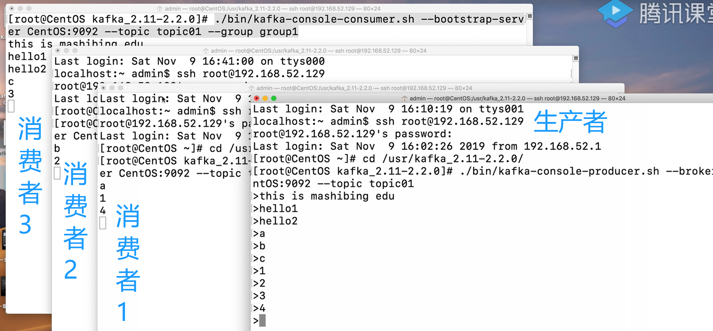

##### kafka集群配置

时钟同步

ntpdate cn.pool.ntp.org | ntp[1-7].aliyun.com

```shell
yum install -y ntp
ntpdate ntp1.aliyun.com
clock -w
```

启动 zk

```
cd /usr/local/zookeeper/bin/
./zkServer.sh start
```

