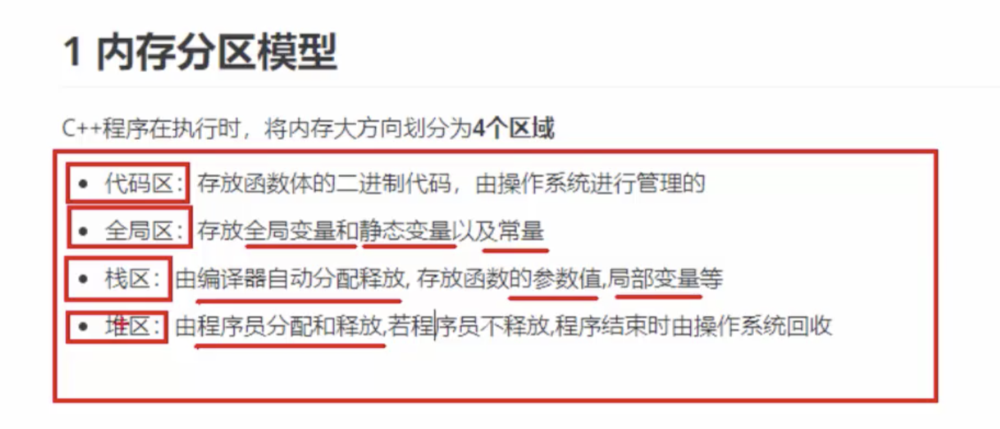

# C++笔记

#### Nullptr 关键字

##### What is the difference between Null and Nullptr in C++?

**nullptr** is a keyword that represents zero as an address (its type is considered a pointer-type), while **NULL** is the value zero as an int . If you're writing something where you're referring to the zero address, rather than the value zero, you should use **nullptr** .

#### const使用场景

- 使用指针传递引用节省空间
- 避免误修改

new出的对象存储在堆空间，例如，int * a = new int(10);，手动开辟，手动释放

局部变量在栈空间，函数返回时自动销毁。不要将局部变量的引用作为返回值。

- struct默认访问权限
- class默认权限private

#### 智能指针

##### What is Make_shared in C++?

`std::make_shared`

Allocates and constructs an object of type T passing args to its constructor, and returns an object of type shared_ptr<T> that owns and stores a pointer to it (with a use count of 1). This function uses ::new to allocate storage for the object.

##### Does Make_shared create a copy?

Yes, in this case sptr will be new shared_pointer instance with newly **created copy** of someInstance (if A class has the public **copy** constructor defined - implicit or explicit).

##### What is Weak_ptr in C++?

std::**weak_ptr** is a smart pointer that holds a non-owning ("weak") reference to an object that is managed by std::shared_ptr. It must be converted to std::shared_ptr in order to access the referenced object. ... Another use for std::**weak_ptr** is to break reference cycles formed by objects managed by std::shared_ptr.

##### When should I use Unique_ptr?

**Use unique_ptr** when you want to have single ownership(Exclusive) of the resource. Only one **unique_ptr** can point to one resource. Since there can be one **unique_ptr** for single resource its not possible to copy one **unique_ptr** to another. A shared_ptr is a container for raw pointers.