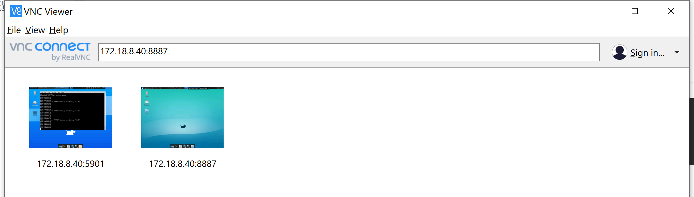
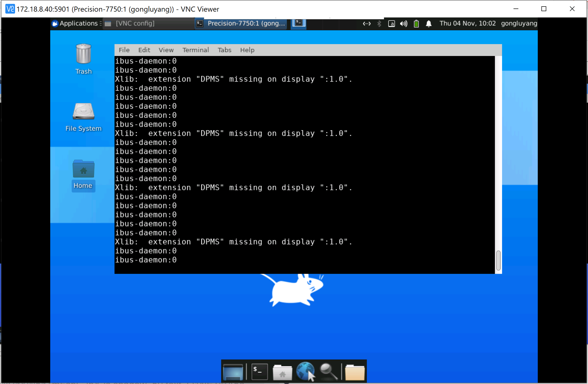
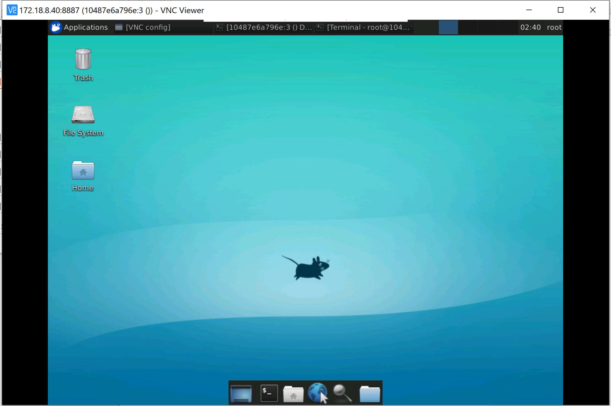

# 使用VNC连接docker容器

> https://sparkydogx.github.io/2018/03/02/vncserver/

vnc是一个远程桌面的工具，可以用来对远程服务器进行图形界面操作。下面介绍如何使用vnc连接到docker容器中。

# 服务端

vncserver部署在服务器中的docker容器内。

## Docker容器端口映射

通常情况下，除非在建立docker容器时指定，否则无法访问到容器内的端口。因此第一步是在建立docker容器是指定服务器与docker容器之间的端口映射。例如：`-p 2222:2222`，建立容器2222端口与服务器2222端口之间的连接。
如果已经有配置好的docker容器，可以使用`docker commit`指令commit当前的docker容器，然后以commit的镜像为image重新创建一个docker容器，创建时指定端口。
如果有需求，还可以在创建时使用`--shm-size=128m`指令指定 /dev/shm 的大小。如果不手动指定，docker默认分配64M。

## 修改镜像源

工欲善其事必先利其器。这是为下一步安装图形桌面做准备。由于图形桌面的软件包较大，需要使用一个靠谱的国内镜像源。以作者的环境为例，Ubuntu 14.04，使用上海交通大学的镜像源：

```
$ vim /etc/apt/sources.list
$ :%s/archive.ubuntu.com/ftp.sjtu.edu.cn/g
$ sudo rm /var/lib/apt/lists/* -vf
$ sudo apt-get update
```


## 安装x11

x11是一个用于远程图形界面的程序，若只安装x11，也可以通过ssh -x连接后显示图形程序。
`sudo apt-get install xorg openbox`

## 安装桌面环境

可以任意选择一下一种：

### Unity :

```
sudo apt-get install ubuntu-desktop
```

### Xfce:

复制

```
$ sudo apt-get install xfce4
$ sudo apt-get install xubuntu-desktop
$ xfce4-session
```

## 安装vncserver

```
sudo apt-get install vnc4server
```

启动vncserver:`vncserver`，首次启动需要设置密码。

## 设置vnc端口

`vim /usr/bin/vncserver`
在这个文件中找到vncPort一行，可以看到`$vncPort = 5900 + $displayNumber;`
将5900修改为需要的端口号，之后我想把displayNumber设置为1，因此这里改为：
`$vncPort = 2332 + $displayNumber;`
用`vncserver :1`命令启动vncserver后，查看log文件可以看到启用的是2333端口。

## 安装其他包

```
sudo apt-get install gnome-panel gnome-settings-daemon metacity nautilus gnome-terminal
```

## 修改xtartup文件

文件位置：`~/.vnc/xstartup`

### Unity

将其修改如下：

```
#!/bin/sh

# Uncomment the following two lines for normal desktop:
# unset SESSION_MANAGER
# exec /etc/X11/xinit/xinitrc

#[ -x /etc/vnc/xstartup ] && exec /etc/vnc/xstartup
#[ -r $HOME/.Xresources ] && xrdb $HOME/.Xresources
#xsetroot -solid grey
#vncconfig -iconic &
#x-terminal-emulator -geometry 80x24+10+10 -ls -title "$VNCDESKTOP Desktop" &
#x-window-manager &

export XKL_XMODMAP_DISABLE=1
unset SESSION_MANAGER
unset DBUS_SESSION_BUS_ADDRESS

[ -x /etc/vnc/xstartup ] && exec /etc/vnc/xstartup
[ -r $HOME/.Xresources ] && xrdb $HOME/.Xresources
xsetroot -solid grey
vncconfig -iconic &
gnome-session &
gnome-panel &
gnome-settings-daemon &
metacity &
nautilus &
gnome-terminal &
```


[参考来源](https://gist.github.com/Musinux/8e6c4752ed3c143d49764311a504c1e9)

### Xfce

```
sed -i 's$x-window-manager$xfce4-session$' ~/.vnc/xstartup
```

## 设置分辨率

1. 关闭vncserver：`vncserver -kill :1`
2. 设置分辨率并重启：`vncserver -geometry 1366x768 :1`

# 客户端

客户端我使用[VNC Viewer](https://www.realvnc.com/en/connect/download/viewer/)，也可自由选择其他软件。

这一步比较简单，只需输入ip，指定端口号，正确填写之前设定的vnc密码，即可连接





##### docker

因为端口映射设置了 8887 端口，所以要让 vnc server 也监听 8887 端口，在配置文件 /usr/bin/vncserver 中将 $vncPort = 5900 + $displayNumber; 改成 8887。

> 端口映射可以 docker -p 指定多个端口吗？docker 和宿主机只能透传 1个端口？

```
?  ~ docker ps -a
CONTAINER ID   IMAGE                            COMMAND                  CREATED        STATUS          PORTS                                       NAMES
10487e6a796e   mjenz/ros-kinetic-desktop-full   "/ros_entrypoint.sh …"   2 weeks ago    Up 24 minutes   0.0.0.0:8887->8887/tcp, :::8887->8887/tcp   xenodochial_kare
```




