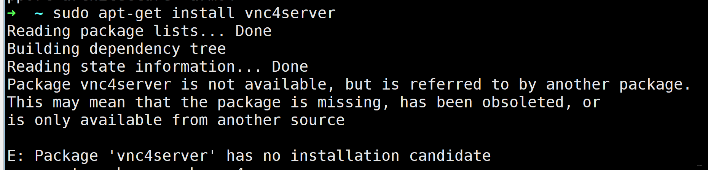
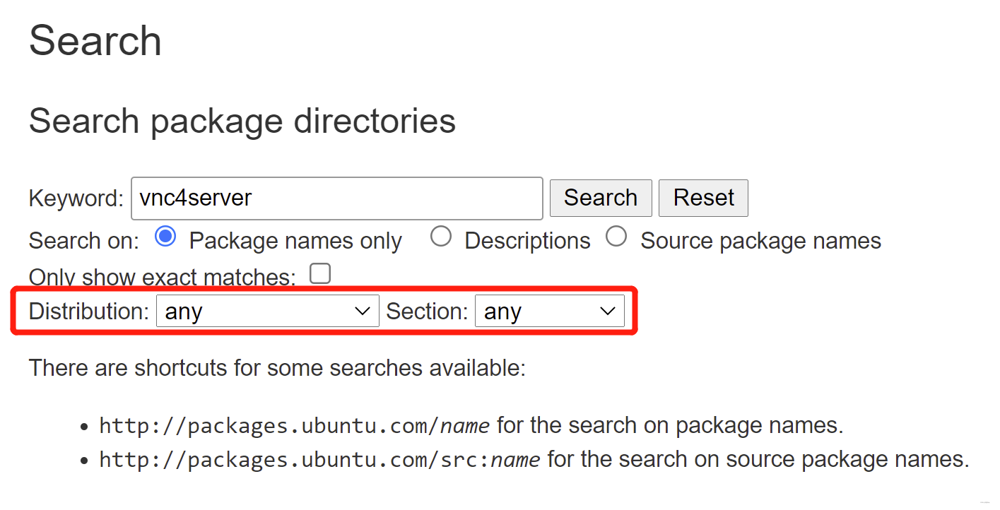
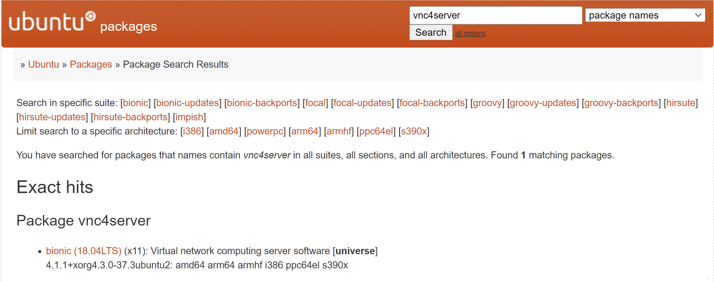

# APT: Package ‘vnc4server‘ has no installation candidate 排查过程及解决方法

## 找不到 vnc4server

想安装 vnc4server，于是 `sudo apt-get insall vnc4server`，然而找不到包，说 Package ‘vnc4server‘ has no installation candidate，`apt-cache search vnc4server` 也搜不到这个包。




## 解决方法
参考：[https://blog.csdn.net/weixin_41879093/article/details/108891958](https://blog.csdn.net/weixin_41879093/article/details/108891958)
参考：[Package 'vncviewer ' has no installation candidate](https://askubuntu.com/questions/963434/package-vncviewer-has-no-installation-candidate)

All this means is that there is no package that exists in your sources list that matches that name exactly. The best approach (IMHO) to take when faced by an issue like this is to begin by checking [Ubuntu Package Search](https://packages.ubuntu.com/) using the keyword of what you were trying to find. In this case "vncviewer" is actually embedded in the [valid package name.](https://packages.ubuntu.com/search?keywords=vncviewer&searchon=names&suite=all&section=all) Even if it wasn't you can still search the package contents for specific filenames which can also be a successful way of locating which package contains a command/program you are attempting to locate. Either of which should get you where you are attempting to go.

In your specific case, you have a couple of easy options. Both of which require [enabling the Universe Repository](https://askubuntu.com/questions/148638/how-do-i-enable-the-universe-repository) first.

Once that is complete, you can either install the gtk version with `sudo apt install gvncviewer` or the X version with `sudo apt install xtightvncviewer`

The GTK version has fewer dependencies and a smaller package size. There's a decent (if somewhat dated) Community Help wiki on [VNC Clients.](https://help.ubuntu.com/community/VNC/Clients)

## 具体步骤

在网站 [Ubuntu Packages Search](https://packages.ubuntu.com/) 上搜索 vnc4server，并且在 distribution 选项上选 any 来从每个版本的软件中查找。




可以看到 vnc4server 这个软件是在版本 bionic 中，并且属于 universe 仓库。




有上面的那些信息后，我们可以在文件 /etc/apt/sources.list 中添加：

```
deb http://archive.ubuntu.com/ubuntu/ bionic universe
```
在添加完后，执行以下命令更新一下再重新安装就可以了。

虽然博主的 Ubuntu 版本是 focal (20版本)，但是同样安装成功了。