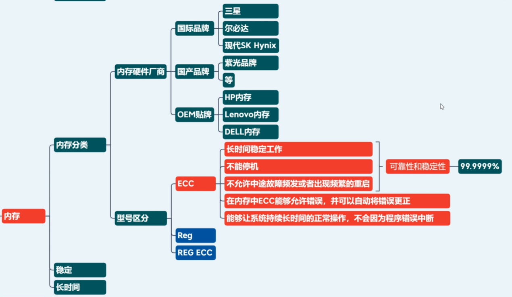
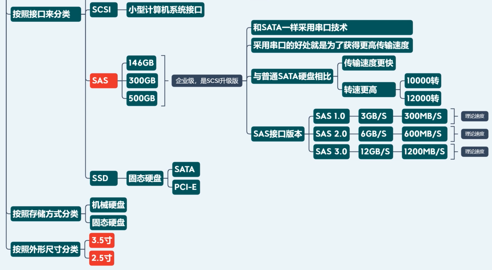
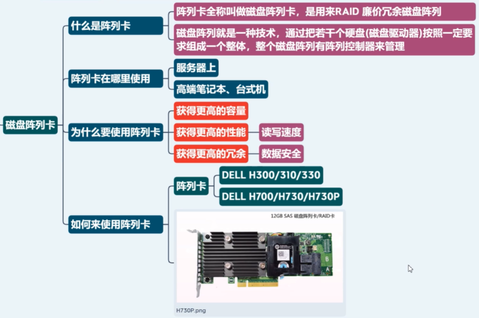
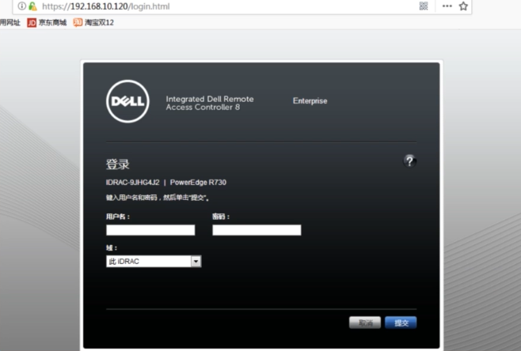

# 服务器硬件

## 服务器分类

#### 服务器系统分类

#### 服务器品牌分类

#### 服务器尺寸分类

收集一下 Dell HP IBM 品牌，1U 2U 4U 等常见的服务器型号

例如： Dell 2U R710

#### 服务器外形分类

#### 服务器功能分类

- 通用性服务器
- 人工智能服务器
- 存储型服务器
- 关键应用服务器
- 区块链算力服务器（矿机）

## 机房分类

## 企业级服务器硬件

#### 服务器主板

- 双路
- 四路
- 多路...Dell C6220

#### CPU 分类

#### 内存分类

#### 硬盘分类

#### 磁盘阵列卡

什么是阵列卡？为什么要使用阵列卡？

#### 远程管理卡

远程管理卡，类似于网卡。实际上可有可无，是让运维人员不去接触服务器，就能进行服务器的配置和管理。

##### 远程管理卡的使用场景

- 运维人员，不方便进入机房的时候，输入用户名、密码，就能进入到服务器上
- 设置服务器的 BIOS 硬件
- 配置 RAID 卡
- 装系统
- 看日志
- 传统方式登录不进操作系统时，可以远程重启

##### 如何使用

登录进去之后，进入 GUI 虚拟控制台，在其中进行各种操作。

#### 网卡

##### 什么是网卡

网卡，就是一块被设计用来允许计算机在网络上进行通讯的计算机硬件。

##### 在哪里用

- PC 机必备
- 服务器必备

##### 为什么使用网卡

- 单个计算机是一个封闭的系统，我们要借助网络进行资源共享、数据传输，所以需要这样的一个设备，将我们操作系统中存储的数据转化为电信号、光信号，逐步分层向下打包发送。
- 为了进行分布式存储：最早是美国军事使用，让数据能够快速输转移到其他的指挥中心节点。

##### 怎么使用网卡

- 有一块能正常工作的网卡，开机通电，由操作系统装了驱动，通过传输介质（网线/光纤/同轴电缆/WIFI/蓝牙/微波/量子通信）
- 网络传输协议：DHCP用于分配IP地址；以及 TCP IP UDP 等等协议

#### 光驱（选配）

了解即可