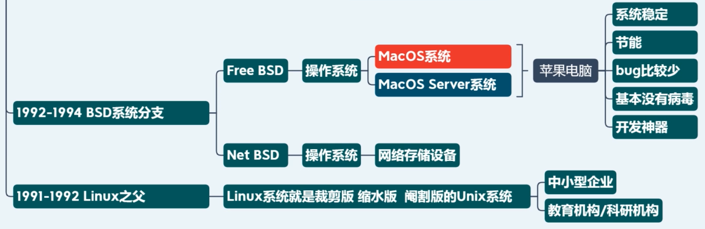
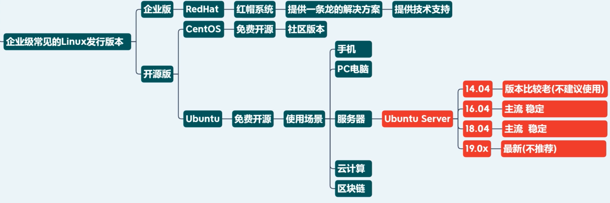
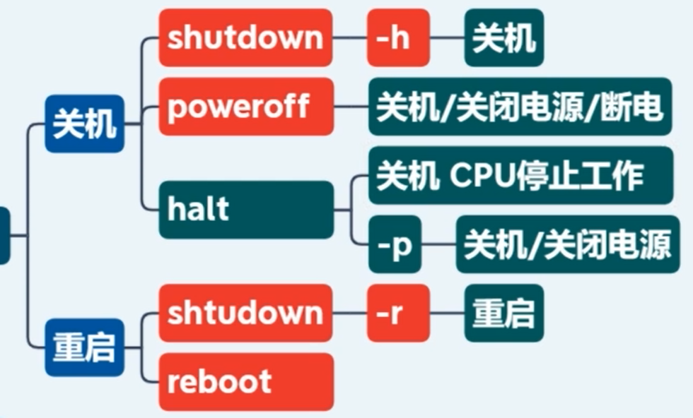
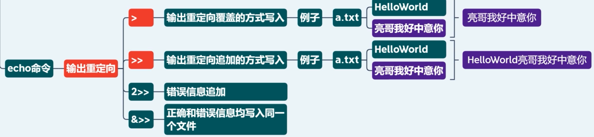

# Linux 系统

### Linux 系统发展历史

1969 Unix 诞生，贝尔实验室，C语言、网络也是在这里诞生的。这些早期都是为美国军方使用的，计算导弹弹道等。

### Linux 系统安装

##### Linux 版本的选择和优化：基于服务器架构的选择

- x86架构：intel 至强处理器 / AMD 公司也有 CPU，但市场占有非常低，只有在桌面级才能和 intel 匹敌
- ARM架构：intel 造出来的，后来卖了。最早出现在 Android 手机上，现在 iphone，ipad，开发板，IOT 设备也是 ARM 架构的。
  - 世界上只有极少数公司能够掌握，例如高通
  - iPad Pro A12X 相当于 intel i7

##### Linux 版本的选择和优化：基于CPU处理数据能力的选择

- 8位 / 16位 / 32位 / 64位...
- 对32位操作系统来说，最大支持 2^32=3.75G 内存寻址

##### 企业级常见的 Linux 发行版本

选择系统原则：不选择较旧的版本，也不建议使用最新版本系统！

- 旧版本停止维护，漏洞没人修复，不安全。例如 win7 面临病毒威胁

- 最新版不稳定，帮助文档少，Bug多，会踩坑（例如，邮政储蓄银行系统）
- 通常选择偶数版本，例如，Ubuntu 18.04，CentOS7.6x64-1810，因为一般奇数版本是较大版本，偶数版是小更新，较稳定
  - CentOS7.7x64-1908 是 CentOS 7 的最后一个版本了，虽然是奇数版本，但也较为稳定，可以选择此版本

##### 安装 CentOS 系统

建议使用 VMWare Workstation 12 以上的版本

##### 命令行快捷键

- ctr a 光标到行首
- ctr e 光标到行尾
- ctr f 光标向右一个
- ctr b 光标向左一个
- ctr insert 复制
- shift insert 粘贴
- ctr d 退出终端

##### 帮助文档

例如，查看 ls 命令的帮助文档：man ls

##### 关机命令

##### echo 命令输出重定向

##### 常用命令

- nl 显示行号查看文件
- more  -显示的行数 文件名
- less
- tail
- head
- tree 树型显示目录
- vim 的 :set nu 显示行号
  - yy 复制所在1行，5yy 复制5行
  - p 在下一行粘贴
  - dd 删除1行，5dd删除5行
  - gg 快速跳转到文件的头部
  - G 快速跳转到文件的尾部，5G跳转到第5行
  - $ 快速到光标所在行尾，5$跳转到第5行的行尾
  - u 撤销
  - :s/旧的/新的，替换光标所在行第一次出现的位置
  - :%s/旧的/新的/g，替换文档中所有出现过的位置

| **目录** |                                                              |
| -------- | ------------------------------------------------------------ |
| /boot    | 系统启动相关的文件，如内核、initrd，以及grub（BootLoader）   |
| /etc     | 配置文件                                                     |
| /home    | 用户的家目录，每一个用户的家目录通常默认为/home/USERNAME     |
| /root    | 管理员的家目录                                               |
| /lib     | 库文件静态库：单在程序中的库，其他程序不能使用该库文件动态库：在内存中，任何用到该库的程序都可以使用/lib/modules：内核模块文件 |
| /media   | 挂载点目录，移动设备（在windows中，插入一张光盘，系统会自动读取光盘，用户可以直接执行，但在linux中，插入光盘后需要在挂载点挂载这个设备之后才可以使用这个设备。） |
| /mnt     | 挂载点目录，额外的临时文件系统                               |
| /opt     | 可选目录，第三方程序的安装目录                               |
| /proc    | 伪文件系统，内核映射文件                                     |
| /sys     | 伪文件系统，跟硬件设备相关的属性映射文件                     |
| /tmp     | 临时文件，/var/tmp                                           |
| /var     | 可变化的文件，经常发生变化的文件                             |
| /bin     | 可执行文件，用户命令                                         |
| /sbin    | 可执行文件，管理命令                                         |
| /usr     | 只读文件，shared read-only/usr/local：第三方软件             |