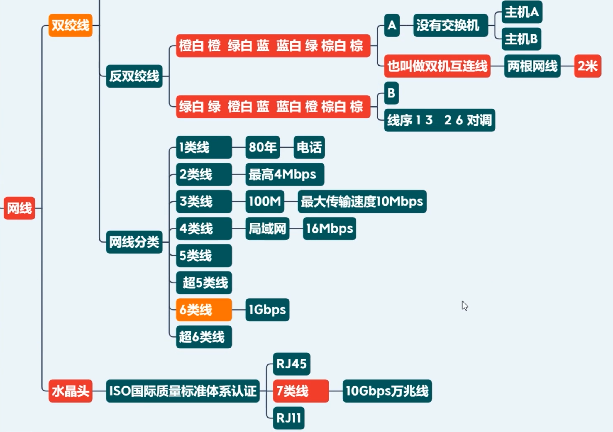
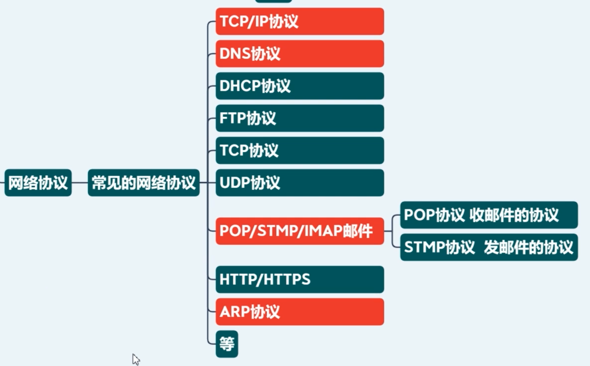
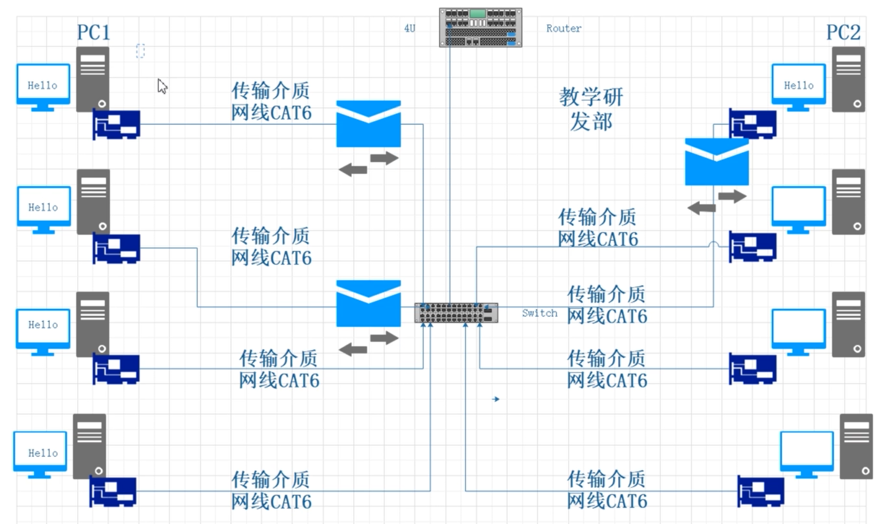
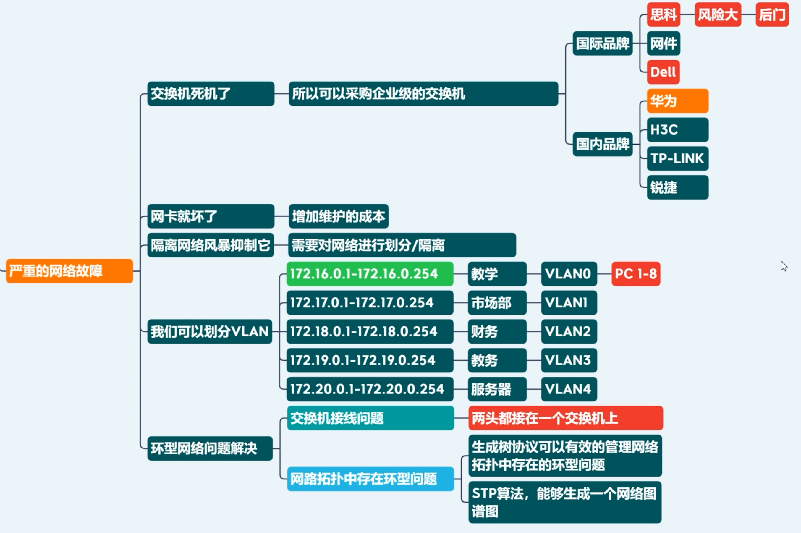
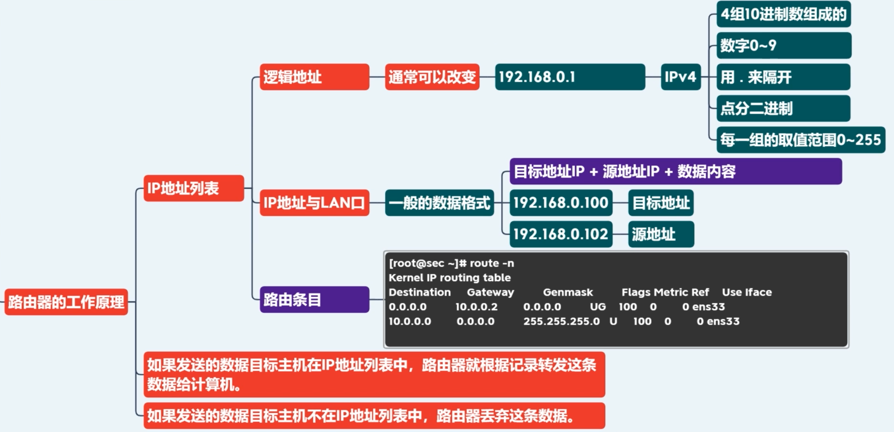

# Linux网络基础

### 容灾技术方案：两地三中心

当前市场上常见的容灾模式可分为：同城容灾、异地容灾、 双活数据中心、 两地三中心几种。

结合近年国内出现的大范围自然灾害，以同城双中心加异地灾备中心的 “两地三中心”的灾备模式也随之出现，这一方案兼具高可用性和灾难备份的能力。

**同城双中心** 是指在同城或邻近城市建立两个可独立承担关键系统运行的数据中心，双中心具备基本等同的业务处理能力并通过高速链路实时同步数据，日常情况下可同时分担业务及管理系统的运行，并可切换运行；灾难情况下可在基本不丢失数据的情况下进行灾备应急切换，保持业务连续运行。与异地灾备模式相比较，同城双中心具有投资成本低、建设速度快、运维管理相对简单、可靠性更高等优点。

**异地灾备中心** 是指在异地的城市建立一个备份的灾备中心，用于双中心的数据备份，当双中心出现自然灾害等原因而发生故障时，异地灾备中心可以用备份数据进行业务的恢复。

**两地三中心** 是指 **同城双中心** 加 **异地灾备** 一种商用容灾备份解决方案；

- **两地** 是指同城、异地；

- **三中心** 是指生产中心、同城容灾中心、异地容灾中心。（ 生产中心、同城灾备中心、异地灾备中心 ）

### 网线分类

### 网络协议

### 交换机（属于7层模型的2层设备）

工作原理：MAC 地址列表

##### 为什么路由器一般要接交换机再接 AP？

家用路由器结合了路由器和交换机的功能，带来了更好的经济性。但是现在有很多朋友也开始使用单独路由器+交换机组网，原因有那么几个

1. 家有路由器一般就5个口，外网用掉一个，还有4口，网口不够

2. 如果家里有AP的，很多使用POE供电，路由器一般都没有这个功能，需要专门的交换机
3. 性能。因为交换机的处理数据，特别像局域网内数据处理，比如复制粘贴，使用了交换机能明显发现速度更快，而且不会影响其他用户。否则，路由器就cpu满载了，影响速度了。

由于现在的无线网络需求大，所以推荐 路由器+交换机+AP 的方案

##### 网络风暴

网络风暴的危害，以及如何避免网络风暴？

### 路由器（属于7层模型的3层设备）

如果通过把两个交换机连在一起的方式连接两个子网的话，任意一方的交换机发生网络风暴的情况下，会影响到其他所有的交换机，导致整体的网络不可用。因此，应该使用路由器，而不是直接连接交换机，来连接并隔离两个子网。

路由器可以有效屏蔽交换网络中网络风暴的问题。

##### 路由器工作原理

工作原理：IP 地址列表

