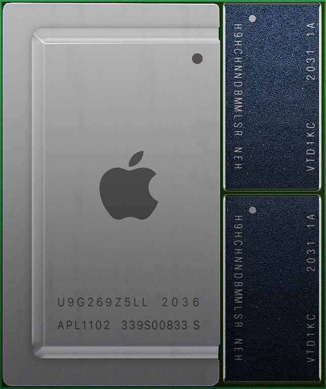
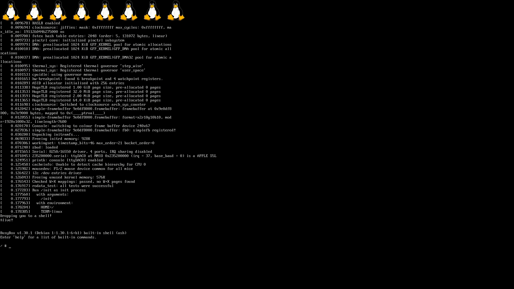

# Asahi Linux——为 Apple 芯片设计的 Linux 系统

> https://dgideas.net/2021/asahi-linux-for-apple-silicon/
>
> 发布日期：2021年9月30日

自 2020 年苹果发布了多款搭载 Apple 芯片的设备以来，社区中的一些高级爱好者便尝试将不同的 Linux 发行版移植到基于 ARM64 指令集的 Apple 芯片上。在众多项目中，[Asahi Linux](https://asahilinux.org/) 便是其中的一个先行者：它通过一种创新且坚实的解决方案将 Linux 系统适配于 Apple 芯片，解决问题的方式富含工程美感，值得大家学习。

一台 Mac mini 中搭载的Apple M1 处理器芯片，由 [Henriok](https://commons.wikimedia.org/wiki/User:Henriok) 拍摄


## 全“芯”困扰

早在 Apple M1 芯片发布数周后，社区中就[已经有](https://arstechnica.com/gadgets/2021/01/corellium-got-ubuntu-linux-running-on-m1-macs-and-you-can-too/)将 Ubuntu 等发行版移植到 Apple 芯片上的尝试——但这些移植并不简单！M1 芯片上的几乎所有组件都是苹果定制的，通用 Linux 内核无法简单的运行在 M1 处理器上。对于 Apple 芯片的后续版本来说，也是如此。

当我们尝试为一个新的硬件环境适配操作系统时，在一系列欠缺支持硬件的面前我们通常有两种手段：要么修改内核，使内核工作于这些硬件组成的集合之上，要么将这些硬件适配为内核可以支持的标准硬件，然后将通用内核应用其上。这两种方法都需要进行大量努力。先行者 [Corellium](https://www.corellium.com/)（一家专注于 ARM 设备虚拟化的公司）通过大幅修改内核的方式以支持 M1 芯片上的特定非标准硬件。一些其他社区项目在适配 Linux 内核时也做出了许多额外贡献。


另一方面，搭载 Apple 芯片设备的启动过程几乎与传统 PC 完全不同——它的启动过程从 iPhone 和 iPad [演进而来](https://support.apple.com/guide/security/boot-process-secac71d5623/web)。Apple 芯片基于 ARM 64 指令集，而就 ARM64 平台来说，大多数设备的启动都遵循以下两个极有影响力的标准之一：[UEFI](https://en.wikipedia.org/wiki/Unified_Extensible_Firmware_Interface) + [ACPI](https://en.wikipedia.org/wiki/Advanced_Configuration_and_Power_Interface)（广泛地用于运行 Windows 或 Linux 的服务器上），以及 [AArch64 Linux 启动协议](https://www.kernel.org/doc/Documentation/arm64/booting.txt) + [Devicetree](https://www.devicetree.org/)（用于小型系统上，同样也被 [U-Boot](https://en.wikipedia.org/wiki/Das_U-Boot) 等支持）。而 Apple 芯片所使用的“苹果式”启动方式则与任何一个公开标准均不同，特别是当这个问题出现在要将全新操作系统内核适配到新系统架构时，更为严重。

在一些由社区整理的资料中我们看到，苹果公司似乎采取一些措施，来让搭载 Apple 芯片的设备启动过程*看起来*与 Intel 平台的 Mac 启动过程类似，然而这更加重了对于这颗芯片到底是如何运作的困惑。苹果公司在 2021 年 2 月更新的《[Apple 平台安全保护](https://support.apple.com/guide/security/welcome/web)》版本中分享了一些关于上述问题的技术细节，但公开的资料极其有限，根本无法作为完整系统功能适配之用。社区中由一群爱好者和志愿者无私整理了关于这些设备的[启动过程](https://github.com/AsahiLinux/docs/wiki/SW:Boot)、[存储与分区](https://github.com/AsahiLinux/docs/wiki/SW:Storage)以及[与传统 PC 的区别比较](https://github.com/AsahiLinux/docs/wiki/M1-vs.-PC-Boot)等诸多细节内容，为相关项目的开发提供了很大帮助。

> 很遗憾，截止到目前为止，苹果公司仍未公布有关 GPU 的有用技术细节，包括 Asahi Linux 在内的几乎所有项目都无法利用 Apple 芯片中的图形处理器（GPU）的绝大部分。
>
> ——注解更新于 2021 年 10 月

## 解决问题

该轮到我们这篇文章的主人公 Asahi Linux 项目上场了——这是一个致力于将 Linux 系统移植到搭载 Apple 芯片的 Macs 上的社区项目，由硬件大佬 [marcan](https://github.com/marcan)（Hector Martin）发起。Asahi 在日语中意为“朝日”（没错，就是“朝日啤酒”里的 Asahi），这同样也是一个苹果栽培品种的名字。项目发起者 marcan 是一位经验丰富的逆向工程师与开发人员，拥有超过 15 年的移植 Linux 和在无文件和 / 或封闭设备上运行非官方软件的经验。他的[个人网站](https://marcan.st/)和[博客](https://marcan.st/posts/)中充满了无数有意思的尝试，现在他领导的项目开始挑战 Apple 芯片了。

### m1n1 + U-Boot

要将操作系统移植到全新的硬件架构上，需要考虑的第一件事情就是如何在新硬件上启动（引导）操作系统。我们已经简要介绍过 ARM64 平台被广泛使用的两种事实标准。时至今日，市面上几乎各种小型嵌入式 Linux 系统均使用 Devicetree 标准：该标准通过一系列数据文件来描述硬件情况。与之不同，ACPI 使用数据和代码的组合来描述。由于 Devicetree 足够简单且已被主线内核接纳，所以 Asahi Linux 项目决定使用 Devicetree 作为启动方式。

> Devicetree 标准（DTSpec）为启动程序到客户程序（注：操作系统等）之间提供了完备的定义，以便在面向多种不同系统间开发时，使用最少系统依赖将其组合起来。
>
> ——译自《[Devicetree v0.3 文档](file:///Users/dgideas/Downloads/devicetree-specification-v0.3.pdf)》 §1.1 节，注释为译者注

有趣的是，苹果公司在 Apple 芯片上也使用了自己版本的“设备树”，被称为 Apple Device Tree。这是由于 Apple 自己的版本以及开源版本的 Devicetree 均基于[开放硬件标准](https://en.wikipedia.org/wiki/Open_Firmware)。这也是一些旧式 Mac 以及 PowerPC 系列 Mac 所使用的标准。不过虽然都被称作“Devicetree”，Apple 版本的 Device Tree 却与开放标准的 Devicetree 的实现大相径庭，除非拥有大量关于标准实现的二进制细节的知识，否则两种格式之间几乎不可能实现转换。

有没有其他解决方法呢？一种可能的方法是引入一个中间层，以将 Apple 芯片设备上的独有硬件进行初始化适配，转换为可被 Linux 内核直接使用的标准格式。我们需要一个定制的 bootlaoder：[m1n1](https://github.com/AsahiLinux/m1n1) 项目由此诞生：m1n1 在启动阶段“作为”一个 XNU 内核，执行 Apple 设备特有的初始化过程。它的设计目的是将尽可能多的 Apple 特定硬件进行转换，这样下游的 Linux 或者其他项目就可以在不做任何更改的条件下进行标准适配。


大多数 Linux 发行版为桌面和服务器设备设计，它们大多默认支持 UEFI 标准而非 Devicetree，为了能在 Devicetree 环境虚拟出一整套 UEFI 环境，开发者使用了 [U-Boot](https://en.wikipedia.org/wiki/Das_U-Boot) 项目。U-Boot 能像一个普通的 Linux 内核被 m1n1 引导，这样它就能为 GRUB 以及 Linux 系统提供足够可用的 UEFI 环境了。上层软件能在它们熟悉的环境中完成更改并升级内核、引导不同发行版等多种操作。到目前，我们的引导过程变成这样：

```
m1n1 -> U-Boot -> GRUB -> Linux
```

另外，m1n1 还不止是一个 bootloader，它还内置了一个通过串行端口工作的代理程序。也就是说，它允许你通过一台远程的“开发电脑”远程控制 m1n1，甚至允许你通过编写 Python 脚本或者交互式命令行的方式访问 m1n1 以及背后 M1 芯片上的数据。所以，比起来 Linux bootloader，把 m1n1 描述成是一个硬件调试工具更为恰当。它同时让手头的 M1 芯片机器编程了学习和了解 Apple 芯片是如何运作的绝佳平台，比如[这段代码](https://github.com/AsahiLinux/m1n1/blob/main/proxyclient/m1n1/find_regs.py)能够将寄存器中的所有值打印在屏幕（或其他标准输出设备）上。

有了 m1n1 作为调试工具，项目的开发者耗费许多努力，最终整理出 Apple 自定义的 [ARM 指令集](https://github.com/AsahiLinux/docs/wiki/HW:Apple-Instructions)、[寄存器](https://github.com/AsahiLinux/docs/wiki/HW:ARM-System-Registers)以及 [AIC](https://github.com/AsahiLinux/docs/wiki/HW:AIC)（Apple 中断控制器，Apple Interrupt Controller）。有了这些文档，我们能够对 Apple 芯片是如何运作的有了更深刻的认识。

### 两台 Mac！

m1n1 允许使用一种被称为串行端口（又被称为 [UART](https://en.wikipedia.org/wiki/Universal_asynchronous_receiver-transmitter) 端口）的简单通讯硬件进行调试：这种端口的实现是如此简单，以至于通过串行端口发送数据只需要几个简单的 CPU 指令。难怪许多低阶调试工具都使用串行端口为开发者提供非常早期的，纯文字的终端界面了。很久以前，大多数计算机曾经使用 RS-232 串行端口，但这种接口已经很难在现代计算机中找到了。一些嵌入式设备（尤其是家庭路由器）通常仍会内嵌一个低电压的串行端口。但是，对于搭载 Apple 芯片的 Mac 电脑来说，哪里有串行端口呢？

对于搭载 M1 芯片的设备来说，确实还保留有一个串行端口，它就位于某一个 USB-C 端口上！但是为了启用它，你必须通过 USB-PD 协议发送一些特殊指令。设置好后，USB-C 的两个特定的引脚会被 Mac 暴露成一个串行端口。现在，我们只需要找到一个方法，把这个串行接口和开发用计算机连接起来，就能开始调试工作了。


不过，市面上几乎没有为 USB-C 专门设计的串口连接线，在这些 Mac 上使串口能够正常工作的一个解决方案是 vdmtool：这是一个使用 Arduino、USB-PD PHY （接口）芯片和 1.2V 串口适配器组成的 DIY 电缆。这需要每一个使用者拥有充足的 DIY 技巧，并且自己建造硬件。当然它也有一些缺点：没有好的 USD-PD PHY 分离板，没有所需要的 USB-C 型连接线，以及 1.2V 电压的 UART 适配器很罕见，等等。

所以我们有了第二个解决方案：如果，你手头有两台 M1 芯片的电脑，那么你只需要通过一根标准 USB-C 公对公连接线以及 [macvdmtool](https://github.com/AsahiLinux/macvdmtool) 工具即可在另一台电脑上发送 / 接收串行信息。这个小小的 macOS 应用可以让你把一台 M1 机器变成另一台机器的串行调试终端，所以你可以直接从 macOS 上运行 m1n1 脚本并启动 Linux 内核。苹果提供的 API 允许将 Mac 自己的端口配置成串行模式，并发送所需的信息，以将远程的 Mac 也配置成串行模式。这些操作都可以在没有任何定制硬件的情况下实现。开发者使用了两台 M1 计算机实现了内核调试。

> 是时候买一个有史以来最贵的 UART 适配器了 
>
> ——Asahi Linux 项目开发者 [@Sven Peter](https://twitter.com/svenpeter42) 购买另一台 M1 计算机进行调试时[如是说](https://twitter.com/svenpeter42/status/1356688286199259137)

### 不光启动就可以

没错，我们都知道适配 Linux 系统不仅仅是使用引导程序 m1n1，适配 Apple 的特定硬件、引导 U-Boot、设置[标识位](https://en.wiktionary.org/wiki/chicken_bit)、初始化 CPU、[帧缓冲器](https://en.wikipedia.org/wiki/Framebuffer)、[内存管理单元](https://en.wikipedia.org/wiki/Memory_management_unit)、屏蔽[看门狗定时器](https://en.wikipedia.org/wiki/Watchdog_timer)然后将控制权交给 Linux 内核那么简单。要保障操作系统能正常运行，以下五部分至少都能正常工作才可以：

- 中央处理器（CPU）
- 内存管理单元（MMU）
- 中断控制器
- 系统定时器
- 某种类型的终端——比如串行终端

对于大多数 AArch64 系统来说，上述部件都是比较标准的硬件——对于 Apple 芯片的设备则不是。我们接下来就能看到，Asahi Linux 的开发者又另外花费了许多精力以确保系统内核能在这个特殊化的定制硬件上正确无误运行。

中央处理器（CPU）部分会出什么问题呢？现代 CPU 不同以往，性能卓越且能耗极低。它通过复杂的电源管理机制来确保处理器的各个部件仅在必要时才通电工作。当操作系统显示地告知中央处理器目前没有更多工作负载时（对于 x86 系统，操作系统会向处理器发送我们熟悉的 [HLT 指令](https://en.wikipedia.org/wiki/HLT_(x86_instruction))，意为挂起），这些现代处理器结合[时钟门控](https://en.wikipedia.org/wiki/Clock_gating)与[电源门控](https://en.wikipedia.org/wiki/Power_gating)能够显著降低整体电路的能源消耗，但有一个前提：关闭这些组件时不能有任何必要的数据丢失。对于大多数通用处理器，数据会在组件关闭之前转移到备份存储中，并在下次重新加载进寄存器。但开发者发现每当向 M1 芯片发送关闭处理器闲置指令 WFI（Wait For Interrupt）后，已经加载好的内核几乎每次立刻崩溃。原来，当 M1 芯片尝试关闭电源时，它会丢失除了[栈帧指针](https://en.wikipedia.org/wiki/Stack_pointer)以及[程序计数器](https://en.wikipedia.org/wiki/Program_counter)以外的所有寄存器内容——这个影响是致命的。通常，macOS 系统会负责在命令处理器闲置前将这些寄存器的内容进行转移，但在 Linux 系统的世界中，没有任何 AArch64 体系的处理器会如此做。得益于前期对于 Apple 芯片寄存器的探索，开发者发现可以通过为 CPU 的某一个寄存器显式设置二进制位的方式完全屏蔽处理器的电源门控功能，且得益于 Linux 系统中的 [cpuidle 驱动程序](https://lwn.net/Articles/384146/)，在进行较小修改（使操作系统备份寄存器的内容）后我们仍然可以享用到 CPU 电源门控带给我们的显著能源节省。


对于 Apple M1 芯片中的内存管理器也有一些问题。在 AArch64 世界，对于映射设备内存通常有四种模式选项：**GRE**、n**GRE**、n**G**n**RE** 以及 n**G**n**R**n**E**。字母 n 显而易见，表示“非、不是”的语义，而字母 G、R 与 E 则分别代表：

- 将多条写入聚合（**G**ather）为一条。举个例子，CPU 可能会将两条 8-bit 写入指令转换为一条 16-bit 写入指令
- 重新编排（**R**e-order）写入：如果你希望将两个值顺序写入到不同的位置，CPU 可能会决定以相反顺序完成写入
- 提早（**E**arly）结束写入：系统可能会在实际写入未结束前就告知 CPU 写入已完成，这样 CPU 就可以继续完成手头其他的事情。在 x86 体系中，这种行为也被称为 [Posted write](https://en.wikipedia.org/wiki/Posted_write)

提早结束写入是一个很常见的优化手段，它甚至已被注明在 PCI 标准中。但对于大多数驱动程序来说，如果写入聚合与重编排特性启用，这些驱动程序很可能会崩溃。因此，AArch64 Linux 默认将所有内存 I/O 映射为 n**G**n**RE** 模式。这样说来，n**G**n**R**n**E** 应该是最保险的模式，因为即使有驱动程序不支持提早结束写入，他们只需要将内存 I/O 模式也看作 n**G**n**R**n**E** 即可。Apple M1 芯片的内部总线强制将所有访问行为限制为 n**G**n**R**n**E** 模式，如果尝试使用 n**G**n**RE** 模式，写入数据会被丢弃，并产生 SError（System error）错误信号。另外，Apple M1 芯片是有 PCIe 支持的。有一些设备（如 Mac Mini 上的以太网卡）通过 PCIe 与芯片进行连接，这些设备需要提早结束写入的特性。糟糕的是，M1 芯片对于 PCI 设备需要 n**G**n**RE** 模式映射，并且拒绝 n**G**n**R**n**E** 模式。这样就有了矛盾：我们不能单纯地将所有内存访问映射成 n**G**n**R**n**E** 模式，这样就无法使用任何 PCI 设备了（需要 n**G**n**RE**）。项目的开发者需要一种新的、基础性解决问题的方法，来允许使用 n**G**n**R**n**E** 模式访问 Apple 芯片上的非 PCI 设备，然后使用 n**G**n**RE** 模式访问 PCI 设备。经过与内核维护者的数周沟通，开发者最终在 Linux 内核[引入](https://www.kernel.org/doc/html/latest/driver-api/device-io.html)了全新函数 `ioremap_np()`，以实现使用非提早结束写入模式访问内存。

当某些外部事件发生时（如收到了一个网络数据包），硬件使用中断控制机制告知 CPU 发生此事，CPU 有能力执行操作系统指定的代码执行相应处理，这需要一个被称为中断控制器的专用硬件参与。与绝大多数环境使用的通用中断控制器不同，Apple 使用了自己版本的中断控制器，被称为 AIC（Apple Interrupt Controller）。AIC 的相关中断类型能从 XNU 内核的[开放源代码部分](https://opensource.apple.com/source/xnu/xnu-7195.81.3/pexpert/pexpert/arm/AIC.h.auto.html)一瞥。但问题是这些中断类型与标准 Linux 内核支持的中断不同，开发者还必须要为 AIC 编写专用的驱动程序：编写驱动程序要考虑非常多因素且极其复杂，项目的开发者深刻研究了 AArch64 架构的相关底层内容（包括[内存排序](https://en.wikipedia.org/wiki/Memory_ordering)与[内存屏障](https://en.wikipedia.org/wiki/Memory_barrier)等），甚至为 ARM64 的 Linux 实现找到了[一个 bug](https://lore.kernel.org/linux-arm-kernel/90ea3e27-b2ef-41ac-75c7-5f0686603b2a@marcan.st/)。有意思的是，Apple M1 芯片已经提供了对一些标准中断控制器的支持，特别地，它支持为客户 VM 系统进行低层级的原生虚拟化技术，这甚至允许未来在 M1 芯片上运行的 Linux-on-Linux 虚拟机比起 Linux-on-Mac 虚拟机还要快。

最后，如果我们希望与设备进行交互（比如读取 `dmesg` 日志或者通过 Linux 终端执行命令），我们还需要为 Apple 芯片提供 UART 驱动程序。这一部分没有太多花样，大多数 PC 设备使用标准 [16550 UART](https://en.wikipedia.org/wiki/16550_UART) 控制器。而 Apple M1 芯片采用了……来自三星的 UART？这其实是很有意思的一点：最早版本的 iPhone 就采用了来自三星的 SoC，即使苹果公司以自己设计芯片著称，但是不可否认的事实是在这些更加底层的硬件上，他们仍然需要花费数代产品的时间来完成由三星产品到自研产品的缓慢转换。Apple 芯片也像其他 SoC 一样，包含了许多由其他公司授权的 [IP 核](https://en.wikipedia.org/wiki/Semiconductor_intellectual_property_core)：比如来自 [Synopsys](https://en.wikipedia.org/wiki/Synopsys) 的 USB 控制器、同样的硬件也出现在 Rockchip、TI 和 NXP 的芯片中。即使苹果将他们芯片的生产商从三星转向台积电，一些三星的痕迹却仍然留在它们的芯片中：UART 的设计至今仍在。

### 企鹅

离我们能看到可爱的小企鹅们仅差一步之遥了：我们要将显示的内容放入帧缓冲区中。在 PC 上，UEFI 固件为我们设置了一个帧缓冲器，它使用一个叫做 efifb 的驱动，允许在没有显示驱动的情况下运行 Linux。Apple 芯片的 Mac 工作方式大致相同：iBoot 设置了一个操作系统可以使用的帧缓冲器。我们需要做的所有工作就是简单地调用 simplefb Linux 驱动程序，它就能工作，根本不需要修改任何代码。我们只需要记录 Devicetree 绑定的一些变化，因为代码已经支持了一些我们需要但没有记录的功能，然后就变成了这样：

久违的 Linux 终端界面，启动自 Apple M1 芯片设备

这一段时间以来，Asahi Linux 的开发者又进行了多项改进，现在由中央处理器渲染的图形化的 Linux 桌面更能呈现在我们面前。基于 ARM 架构的芯片性能是如此强大，以至于单纯使用 CPU 渲染的 Linux 图形桌面的性能比起有图形加速的 Rockchip ARM64 机器还要快。说要 GPU，也是目前比较遗憾的部分之一——Asahi Linux 项目还没有支持这个复杂的庞然大物。GPU 由两个独立的部分组成：GPU 本身，以及负责将渲染帧从内存发送到显示设备的显示控制器。社区开发者 [Alyssa Rosenzweig](https://rosenzweig.io/) 一直致力于编写图形驱动程序，而 marcan 等人致力于通过观察底层调用的方式尝试使用其中的显示控制器部分。

由于苹果公司和 Apple 芯片的匮乏文档，Asahi Linux 的开发过程更像是一个优美的反向工程学项目。项目的开发者们通过智慧，采用一种扎实且合法的方式调查黑盒硬件的特点和用法，为封闭且略微神秘的 Apple 芯片世界添加了无数的开放源代码注解。如果你手头有一台 Apple 芯片的设备，不妨试试 Asahi Linux！


## 参考链接

- Asahi Linux 项目页面：[asahilinux.org](https://asahilinux.org/)
- Asahi Linux 的[二月博文](https://asahilinux.org/2021/03/progress-report-january-february-2021/)与[八月博文](https://asahilinux.org/2021/08/progress-report-august-2021/)、[九月博文](https://asahilinux.org/2021/10/progress-report-september-2021/)