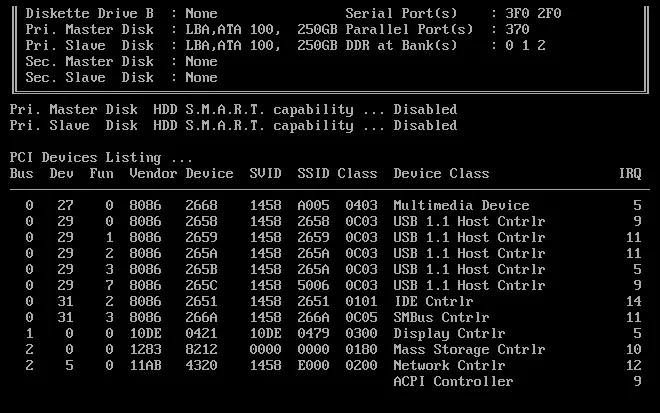
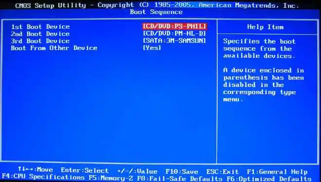
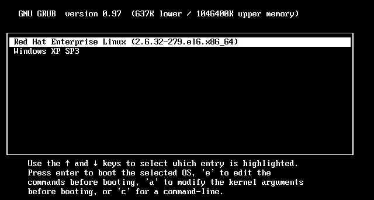

# Linux 系统开机加电后发生了什么?

```
原创博主：https://blog.csdn.net/gatieme/category_9265324.html 博主的文章和公众号写的不错
本文链接：https://blog.csdn.net/gatieme/article/details/50914250
```

#### linux系统的启动流程

关于linux系统的启动流程我们可以按步进行划分为如下：

BIOS

- POST自检
- BIOS(Boot Sequence)

引导操作系统

- 加载对应引导上的MBR(bootloader)
- 主引导设置加载其BootLoader

加载操作系统

#### 启动BIOS，准备实模式下的中断向量表和中断服务程序

电脑启动后，CPU逻辑电路被设计为只能运行内存中的程序，没有能力直接运行存在于软盘或硬盘中的操作系统，如果想要运行，必须要加载到内存（RAM）中。

BIOS是如何启动的，CPU硬件逻辑设计为在加电瞬间强行将CS值置为0XF000，IP为0XFFF0，这样CS:IP就指向0XFFFF0这个位置，这个位置正是BIOS程序的入口地址。

BIOS程序被固化在计算机主机板上的一块很小的ROM芯片里。现在CS:IP已经指向了0XFFFF0这个位置，意味着BIOS开始启动。

#### POST自检

BIOS的第一步动作就是进行 上电自检（POST）

POST的工作是检查硬件设备。随着BIOS程序的执行，屏幕上会显示显卡的信息，内存的信息等，

#### 初始化设备

BIOS的第二步动作就是 枚举本地设备并初始化

有一项对启动操作系统至关重要的工作，那就是BIOS在内存中建立中断向量表和中断服务程序

BIOS程序在内存最开始的位置（0x00000）用1KB的内存空间（0x00000~0x003FF）构建中断向量表，在紧挨着它的位置用256KB的内存空间构建BIOS数据区（0x00400~0x004FF），并在大约57KB以后的位置（0x0e05b）加载了8KB左右的与中断向量表相应的若干中断服务程序。

中断向量表有256个中断向量，每个中断向量占4个字节，其中两个字节是CS值，两个字节是IP值。每个中断向量都指向一个具体的中断服务程序。

#### BIOS-runtime服务按照boot启动顺序搜索设备，寻找BBR

由于BIOS功能使用上的不同，它由两个部分组成：POST和runtime服务。POST完成后，它将从存储器中被清除，但是BIOS runtime服务会被保留，用于目标操作系统。

为了启动操作系统，BIOS的runtime服务将搜索那些激活状态的或是可引导启动的设备，搜索的顺序则由CMOS设置决定（也就是我们平时所谓的在BIOS中设置的启动顺序）。一个软驱，一台光驱，一个硬盘上的分区，网络上的设备甚至一个usb 闪存盘都可以作为一个启动设备。

当然，linux通常是从硬盘启动的。硬盘上的MBR（主启动记录）包含有基本的boot loader，它是一个512字节大小的扇区，位于磁盘的第一个扇区（0磁头0磁道1扇区）。当MBR被装载到RAM中后，BIOS就会将控制权转交给MBR。

#### 引导操作系统内核并为保护模式做准备

位于MBR中的主 boot loader 是一个512字节的镜像，其中不仅包含了 bootload 程序代码，还包含了一个小的分区表。

最初的446字节是主 boot loader，它里面就包含有可执行代码以及错误消息文本。接下来的64字节是分区表，其中包含有四个分区的各自的记录（一个分区占16字节）。MBR 通过特殊数字 0xAA55（译者注：在电子界中 AA55 确实是具有传奇色彩的数字，想知道为什么么？将它展开成二进制形式，看看有什么规律）作为两个字节的结束标志。0x55AA 同时也是 MBR 有效的校验确认。

首先对CPU发送 int 0x19 中断，使CPU运行 int 0x19 中断对应的中断服务程序，这个中断服务程序的作用就是把软盘第一个扇区的程序加载到内存的指定位置。

主 boot loader 的工作是寻找并加载次 boot loader（内核加载程序）

它通过分析分区表，找出激活分区来完成这个任务，当它找到一个激活分区时，它将继续扫描剩下的分区表中的分区，以便确认他们都是未激活的。

确认完毕后，激活分区的启动记录（次 boot loader）从设备中被读到 RAM，并被执行。

其中加载过程需要借助 BIOS 提供的int 0x13中断向量指向的中断服务程序来完成。该程序将软盘第二个扇区开始的4个扇区，即 setup.s 对应的程序加载至内存的 SETUPSEG（0x90200）处。

> 把第一阶段和第二阶段的 boot loaders 联合起来，就是在x86个人电脑中，我们所说的 linux loader（LILO）或者 GRand Unified Bootloader(GRUB)。由于 GRUB 修正了一些 LILO 中存在的缺陷，因此下面就让我们来看看 GRUB（如果你希望得到更多的关于 GRUB，LILO 和与之相关话题的讨论资源，请见文后的参考资料）
> 对于 GRUB 来说，一个比较好的方面就是它包含了 linux 文件系统的知识。与LILO使用裸扇区不同的是，GRUB 能够从 ext2 或者 ext3 文件系统中加载 linux 内核。它是通过将本来两阶段的 boot loader 转换成三个阶段的 boot loader。在第一阶段（MBR）中会启动 stage1.5 的 boot loader 来理解 linux 内核镜像中的特殊的文件系统格式，例如，reiserfs_stage1-5(用于从reiserf日志文件系统中进行加载)或 e2fs + stage1_5 (用于从wxt2或ext3文件系统进行加载）。当 stage1.5 的 boot loader 被加载并运行时，stage2 的 boot loader 才能被加载。当 stage2 被加载时，GRUB能根据请求的情况显示一个可选内核的清单（在 /etc/grub.conf 中进行定义，同时还有几个软符号链接 /etc/grub/menu.lst 和 /etc/grub.conf)。你可以选择一个内核，修改其附加的内核参数。同时，你可以选择使用命令行的shell来对启动过程进行更深层次的手工控制。

在次 boot loader 存在与内存中后，就可以对文件系统进行查询了，同时将默认的内核镜像以及初始化内存盘镜像也被加载到内存中。

一切准备完毕之后，次 boot loader 就会调用内核镜像，完成操作系统的加载。

#### 加载内核并从实模式转换为保护模式

当内核映像被加载到内存中（加载过程仍然用int 0x13中断向量)，并且次引导加载程序释放控制权之后，内核阶段就开始了。

#### 加载内核镜像

内核映像并不是一个可执行的内核，而是一个压缩过的内核映像。通常它是一个 zImage（压缩映像，小于 512KB）或一个 bzImage（较大的压缩映像，大于 512KB），它是提前使用 zlib 进行压缩过的。在这个内核映像前面是一个例程，它实现少量硬件设置，并对内核映像中包含的内核进行解压，然后将其放入高端内存中，如果有初始 RAM 磁盘映像，就会将它移动到内存中，并标明以后使用。然后该例程会调用内核，并开始启动内核引导的过程。

当 bzImage（用于 i386 映像）被调用时，我们从 ./arch/i386/boot/head.S 的 start 汇编例程开始执行。

这个例程会执行一些基本的硬件设置，并调用 ./arch/i386/boot/compressed/head.S 中的 startup_32，设置一个基本的环境（堆栈等），并清除 Block Started by Symbol（BSS）。然后调用一个叫做 decompress_kernel 的 C 函数（在 ./arch/i386/boot/compressed/misc.c 中）来解压内核。当内核被解压到内存中之后，就可以调用它了。这是另外一个 startup_32 函数，但是这个函数在 ./arch/i386/kernel/head.S 中。

#### 进入保护模式并初始化

- 进入保护模式
- 设置中断描述附表和全局描述符表
- 创建了内存分页机制

#### 启动内核

- start_kernel启动内核
- 创建init进程

#### BIOS阶段–准备实模式下的中断向量表和中断服务程序

#### BIOS是什么

上个世纪70年代初，”只读内存”（read-only memory，缩写为ROM）发明，开机程序被刷入ROM芯片，计算机通电后，第一件事就是读取它。计算机，启动这块芯片里的程序叫做”基本輸出輸入系統”（Basic Input/Output System），简称为BIOS。

它是一组固化到计算机内主板上一个ROM芯片上的程序，它保存着计算机最重要的基本输入输出的程序、开机后自检程序和系统自启动程序，它可从CMOS中读写系统设置的具体信息。其主要功能是为计算机提供最底层的、最直接的硬件设置和控制。

#### BIOS存储的信息

BIOS芯片中主要存放：

- 自诊断程序：通过读取CMOSRAM中的内容识别硬件配置，并对其进行自检和初始化；
- CMOS设置程序：引导过程中，用特殊热键启动，进行设置后，存入CMOS RAM中；
- 系统自举装载程序：在自检成功后将磁盘相对0道0扇区上的引导程序装入内存，让其运行以装入DOS系统；
- 主要I/O设备的驱动程序和中断服务：由于BIOS直接和系统硬件资源打交道，因此总是针对某一类型的硬件系统，而各种硬件系统又各有不同，所以存在各种不同种类的BIOS，随着硬件技术的发展，同一种BIOS也先后出现了不同的版本，新版本的BIOS比起老版本来说，功能更强。

BIOS：计算机加电自检完成后第一个读取的地方就是就是BIOS（Basic Input Output System，基础输入输出系统），BIOS里面记录了主机板的芯片集与相关设置，如CPU与接口设备的通信频率、启动设备的搜索顺序、硬盘的信息、系统时间、内存信息、时钟信息、PnP特性、外部总线、各种接口设备的I/O地址、已经与CPU通信的IRQ中断信息，所以，启动如果要顺利启动，首先要读取BIOS设置。

计算机会首先加载BIOS信息，BIOS信息是如此的重要，以至于计算机必须在最开始就找到它。

电脑启动后，CPU逻辑电路被设计为只能运行内存中的程序，没有能力直接运行存在于软盘或硬盘中的操作系统，如果想要运行，必须要加载到内存（RAM）中。

#### BIOS是如何启动的

CPU硬件逻辑设计为在加电瞬间强行将CS值置为0XF000，IP为0XFFF0，这样CS:IP就指向0XFFFF0这个位置，这个位置正是BIOS程序的入口地址。

#### BIOS需要在内存中加载中断向量表和中断服务程序

BIOS程序被固化在计算机主机板上的一块很小的ROM芯片里。现在CS:IP已经指向了0XFFFF0这个位置，意味着BIOS开始启动。随着BIOS程序的执行，屏幕上会显示显卡的信息，内存的信息,说明BIOS程序在检测显卡，内存，这个就是POST开机自检期间，有一项对启动操作系统至关重要的工作，那就是BIOS在内存中建立中断向量表和中断服务程序

BIOS程序在内存最开始的位置（0x00000）用1KB的内存空间（0x00000~0x003FF）构建中断向量表，在紧挨着它的位置用256KB的内存空间构建BIOS数据区（0x00400~0x004FF），并在大约57KB以后得位置（0x0e05b）加载了8KB左右的与中断向量表相应的若干中断服务程序。

中断向量表有256个中断向量，每个中断向量占4个字节，其中两个字节是CS值，两个字节是IP值。每个中断向量都指向一个具体的中断服务程序。

#### BIOS阶段的工作

POST开机自检

> BIOS程序首先检查，计算机硬件能否满足运行的基本条件，这叫做”硬件自检”（Power-On Self-Test），缩写为POST。

如果硬件出现问题，主板会发出不同含义的蜂鸣，启动中止。如果没有问题，屏幕就会显示出CPU、内存、硬盘等信息。

电脑主机打开电源的时候，随后会听到滴的一声，系统启动开始了开机自检（POST-power on self test）自检开始）

这个过程中主要是检测计算机硬件设备比如：CPU，内存，主板，显卡，CMOS等设备是否有故障存在

如果有硬件故障的话将按两种情况理：

- 对于严重故障(致命性故障)则停机，此时由于各种初始化操作还没完成，不能给出任何提示或信号；
- 对于非严重故障则给出提示或声音报警信号，等待用户处理），如果没有故障，POST完整自己的接力任务，将尾部工作交接给BIOS处理



#### 加载BIOS

BIOS把控制权转交给下一阶段的启动程序。

这时，BIOS需要知道，”下一阶段的启动程序”具体存放在哪一个设备。也就是说，BIOS需要有一个外部储存设备的排序，排在前面的设备就是优先转交控制权的设备。这种排序叫做”启动顺序”（Boot Sequence）。打开BIOS的操作界面，里面有一项就是”设定启动顺序”。



在此之后，计算机心里就有谱了，知道应该去读取哪个硬件设备了。

#### 引导操作系统

硬件自检完成后，我们期望能否启动操作系统，但是问题出来了

- 操作系统存放在哪？
- BIOS如何找到操作系统？
- BIOS如何加载操作系统？

#### 背景知识

**多操作系统时的启动顺序**

为了寻找操作系统，BIOS按照”启动顺序”，把控制权转交给排在第一位的储存设备。

这时，计算机读取该设备的第一个扇区，也就是读取最前面的512个字节。

如果这512个字节的最后两个字节是0x55和0xAA，表明这个设备可以用于启动；

如果不是，表明设备不能用于启动，控制权于是被转交给”启动顺序”中的下一个设备。

这最前面的512个字节，就叫做**主引导记录（Master boot record，缩写为MBR）**

#### 主引导记录 MBR

位于MBR中的主boot loader是一个512字节的镜像，其中不仅包含了程序代码，还包含了一个小的分区表。

最初的446字节是主boot loader，它里面就包含有可执行代码以及错误消息文本。接下来的64字节是分区表，其中包含有四个分区的各自的记录（一个分区占16字节）。MBR通过特殊数字0xAA55（译者注：在电子界中AA55确实是具有传奇色彩的数字，想知道为什么么？将它展开成二进制形式，看看有什么规律）作为两个字节的结束标志。0x55AA同时也是MBR有效的校验确认。

主boot loader的工作是寻找并加载次boot loader。它通过分析分区表，找出激活分区来完成这个任务，当它找到一个激活分区时，它将继续扫描剩下的分区表中的分区，以便确认他们都是未激活的。确认完毕后，激活分区的启动记录从设备中被读到RAM，并被执行。

“主引导记录”只有512个字节，放不了太多东西。它的主要作用是，告诉计算机到硬盘的哪一个位置去找操作系统。主引导记录由三个部分组成：

- 第1-446字节：调用操作系统的机器码。
- 第447-510字节：分区表（Partition table）。
- 第511-512字节：主引导记录签名（0x55和0xAA）。

其中，第二部分”分区表”的作用，是将硬盘分成若干个区。

#### 分区表

硬盘分区有很多好处。考虑到每个区可以安装不同的操作系统，”主引导记录”因此必须知道将控制权转交给哪个区。分区表的长度只有64个字节，里面又分成四项，每项16个字节。所以，一个硬盘最多只能分四个一级分区，又叫做“主分区”。

每个主分区的16个字节，由6个部分组成：

- 第1个字节：如果为0x80，就表示该主分区是激活分区，控制权要转交给这个分区。四个主分区里面只能有一个是激活的。
- 第2-4个字节：主分区第一个扇区的物理位置（柱面、磁头、扇区号等等）。
- 第5个字节：主分区类型。
- 第6-8个字节：主分区最后一个扇区的物理位置。
- 第9-12字节：该主分区第一个扇区的逻辑地址。
- 第13-16字节：主分区的扇区总数。

最后的四个字节（”主分区的扇区总数”），决定了这个主分区的长度。也就是说，一个主分区的扇区总数最多不超过2的32次方。

如果每个扇区为512个字节，就意味着单个分区最大不超过2TB。再考虑到扇区的逻辑地址也是32位，所以单个硬盘可利用的空间最大也不超过2TB。

如果想使用更大的硬盘，只有2个方法：

- 一是提高每个扇区的字节数，
- 二是增加扇区总数。

MBR：第一个可开机设备的第一个扇区内的主引导分区块，内包含引导加载程序

引导加载程序（Boot loader）: 一支可读取内核文件来执行的软件

内核文件：开始操作系统的功能

#### 引导操作系统的过程

由硬盘启动时，BIOS通常是转向第一块硬盘的第一个扇区，即主引导记录(MBR)。装载GRUB和操作系统的过程，包括以下几个操作步骤：

**装载记录**

基本引导装载程序所做的唯一的事情就是装载第二引导装载程序。

**装载Grub**

这第二引导装载程序实际上是引出更高级的功能，以允许用户装载一个特定的操作系统。

**装载系统**

如linux内核。GRUB把机器的控制权移交给操作系统。

不同的是，微软操作系统都是使用一种称为链式装载的引导方法来启动的，主引导记录仅仅是简单地指向操作系统所在分区的第一个扇区。

#### 加载主引导加载程序-基本装载程序

众所周知，硬盘上第0磁道第一个扇区被称为MBR，也就是Master Boot Record，即主引导记录，它的大小是512字节，别看地方不大，可里面却存放了预启动信息、分区表信息。

按照BIOS所设定的系统启动流程，如果检测通过，则根据引导次序(Boot Sequence)开始在第一台设备上支持启动程序，我们的启动设备主要包括硬盘、USB、SD等，我们一般用的是硬盘，然后进行读取第一个设备就是硬盘，第一个要读去的就是该硬盘的主引导记录MBR（Master Boot Record），然后系统可以根据启动区安装的引导加载程序（Boot Loader）开始执行核心识别的工作。

> MBR程序只是找到只是硬盘分区内最前面的446个字节的Boot Loader，然后查找相关配置和定义。

然后将控制权交给主引导代码。主引导代码的任务包括

- 扫描分区表，找到一个激活(可引导)分区；
- 找到激活分区的起始扇区；
- 将激活分区的引导扇区装载到内存7C00处；
- 将控制权交给引导扇区代码；

#### 加载次引导记载程序–高级装载程序bootload如GRUB

系统读取内存中的grub配置信息（一般为menu.lst或grub.lst），并依照此配置信息来启动不同的操作系统。

这时，计算机的控制权就要转交给硬盘的某个分区了，这里又分成三种情况。

**情况A：卷引导记录**

上一节提到，四个主分区里面，只有一个是激活的。计算机会读取激活分区的第一个扇区，叫做“卷引导记录”（Volume boot record，缩写为VBR）。“卷引导记录”的主要作用是，告诉计算机，操作系统在这个分区里的位置。然后，计算机就会加载操作系统了。

**情况B：扩展分区和逻辑分区**

随着硬盘越来越大，四个主分区已经不够了，需要更多的分区。但是，分区表只有四项，因此规定有且仅有一个区可以被定义成“扩展分区”（Extended partition）。所谓“扩展分区”，就是指这个区里面又分成多个区。这种分区里面的分区，就叫做”逻辑分区”（logical partition）。

计算机先读取扩展分区的第一个扇区，叫做“扩展引导记录”（Extended boot record，缩写为EBR）。它里面也包含一张64字节的分区表，但是最多只有两项（也就是两个逻辑分区）。

计算机接着读取第二个逻辑分区的第一个扇区，再从里面的分区表中找到第三个逻辑分区的位置，以此类推，直到某个逻辑分区的分区表只包含它自身为止（即只有一个分区项）。因此，扩展分区可以包含无数个逻辑分区。

但是，似乎很少通过这种方式启动操作系统。如果操作系统确实安装在扩展分区，一般采用下一种方式启动。

**情况C：启动管理器**

在这种情况下，计算机读取”主引导记录”前面446字节的机器码之后，不再把控制权转交给某一个分区，而是运行事先安装的“启动管理器”（boot loader），由用户选择启动哪一个操作系统。

Linux环境中，目前最流行的启动管理器是Grub。

Boot Loader 就是在操作系统内核运行之前运行的一段小程序。通过这段小程序，我们可以初始化硬件设备、建立内存空间的映射图，从而将系统的软硬件环境带到一个合适的状态，以便为最终调用操作系统内核做好一切准备。

Boot Loader有若干种，其中Grub、Lilo和spfdisk是常见的Loader。

我们以Grub为例来讲解吧，毕竟用lilo和spfdisk的人并不多。



#### 为什么这么复杂

早期的操作系统并没有那么复杂，当然bootload也没有那么多功能，但是如今我们的操作系统越来越复杂，bootload也越来越庞大，而且如今在一台电脑上安装多系统变得那么平常，因此之前简单的bootload已经无法满足这些功能。

BIOS和MBR都是硬件本身会支持的功能，至于Boot Loader则是操作系统安装在MBR上面的一套软件。由于MBR仅有446bytes而已，因此这个引导加载程序是非常小而完美的。这个BootLoader的主要任务如下

- 提供菜单：用户可以选择不同的开机选项，这也是多重引导的重要功能
- 载入内核文件：直接指向可开机的程序段来开始操作系统。
- 转交其他Loader：将引导加载功能转交给其他loader负责

上面的前两点还容易理解，但是第三点很有趣！那表示你的计算机系统里面可以具有两个以上的引导加载程序呢。有可能吗？我们的硬盘不是只有一个MBR而已？但是引导加载程序除了可以安装在MBR之外，还可以安装在每个分区的引导扇区。

举一个例子来说，假设你的个人计算机只有一块硬盘，里面分成4个分区。其中第一，二分区分别安装了Windows及Linux，你要如何在开机的时候选择用Windows还是Linux开机呢？假设MBR内安装的是可以同时识别Windows和Linux操作系统的引导加载程序，那么整个流程如下

做个总结就是这样：

- 每个分区都有自己的启动扇区
- 系统分区为第一及第二分区
- 实际可开机的内核文件是放置到各分区内的
- loader只会认识自己的系统分区内的可开机内核文件，以及其他的Loader而已
- loader可直接指向或者是间接将管理权交给另一个管理程序

> 现在想一下，为什么人家常说：”如果要安装多重引导，最好先安装Windows再安装Linux呢“？
>
> 
> 这是因为Linux在安装时，你可以选择将引导加载程序安装在MBR或个别分区的启动扇区，而且Linux的Loader可以手动设置菜单，所以你可以在Linux的Boot Loader里面加入Windows开机选项
>
> 
> Windows在安装的时候，他的安装程序会主动覆盖掉MBR以及自己所在分区的启动扇区，你没有选择的机会，而且他没有让我们自己选择菜单功能

#### 加载操作系统内核

用户选择要加载的内核之后，次引导加载程序（GRUB）就会根据/boot/grub.conf配置文件中所设置的信息，从/boot/所在的分区上读取Linux内核映像，然后把内核映像加载到内存中并把控制权交给Linux内核。

linux内核获得控制权之后开始干自己的事

- 检测硬件
- 解压缩自己并安装必要驱动
- 初始化与文件系统相关的虚拟设备，LVM或RAID
- 装载根文件系统，挂在根目录下面
- 完成之后，linux在进程空间里面加载init程序，下面轮到init干活

根据grub设定的内核映像所在路径，系统读取内存映像，并进行解压缩操作。此时，屏幕一般会输出“Uncompressing Linux”的提示。当解压缩内核完成后，屏幕输出“OK, booting the kernel”。

系统将解压后的内核放置在内存之中，并调用start_kernel()函数来启动一系列的初始化函数并初始化各种设备，完成Linux核心环境的建立。至此，Linux内核已经建立起来了，基于Linux的程序应该可以正常运行了。

启动第五步 用户层init依据inittab文件来设定运行等级

内核被加载后，第一个运行的程序便是/sbin/init，该文件会读取/etc/inittab文件，并依据此文件来进行初始化工作。其实/etc/inittab文件最主要的作用就是设定Linux的运行等级，其设定形式是“：id:5:initdefault:”，这就表明Linux需要运行在等级5上。Linux的运行等级设定如下：

- 0：关机
- 1：单用户模式
- 2：无网络支持的多用户模式
- 3：有网络支持的多用户模式
- 4：保留，未使用
- 5：有网络支持有X-Window支持的多用户模式
- 6：重新引导系统，即重启

关于/etc/inittab文件的学问，其实还有很多

#### init进程执行rc.sysinit

在设定了运行等级后，Linux系统执行的第一个用户层文件就是/etc/rc.d/rc.sysinit脚本程序，它做的工作非常多，包括设定PATH、设定网络配置（/etc/sysconfig/network）、启动swap分区、设定/proc等等。如果你有兴趣，可以到/etc/rc.d中查看一下rc.sysinit文件，里面的脚本够你看几天的

#### 启动内核模块

具体是依据/etc/modules.conf文件或/etc/modules.d目录下的文件来装载内核模块。

#### 执行不同运行级别的脚本程序

根据运行级别的不同，系统会运行rc0.d到rc6.d中的相应的脚本程序，来完成相应的初始化工作和启动相应的服务。

#### 执行/etc/rc.d/rc.local

你如果打开了此文件，里面有一句话，读过之后，你就会对此命令的作用一目了然：

```
# This script will be executed *after* all the other init scripts.
# You can put your own initialization stuff in here if you don’t
# want to do the full Sys V style init stuff.
```

rc.local就是在一切初始化工作后，Linux留给用户进行个性化的地方。你可以把你想设置和启动的东西放到这里。

#### 执行/bin/login程序，进入登录状态

此时，系统已经进入到了等待用户输入username和password的时候了，你已经可以用自己的帐号登入系统了。