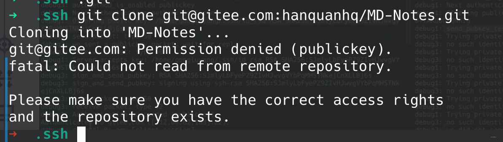
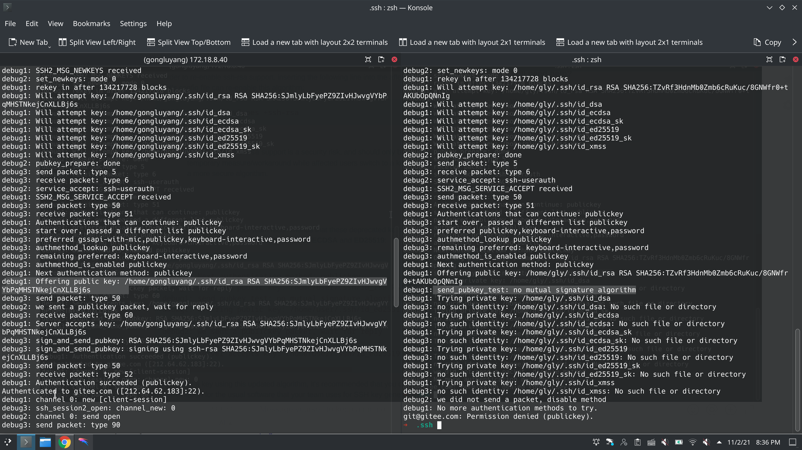
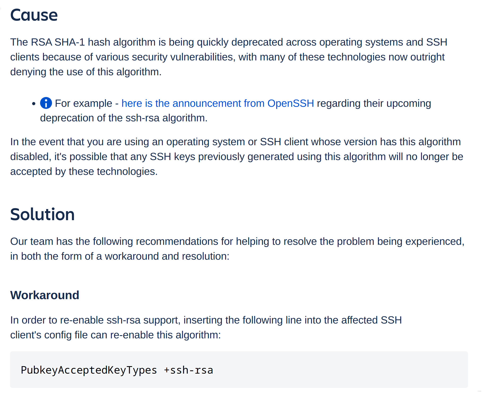
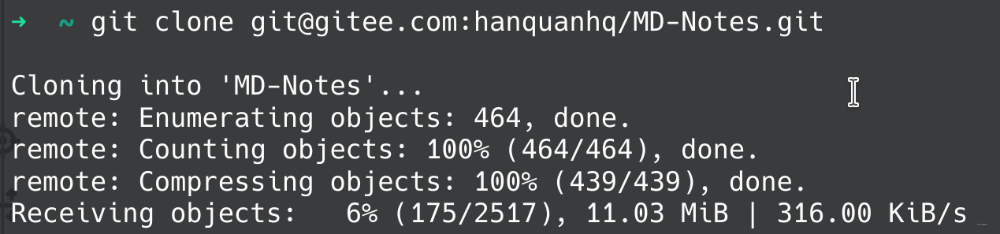

# Gitee ssh 公钥配置好后，仍然 permission denied 的排查过程及解决方法

## 突如其来

今天 git pull 一个老项目，之前一直提交的好好的，这次突然报错 `git@gitee.com: Permission denied (publickey).`，明明是我自己的 repo，居然告诉我没有权限？？



## 无脑尝试
一开始以为是本地 id_rsa.pub 变更导致 gitee 上原有的记录失效，于是 ssh-keygen 命令重新生成了下，贴到 gitee 上，还是老样子。

然后我怀疑我在折腾的时候改乱了 git 的配置，又重新 `pacman -S git` 强制 reinstall 了下，还是老样子。

我又尝试用 ssh 方式去 clone gitee 上的其他 repo 也是 permission denied，用 http 方式就没问题。但是难道是 ~/.ssh 目录下的文件的锅？于是我转移阵地，到 github 上试了下，github 上可以正常 clone，畅通无阻。

奇了怪了，难道是 gitee 的 bug？于是，我开了两个 terminal，左边是一台 ubuntu 的开发机，右边是我本地。双双重新生成 ssh-key，重新贴到 gitee 上，重新 clone，一气呵成。

然而，开发机上畅通无阻，本地无权限依旧...

## 蛛丝马迹

后来看到，有人遇到过 [ssh公钥配置好后还是不能访问到码云网](https://gitee.com/oschina/git-osc/issues/IKJ5E) 问题，虽然作者没有解决，但下面的回答提供了一种思路：`ssh -Tvvv git@gitee.com` 可以打印详细的 log！

我在远程和本地分别执行 `ssh -Tvvv git@gitee.com`，虽然和之前一样，一边是 successfully authenticated，一边是 Permission Denied，但不同的是，这次有了更详细的日志了！

不怕 error，就怕原因不明的 error。这下好办了，两边日志一行一行对比，简直看花了眼，终于在右侧找到一些端倪：`debug1: send_pubkey_test: no mutual signature algorithm`

嗯？为啥？没有这个签名算法？？




## 拨云见日
既然已经发现 send_pubkey_test: no mutual signature algorithm，当然是问 google 啦。根据 [SSH-RSA key rejected with message "no mutual signature algorithm"](https://confluence.atlassian.com/bitbucketserverkb/ssh-rsa-key-rejected-with-message-no-mutual-signature-algorithm-1026057701.html) 中说的：



意思是说，RSA SHA-1 算法已经过时了。如果你一定要用的话，可以在 ssh config 里面将其开启：

```
# 编辑 ssh 配置文件
sudo vim /etc/ssh/ssh_config
# 添加以下内容
PubkeyAcceptedKeyTypes +ssh-rsa
```

## 柳暗花明
我估计是某次系统更新的时候把原有的 RSA SHA-1 算法 deprecated 掉了。

按着上面说的，修改 ssh config 后保存，重新 git clone 一下，就可以正常使用了。

