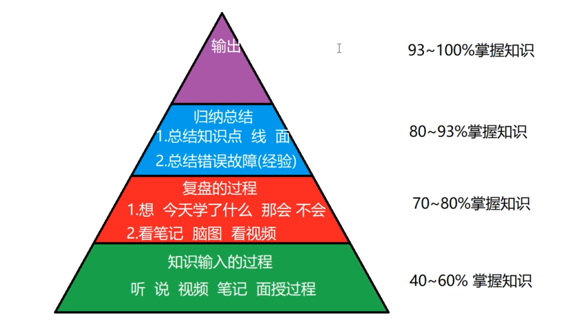
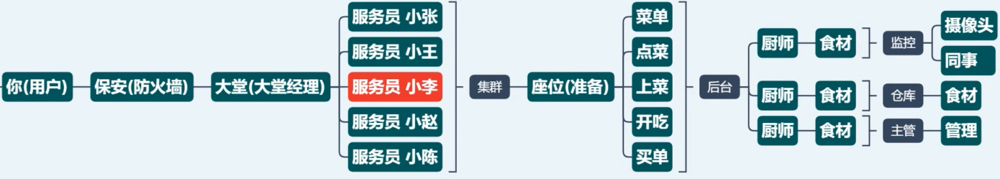
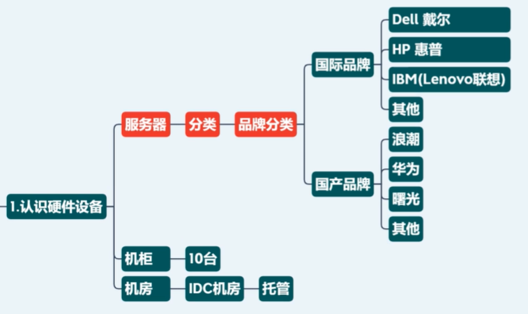
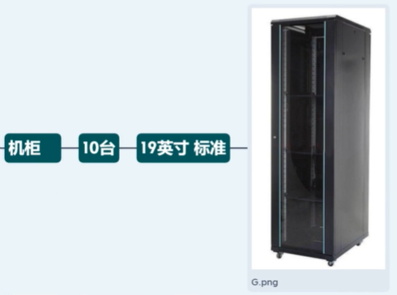
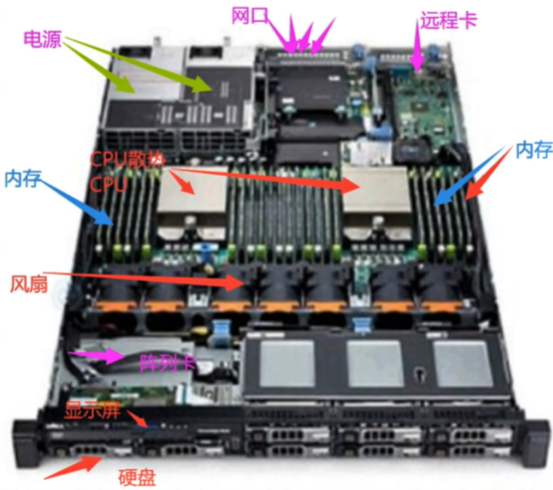
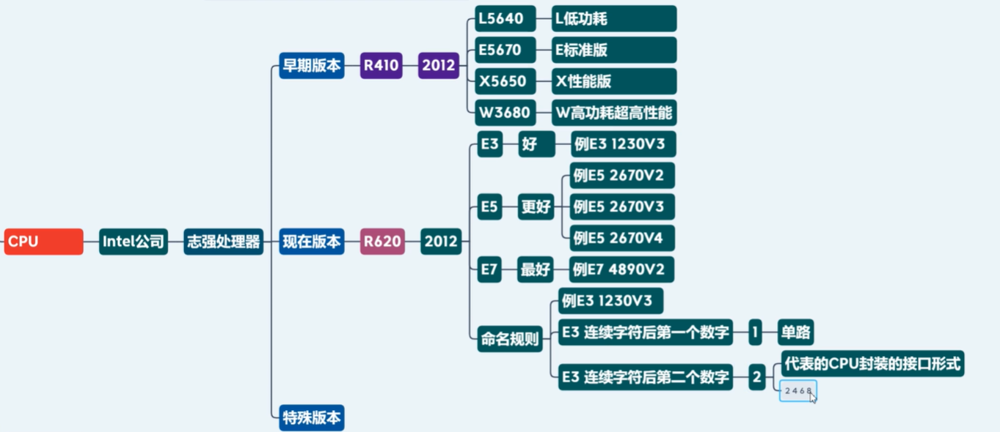

# 运维

### 运维的职责是什么？

工作中，有60%的时间你在看监控，通过监控发现服务器、服务、硬件（交换机，路由器，防火墙，负载均衡设备是否出现问题，如果出现问题，就会出现告警）

##### 运维三大职责：

- 保护用户的数据不能丢（任何情况，断电等的发生，用户数据不能丢）

- 保证业务 7*24 稳定运行（高可用）
- 不断提升、优化用户的体验

##### 思想

技术的提升只是量的变化，思想的提升才是质的飞跃

- 认知：由习惯、知识、见识决定
- 思想：认知决定了你的思想，要摒弃坏的，形成好的思想，取其精华，去其糟粕 -> 产生价值观
- 行为：价值观在行为上有所表现：认真听课，满满正能量，不受外界影响，每天学习12小时以上，每天敲200-300行，日事日毕，按照标准化（学习内容标准化，学习过程标准化）学习...
- 结果：高薪就业！

##### 学习方法

四步记忆法

##### 网站架构（淘宝早期的项目架构）

百万~千万级并发

### 就业岗位

传统运维岗位

- Linux 系统运维工程师
- 网络运维工程师
- IDC 机房运维工程师

云计算运维岗位

- 云计算运维工程师
- 容器云工程师

DevOps运维开发岗位

- CICD工程师
- 数据库工程师：DBA

架构师

- 初级的架构

安全岗位

- 网络安全工程师
- 信息安全工程师
- 风险评估工程师
- 应急响应工程师
- 代码审计工程师...

### 服务器系统分类

### 服务器品牌分类

### 服务器尺寸分类

收集一下 Dell HP IBM 品牌，1U 2U 4U 等常见的服务器型号

例如： Dell 2U R710

### 服务器外形分类

### 服务器功能分类

- 通用性服务器
- 人工智能服务器
- 存储型服务器
- 关键应用服务器
- 区块链算力服务器（矿机）

### 机房

### 企业级服务器硬件

##### 服务器主板

- 双路
- 四路
- 多路...Dell C6220

##### CPU 版本

