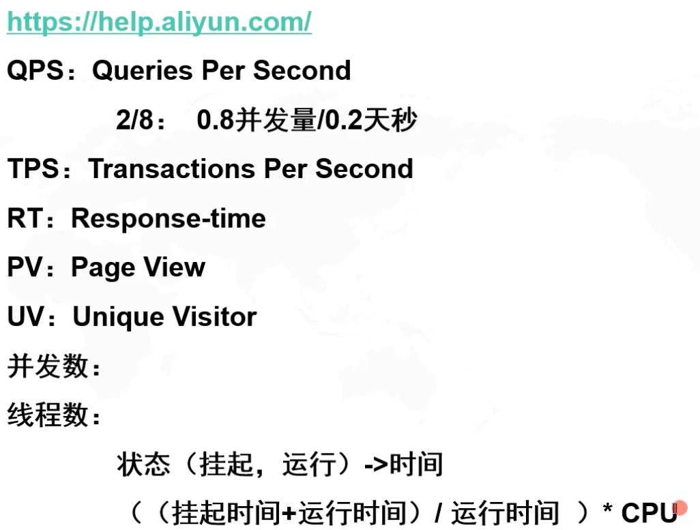
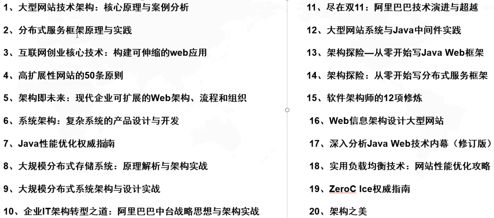
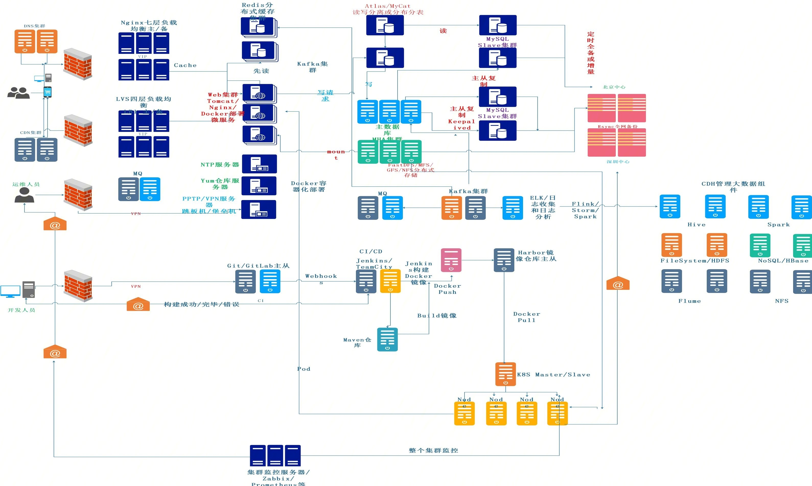

# 架构演进

1. 单一应用架构

2. 垂直应用架构

3. 分布式服务架构

4. 流动计算架构

## P8 架构概论

按需、预期未来，规划企业架构

业务全局出发，制定可落地的架构方案

技术选型、难题解决规划

方案与代码，广度与深度

技术+管理（人，资源，技术）

#### 从过去到未来

阿里评级：P8 是什么水平？

### 缓冲、缓存、复用、分治、亲密性、技术选型

回顾一下软件工程学中的几个重要词汇，整个信息化进程中，做调优离不开这些：
- buffer 缓冲，包括：消息队列 ；操作系统中的IO方式（积攒一个buffer），解决上下游处理速度不匹配的问题；批量计算；啤酒理论
- cache 缓存，包括：pagecache页缓存；缓存热点数据提升io速度；CPU的多级缓存；数据库缓存中间件
缓冲是解决单次大小问题的，缓存是用来复用的
- pool 复用，池化，包括：连接池、线程池、对象池、字符串常量池、享元，减少三次握手成本、线程创建成本等各种成本
- sharding 分治，单机多机都使用，包括集群：分片集群，降低复杂度。HashMap也可以。
- sticky 亲密（粘性）：某一个线程亲密到某一个CPU上；threadlocal；数据路由相同ip或session或商品分配到不同的负载机器上。
（可以通过配置负载均衡层的策略实现。例如，并发到来的时候，从C1客户端发来的请求被转发Server1上，从C2客户端发来的请求被转发到Server2上，这样在单机使用线程池，在线程池中**单机加锁，要优于在多机加分布式锁**，因为分布式锁要消耗网络通信的成本）
再比如，你小区有两个门，进门需要登记。你这次从北门登记过了，下次再从北门过就不用登记了，你从南门的走话还要再登记。
- balance/trade-off 权衡：做技术选型，相同的需求有很多方法能够实现，这时候你需要选择。从另外一个角度，是两权相害取其轻

## QPS、TPS、RT、PV、UV、并发数、线程数

阿里云帮助文档可以看各种阿里云服务的压侧性能：https://help.aliyun.com/

例如，阿里云性能白皮书：https://help.aliyun.com/document_detail/109378.html?spm=a2c4g.11186623.6.1621.3fe6b9efZ2fTSh

阿里云提供的官方压侧结果

查看cpu核心数：`lscpu`
一般推荐：线程数量是CPU数量的2倍，是根据上面的公式，以挂起时间、运行时间1:1的比例计算的。

推荐一些书：

服务拆解：ESB企业服务总线、SOA->微服务

#### 单体，全量：

#### SOA，ESB，微服务：
拆解，分层：
- 按照流程拆解，是最常见的方法。如，TCP/IP协议
- 按照服务拆解，如SOA，服务可大可小，偏业务的角度
- 按照功能拆解，登录（权限认证），购物，支付，比服务更小，最终功能变成独立的服务运行起来。偏向于微服务。

你做业务拆分的时候，要考量开发的成本，合理根据业务需求，规划企业架构，而不是因为技术而技术。
拆分的过细，反而会增加负担。

#### AKF 划分
三高：高可用，高性能，可扩展

- x轴：数据的复制是全量的，基于**主备**，可以完成**主从**的读写分离，解决**可用性**，性能优化。
- y轴：基于业务的拆分，业务太大超过了CPU算力或超过了硬件的负载，这时候我们按服务拆分。可以将不同的业务放进不同的Redis当中。提高缓存命中率，不会轻易被淘汰
- z轴：在已经按照业务拆分了的情况下，并发量仍然很大，这时解决倾斜的方式：sharding，例如在数据层面分为 `0-99,100-199,...`，一般用代理服务器来实现负载均衡。

#### 负载均衡

分为基于计算（Tomcat）的负载均衡 / 基于数据（Redis）的负载均衡

- 地域上的负载均衡：DNS
- 硬件层面的负载均衡：F5（集群和集群之间的负载均衡）
- 软件层面的负载均衡：LVS & Nginx（主机和主机之间的负载均衡）

#### P8 架构师主机规划

