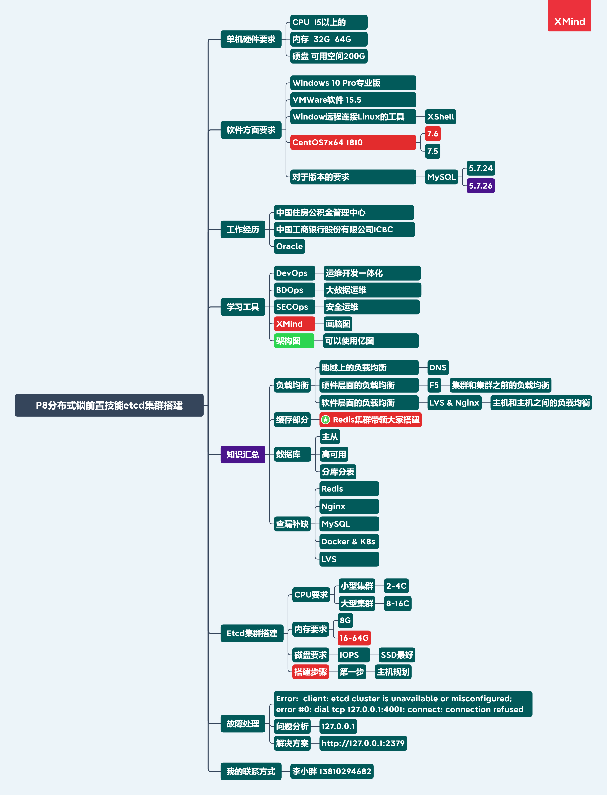
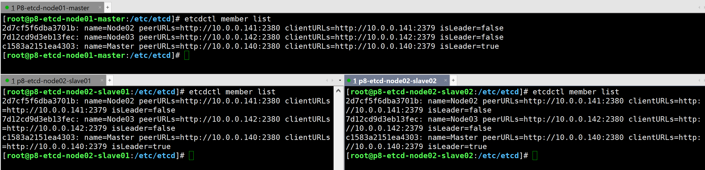
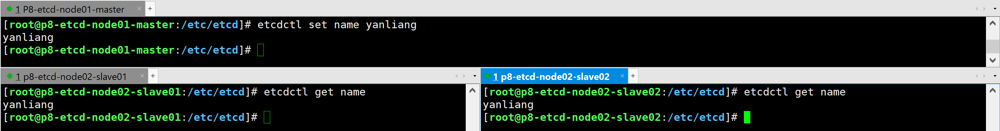

# etcd 集群环境搭建



### 13 什么是 etcd？

etcd 是一个分布式高可用的 Key/Value 存储系统，旨在可靠、快速地保存和提供对关键数据的访问，主要用于分享配置和服务发现。它通过分布式锁定、领导人选举和编写障碍实现可靠的分布式协调。etcd集群用于高可用性和永久数据存储和检索。（为后续分布式 id 的生成做准备）

##### etcd 和 Zookeeper 的区别？

zookeeper 是用 java 开发的，被 Apache 很多项目采用。etcd 是用 go 开发的，主要是被 Kubernetes 采用。zookeeper 非常稳定，是一个著名的分布式协调系统，etcd 是后起之秀，前景广阔。因为 etcd 是用 go 写的，现在还没有很好的 java 客户端库，需要通过 http 方式调用。而 zookeeper 在这方面就成熟很多，对于 java 之外的其他开发语言都有很好的客户端库。

具体选择 zookeeper 还是 etcd，需要根据您的需求结合它们各自的特性进行判断，还有您所使用的开发语言。

##### etcd 停止开发了吗？

2019 年回答：etcd 没有停止开发，Google、Red Hat、阿里巴巴都有投人进去。但是 CoreOS 被 RedHat 收购后，原 etcd 核心开发人员都离开了。新来的当然没有老革命这么有热情，搞个大事情啥的。而且目前功能也比较稳定，趋于偏维护状态。


### 13.1 Rancher Master节点（etcd开源数据库）

#### 主机规划

| 序号 | 主机名称               | 角色   | 数量 | 主机内网IP规划 | 主机外网IP    | 主机配置 | 基础软件                   | 系统            |
| ---- | ---------------------- | ------ | ---- | -------------- | ------------- | -------- | -------------------------- | --------------- |
| 01   | p8-etcd-node01-master  | Node01 | 1    | 10.0.0.140     | 123.57.59.137 | 2C 4G    | wget &&yum install -y etcd | CentOS7x64 1810 |
| 02   | p8-etcd-node02-slave01 | Node02 | 1    | 10.0.0.141     | 123.57.59.138 | 2C 4G    | wget &&yum install -y etcd | CentOS7x64 1810 |
| 03   | p8-etcd-node02-slave02 | Node03 | 1    | 10.0.0.142     | 123.57.59.139 | 2C 4G    | wget &&yum install -y etcd | CentOS7x64 1810 |

IP 地址一般设置为连续的，在写自动化脚本的时候，写个循环就过去了，比较方便。

**PS：这里要注意 etcd 并不是很吃硬件，如果业务量不是很大的话给2C 4G就够了，如果业务量比较大的话4G 8G-16G或更大的硬件配置，自己灵活掌握。安装的时候需要注意7.2版本坑比较多，跟etcd的版本存在兼容性的问题，自己安装的过程中容易翻车。**

CentOS7x64 1810版本下载链接 链接：https://pan.baidu.com/s/14PWga1We99tkZLJyS_q0gQ 提取码：glk4

XShell XFtp Typora软件下载链接 链接：https://pan.baidu.com/s/1NZWfWqKezXewsHpV0gc2-A 提取码：48xc

etcd 官方给出的硬件配置 https://github.com/etcd-io/etcd/blob/master/Documentation/op-guide/hardware.md


### 13.2 设置主机 hostname

```shell
hostnamectl set-hostname p8-etcd-node01-master
hostnamectl set-hostname p8-etcd-node02-slave01
hostnamectl set-hostname p8-etcd-node02-slave02
```

##### 为什么要设置 hostname？

多年老运维要有好的运维习惯，就像编码规范那样。它的作用是，如果没有 DNS 的情况下，我们可以用 host 文件做 host 解析，相当于是 DNS。当然，如果有条件的话，你也可以做内网 DNS，也是一种解决方案。


### 13.3 修改 IP 地址（有必要的话，就设置 hosts 解析）

虚拟机是虚拟网卡，叫 ens33，物理网卡叫 eth0，eth1...，如果是 Dell 的服务器，也有可能是 em1，em2...

```shell
cd /etc/sysconfig/network-scripts && vim ifcfg-ens33
```


### 13.4 安装 etcd 搭建集群环境

etcd集群三种方式：静态集群，动态集群，DNS集群；我们这里搭建的是静态集群。

##### 三台机器上都需要安装

```
yum install -y etcd
```

##### 效验安装

```
rpm -qa etcd
```

##### 查看安装的 etcd 的版本号

```
etcdctl -v
```

或

```
etcdctl --version
```


### 13.5 修改配置文件搭建集群环境

##### 修改之前先备份！

```
cp /etc/etcd/etcd.conf /etc/etcd/etcd.conf.bak
cd /etc/etcd && vim etcd.conf
```
配置文件修改如下，需要修改的地方均已用注释 “# 【这里】...” 标出，（坑：最后记得把中文注释删掉，否则会报错）

```shell
#[Member]
#ETCD_CORS=""
ETCD_DATA_DIR="/var/lib/etcd/default.etcd"
#ETCD_WAL_DIR=""
ETCD_LISTEN_PEER_URLS="http://10.0.0.140:2380" # 【这里】打开这行注释，并且将localhost修改为本机的ip地址
ETCD_LISTEN_CLIENT_URLS="http://10.0.0.140:2379,http://127.0.0.1:2379" # 【这里】修改ip地址，注意要添加一个127.0.0.1:2379的环回地址
CD_MAX_SNAPSHOTS="5"
#ETCD_MAX_WALS="5"
ETCD_NAME="Master" # 【这里】将default修改为Master,Node02,Node03
#ETCD_SNAPSHOT_COUNT="100000"
#ETCD_HEARTBEAT_INTERVAL="100"
#ETCD_ELECTION_TIMEOUT="1000"
#ETCD_QUOTA_BACKEND_BYTES="0"
#ETCD_MAX_REQUEST_BYTES="1572864"
#ETCD_GRPC_KEEPALIVE_MIN_TIME="5s"
#ETCD_GRPC_KEEPALIVE_INTERVAL="2h0m0s"
#ETCD_GRPC_KEEPALIVE_TIMEOUT="20s"
#
#[Clustering]
ETCD_INITIAL_ADVERTISE_PEER_URLS="http://10.0.0.140:2380" # 【这里】修改本机ip
ETCD_ADVERTISE_CLIENT_URLS="http://10.0.0.140:2379" # 【这里】修改本机ip
#ETCD_DISCOVERY=""
#ETCD_DISCOVERY_FALLBACK="proxy"
#ETCD_DISCOVERY_PROXY=""
#ETCD_DISCOVERY_SRV=""
ETCD_INITIAL_CLUSTER="Master=http://10.0.0.140:2380,Node02=http://10.0.0.141:2380,Node03=http://10.0.0.142:2380" # 【这里】必须和上面配置的ETCD_NAME名称相同。在三台机器上，主节点始终放在第一个
ETCD_INITIAL_CLUSTER_TOKEN="etcd-cluster" # 【这里】打开
ETCD_INITIAL_CLUSTER_STATE="new" # 【这里】打开
#ETCD_STRICT_RECONFIG_CHECK="true"
#ETCD_ENABLE_V2="true"
...省略
```

保存退出即可

#### 运行 etcd 集群

注：三台机器都运行以下命令之后，才能成功跑起来。只运行其中一台时，会阻塞等待连接。

```shell
systemctl restart etcd
systemctl status etcd

etcdctl member list
```

运行起来，这样，集群就搭建成功了



测试一下

```shell
etcdctl set name yanliang # Master节点
etcdctl get name yanliang # Slave节点
```




### 13.6 配置防火墙开放端口C7--firewalld

```
firewall-cmd --zone=public --add-port=2379/tcp --permanent
firewall-cmd --zone=public --add-port=2380/tcp --permanent
firewall-cmd --reload && firewall-cmd --list-ports
```


### 13.7 查看集群列表/健康状态

查看集群列表

```
etcdctl member list
```

查看集群健康状态

```
etcdctl cluster-health
```


### 13.8 容易出现的问题

##### 定时任务 / 计划任务 / 定时同步时间

```shell
yum install -y ntp
crontab -e
0 1 * * * /usr/sbin/ntpdate ntp.sjtu.edu.cn >> /var/log/ntpdate.log 2>&1 &
```

各个节点配置 crontab 定时同步时间，否则可能会出现以下

```
node1 etcd[1657]: the clock difference against peer f63afbe816fb463d is too high [8h0m2.595609129s > 1s]
```

这个问题， 将时间进行同步即可。

