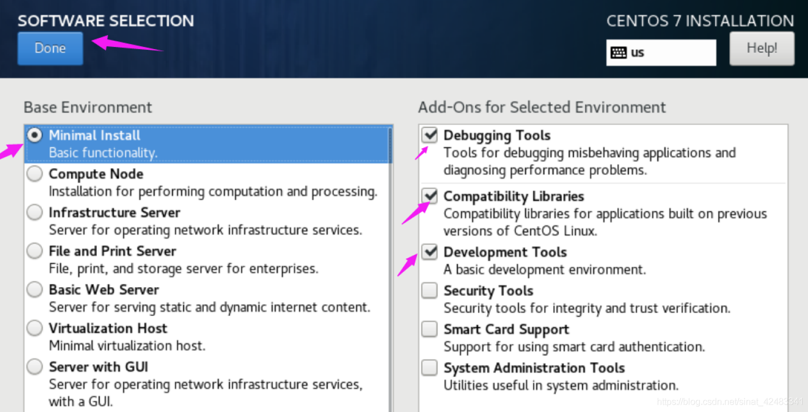
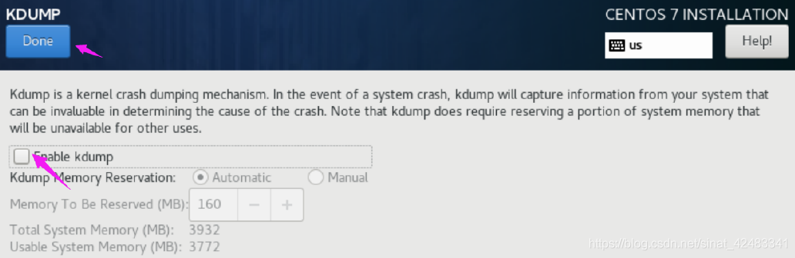
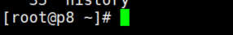
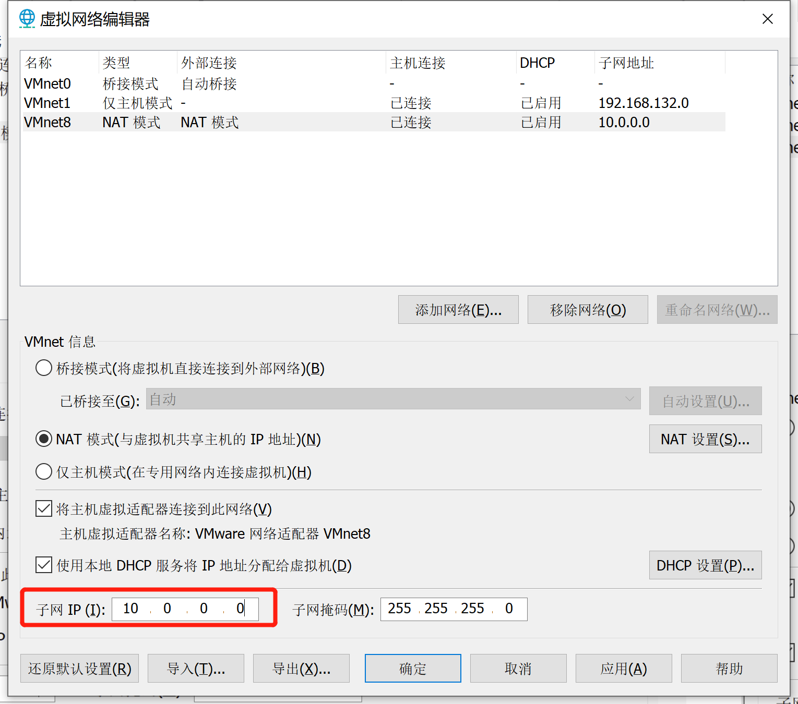

# 集群搭建：CentOS 7 模板机封装、配置静态 IP、简单优化

### 最小化安装




### 关闭内核转储



最后，别忘了在安装界面的选项中，打开 **ens33 网络的开关**


### 设置主机名称

```bash
hostnamectl set-hostname p8
```

设置之后，重新连接才能看到效果




### 安装常用工具

```bash
yum install -y wget vim net-tools lrzsz curl
```

net-tools 是补充我们最小化安装的一些命令，例如 ifconfig

lrzsz 是一款程序,在 linux 中可以代替 ftp 的上传和下载

### 配置静态 IP

```bash
cd /etc/sysconfig/network-scripts && vim ifcfg-ens33
```

将 ifcfg-ens33 文件配置如下

- 要删除配置中的 UUID，否则以后克隆出多个网卡只能启动一个
- 虚拟机里的网卡都叫 ifcfg-ens33，主机云主机就是 ifcfg-eth0，Dell的可能较em1，不过这个可以改

```bash
TYPE="Ethernet"
PROXY_METHOD="none"
BROWSER_ONLY="no"
#BOOTPROTO="dhcp" #dhcp是动态分配ip的网络协议
DEFROUTE="yes"
IPV4_FAILURE_FATAL="no"
IPV6INIT="yes"
IPV6_AUTOCONF="yes"
IPV6_DEFROUTE="yes"
IPV6_FAILURE_FATAL="no"
IPV6_ADDR_GEN_MODE="stable-privacy"
NAME="ens33"
#UUID="c62ec355-a09b-4773-8f42-2f9a3839d1bd" #网卡唯一的uuid
DEVICE="ens33"
ONBOOT="yes" #开机启动

###### add below ######
BOOTPROTO="static" #静态IP
IPADDR=10.0.0.130 #本机地址
GATEWAY=10.0.0.2 #子网掩码
NETMASK=255.255.255.0 #默认网关
DNS1=10.0.0.2
DNS2=1.2.4.8
```

以上参数含义：

>DEVICE     接口名（设备,网卡）
>USERCTL    [yes|no]（非root用户是否可以控制该设备）
>BOOTPROTO  IP的配置方法[none|static|bootp|dhcp]（引导时不使用协议|静态分配IP|BOOTP协议|DHCP协议）
>HWADDR     MAC地址   
>ONBOOT     系统启动的时候网络接口是否有效（yes/no）   
>TYPE       网络类型（通常是Ethemet）   
>NETMASK    网络掩码   
>IPADDR     IP地址   
>IPV6INIT   IPV6是否有效（yes/no）   
>GATEWAY    默认网关IP地址
>BROADCAST  广播地址
>NETWORK    网络地址

配置完成后，别忘了在 VMware 中，选择 **编辑->虚拟网络编辑器**，让 **子网IP** 和上面文件中保持对应，否则无法上网



### 重启一下网络

```bash
systemctl restart network
```

测试网络通不通

```bash
ping www.baidu.com
```


### 关闭防火墙以及NetworkManager

```bash
systemctl stop firewalld
systemctl disable firewalld 

systemctl disable NetworkManager
```


### 关闭SELINUX

```bash
vim /etc/sysconfig/selinux
```

将 `SELINUX=enforcing` 替换为 `SELINUX=disabled`

重启后，运行命令`sestatus`

看到SELinux status ：  disabled，成功关闭


### 替换内网yum源

增删改之前先备份！

```bash
cd /etc/yum.repos.d/
mv CentOS-Base.repo CentOS-Base.repo.bak
wget -O /etc/yum.repos.d/CentOS-CR.repo http://mirrors.aliyun.com/repo/Centos-7.repo
```


### 清一下缓存

```bash
yum clean all && yum makecache
```


### Xshell 终端设置主机名和用户名颜色

```shell
cd ~
vim .bashrc
```

追加以下内容

```shell
PS1='[\[\033[01;32m\]\u@\h\[\033[00m\]:\[\033[01;34m\]\w\[\033[00m\]]\$ '
```

使其生效

```shell
source .bashrc
```

### 取消vim粘贴时自动注释功能

```
cd ~
vim .vimrc
# 添加下面的内容
set paste
```

保存即可，然后使其生效

```
source .vimrc
```


#### 搞定，这是一些简单的优化，后面的机器可以直接用这台克隆了~

克隆的时候，记得和上面一样修改一下新主机的 **主机名称** 和 **静态ip** 就可以啦！


---

### 附：模板机一键改 ip、设置 hostname

```shell
hostnamectl set-hostname p8-redis
sed -i 's/IPADDR=10.0.0.130/IPADDR=10.0.0.55/g' /etc/sysconfig/network-scripts/ifcfg-ens33
systemctl restart network
```

