# 分布式锁多种实现

> 老周-2021金三银四面试突击-08-redis面试题-1:18：**锁必须由一个单节点排他技术提供**

### 大道至简：锁是怎么实现的？

- 总线协议 + 单机版管程 = 单机版锁

- 单机版分布式锁的实现 + TCP/IP 协议栈 = 多机版分布式锁

## 多种分布式锁的实现

#### 基于MySQL分布式锁实现

mysql乐观锁：加veison方式实现，在并发量大场景下mysql是支撑不住的

**乐观锁介绍：**

乐观锁（ Optimistic Locking ） 相对悲观锁而言，乐观锁假设认为数据一般情况下不会造成冲突，所以在数据进行提交更新的时候，才会正式对数据的冲突与否进行检测，如果发现冲突了，则让返回用户错误的信息，让用户决定如何去做。那么我们如何实现乐观锁呢，一般来说有以下2种方式：

1. 使用数据版本（Version）记录机制实现，这是乐观锁最常用的一种实现 方式。何谓数据版本？即为数据增加一个版本标识，一般是通过为数据库表增加一个数字类型的 “version” 字段来实现。当读取数据时，将version字段的值一同读出，数据每更新一次，对此version值加一。当我们提交更新的时候，判断数据库表对应记录 的当前版本信息与第一次取出来的version值进行比对，如果数据库表当前版本号与第一次取出来的version值相等，则予以更新，否则认为是过期数据。

2. 乐观锁定的第二种实现方式和第一种差不多，同样是在需要乐观锁控制的table中增加一个字段，名称无所谓，字段类型使用时间戳 （timestamp）, 和上面的version类似，也是在更新提交的时候检查当前数据库中数据的时间戳和自己更新前取到的时间戳进行对比，如果一致则OK，否则就是版本冲突。

#### 基于Redis分布式锁实现

redis悲观锁，多节点redlock算法

Redisson

在应用中，有这样一种可行的架构，即让悲观锁和乐观锁同时存在：

- 如果redis挂了，就降级到让mysql顶上来。如果流量太大的话，mysql也会挂掉，怎么办？在应用服务器加一个信号量，例如10个最小吞吐量对mysql进行操作。
- 这样，用信号量+乐观锁来抵一个redis，等redis恢复之后再继续用redis，这就是分布式的锁升级与锁降级。

##### 什么是分布式锁？

当多个进程在同一个系统中，用分布式锁控制多个进程对资源的访问

##### 分布式锁应用场景？

（1）传统的单体应用单机部署情况下，可以使用java并发处理相关的API进行互斥控制。
（2）分布式系统后由于多线程，多进程分布在不同机器上，使单机部署情况下的并发控制锁策略失效，为了解决跨JVM互斥机制来控制共享资源的访问，这就是分布式锁的来源；分布式锁应用场景大都是高并发、大流量场景。

##### 分布式锁实现？

基于Redisson对redis分布式锁的实现；

（1）加锁机制：根据hash节点选择一个客户端执行lua脚本

（2）锁互斥机制：再来一个客户端执行同样的lua脚本会提示已经存在锁，然后进入循环一直尝试加锁

（3）可重入机制

（4）watch dog 自动延期机制

（5）释放锁机制

##### 测试用例

Redis单机分布式锁

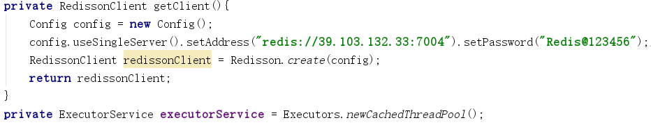

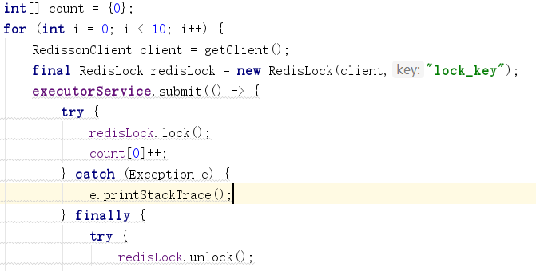

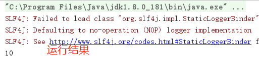

Redis 红锁

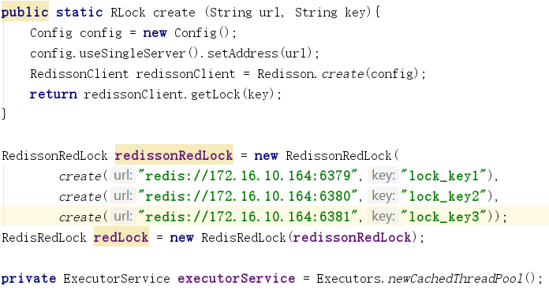

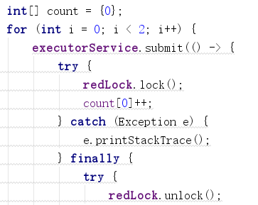

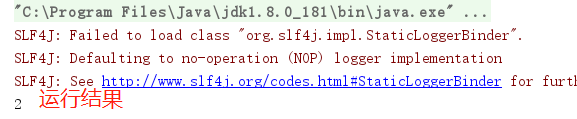

#### 基于zookeeper分布式锁实现

zookeeper作为高性能分布式协调框架，可以把其看做一个文件系统，其中有节点的概念，并且分为4种：

1. 持久性节点

2. 持久性顺序节点

3. 临时性节点

4. 临时性顺序节点。

分布式锁的实现主要思路就是：监控其他客户端的状态，来判断自己是否可以获得锁。

采用临时性顺序节点的原因：

1. zk服务器维护了客户端的会话有效性，当会话失效的时候，其会话所创建的临时性节点都会被删除，通过这一特点，可以通过watch临时节点来监控其他客户端的情况，方便自己做出相应动作。

2. 因为zk对写操作是顺序性的，所以并发创建的顺序节点会有一个唯一确定的序号，当前锁是公平锁的一种实现，所以依靠这种顺序性可以很好的解释—节点序列小的获取到锁

 并且可以采用watch自己的前一个节点来避免惊群现象（这样watch事件的传播是线性的）。

##### zookeeper分布式锁步骤

1. 启动客户端，确认链接到了服务器
2. 多个客户端并发的在特定路径下创建临时性顺序节点
3. 客户端判断自己的创建的顺序节点是否是最小的，如果是最小的，则获取锁成功
4. 第三步若判定失败，则采用zk的watch机制监听自己的前一个顺序节点，等待前一个节点的删除（放锁）事件，再开始第三步判定。

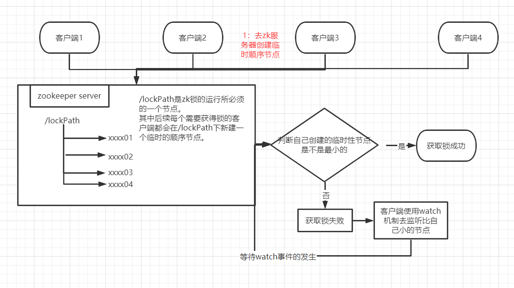

#### 基于etcd分布式锁实现

##### 基于 ETCD 的锁实现的基础机制

1. Lease机制
   租约机制（TTL，Time To Live），etcd 可以为存储的 key-value 对设置租约，当租约到期，key-value 将失效删除；
   同时也支持续约，通过客户端可以在租约到期之前续约，以避免 key-value 对过期失效。Lease 机制可以保证分布式锁的安全性，为锁对应的 key 配置租约，即使锁的持有者因故障而不能主动释放锁，锁也会因租约到期而自动释放。

2. Revision机制
   每个 key 带有一个 Revision 号，每进行一次事务便+1，它是全局唯一的，通过 Revision 的大小就可以知道进行写操作的顺序。
   在实现分布式锁时，多个客户端同时抢锁，根据 Revision 号大小依次获得锁，可以避免 “羊群效应” ，实现公平锁。

   羊群效应：羊群是一种很散乱的组织，平时在一起也是盲目地左冲右撞，但一旦有一只头羊动起来，其他的羊也会不假思索地一哄而上，全然不顾旁边可能有的狼和不远处更好的草。

   etcd的Revision机制，可以根据Revision号的大小顺序进行写操作，因而可以避免“羊群效应”。这和zookeeper的临时顺序节点+监听机制可以避免羊群效应的原理是一致的。

3. Prefix机制，即前缀机制。
   例如，一个名为 /etcd/lock 的锁，两个争抢它的客户端进行写操作，实际写入的 key 分别为：key1="/etcd/lock/UUID1"，key2="/etcd/lock/UUID2"。其中，UUID 表示全局唯一的 ID，确保两个 key 的唯一性。写操作都会成功，但返回的 Revision 不一样，那么，如何判断谁获得了锁呢？通过前缀 /etcd/lock 查询，返回包含两个 key-value 对的的 KeyValue 列表，同时也包含它们的 Revision，通过 Revision 大小，客户端可以判断自己是否获得锁。

4. Watch机制，即监听机制。
   Watch 机制支持 Watch 某个固定的 key，也支持 Watch 一个范围（前缀机制）。当被 Watch 的 key 或范围发生变化，客户端将收到通知；在实现分布式锁时，如果抢锁失败，可通过 Prefix 机制返回的 Key-Value 列表获得 Revision 比自己小且相差最小的 key（称为 pre-key），对 pre-key 进行监听，因为只有它释放锁，自己才能获得锁，如果 Watch 到 pre-key 的 DELETE 事件，
   则说明 pre-key 已经释放，自己将持有锁。

##### 基于 ETCD 的分布式锁的原理

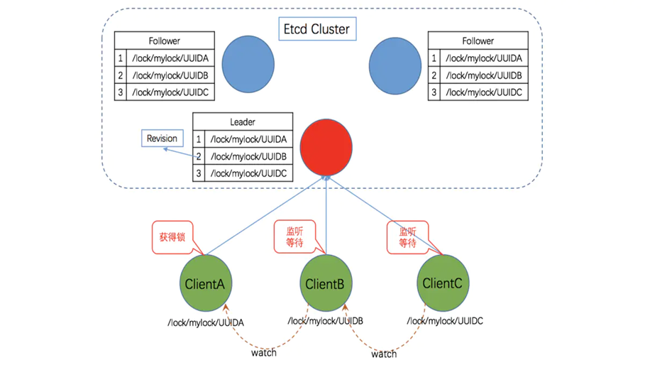

##### etcd分布式锁的实现流程

1. 建立连接

   客户端连接 etcd，以 /etcd/lock 为前缀创建全局唯一的 key，假设第一个客户端对应的 key="/etcd/lock/UUID1"，第二个为 key="/etcd/lock/UUID2"；客户端分别为自己的 key 创建租约 - Lease，租约的长度根据业务耗时确定；
   
2. 创建定时任务作为租约的“心跳”

   当一个客户端持有锁期间，其它客户端只能等待，为了避免等待期间租约失效，客户端需创建一个定时任务作为“心跳”进行续约。此外，如果持有锁期间客户端崩溃，心跳停止，key 将因租约到期而被删除，从而锁释放，避免死锁；

3. 客户端将自己全局唯一的 key 写入 etcd

   执行 put 操作，将步骤 1 中创建的 key 绑定租约写入 Etcd，根据 Etcd 的 Revision 机制，假设两个客户端 put 操作返回的 Revision 分别为 1、2，客户端需记录 Revision 用以接下来判断自己是否获得锁；

4. 客户端判断是否获得锁

   客户端以前缀 /etcd/lock/ 读取 key-Value 列表，判断自己 key 的 Revision 是否为当前列表中最小的，如果是则认为获得锁；否则监听列表中前一个 Revision 比自己小的 key 的删除事件，一旦监听到删除事件或者因租约失效而删除的事件，则自己获得锁；

5. 执行业务

   获得锁后，操作共享资源，执行业务代码

6. 释放锁

   完成业务流程后，删除对应的key释放锁

##### 基于ETCD的分布式锁源码分析

加锁过程：

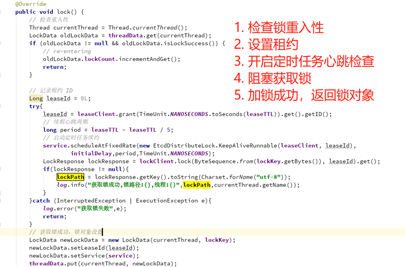

解锁过程：

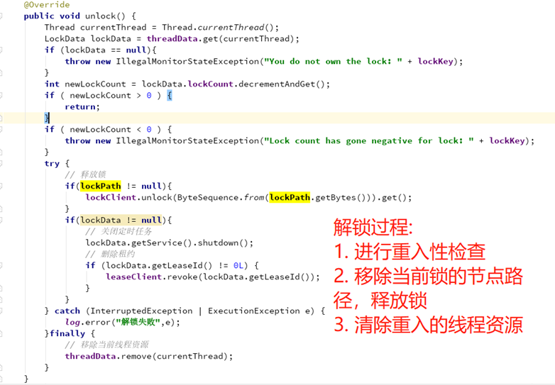

##### 基于ETCD的分布式锁源码核心接口

io.etcd.jetcd.LockImpl

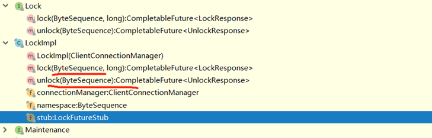