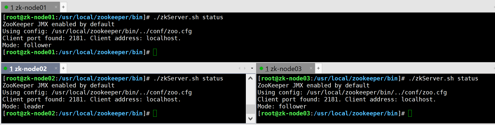

# zookeeper集群搭建

### 主机规划

| 序号 | 主机名称  | 角色   | 数量 | 主机内网IP规划 | 主机外网IP | 主机配置 | 基础软件 | 系统            |
| ---- | --------- | ------ | ---- | -------------- | ---------- | -------- | -------- | --------------- |
| 01   | zk-node01 | Node01 | 1    | 10.0.0.150     |            | 2C 4G    |          | CentOS7x64 1810 |
|      | zk-node02 | Node02 | 1    | 10.0.0.151     |            | 2C 4G    |          |                 |
|      | zk-node03 | Node03 | 1    | 10.0.0.152     |            | 2C 4G    |          |                 |

### Java 环境安装与配置

```shell
#yum在线安装
yum install -y java-1.8*
#查验是否安装成功
rpm -qa | grep java
#定位JDK路径
rpm -qa | grep java
rpm -ql java-1.8.0-openjdk-1.8.0.111-1.b15.el7_2.x86_64
#确认路径
/usr/lib/jvm/java-1.8.0-openjdk-1.8.0.252.b09-2.el7_8.x86_64/
```

添加环境变量

```shell
vim /etc/profile
```

追加以下内容

```shell
# Java environment
export JAVA_HOME=/usr/lib/jvm/java-1.8.0-openjdk-1.8.0.275.b01-0.el7_9.x86_64
export CLASSPATH=.:$JAVA_HOME/jre/lib/rt.jar:$JAVA_HOME/lib/dt.jar:$JAVA_HOME/lib/tools.jar
export PATH=$PATH:$JAVA_HOME/bin
```

使其生效

```shell
source /etc/profile
```

### 安装 ZK 3.58 版本

运维一定要和开发人员沟通、确认版本

> 视频课中用的 3.56 版本，镜像没有，为了拉镜像方便，所以用了 3.58

```shell
cd /usr/local
wget https://mirrors.tuna.tsinghua.edu.cn/apache/zookeeper/stable/apache-zookeeper-3.5.8-bin.tar.gz
tar -zxvf apache-zookeeper-3.5.8-bin.tar.gz
mv apache-zookeeper-3.5.8-bin zookeeper
cd zookeeper/
#创建一个数据存储目录以及日志存储目录
mkdir data && mkdir logs
#三台分别执行
cd data && echo "1">>myid # node01
cd data && echo "2">>myid # node02
cd data && echo "3">>myid # node03
#拷贝一份配置文件，后期使用zoo.cfg
cd conf/
cp zoo_sample.cfg zoo.cfg
#编辑配置文件
vim zoo.cfg
```

### 三台机器启动 zk

启动 zk

```shell
cd /usr/local/zookeeper/bin/
./zkServer.sh start
```

查看当前机器上zk的状态（leader 或者 follower）

```shell
zkServer.sh status
```

