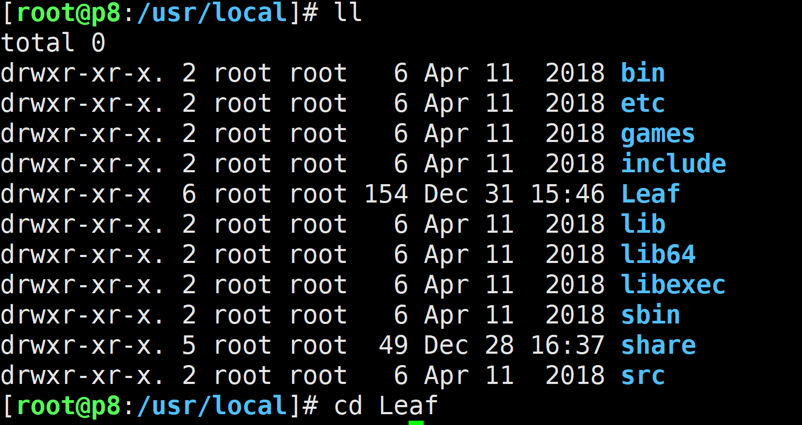

# 美团 Leaf 分布式 ID 生成器部署与测试

美团的开源的分布式ID解决方案 https://github.com/Meituan-Dianping/Leaf

### 主机规划

| 序号 | 主机名称 | 角色   | 数量 | 主机内网IP规划 | 主机外网IP | 主机配置 | 基础软件 | 系统            |
| ---- | -------- | ------ | ---- | -------------- | ---------- | -------- | -------- | --------------- |
| 01   | p8-leaf  | Node01 | 1    | 10.0.0.160     |            | 2C 4G    |          | CentOS7x64 1810 |
|      |          |        |      |                |            |          |          |                 |
|      |          |        |      |                |            |          |          |                 |

### 美团 Leaf 分布式 ID 生成器部署过程

git clone https://github.com/Meituan-Dianping/Leaf.git



```
yum install -y git
yum install -y maven
```

修改 maven 镜像为阿里源

```
vim /etc/maven/settings.xml
```

编辑如下

```xml
<mirrors>
    <!-- mirror
     | Specifies a repository mirror site to use instead of a given repository. The repository that
     | this mirror serves has an ID that matches the mirrorOf element of this mirror. IDs are used
     | for inheritance and direct lookup purposes, and must be unique across the set of mirrors.
     |-->
    <mirror>
      <id>alimaven</id>
      <mirrorOf>*</mirrorOf>
      <name>aliyun maven</name>
      <url>https://maven.aliyun.com/nexus/content/groups/public/</url>
    </mirror>
  </mirrors>
```

在 Leaf 目录下安装

```
cd Leaf
mvn clean install -DskipTests
cd leaf-server
```

maven 方式运行

```
mvn spring-boot:run
```

##### 测试一下

安装完成，现在可以在浏览器中访问了，显示 0 表示正常运行

http://10.0.0.130:8080/api/segment/get/leaf-segment-test

