# 分布式ID业界解决方案

一言以蔽之：全局唯一，局部唯一，按情况保持递增

### 雪花算法

### 分布式ID业界实现方案

#### 基于 UUID

逻辑主键/物理主键：一个是数据库的，一个是业务上的

create table xxx(id bigint primiary key, uid varchar 11)

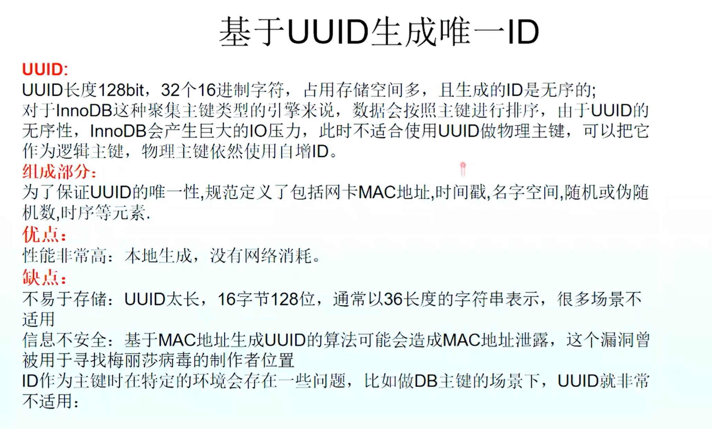

##### UUID 生成策略

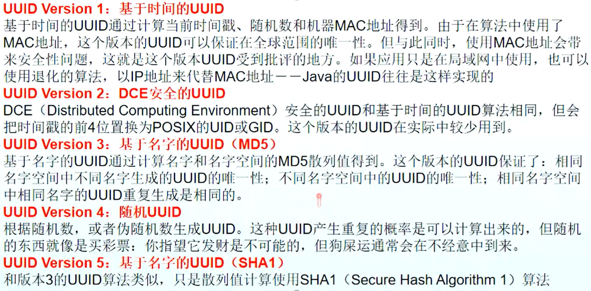

##### UUID 应用

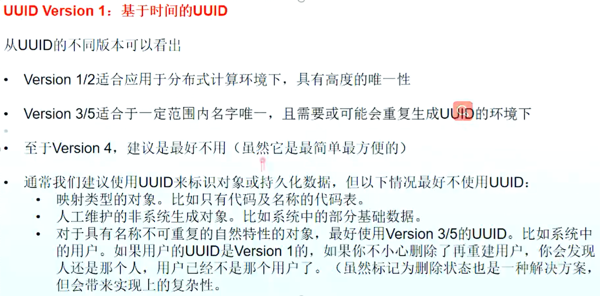

##### 测试用例

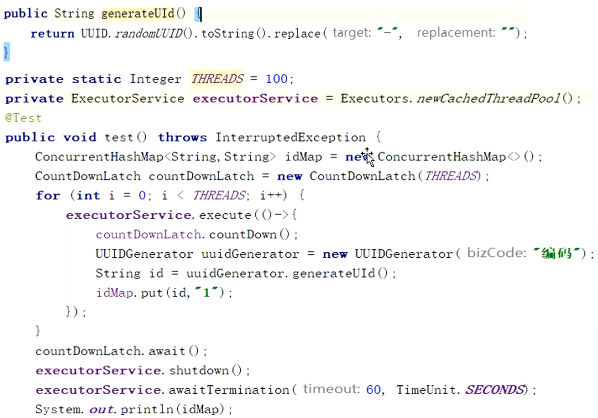

#### 基于 DB 的自增主键方案

没人用了，redis都比这个好

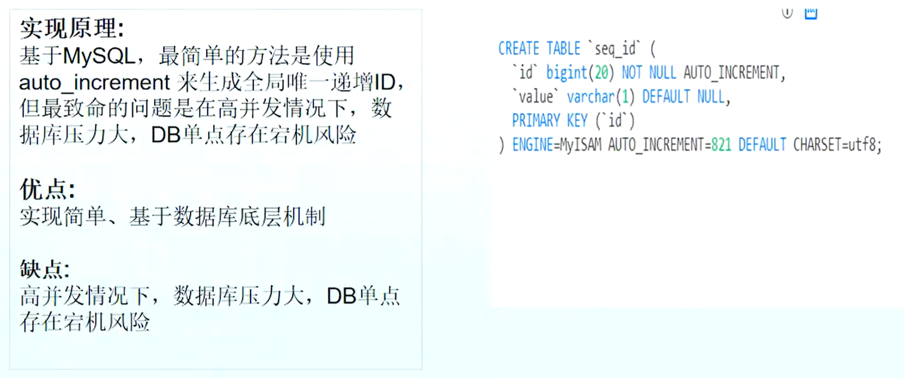

#### 基于 DB 多主模式方案

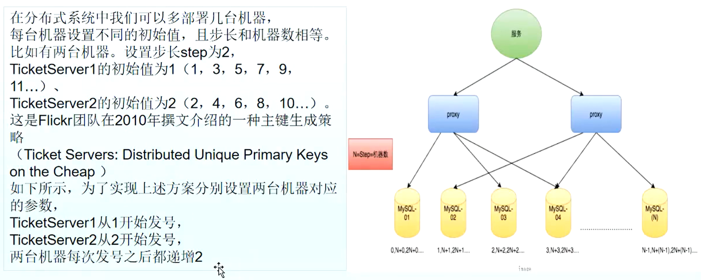

#### 基于 DB 号段实现方案

两台机器同时申请号段的时候，如何保证号段唯一？答：因为并发量不大，因此使用乐观锁即可。

##### 乐观锁案例：

银行两操作员同时操作同一账户。
比如A、B操作员同时读取一余额为1000元的账户，A操作员为该账户增加100元，B操作员同时为该账户扣除50元，A先提交，B后提交。最后实际账户余额为1000-50=950元，但本该为1000+100-50=1050。这就是典型的并发问题。

乐观锁机制在一定程度上解决了这个问题。乐观锁，大多是基于数据版本(Version)记录机制实现。何谓数据版本？即为数据增加一个版本标识，在基于数据库表的版本解决方案中，一般是通过为数据库表增加一个 “version” 字段来实现。

读取出数据时，将此版本号一同读出，之后更新时，对此版本号加一。此时，将提交数据的版本数据与数据库表对应记录的当前版本信息进行比对，如果提交的数据版本号大于数据库表当前版本号，则予以更新，否则认为是过期数据。

对于上面修改用户帐户信息的例子而言，假设数据库中帐户信息表中有一个version字段，当前值为1；而当前帐户余额字段(balance)为1000元。假设操作员A先更新完，操作员B后更新。
a、操作员A此时将其读出(version=1)，并从其帐户余额中增加100(1000+100=1100)。
b、在操作员A操作的过程中，操作员B也读入此用户信息(version=1)，并从其帐户余额中扣除50(1000-50=950)。
c、操作员A完成了修改工作，将数据版本号加一(version=2)，连同帐户增加后余额(balance=1100)，提交至数据库更新，此时由于提交数据版本大于数据库记录当前版本，数据被更新，数据库记录version更新为2。
d、操作员B完成了操作，也将版本号加一(version=2)试图向数据库提交数据(balance=950)，但此时比对数据库记录版本时发现，操作员B提交的数据版本号为2，数据库记录当前版本也为2，不满足 “提交版本必须大于记录当前版本才能执行更新 “的乐观锁策略，因此，操作员B的提交被驳回。
这样，就避免了操作员B用基于version=1的旧数据修改的结果覆盖操作员A的操作结果的可能。

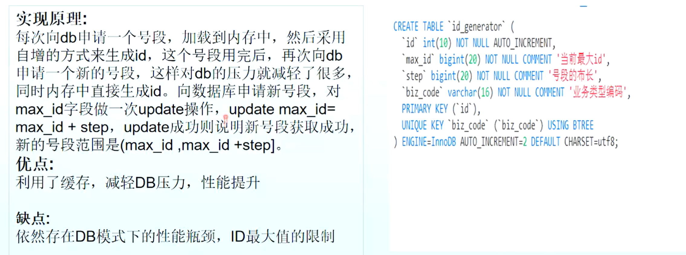

#### 基于 Redis 实现分布式 ID

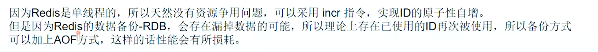

#### 基于 zk 实现分布式 ID

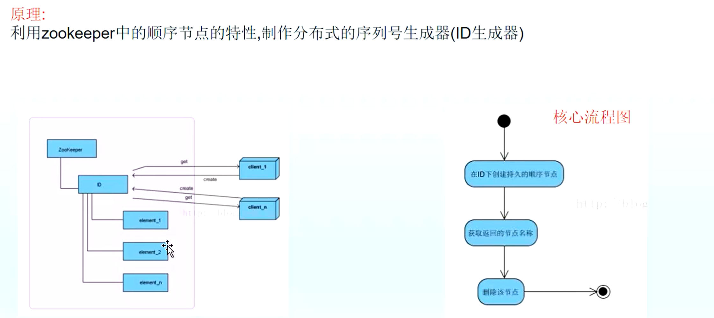

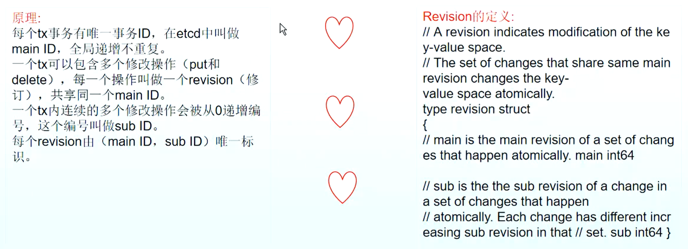

#### 美团 Leaf - 基于 DB 的 segment 模式（DB-Segment、zk+SnowFlake）

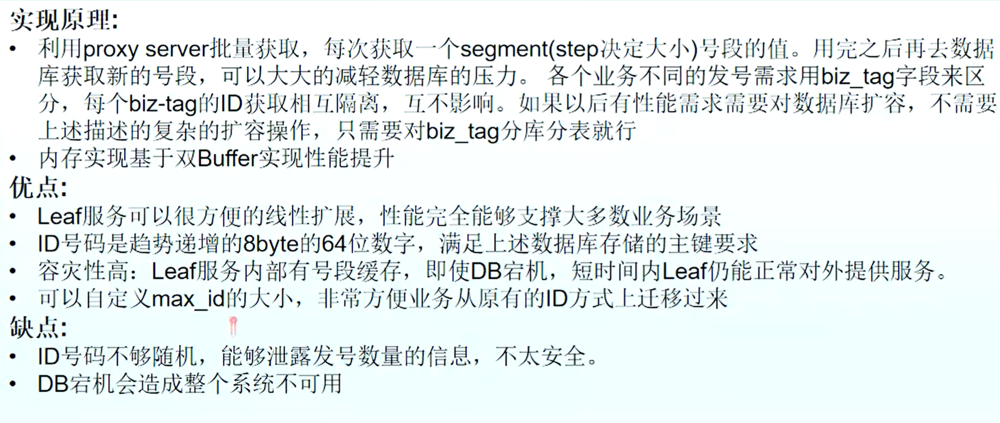

美团 Leaf 原理图

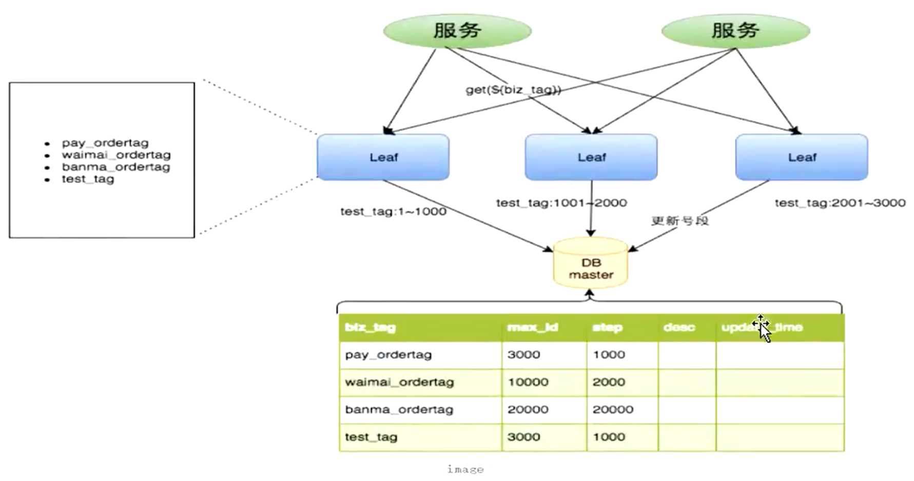

##### 美团 Leaf - 基于 zk 的 SnowFlake 算法

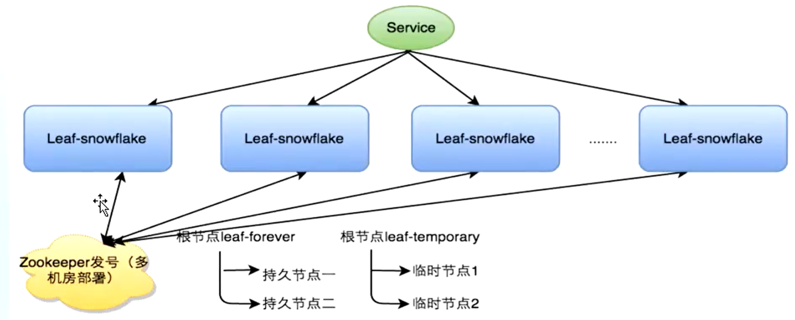

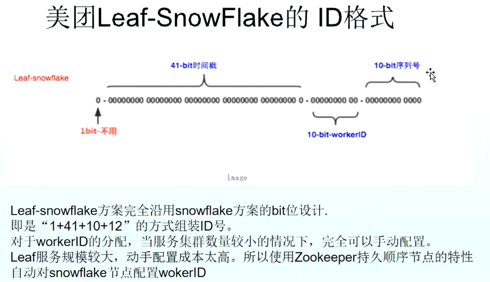

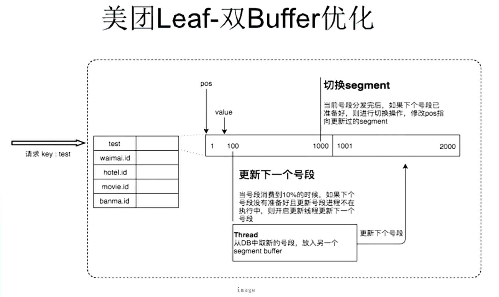

#### 百度 uid-generator 分布式 ID 生成器

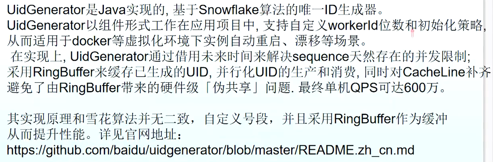