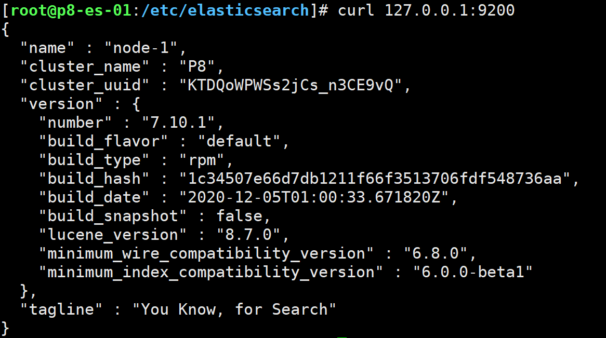
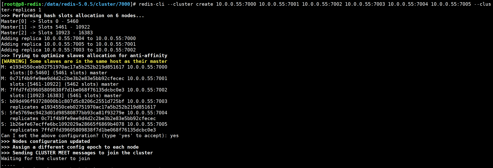
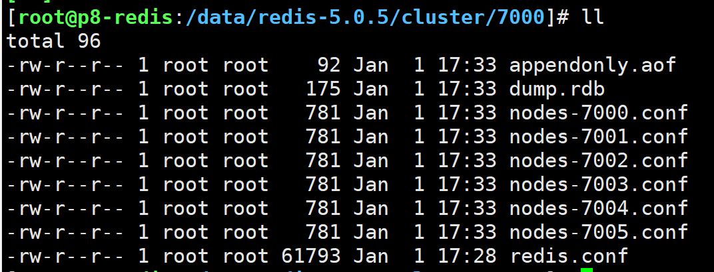
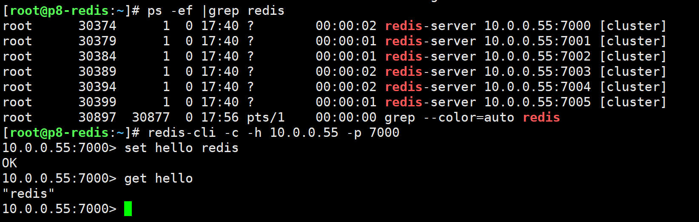

# ES和Redis环境安装与配置


### 一、IDC机房和P8架构中硬件设备选购案例

#### 1.1 生产环境中选购的依据

价格、性能、冗余


##### 1.1.1 生产环境负载均衡集群系统架构设备选购方案

LVS1 DELL R610 1U CPU E5 * 2 8G * 2（4） 硬盘 SAS 146G * 2 RAID 1
LVS2 DELL R610 1U CPU E5 * 2 8G * 2（4） 硬盘 SAS 146G * 2 RAID 1


##### 1.1.2 Web 层硬件选择和RAID级别

WWW 主站1 业务(2台) 	DELL R730 2U 	CPU E5 * 2 	8G(16 32G) 	SAS 300G * 2 	RAID 0 没有冗余
WWW 主站2 业务(2台) 	DELL R730 2U 	CPU E5 * 2 	8G(16 32G) 	SAS 300G * 2 	RAID 0

备选方案：R430 R610 1U

##### 1.1.3 数据库层硬件选择以及RAID级别(Oracle和MySQL)

MySQL 主库1-1 	DELL R730 2U 	CPU E5 * 2 	8G(16 32G) 	SAS 300G * 6 	RAID 10 兼具冗余和速率
MySQL 主库1-2 	DELL R730 2U 	CPU E5 * 2 	8G(16 32G) 	SAS 300G * 6 	RAID 10

MySQL 从库1-1 	DELL R730 2U 	CPU E5 * 2 	8G(16 32G) 	SAS 300G * 6 	RAID 0或5 从库一般保证冗余和备份
MySQL 从库1-2 	DELL R730 2U 	CPU E5 * 2 	8G(16 32G) 	SAS 300G * 6 	RAID 0或5
MySQL 从库2-1 	DELL R730 2U 	CPU E5 * 2 	8G(16 32G) 	SAS 300G * 6 	RAID 0或5
MySQL 从库2-2 	DELL R730 2U 	CPU E5 * 2 	8G(16 32G) 	SAS 300G * 6 	RAID 0或5


##### 1.1.4 存储层硬件选择和 RAID 级别（数据备份，两地三中心）

数据备份硬件以及 RAID 级别

DELL R610 	E5 * 2 	16G-32G 	SAS 10K 2T * 6 	可以不做RAID，不做就用交叉备份
DELL R730 	E5 * 2 	16G-32G 	SAS 10K 2T * 6 	如果做RAID，用 RAID5，是折中方案

提示：对于备份服务器来说，一般我们考虑容量和冗余，不能随随便便就挂了，而对性能要求不高。

##### 1.1.5 共享存储 NFS 硬件选择以及 RAID 级别

NFS1 	DELL R730 	E5 	8G * 2 	SAS15K 600G * 6	RAID10/RAID5/RAID0
NFS2 	DELL R730 	E5 	8G * 2 	SAS15K 600G * 6	RAID10/RAID5/RAID0

热迁移方案现在一般选用 NFS 来做，或者新一点的 GFS（google），MFS

##### 1.1.6 分布式存储 GFS、MFS

NFS1	 DELL R730 	E5 8G * 2 	SAS 15K 600G * 6	 RAID10/RAID5/RAID0
NFS2	 DELL R730	 E5 8G * 2 	SAS 15K 600G * 6 	RAID10/RAID5/RAID0

##### 1.1.7 监控管理/网关层硬件选择以及RAID级别

DELL R610 /R430	 E51	 8G-16G 	146G SAS 2块 	RAID1

##### 1.1.8 网络设备【选全千兆设备即可】

国内首选华为 H3C，涉及安全性问题我们在陆续淘汰CISCO，也可以用。另外，还可以选用DLINK 易捷等。

所有的服务器，都带有远程管理卡，4 网口 + 1，每个服务器 5 根网线


### 二、搭建ES环境P8集群架构，要求ES单节点即可

本项目安装 ES 的原因是，主要用于将数据库的数据导入到 ES 中，做分词，我们后面再讲

#### 2.1 环境要求

##### 安装 Java，要求 JDK 1.8.0 以上的版本

```shell
yum install -y java-1.8.0-openjdk*
```

##### 安装 ES yum 公钥

```shell
rpm --import https://artifacts.elastic.co/GPG-KEY-elasticsearch
```

##### 配置 yum 清华源

```shell
vim /etc/yum.repos.d/elasticsearch.repo
```

粘贴如下

```shell
[elasticsearch-7.x]
name=Elasticsearch repository for 7.x packages
baseurl=https://mirror.tuna.tsinghua.edu.cn/elasticstack/7.x/yum/
gpgcheck=1
gpgkey=https://artifacts.elastic.co/GPG-KEY-elasticsearch
enabled=1
autorefresh=1
type=rpm-md
```

##### 安装 ES

```shell
yum makecache && yum install -y elasticsearch
```

##### 配置 ES

如果电脑配置不够 可以256 最大512M

```shell
cd /etc/elasticsearch 
# 修改jvm内存限制，默认1g，一般可以不改
vim jvm.options
# 集群配置
vim elasticsearch.yml
```

elasticsearch.yml 配置文件需要修改的地方，已经用【这里】标出

```shell
# ======================== Elasticsearch Configuration =========================
#
# NOTE: Elasticsearch comes with reasonable defaults for most settings.
#       Before you set out to tweak and tune the configuration, make sure you
#       understand what are you trying to accomplish and the consequences.
#
# The primary way of configuring a node is via this file. This template lists
# the most important settings you may want to configure for a production cluster.
#
# Please consult the documentation for further information on configuration options:
# https://www.elastic.co/guide/en/elasticsearch/reference/index.html
#
# ---------------------------------- Cluster -----------------------------------
#
# Use a descriptive name for your cluster:
#
cluster.name: P8 #【这里】
#
# ------------------------------------ Node ------------------------------------
#
# Use a descriptive name for the node:
#
node.name: node-1  #【这里】
#
# Add custom attributes to the node:
#
#node.attr.rack: r1
#
# ----------------------------------- Paths ------------------------------------
#
# Path to directory where to store the data (separate multiple locations by comma):
#
path.data: /var/lib/elasticsearch
#
# Path to log files:
#
path.logs: /var/log/elasticsearch
#
# ----------------------------------- Memory -----------------------------------
#
# Lock the memory on startup:
#
#bootstrap.memory_lock: true
#
# Make sure that the heap size is set to about half the memory available
# on the system and that the owner of the process is allowed to use this
# limit.
#
# Elasticsearch performs poorly when the system is swapping the memory.
#
# ---------------------------------- Network -----------------------------------
#
# Set the bind address to a specific IP (IPv4 or IPv6):
#
network.host: 0.0.0.0  #【这里】
#
# Set a custom port for HTTP:
#
http.port: 9200  #【这里】
#
# For more information, consult the network module documentation.
#
# --------------------------------- Discovery ----------------------------------
#
# Pass an initial list of hosts to perform discovery when this node is started:
# The default list of hosts is ["127.0.0.1", "[::1]"]
#
#discovery.seed_hosts: ["host1", "host2"]
#
# Bootstrap the cluster using an initial set of master-eligible nodes:
#
cluster.initial_master_nodes: ["node-1"]  #【这里，因为我们是单节点，只留下node-1即可】
#
# For more information, consult the discovery and cluster formation module documentation.
#
# ---------------------------------- Gateway -----------------------------------
#
# Block initial recovery after a full cluster restart until N nodes are started:
#
#gateway.recover_after_nodes: 3
#
# For more information, consult the gateway module documentation.
#
# ---------------------------------- Various -----------------------------------
#
# Require explicit names when deleting indices:
#
#action.destructive_requires_name: true

```

##### 启动

```shell
systemctl restart elasticsearch
```

##### 效验安装成功

```shell
curl 127.0.0.1:9200
```



看到以上输出，搭建成功。

或者在本地打开页面 http://10.0.0.50:9200/，看到显示，表示搭建成功了。


### 三、Redis安装：单主机3主3从，主机的配置 2C 4G

##### 主机规划

| 序号 | 主机名称        | 角色   | 数量 | 主机内网IP规划 | 主机外网IP | 端口 |      |                 |
| ---- | --------------- | ------ | ---- | -------------- | ---------- | ---- | ---- | --------------- |
| 1    | redis-master-01 | Node01 | 1    | 10.0.0.55      |            | 7000 |      | CentOS7x64 1810 |
| 2    | redis-master-02 | Node02 | 1    | 10.0.0.55      |            | 7002 |      |                 |
| 3    | redis-master-03 | Node03 | 1    | 10.0.0.55      |            | 7004 |      |                 |
| 4    | redis-slave-01  | Node04 | 1    | 10.0.0.55      |            | 7001 |      |                 |
| 5    | redis-slave-02  | Node05 | 1    | 10.0.0.55      |            | 7003 |      |                 |
| 6    | redis-slave-03  | Node06 | 1    | 10.0.0.55      |            | 7005 |      |                 |

##### 安装编译器

```shell
yum install -y tcl gcc gcc-c++
```

##### 安装 Redis，版本要求 Redis 5.0.5

```shell
cd /usr/local
wget http://download.redis.io/releases/redis-5.0.5.tar.gz
tar -zxvf redis-5.0.5.tar.gz
#安装之前可以用mv redis-5.0.5 redis去掉版本号，方便运维脚本操作，此处为了显示版本，故保留
cd redis-5.0.5 
make && make install
mkdir -p /data/redis-5.0.5/cluster/7000
mkdir -p /data/redis-5.0.5/cluster/7001
mkdir -p /data/redis-5.0.5/cluster/7002
mkdir -p /data/redis-5.0.5/cluster/7003
mkdir -p /data/redis-5.0.5/cluster/7004
mkdir -p /data/redis-5.0.5/cluster/7005
cp /usr/local/redis-5.0.5/redis.conf /data/redis-5.0.5/cluster/7000
cp /usr/local/redis-5.0.5/redis.conf /data/redis-5.0.5/cluster/7001
cp /usr/local/redis-5.0.5/redis.conf /data/redis-5.0.5/cluster/7002
cp /usr/local/redis-5.0.5/redis.conf /data/redis-5.0.5/cluster/7003
cp /usr/local/redis-5.0.5/redis.conf /data/redis-5.0.5/cluster/7004
cp /usr/local/redis-5.0.5/redis.conf /data/redis-5.0.5/cluster/7005
```

##### 批量替换配置文件

用 notepad++将以下 7000 分别换成 7001,7002,7003,7004,7005，一起复制到 bash 里面执行即可

注意这里将 bind 127.0.0.1 改成 bind 10.0.0.55，其目的是让集群里的 redis 可以互相访问

```shell
# 用法：	sed -i 's/原来的/新的/g'  文件路径
sed -i 's/bind 127.0.0.1/bind 10.0.0.55/g' /data/redis-5.0.5/cluster/7000/redis.conf
sed -i 's/port 6379/port 7000/g'  /data/redis-5.0.5/cluster/7000/redis.conf
sed -i 's/redis_6379.pid/redis_7000.pid/g'  /data/redis-5.0.5/cluster/7000/redis.conf
sed -i 's/# cluster-enabled yes/cluster-enabled yes/g'  /data/redis-5.0.5/cluster/7000/redis.conf
sed -i 's/daemonize no/daemonize yes/g'  /data/redis-5.0.5/cluster/7000/redis.conf
sed -i 's/# cluster-config-file nodes-6379.conf/cluster-config-file nodes-7000.conf/g'  /data/redis-5.0.5/cluster/7000/redis.conf
sed -i 's/# cluster-node-timeout 15000/cluster-node-timeout 15000/g'  /data/redis-5.0.5/cluster/7000/redis.conf
sed -i 's/appendonly no/appendonly yes/g'  /data/redis-5.0.5/cluster/7000/redis.conf
```

##### 启动6个 redis

```shell
redis-server /data/redis-5.0.5/cluster/7000/redis.conf
redis-server /data/redis-5.0.5/cluster/7001/redis.conf
redis-server /data/redis-5.0.5/cluster/7002/redis.conf
redis-server /data/redis-5.0.5/cluster/7003/redis.conf
redis-server /data/redis-5.0.5/cluster/7004/redis.conf
redis-server /data/redis-5.0.5/cluster/7005/redis.conf
```

查看启动状态

```shell
ps -ef | grep redis
```

##### 最后，创建集群

注：每一个 redis 也是可以独立被连接的，因为配置文件写的是 bind 10.0.0.55，所以独立访问的时候要用 `redis-cli -h 10.0.0.55 -p 7000` ，而不能用本地环回地址 `redis-cli -h 127.0.0.1 -p 7000`

创建集群方法：

```shell
redis-cli --cluster create 10.0.0.55:7000 10.0.0.55:7001 10.0.0.55:7002 10.0.0.55:7003 10.0.0.55:7004 10.0.0.55:7005 --cluster-replicas 1
```



可以看到在运行的当前目录下，自动生成nodes.conf文件：



##### 登录集群

```shell
redis-cli -c -h 10.0.0.55 -p 7000               # -c 表示使用集群方式登录
```

可以正常使用

