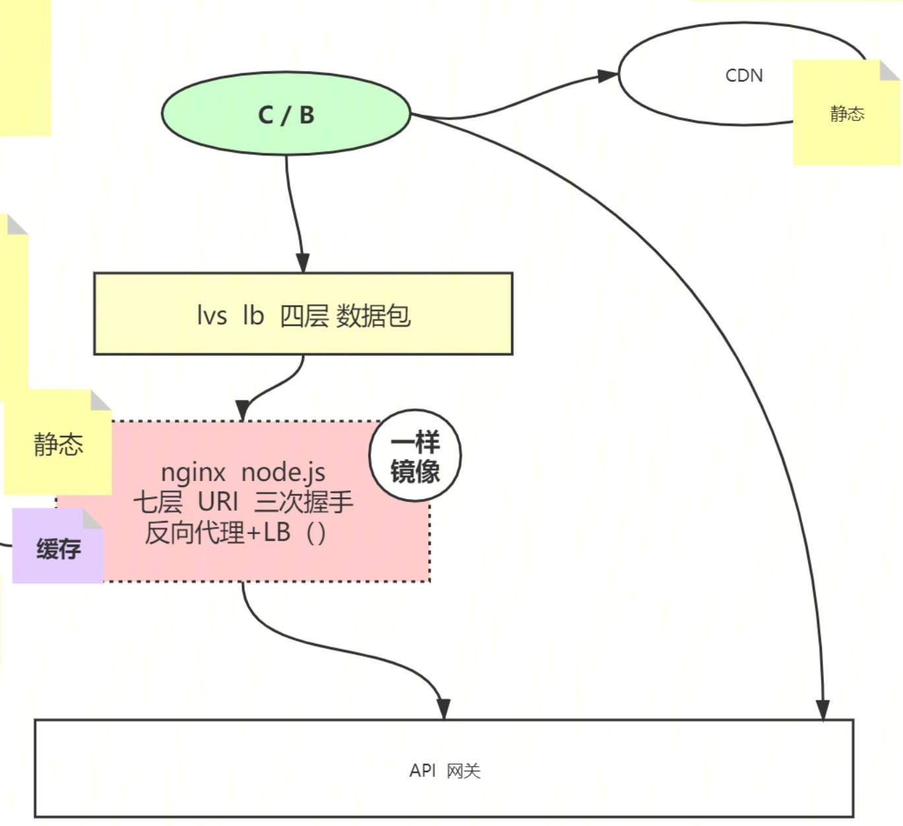

# P8 架构概论-1

#### 面试题：负载均衡有哪些策略？

- LVS 和 Nginx 的区别：LVS 是无法区分用户发来的不同请求的，要保证给后面的 realserver 是一样的，也就是镜像复制，而 nginx 可以区分用户发来的不同请求，也就是可以做 AKF 拆分原则中的 y 轴方向上的业务拆分，根据 uri，通过不管是 nginx 还是其他的反向代理，最终将不同的请求转发到不同的域名下。

