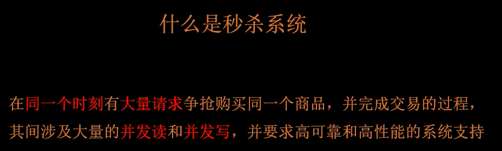

# 秒杀系统

淘宝和京东商品详情页的区别？切换商品时，页面是否切换。

SPU stand product unit SKU stock keeping unit 库存最小单元 重视 SPU能减少商品详情页的存储压力

### SPU

SPU：Standard Product Unit(标准化产品单元)
是一个商品集合，一般来说就是一个集合链，是商品信息聚合的最小单位，是一组可复用、易检索的标准化信息的集合，该集合描述了一个产品的特性。

### SKU

SKU：Stock keeping Unit(库存量单位)

库存进出计量的基本单位，可以是以个、件、盒、包等为单位。

（1）SKU是指一款商品，每款都有出现一个SKU，便于电商品牌识别商品。

（2）一款商品多色，则是有多个SKU。

（3）SKU这是对于大型连锁超市DC（配送中心）物流管理的一个必要的方法。英文全称为 stock keeping unit, 简称SKU，定义为保存库存控制的最小可用单位。

（4）例如手机中一个SKU通常表示内存，颜色。

### 解决什么问题

并发读、并发写

### 整体架构

- 前端展示层（App，网页）
- 网关层（请求发出之后到 CDN，即内容分发网络，北京的网页是北京的服务器提供给你的，杭州的网页是杭州的服务器提供给你的。另外，在CDN上一个域名可以配置多个IP地址，此时就做了负载均衡，让到达后端的流量更少一些）
- 服务层（微服务，请求过来之后，服务端先用一个服务把请求接住，这个服务会调用一些额外的服务来完成这个功能。会涉及到缓存，消息队列，中间件...）
- 存储层
- 运行环境

中台

秒杀系统，商品详情页是入口，要解决并发写和并发读的问题

技术赋能业务