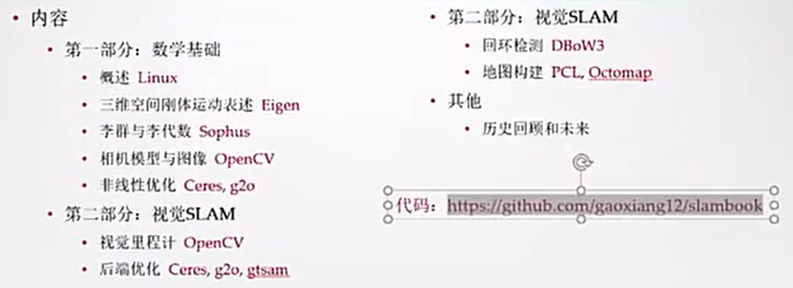
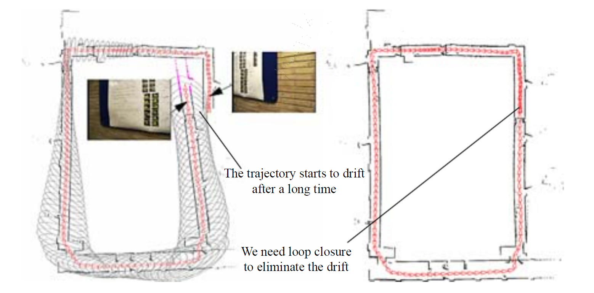
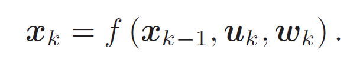
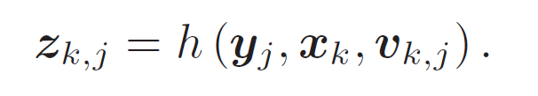
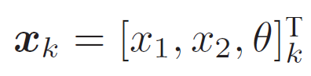
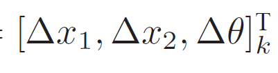
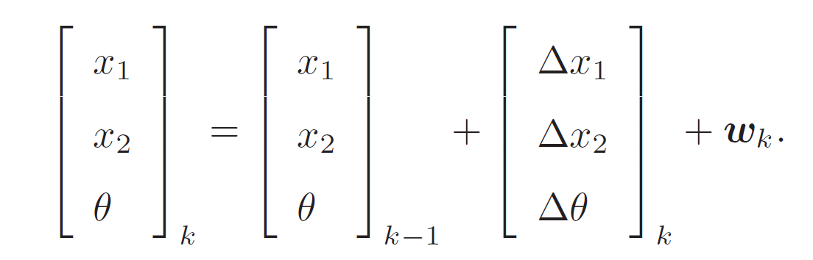
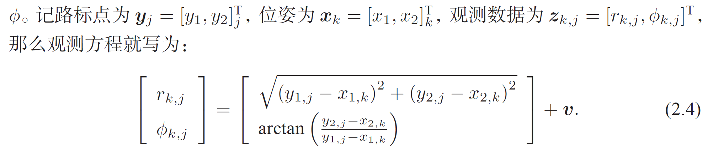
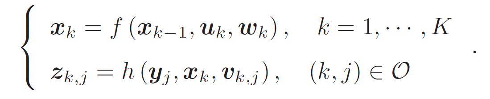

# 视觉 SLAM

#### Questions

- SLAM 是模型吗？它的输入是什么，输出是什么？模型是需要训练的吗？样本从哪儿来，好坏有什么指标？
- 看完 SLAM 之后，做什么？我们的算法是怎么使用/调用的 SLAM？我们的算法代码在哪里？
- 读《视觉SLAM十四讲》，学了 SLAM 后，用来解决项目中的什么问题？
  - 首先是定位问题，尤其是视觉里程计VO。
  - 当一个AR图标绘制后，一般是它在世界空间中的坐标不变，但是在司机视野里位置要不断变化，更新司机看到图标位置就要用到视觉里程计。
  - 其次就是地图的问题，例如在岔路口和转弯处，如何能识别岔路口在哪里呢？靠地图是一个可靠的办法
  - 然后除了slam之外，还有视频分割的问题。
  - 还有总体上想不明白的我们周一再说说。也可以听一下周四我们讨论关键技术研究的录音。云盘上。

#### 什么是 SLAM？

SLAM 是 Simultaneous Localization and Mapping 的缩写，中文译作“**同时定位与地图构建**”[1]。它是**指搭载特定传感器的主体，在没有环境先验信息的情况下，于运动过程中建立环境的模型，同时估计自己的运动**[2]。如果这里的传感器主要为相机，那就称为“视觉SLAM”。根据一张张连续运动的图像，从中推断相机的运动，以及周围环境的情况。

- 计算机视觉，Computer Vision，cv，通过人工智能中的机器学习技术，让计算机辨别物体
- SLAM发展30年后，才让相机能够认识到自己的位置，发觉自己在运动

许多地方都用到 SLAM：扫地机，移动机器人，自动驾驶汽车，无人机，虚拟现实、增强现实的设备

在很多应用场景中，我们希望知道自己在什么地方。

SLAM 的目的是解决“定位”与“地图构建”这两个问题。也就是说，一边要估计传感器自身的位置，一边要建立周围环境的模型。

##### 参考的 github：

> VO：Visual Odometry 视觉里程计 
>     代码：https://github.com/Huangying-Zhan/DF-VO
>     论文：https://arxiv.org/abs/1909.09803
>
> 车道线
>     代码：https://github.com/liuruijin17/LSTR
>     论文：https://arxiv.org/abs/2011.04233
>     论文解析：https://jishuin.proginn.com/p/763bfbd314fe

#### 自动运动的两大基本问题

- 我在什么地方？——定位，自身状态
- 周围长什么样子？——建图，外在环境

机器人的“内外兼修”：定位侧重对自身的了解，建图侧重对外在的了解

解决定位问题的方法：安装传感器，机器人本体 / 环境中。受到外部环境的约束，我们希望有一个普遍、通用的解决方案。

当谈论视觉SLAM 时，我们主要是指如何用相机解决定位和建图问题。

- 普通的摄像头能以每秒钟30 张图片的速度采集图像
- 按照工作方式不同，相机分为：
  - 单目相机（Monocular）
  - 双目相机（Stereo）
  - 深度相机（RGB-D）

#### 单目 SLAM

- 照片，以二维的形式记录了三维的世界，丢失了一个维度：深度，而这个维度是 SLAM 中非常关键的信息。
- 如果想恢复三维的结构，必须移动相机，才能估计它的运动和结构（场景中物体的远近和大小）
- 尺度不确定性

#### 双目相机和深度相机

双目相机

- 两个相机之间的距离成为基线，基线越大，能够测量到的深度越远。
- 通过左右相机图像差异来判断物体的远近，计算开销大，计算量成为主要问题

深度相机

- 通过物理手段（而非软件计算），主动向物体发射光并接收返回的光，来推测距离
- 主要用于室内

因此，SLAM 的工作原理就是：相机在场景中运动的过程，我们将得到一系列连续变化的图像。通过这样的一些图像，我们进行定位和地图构建。SLAM 需要一个完善的算法框架，而经过研究者们长期的努力工作，现有这个框架已经定型了。

#### 经典视觉 SLAM 框架

视觉 SLAM 流程：

1. 传感器信息读取

2. 视觉里程计（Visual Odometry，VO），估算 **相邻图像** 间相机的运动，以及局部地图的样子，又称为**前端**

3. 后端优化，接受不同时刻视觉里程计测量的相机位姿，以及回环检测的信息，对它们进行优化，得到全局一致的轨迹和地图。由于接在 VO 之后，又称为后端。

   > **前端** 给后端提供待优化的数据，以及这些数据的初始值。
   >
   > **后端** 负责整体的优化过程，它往往面对的只有数据，不必关心这些数据到底来自什么传感器。
   >
   > 在视觉 SLAM 中，**前端** 和 **计算机视觉** 研究领域更为相关，比如 **图像的特征提取与匹配** 等，**后端** 则主要是 **滤波与非线性优化算法**。

4. 回环检测（Loop Closing）。回环检测判断机器人是否到达过先前的位置。如果检测到回环，它会把信息提供给后端进行处理。

5. 建图（Mapping）。它根据估计的轨迹，建立与任务要求对应的地图

图像在计算机里只是一个数值矩阵，矩阵里表达着什么东西，正是现在机器学习要解决的问题。

为了定量地估计相机运动，必须先了解**相机**与**空间点**的几何关系。

- VO 能够通过相邻帧间的图像估计相机运动，并恢复场景的空间结构。它和实际的里程计一样，只计算相邻时刻的运动，而和再往前的过去的信息没有关联。就像一种只有短时间记忆的物种（可以不限于两帧，例如5-10帧）。
- 现在，假定我们已估计了两张图像间的相机运动，只要把相邻时刻的运动“串”起来，就构成了机器人的运动轨迹，从而解决了**定位问题**。另一方面，我们根据每个时刻的相机位置，计算出各像素对应的空间点的位置，就得到了**地图**。

累积漂移问题：每次估计都带有一定的误差，而由于里程计的工作方式，先前时刻的误差将会传递到下一时刻，导致经过一段时间之后，估计的轨迹将不再准确。

为了解决漂移问题，需要两种技术：**回环检测、后端优化**

- 回环检测：把“机器人回到原始位置”的事情检测出来，解决位置估计随时间漂移的问题
  - 回环检测与“定位”和“建图”二者都有密切的关系
  - 我们认为，地图存在的主要意义是让机器人知晓自己到过的地方，用判断图像间的相似性来完成回环检测。回环检测实质上是一种计算图像数据相似性的算法。
  - 在检测到回环之后，我们会把“A 与B 是同一个点”这样的信息告诉后端优化算法，可以显著的减小累计误差。
- 后端优化：根据该信息，校正整个轨迹的形状。
  - 处理 SLAM 过程中噪声的问题
    - 如何从这些带有噪声的数据中估计整个系统的状态
    - 这个状态估计的不确定性有多大（最大后验概率估计，MAP）
  - 反映出了 SLAM 问题的本质：对运动主体自身和周围环境空间不确定性的估计

##### 建图

建图并没有一个固定的形式和算法，地图关心的内容的精细程度也不同，有时地图可以由他人提供，因此地图的形式随 SLAM 的应用场合而定。分为度量地图和拓扑地图。

- 度量地图：精确地表示地图中物体的位置关系，分为稀疏地图、稠密地图
- 拓扑地图：更强调地图元素之间的关系，由节点和边组成，只考虑节点间的连通性

#### SLAM 问题的数学表述

小萝卜携带着某种传感器，在未知环境里运动。相机通常在离散时刻采集数据，所以我们只关心离散时刻的数据和地图。

> 假设：
>
> - t = 1, ... ,K 时刻发生的事情
> - x 表示位置。各时刻的位置记为 x1, ... , xK，
> - y 表示路标点。路标点一共有 N 个，用 y1, ... , yN 表示

- 运动：从 k-1 时刻到 k 时刻，小萝卜的位置 x 如何变化
- 观测：小萝卜在 k 时刻于 xk 处探测到了某一个路标 yj

##### 运动方程

噪声的存在使得这个模型变成了随机模型

- uk 是运动传感器的读数或者输入
- wk 为该过程中加入的噪声

##### 观测方程

当小萝卜在 xk 位置上看到某个路标点 yj，产生了一个观测数据 zk,j

- vk,j 是此次观测的噪声

##### 参数化：具体的观测方程、运动方程的例子

针对不同的传感器，这两个方程有不同的参数化形式。我们以小萝卜为例。

###### 1、运动方程

假设小萝卜在平面中运动，那么，它的位姿（位置和姿态）由两个位置（我的理解：x1,x2 确定平面坐标系上的一个点）和一个转角来描述，即：

其中 x1, x2 是两个轴上的位置而 θ 为转角。uk 是 ，此时，运动方程就可以具体化为：

###### 2、观测方程

比如小萝卜携带着一个二维激光传感器。当观测一个2D 路标点时，能够测到两个量：路标点与小萝卜本体之间的距离 r 和夹角ϕ。

##### 最基本的 SLAM 问题

不同的传感器有不同的参数化形式。SLAM 过程可总结为两个基本方程：

其中 O 是一个集合，记录着在哪个时刻观察到了哪个路标。

描述了最基本的 SLAM 问题：当知道运动测量的读数 u，以及传感器的读数 z 时，如何求解定位问题（估计x）和建图问题（估计y）？

把SLAM 问题建模成了一个状态估计问题：如何通过带有噪声的测量数据，估计内部的、隐藏着的状态变量？