# DF-VO 环境搭建&模型运行 

### 1、代码、文档

参考 github：https://github.com/Huangying-Zhan/DF-VO

### 2、环境搭建

```shell
# 清除索引缓存，避免拉取包时出现一些奇奇怪怪的问题
conda clean -i
# 根据 requirements 创建 conda 环境
conda env create -f requirement.yml -p /home/wxyteam/anaconda3/envs/dfvo
# 开启刚创建的 conda 环境
source /home/wxyteam/anaconda3/bin/activate
conda activate dfvo
```

### 3、下载数据集、模型

根据文档说明下载数据集和模型，（可以通过软链接）放在指定目录下（目录在 options/examples/default_configuration.yml 指定），如下图

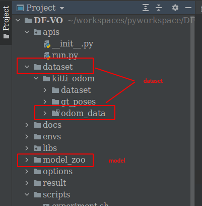

注意阅读 [Configuration Documentation](https://df-vo.readthedocs.io/en/latest/rsts/configuration.html)，了解其中配置项含义，有些配置需要自己微调，后面会遇到一些坑，例如：

- 数据集文件名和配置文件默认的文件名不一致导致的 file not found
- 数据集文件拓展名和配置文件默认的文件名不一致，读不到输入，导致的输出为空
- 无效的 cam_mode 配置项

### 4、小坑，需要微调代码

同级目录下找不到 module，需要将要将当前包所在路径 append 进 run.py 里面来：

```python
import sys
sys.path.append(r"/home/wxyteam/workspaces/pyworkspace/DF-VO")
sys.path.append(r"/home/wxyteam/workspaces/pyworkspace/DF-VO/libs")
```

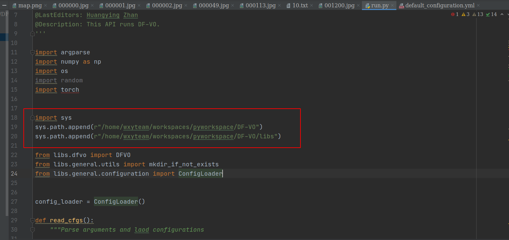

### 5、运行公开数据集

命令：`python apis/run.py -d options/examples/default_configuration.yml -c options/examples/kitti_stereo_train_icra.yml --no_confirm`

图像、文件输出：

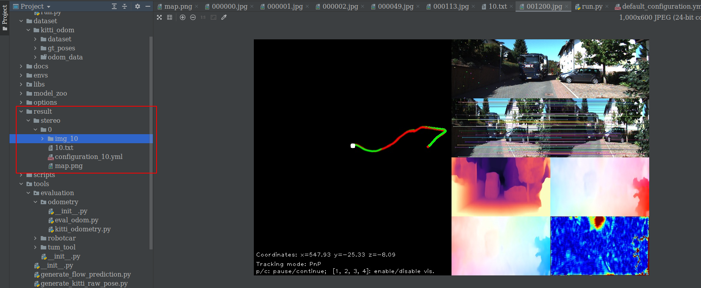

控制台输出：

```shell
(dfvo) wxyteam@wxyteam-Precision-7750:~/workspaces/pyworkspace/DF-VO$ python apis/run.py -d options/examples/default_configuration.yml -c options/examples/kitti_stereo_train_icra.yml --no_confirm
==> Initialize LiteFlowNet with [model_zoo/optical_flow/LiteFlowNet/network-default.pytorch]: 
==> Initialize Depth-CNN with [model_zoo/depth/kitti_odom/stereo/]
==> Start DF-VO
==> Running sequence: 10
100%|███████████████████████████████████████████████████████████████████████████████████████████████████████████████████████████████| 1201/1201 [08:13<00:00,  2.72it/s]
=> Finish!
The result is saved in [result/stereo/0].
Save VO map.
Trajectory saved.
----- time breakdown -----
Group [single]: 
        [DF-VO]: 0.411s
        [data_loading]: 0.011s
        [deep_inference]: 0.158s
        [tracking]: 0.097s
        [visualization]: 0.145s
Group [tracking]: 
        [E-tracker]: 0.074s
        [kp_sel]: 0.010s
        [pnp]: 0.017s
        [scale_recovery]: 0.012s
Group [E-tracker]: 
        [GRIC-E]: 0.002s
        [GRIC-H]: 0.020s
        [find H]: 0.019s
        [find-Ess]: 0.007s
        [find-Ess (full)]: 0.047s
        [recover pose]: 0.008s
Group [deep inference]: 
        [depth_cnn]: 0.017s
        [flow_cnn]: 0.139s
Group [scale_recovery]: 
        [scale ransac]: 0.008s
        [triangulation]: 0.003s
```


### 5、运行自己的数据集

数据集路径：seafile -> wxy-team -> 实测数据 -> 仿真器数据

- R1 是长方形路径
  - 20210106-深圳R1-雅园-虎山-永香-坂雪岗
    - 相平面：用于测量板
    - 变道-两圈：测试多次变道
    - 左侧直行-两圈：正常行驶
  - R1-202102271259 是最新样本
- R2 是三角形路径

视频转图片脚本（调一下输入、输出路径即可）：

```python
# source /home/wxyteam/anaconda3/bin/activate
# conda activate pyarhud
# python video_to_images.py
import cv2
import math


# 加载视频文件
cap = cv2.VideoCapture('/home/wxyteam/workspaces/pyworkspace/video_to_pic/adas1.mp4')
# 获取视频总帧数
cap_num = cap.get(7)
cap_num1 = int(cap.get(7))
# 获取视频帧宽度（横）
cap_width = math.ceil(cap.get(3))
# 获取视频帧高度（竖）
cap_height = math.ceil(cap.get(4))
# 获取视频帧率
cap_fps = math.ceil(cap.get(5))

# 得到视频总帧数的位数，比如198帧（三位数），得到3；1989帧（4位数），得到4
cap_count = 0
while cap_num:
    cap_count = cap_count + 1
    cap_num = math.floor(cap_num / 10)

# 得到图片保存的前缀，比如001.png，0001.png
fix = '%0' + str(cap_count) + 'd'
cap_cnt = 1
# 读取图片
flag, frame = cap.read()
while flag:
    # 图片保存目录
    path = '/home/wxyteam/workspaces/pyworkspace/DF-VO/dataset/kitti_odom/dataset/sequences/10/image_2/' + str(fix % cap_cnt) + '.png'
    cv2.imwrite(path, frame)
    print(str(cap_cnt) + '/' + str(cap_num1))
    cap_cnt = cap_cnt + 1
    flag, frame = cap.read()

cap.release()

```


i3摄像头参数标定技术文档：http://140.143.45.184/wiki/pages/viewpage.action?pageId=23103238

用来测定标定的脚本在 pyarhud-navigation 项目中的 pyarhud/run_recorder.py

注意到，若运行自己的数据集，需要重写 get_intrinsics_param 方法，这个方法默认是对于双目摄像头的。疑问：intrinsics_param 数据如何得到？此模型是否仅用于双目摄像头？

需要看一下代码，是否需要将数据组织成样例给的格式？官方数据集样本文件中包含 calib.txt，这是在 kitti.py 中指定的，是需要我们自己的相机内参的。

摄像头标定 内参 外参 是固定不变的

TODO：

- 看一下内参 外参 讲一下需要的参数的含义 以及为什么需要

- 计算机视觉的基本流程是什么样的？常用的是哪些标定？

#### 可能遇到的一些坑

##### 1、此模型是否仅用于双目摄像头？

从代码来看，image_3 从未用到过（把image_3删掉之后，cam_mode 配置项无论是 mono 还是 stereo 还是其他的任意字符串，都可以仍然正常运行，且位置准确，而且官方配置文档中没有 cam_mode 这个选项，而且代码中用 ack 查不到有任何地方读取了这个配置项。所以这个配置没有任何用处，且怀疑其他配置项的有效性。）疑问：此模型是否仅用于单目摄像头？

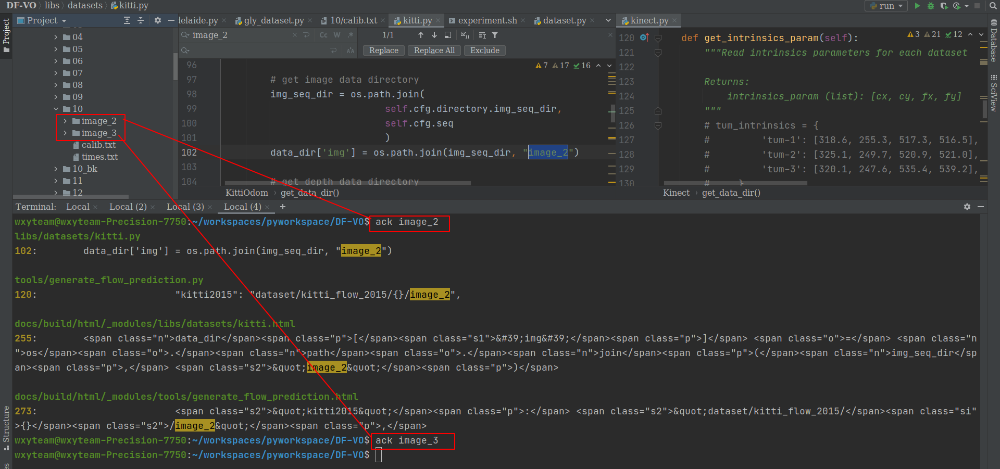

##### 2、替换文件名，删除 hud 前缀

```shell
# cd /home/wxyteam/gly-workspace/download/hud_pictures
rename -n "s/hud//" * # 测试&验证
rename "s/hud//" * # 执行
```

##### 3、生成 times.txt 文件

这个文件没有用到。删掉之后没有影响。所以没有必要生成。

##### 4、可选 gt_poses 但是输入不能为空的问题

可以关掉这个 option。方法：仿照 libs/datasets/adelaide.py 写自己的 data loader 时，注释掉 get_depth 和 get_gt_poses 两个函数，并且在配置文件中 leave the option blank

##### 5、设置内参

仿照 libs/datasets/adelaide.py 写自己的 data loader 时，必须重写 get_intrinsics_param 方法

```python
    def get_intrinsics_param(self):
        """Read intrinsics parameters for each dataset

        Returns:
            intrinsics_param (list): [cx, cy, fx, fy]
        """
        intrinsics_param = [640.0, 540.0, 1388.0, 1388.0]
        return intrinsics_param
```

##### 6、运行效果

使用 hud 样本，调整内参：


使用 hud 样本，不调整内参：

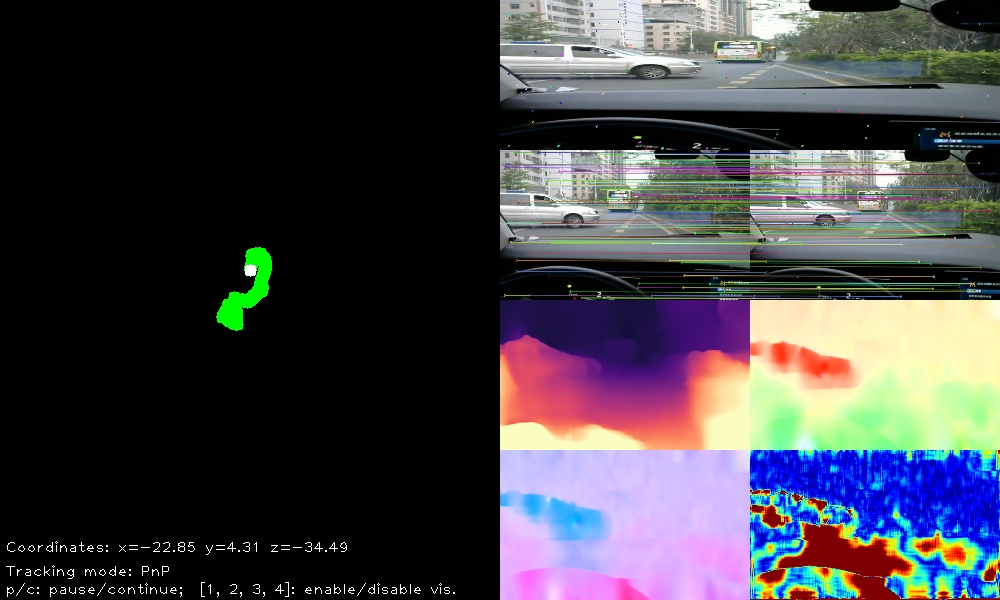

使用 adas 样本，调整内参：

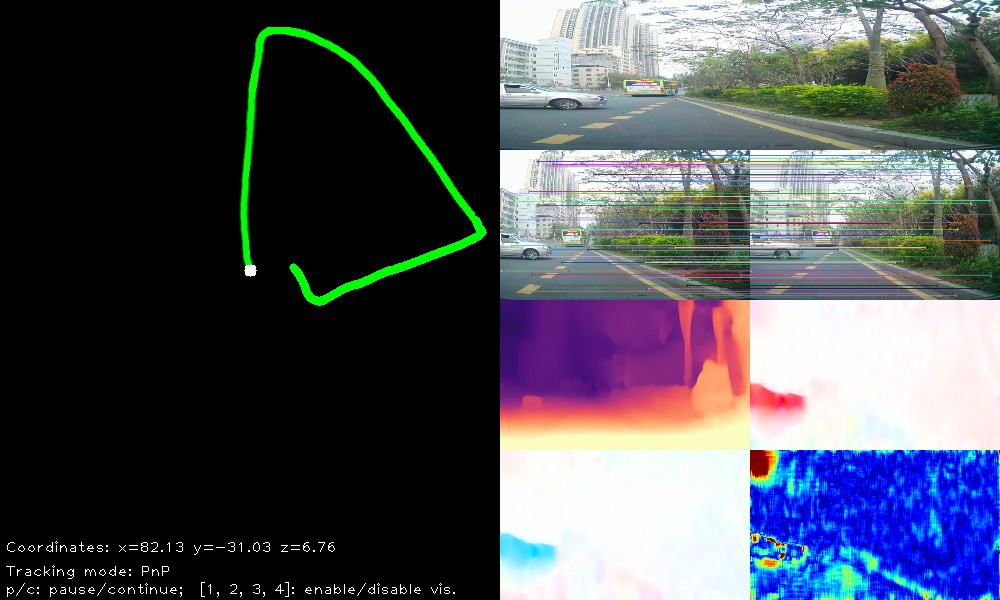

与地图轨迹对比：

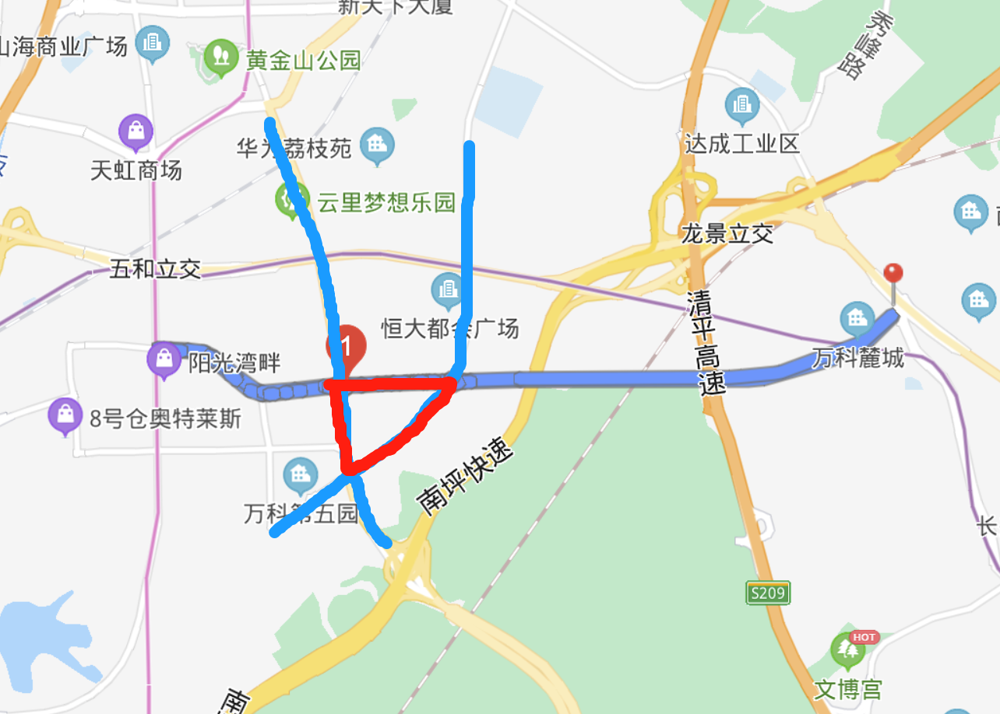

使用 adas 样本，不调内参：

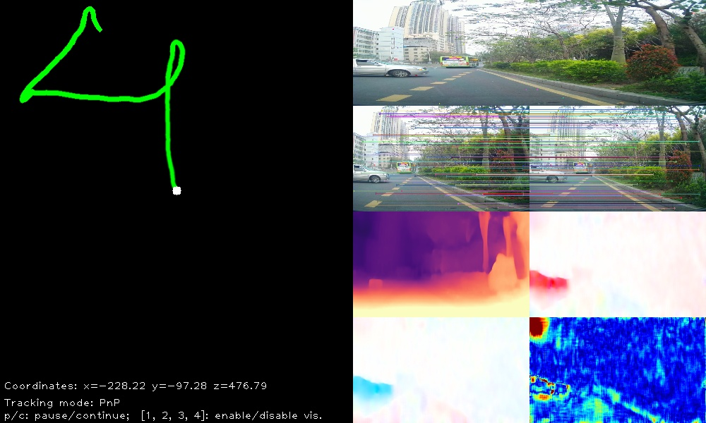

- z：向前方形
- x：向右
- y：向上

R1 长方形轨迹：

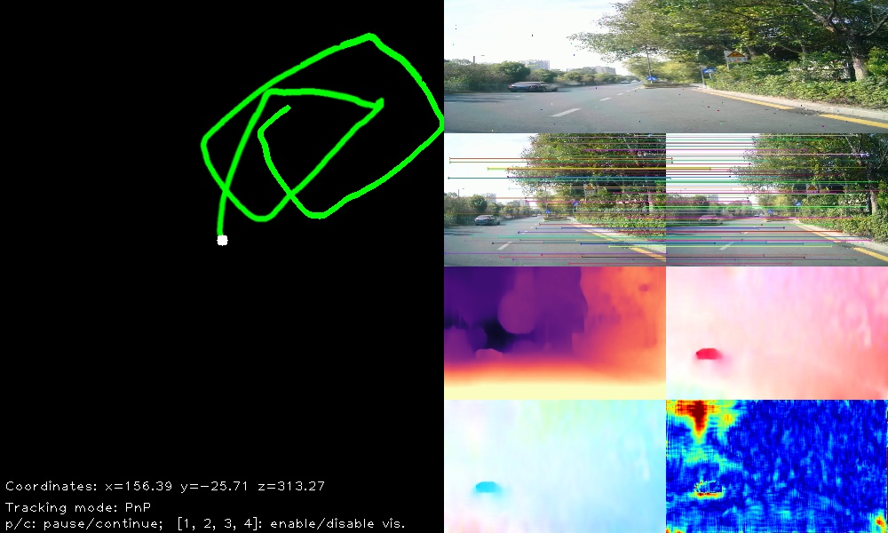


## 相机标定

DF-VO 需要的输入：intrinsics parameters for each dataset，即 intrinsics_param (list): [cx, cy, fx, fy]

#### 为什么要进行相机标定？

samples: https://github.com/opencv/opencv/tree/master/samples/data

docs: https://opencv-python-tutroals.readthedocs.io/en/latest/py_tutorials/py_calib3d/py_calibration/py_calibration.html#

Dissecting the Camera Matrix, Part 3: The Intrinsic Matrix http://ksimek.github.io/2013/08/13/intrinsic/

建立相机成像几何模型并矫正透镜畸变。

畸变包括径向畸变和切向畸变。（radial distortion and tangential distortion）

Due to **radial distortion**, straight lines will appear curved. Its effect is more as we move away from the center of image. For example, one image is shown below, where two edges of a chess board are marked with red lines. But you can see that border is not a straight line and doesn’t match with the red line. All the expected straight lines are bulged out. 


In addition to this, we need to find a few more information, like intrinsic and extrinsic parameters of a camera. 

**Intrinsic parameters** are specific to a camera. It includes information like focal length (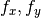), optical centers (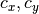) etc. It is also called camera matrix. It depends on the camera only, so once calculated, it can be stored for future purposes. It is expressed as a 3x3 matrix:

![camera \; matrix = \left [ \begin{matrix}   f_x & 0 & c_x \\  0 & f_y & c_y \\   0 & 0 & 1 \end{matrix} \right ]](../../images/5e9d2db8b3561f68fa0688992fa45c13766a382c.png)

**Extrinsic parameters** corresponds to rotation and translation vectors which translates a coordinates of a 3D point to a coordinate system. 外部参数对应于旋转和平移向量，将一个3D点的坐标转换为一个坐标系。

For stereo applications, these distortions need to be corrected first. To find all these parameters, what we have to do is to provide some sample images of a well defined pattern (eg, chess board). We find some specific points in it ( square corners in chess board). We know its coordinates in real world space and we know its coordinates in image. With these data, some mathematical problem is solved in background to get the distortion coefficients. That is the summary of the whole story. For better results, we need atleast 10 test patterns. 对于 stereo applications，首先需要纠正这些失真。为了找到所有这些参数，我们必须提供一些定义良好的模式(如象棋棋盘)的样本图像。我们在其中找到了一些特定的点(棋盘上的正方形角)。我们知道它在现实空间中的坐标也知道它在图像中的坐标。利用这些数据，在后台解决了一些数学问题，得到了失真系数。这就是整个故事的总结。为了获得更好的结果，我们需要至少10个测试模式。

**建立相机成像几何模型**：计算机视觉的首要任务就是要通过拍摄到的图像信息获取到物体在真实三维世界里相对应的信息，于是，建立物体从三维世界映射到相机成像平面这一过程中的几何模型就显得尤为重要，而这一过程最关键的部分就是要得到相机的**内参和外参**（后文有具体解释）。

**矫正透镜畸变**：我们最开始接触到的成像方面的知识应该是有关小孔成像的，但是由于这种成像方式只有小孔部分能透过光线就会导致物体的成像亮度很低，于是聪明的人类发明了透镜。虽然亮度问题解决了，但是新的问题又来了：由于透镜的制造工艺，会使成像产生多种形式的**畸变，**于是为了去除畸变（使成像后的图像与真实世界的景象保持一致），人们计算并利用**畸变系数**来矫正这种像差。（虽然理论上可以设计出不产生畸变的透镜，但其制造工艺相对于球面透镜会复杂很多，so相对于复杂且高成本的制造工艺，人们更喜欢用脑子来解决……）

#### cx, cy, fx, fy 的含义是什么？如何计算？

图像坐标系到像素坐标系


世界坐标系到像素坐标系需要经过三次矩阵的连乘，矩阵里面的参数就是我们需要标定的东西。

参考：

- doc https://opencv-python-tutroals.readthedocs.io/en/latest/py_tutorials/py_calib3d/py_calibration/py_calibration.html
- bilibili https://www.bilibili.com/video/BV1yD4y127Y8?from=search&seid=15822123031146272498

例如：

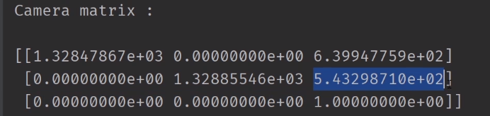

- fx, fy 是两个方向上的焦距，例如，1328.4，1328.5，例如，6mm镜头，相元尺寸（单个像素的长宽）是4.8μ，所以4.8*1328=6.37，既然知道镜头是6mm，为什么还要标定呢？因为6mm指的是镜头可以在6mm范围之内调整，不是定焦镜头。
  - 我们的 adas 摄像头焦距（像素）是 1388.8，暂时将两个方向上的焦距都设置为这个值。

- cx, cy 是中心点，即光轴穿过的那个点，值约等于像素/2。例如，1280*1024 的 cx，cy 实测是 639，543
  - 相片的分辨率是 1280*1080，因此我们的 cx，cy 应该在 640, 540 左右。

## 相机模型

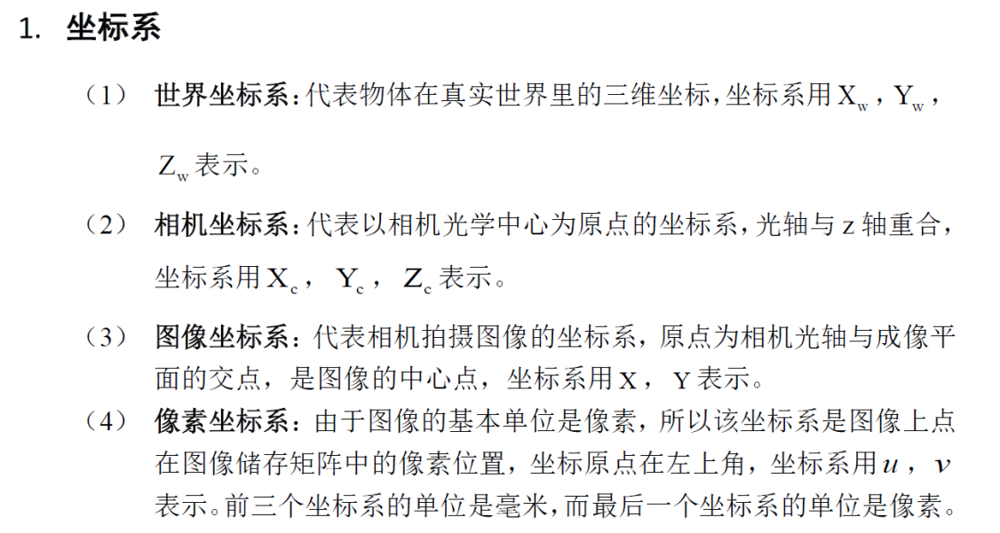

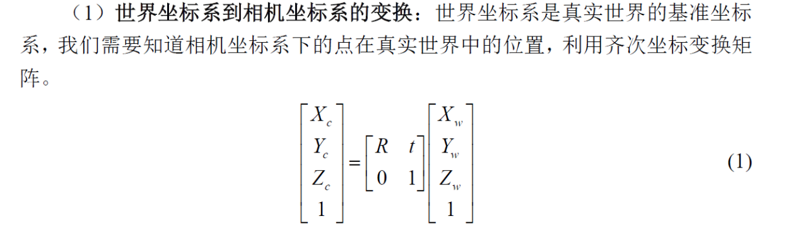

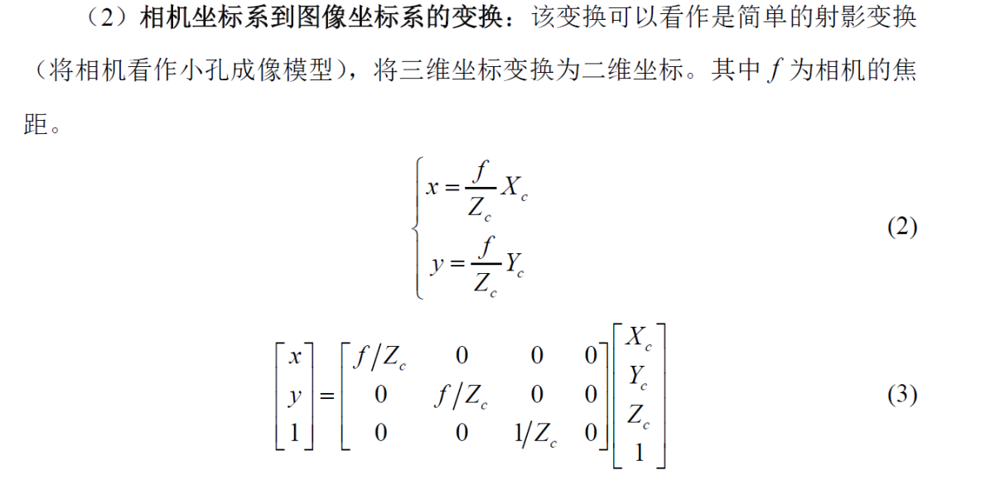

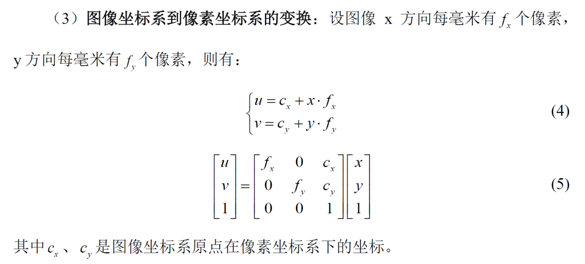

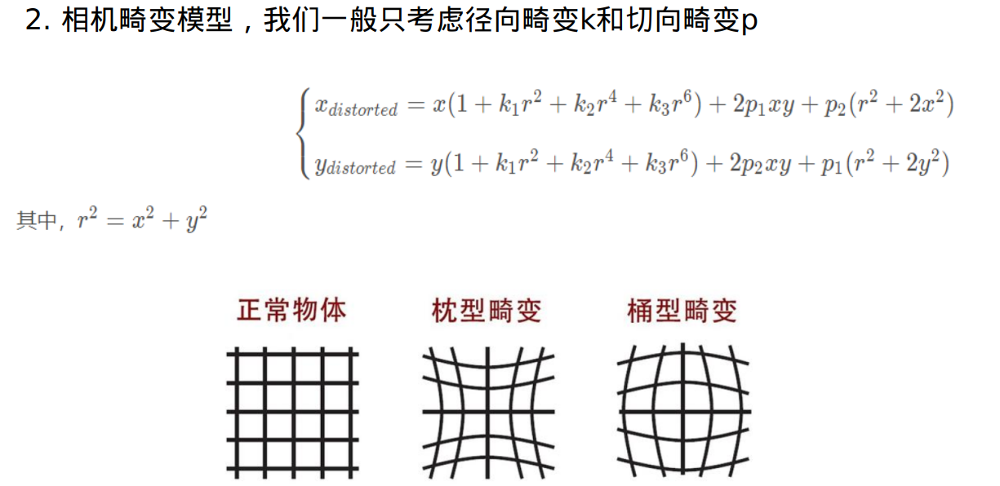

#### 相机标定要标定什么？

- 内参：`fx fy cx cy k1 k2 k3 p1 p2`（其中，k p 是畸变参数）
- 外参：`R t`

##### 张氏标定法


空洞卷积 在参数不增加的情况下 扩大感受野 rate扩张率 